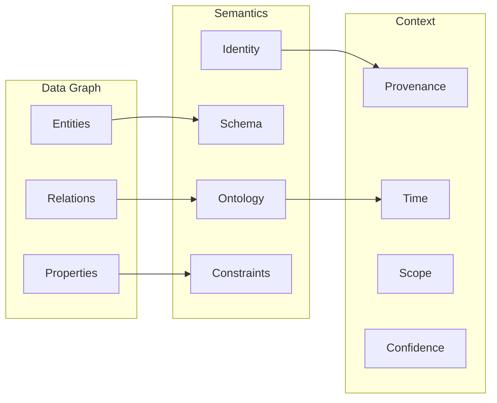

# Chapter 1 — From Graph to Knowledge

> **Chapter orientation**
>
> **Central question:** What turns a data graph into knowledge that a machine can
> represent, query, reason about, validate, and use?
>
> **Why it matters:** Before you build any knowledge system, you need a mental model to
> distinguish "having a graph structure" from "having knowledge". Without one, you will
> easily mistake a large graph database for a genuine knowledge system.
>
> **What you will understand:**
>
> - Graphs, triples, entities, relations
> - The difference between a data graph, a taxonomy, and an ontology
> - The minimal definition of a Knowledge Graph
> - The book's engineering model: *Knowledge Graph = Data Graph + Semantics + Context*
> - Why a bare label is not yet meaning
>
> **Prerequisites:** None. This is the foundational chapter.
>
> **Concept map:**
>
> Structural graph → Meaningful labels → Schema / Ontology → Identity → Context →
> Inference

## 1.1 Opening: When data needs to be "understood"

In engineering practice, we constantly work with data that has relational structure:
database tables, nested JSON, or APIs that return lists of linked objects. But when a
system needs to *understand* the meaning of those relationships — not merely store and
retrieve them — ordinary data models reveal their limits.

This chapter answers a foundational question: **What turns a data graph into knowledge
that a machine can represent, query, reason about, validate, update, and use?**

We start from the pure graph concept and progress through the data graph, the taxonomy,
the ontology, and finally the Knowledge Graph. Each step is illustrated by an experiment
in the companion code repository so you can verify the differences yourself; however, the
chapter's main argument can be read in full without running any code.

> **Important note:** The mental model "Knowledge Graph = Data Graph + Semantics +
> Context" introduced in this chapter is an **engineering learning model**, NOT a formal
> definition widely accepted in academia. It helps separate the layers of responsibility
> when designing a knowledge system, but it does not replace the standard definitions from
> the **W3C** (World Wide Web Consortium — the organization that develops web standards) or
> from the specialized research literature.

## 1.2 The mental model

> 📦 **Concept Orientation — Standards and Core Theory Encountered Early**
>
> This book builds progressively across 10 chapters. To prevent friction when encountering foundational concepts that receive full treatment in later chapters, here is a concise guide to what each term means and how to understand it in the immediate context:
>
> **Web Standards & Languages:**
> - **W3C** (World Wide Web Consortium): The international standards body governing web specifications, including RDF, OWL, and SPARQL.
> - **RDF** (Resource Description Framework): The standard graph data model representing knowledge as directed triples: `(subject, predicate, object)`. Covered in Chapter 2.
> - **IRI** (Internationalized Resource Identifier): A globally unique web address used to name entities and relations unambiguously across systems. Covered in Chapter 2.
> - **RDFS** (RDF Schema): A minimal vocabulary extending RDF with class hierarchies (`subClassOf`) and property typing (`domain`, `range`) for basic type inference. Covered in Chapter 3.
> - **OWL** (Web Ontology Language): A formal, logic-based ontology language based on Description Logics that enables automated deduction and consistency checking. Covered in Chapter 4.
> - **SHACL** (Shapes Constraint Language): A declarative language for validating graph structure against structural shapes and business rules. Covered in Chapter 5.
> - **SPARQL**: The standard query language for RDF graphs, matching graph patterns via relational algebra. Covered in Chapter 2.
>
> **Logic, Semantics & Machine Learning Concepts:**
> - **Ontology vs. Taxonomy**: A *taxonomy* organizes terms strictly into hierarchical "is-a" parent-child trees; an *ontology* is a formal logical theory defining concepts, rich relation types, cardinality constraints, and inference axioms (formalized in Chapter 4).
> - **Inference & Entailment (Deduction)**: The deterministic process of deriving new true facts from existing assertions using formal mathematical rules (e.g., if $A$ requires $B$ and $B$ requires $C$, then $A$ requires $C$). Formalized in Chapter 5.
> - **Model Theory & First-Order Logic**: The mathematical branch of logic that assigns precise truth values to syntactic symbols by mapping them to abstract domain sets and relations. Introduced in Chapter 4.
> - **Open World vs. Closed World Assumption**: A *Closed World* (used in relational databases) assumes anything not explicitly stored is false; an *Open World* (used in Semantic Web KGs) assumes anything not stated is merely unknown, not necessarily false. Formalized in Chapter 4.
> - **Provenance**: Lineage metadata recording who created a statement, from which source document, using which tool, and at what timestamp. Formalized in Chapter 6.
> - **Vector Embeddings & Graph ML**: Numerical vectors in continuous space learned by machine learning models to represent entities and predict missing edges statistically (contrasting with deterministic logic rules). Formalized in Chapter 8.
> - **GraphRAG**: An architecture that combines structured graph traversal with large language models to generate accurate, verifiable answers with traceable citations. Formalized in Chapter 9.

### Knowledge Graph = Data Graph + Semantics + Context



Figure: The three layers Data Graph, Semantics, and Context. Each layer answers a
different group of questions about the same graph.

These three layers address three different problems:

1. **Data Graph** answers: "Which nodes and edges are there?"
2. **Semantics** answers: "What do those nodes and edges *mean*? Which rules do they follow?"
3. **Context** answers: "Where did this information come from? When is it true? Within what scope? How trustworthy is it?"

In the book's engineering model, the Data Graph provides structure, Semantics provides
machine-readable meaning, and Context supports trust assessment and auditability. These
are complementary capability layers, not prerequisites for a graph to be called a
Knowledge Graph under the minimal definition [@stanford-cs520-what-is-kg].

### Why not every graph is a Knowledge Graph

Consider two cases:

- **Case A**: A graph containing `(Alice) --[:KNOWS]--> (Bob)` but with no definition of
  what `:KNOWS` means, no schema, no provenance. This is a data graph.
- **Case B**: The same graph, but `:KNOWS` is defined as a symmetric social relation
  between two Persons, with **RDFS** (RDF Schema — a vocabulary and semantics that extend
  RDF, providing class, subclass, and domain/range concepts for type inference; covered in
  detail in Chapter 2) semantics (**domain** — the class of subject entities — and **range**
  — the class of object entities — used for type inference), a timestamp, and a citation
  source. This is a knowledge graph.

The difference lies in semantics and context, not in the graph structure.

The same distinction holds for **the book's capstone domain — knowledge about
mechanisms**. Consider the graph over RATE_OF_CHANGE, the mechanism "velocity equals the
rate of change of position with respect to time":

- **Case C**: A graph containing `(rateOfChange_1) --[:hasOperation]--> (derivativeOperation_1)`
  but with no definition of what `:hasOperation` means, no source, no timestamp. The
  machine only sees two named nodes — it does not know that `rateOfChange_1` is a
  mechanism, nor where the statement came from. This is still a data graph.
- **Case D**: The same triple, but `:hasOperation` is declared as a relation between a
  mechanism and the operation it performs; the triple carries the source `source: Textbook A`,
  an asserted `confidence: 0.9`, and a timestamp. Now the system can evaluate: who asserts
  that RATE_OF_CHANGE performs the derivative operation, when, and how trustworthy that is.
  This is a knowledge graph.

The structure of C and D may be identical; the difference lies in the semantics and
context we attach. This is the yardstick used throughout the book: each chapter will ask
*"which layer is still missing for this mechanism graph to become knowledge?"*.

## 1.3 Core concepts

**Graph.** A graph G = (V, E) consists of a vertex set V and an edge set E ⊆ V × V. In the
Knowledge Graph context, we mostly work with **directed labeled graphs**: each edge has a
name/label identifying the kind of relation.

**Triple.** The most basic unit of graph-shaped knowledge representation:
`(subject, predicate, object)`. Example: `(Hanoi, isCapitalOf, Vietnam)`. Each triple
corresponds to a labeled edge in the graph.

**Entity.** An object in the real world or in the problem domain. When representing an
entity in a knowledge graph, four levels must be clearly distinguished:

1. **Real-world entity**: the actual object (the city of Hanoi, the person Nguyen Van A).
2. **Graph node**: the node in the graph that represents that entity.
3. **Identifier**: the name/IRI used to reference the node (e.g. `ex:Hanoi`).
4. **Label**: the display string meant for humans to read (e.g. "Hanoi").

These four levels separate just as cleanly for our own capstone domain — the mechanism:

1. **Real-world mechanism**: the very process "velocity = the rate of change of position
   with respect to time" — existing independently of any system that describes it.
2. **Graph node**: the node `rateOfChange_1` in the Mechanism-KG that represents that mechanism.
3. **Identifier**: `ex:rateOfChange_1` — the identifier string used to reference the node.
4. **Label**: "RATE_OF_CHANGE" — the human-readable string.

Self-check question: which level is *"rate of change"*? It is the **label** (level 4) — a
string. And `dX/dt` — the mathematical notation "the derivative of X with respect to t" —
is a **representation of the derivative operation**, i.e. a separate entity, not the
mechanism. Confusing a mechanism with the operation it uses, or with the label that
describes it, is the root of a whole family of later design errors: attaching metadata to
the wrong level, or treating two identical labels as one entity.

These four levels are **not one and the same**. The same real-world entity can be
represented by different graph nodes in different systems, each with its own identifier
and its own label. Conversely, two different identifiers can point to the same entity —
this is exactly the **entity resolution** problem (covered in Chapter 3).

> ⚠ **Common misconception:** Confusing the identifier with the entity. `ex:Hanoi` is a
> string used as an identifier; it is *not* the city of Hanoi. When a system says
> "`ex:Hanoi` is the capital of `ex:Vietnam`", it is talking about symbols in the graph,
> not directly about reality. The connection between symbol and reality lies in semantics
> and context, not in the identifier itself.

> 🖊 **Self-check:** If two different systems both have a node labeled "Hanoi" but use
> different identifiers (`ex:Hanoi` vs `wd:Q1858`), are they talking about the same
> entity? How do you know? What information beyond the label and the identifier would help
> answer this question?

**Relation.** A connection between two entities, represented by a labeled edge. Relations
carry semantics: `isCapitalOf` differs from `isLocatedIn` even though both connect two
places.

**Data Graph.** A collection of entities, relations, and properties with NO formal
definition of meaning. A data graph can answer "what is there" but not "what does it
mean".

**Semantics.** The meaning layer of the graph: the set of declarations that tell the
machine *what the symbols mean* and *what can be inferred from what*. Semantics is not in
the shape of the edge — two graphs can have identical structure yet entirely different
semantics. In the book's engineering model, semantics has four main components: schema
(expected structure), ontology (formal semantic commitment), identity, and constraints.
"Semantics" itself is not identical to any one of those components; it is the *layer* they
jointly contribute to. A concrete example from the capstone: if we declare `hasInput` to
have **domain** `Mechanism` and **range** `Quantity` (the domain/range concept was
introduced in §1.2), then when the triple `(rateOfChange_1, hasInput, position_1)`
appears, the machine will **infer** `position_1 : Quantity` — it knows `position_1` is a
quantity — without anyone attaching an explicit label. This is what a data graph cannot
do: same structure, but whether or not a semantic declaration exists is the decisive
difference (covered in detail in Chapters 2–4).

**Context.** The layer of information attached *outside* the graph to evaluate the
statements within it: where a source comes from (provenance), when it holds (time), within
what scope it holds (scope), and how trustworthy it is (confidence). Context is **not** a
few bytes of technical metadata (file size, storage timestamp): it is knowledge-bearing
information — changing the source of a triple can change the trust level of the conclusion
the machine draws from it. Context is attached to the graph by several mechanisms
(edge annotations, named graphs, n-ary relations — Chapter 3; claims and evidence —
Chapter 6). Two important principles come with it:

1. **Context enables evaluation; context does not establish truth.** Attaching a `source`
   to a triple lets the system compare and quantify trust — but attaching a source does not
   by itself make the statement true.
2. **Context is the basis for handling contradiction.** If two sources assert opposite
   things about the same mechanism, the Semantics layer does not know which side to trust;
   the Context layer provides the information to evaluate (Chapter 6).

**Taxonomy.** A hierarchical system of concepts based on the parent-child
(subclass/superclass) relation. A taxonomy adds hierarchical structure to a data graph. In
the book's engineering model, a taxonomy is one of several capability layers that can be
combined; a taxonomy on its own is still a form of knowledge graph under the minimal
definition [@stanford-cs520-what-is-kg].

**Ontology.** A formal definition of the concepts, relations, constraints, and axioms in a
knowledge domain. An ontology provides the semantics that a data graph and a taxonomy lack.

**Knowledge Graph.** Two approaches must be distinguished:

- *Academic (minimal) definition:* According to Stanford CS520 [@stanford-cs520-what-is-kg],
  a knowledge graph is a **directed labeled graph** in which the labels carry clearly
  defined semantics. Formally and minimally: given a node set N and a label set L, a
  knowledge graph is a subset of N × L × N — that is, a set of directed triples. Different
  definitions exist in the research literature [@hogan-knowledge-graphs]; there is no single
  widely accepted definition.
- *The book's engineering model:* To serve the design of real knowledge systems, the book
  uses the layered model **Knowledge Graph = Data Graph + Semantics + Context**, where the
  Data Graph comprises entities/relations/properties; Semantics comprises
  schema/ontology/identity/constraints; Context comprises provenance/time/scope/confidence.
  This is an **engineering learning model**, not a universal definition. It answers the
  question: "Which additional capabilities do we want a graph-based knowledge system to
  provide?"

## 1.4 Mechanism

The core mechanism of this chapter is **the sequential addition of capability layers on
top of a graph structure**. This is not a rigid maturity ladder (a data graph can still be
a knowledge graph in the academic sense), but an accumulation model of engineering
capabilities:

```
Graph Structure (vertices + edges)
  + Semantic Commitments (meaningful labels)
    + Schema/Ontology (formal definitions, domain/range, subclass)
      + Identity (persistent IRIs, entity resolution, sameAs)
        + Context/Provenance (source, time, scope, confidence)
          + Constraints/Validation (**SHACL** (Shapes Constraint Language — an RDF data constraint language, covered in Chapter 5) shapes, **cardinality** (the number of values allowed for a relation/property))
            + Inference Capabilities (**entailment** (logical inference: a new conclusion derived from axioms), rules, reasoning)
```

Each added layer addresses a specific limitation of the previous one:

- Semantic commitments distinguish the kind of relation (instead of arbitrary labels).
- Schema/ontology lets the machine understand meaning and infer types.
- Identity solves the problem of one entity having many names/representations.
- Context/provenance enables managing knowledge in practice (origin, time, trust).
- Constraints/validation detect data that does not conform to a defined policy.
- Inference capabilities produce new knowledge from existing knowledge.

Note: these layers **do not exclude one another**. A system can have inference without
full validation, or context without a formal ontology.

> 🖊 **Self-check:** Pick a graph system you have worked with (a relational database, a
> REST API, a JSON file, etc.). Which layer of the model above does it belong to? Which
> layer is still missing for it to become a Knowledge Graph under the book's engineering
> model? Explain why the missing layer matters.

## 1.5 Formal model

> ⚠ The notation below is defined by this book for learning purposes. It is not standard
> notation from the W3C or from academic literature.

> 📐 **Minimal mathematics for this chapter**
>
> - **Set:** A set S is a collection of distinct elements. The notation x ∈ S means "x
>   belongs to S". Example: V = {Hanoi, Vietnam} is a set of two elements.
> - **Cartesian product:** A × B is the set of all ordered pairs (a, b) with a ∈ A and b ∈
>   B. Example: if V = {Hanoi, Vietnam}, then V × V contains (Hanoi, Hanoi),
>   (Hanoi, Vietnam), (Vietnam, Hanoi), (Vietnam, Vietnam).
> - **Subset:** A ⊆ B means every element of A also belongs to B.
> - **Function:** f: A → B assigns each element of A exactly one element of B.
>
> You only need these four concepts to follow the entire formal model in this chapter.

### Why not use G = (V, E, λ)?

A common approach in graph theory is the **labeled directed graph** model G = (V, E, λ)
with E ⊆ V × V and a labeling function λ: E → L. However, this model has an important
limitation for Knowledge Graphs: between the same two vertices there is only **one** edge
in E (because E is a set of pairs), so only **one** label can be assigned. In practice,
two entities often have several simultaneous relations:

```
(Hanoi, locatedIn, Vietnam)
(Hanoi, capitalOf, Vietnam)
```

To represent both triples above with G = (V, E, λ), we would need two distinct edges
between the same pair of vertices — but E ⊆ V × V does not allow this.

### The direct triple model

Instead of going through an intermediate edge structure, we define a Knowledge Graph
**directly** as a set of triples:

Given a vertex set V (entities) and a label set L (predicates/relations):

$$K \subseteq V \times L \times V$$

Each element (s, p, o) ∈ K is a **triple**, where s is the subject, p is the predicate
(relation label), and o is the object.

**Concrete example:** With V = {Hanoi, Vietnam} and L = {locatedIn, capitalOf}:

$$K = \{(Hanoi,\; locatedIn,\; Vietnam),\;\; (Hanoi,\; capitalOf,\; Vietnam)\}$$

The two triples share the subject and object but differ in predicate — something
G = (V, E, λ) cannot represent naturally.

> 🖊 **Self-check:** Why is the model K ⊆ V × L × V a better fit for Knowledge Graphs than
> G = (V, E, λ)? Explain by giving a concrete example where G = (V, E, λ) struggles.

**Second example — same model, capstone domain:** The formal model is domain-independent.
Take V = {newtonCooling_1, rateOfChange_1, heatTransferRate_2, derivativeOperation_1} and
L = {requires, hasOperation}:

$$K = \{(\text{newtonCooling\_1},\; \text{requires},\; \text{rateOfChange\_1}),\;\; (\text{newtonCooling\_1},\; \text{requires},\; \text{heatTransferRate\_2})\}$$

Read: Newton's law of cooling **requires** the RATE_OF_CHANGE capability and the heat
transfer model. The immediate design consequence: because K is a set, every conclusion can
be verified by enumerating elements — the machine answers the question "which mechanisms
require RATE_OF_CHANGE?" with a deterministic traversal, independent of reading and
understanding labels. This model also transfers to an unrelated domain: a software package
dependency graph `(app_1, requires, lib_2)` uses the same notation and the same inference
rules — a sign that the *triple structure* is a common foundation, while the meaning of
each label belongs to the semantics layer.

**Data Graph**: K with arbitrary labels, no additional semantic constraints.

**Taxonomy**: Data Graph + a concept set C ⊆ V and a hierarchy relation ⊑ ⊆ C × C
(subclassOf). In the book's simplified model, ⊑ is treated as a partial order on C
(reflexive, transitive, antisymmetric). Note: the standard RDFS semantics of
`rdfs:subClassOf` requires only reflexivity and transitivity, and does not guarantee
antisymmetry; therefore the partial-order model here is an additional constraint of the
book, not full RDFS semantics. When two classes A and B satisfy both A ⊑ B and B ⊑ A,
under **OWL** (Web Ontology Language — the W3C standard ontology language for expressing
logical axioms about classes, properties, and individuals; covered in detail in Chapter 4)
they are considered **equivalent classes** (covered in Chapter 4) — that is, they have the
same members in every valid model.

**Ontology** (in the RDFS and OWL sense): an axiom set T comprising domain, range, and
subclass declarations (provided by RDFS), together with equivalence, disjointness,
property characteristics, and class restrictions (added by OWL). The semantics is defined
by each standard's formal semantics and entailment relations, not by constraint checking.

**Book Engineering Model** (the book's own notation): KSE = (K, T, C) where K ⊆ V × L × V
is the triple set, T is the ontology axiom set, and C is context information (provenance,
time, scope, confidence). This notation is defined by the book, not an industry standard.

### Beyond Binary Edges: n-ary Relations and Hypergraphs

The direct triple model $K \subseteq V \times L \times V$ formalizes a **binary relational graph**: every edge connects exactly two vertices (a subject and an object). For simple statements like `(Hanoi, capitalOf, Vietnam)`, binary edges are natural and mathematically clean.

However, scientific, biomedical, and industrial facts are frequently **$n$-ary relations** involving three or more participants ($n \ge 3$). Consider:
- In chemistry: `(Enzyme_A, catalyzesReaction, Substrate_B, intoProduct, Molecule_C, atTemperature, 37C)`.
- In medicine: `(Patient_X, receivedTreatment, Drug_Y, atDosage, 50mg, prescribedBy, Doctor_Z)`.
- In our capstone domain: the seed mechanism *"velocity is the rate of change of position with respect to time"* binds four participants at once — a *Mechanism*, a *Quantity Differentiated* (position), a *Reference Variable* (time), and a *Mathematical Operation* (derivative).

Pairwise binary triples $(s, p, o)$ cannot directly capture these multi-participant assertions without decomposing them. In theoretical computer science and knowledge representation, two primary formalisms address this:

#### 1. Native Hypergraphs
A **Hypergraph** $\mathcal{H} = (V, \mathcal{E})$ generalizes a graph by allowing each **hyperedge** $e \in \mathcal{E}$ to encompass an arbitrary subset of vertices $S \subseteq V$:
$$\mathcal{E} \subseteq \mathcal{P}(V) \setminus \{\emptyset\}$$
where $\mathcal{P}(V)$ denotes the power set (the set of all subsets) of $V$. In a labeled directed hypergraph, a hyperedge connects an ordered sequence or set of input vertices (sources) to output vertices (targets) under a shared predicate. Native hypergraph models preserve multi-party interactions as single atomic units, which avoids fragmenting relational context.

#### 2. Bipartite Graph Expansion (Incidence Graphs)
Because mainstream graph databases and RDF engines are optimized for binary edges, standard practice projects $n$-ary hyperedges into binary triples via a **bipartite graph expansion**, constructing what graph theorists call an **incidence graph**:
1. Create an intermediate node representing the **event, application, or relationship instance** (e.g., `derivativeApplication_1` or `prescription_902`).
2. Connect this central node to each participating entity using specialized binary role properties — `differentiand`, `withRespectTo`, and `hasOperation` point from the application to its participants, while `hasApplication` links the mechanism to it.

In our capstone domain, instead of an unwieldy multi-node edge, we write:
```turtle
ex:rateOfChange_1  ex:hasApplication  ex:derivativeApplication_1 .

ex:derivativeApplication_1  a               ex:DerivativeApplication ;
                            ex:hasOperation     ex:derivativeOperation_1 ;
                            ex:differentiand    ex:position_1 ;
                            ex:withRespectTo    ex:time_1 .
```

This transformation proves that **the binary triple model $K \subseteq V \times L \times V$ is universal**: any $n$-ary fact or hyperedge can be represented by introducing an intermediate event node and directed role edges. Chapter 3 will formalize this pattern as **n-ary modeling** and **reification**, showing how it forms the basis for attaching provenance, timestamps, and confidence scores to complex knowledge assertions.

## 1.6 Running example

Consider the knowledge domain of cities and countries — the domain that will follow us
across many chapters.

**Step 1 — Plain Graph:**

```
Node A --- Node B --- Node C
```

No labels, no meaning.

**Step 2 — Data Graph:**

```
(Hanoi) --[:LOCATED_IN]--> (Vietnam)
(Hanoi) --[:HAS_POPULATION]--> (8000000)
```

There are labels, but what does `:LOCATED_IN` mean? Is it different from `:CAPITAL_OF`?
The machine does not know.

**Step 3 — Taxonomy:**

```
City    is a subclass of Place
Country is a subclass of Place
Capital is a subclass of City
```

The machine knows Capital is a kind of City, City is a kind of Place. But it still does not
know which kind `:LOCATED_IN` applies to.

> ⚠ Here we use conceptual notation ("is a subclass of") rather than concrete syntax. The
> actual representation syntax (e.g. `rdfs:subClassOf` in RDF/Turtle) is covered in
> Chapter 2. What matters at this step is the **hierarchical meaning**, not the way it is
> written.

**Step 4 — Ontology:**

```
Relation locatedIn:
  - domain: Place
  - range: Place

Relation capitalOf:
  - domain: City
  - range: Country
```

The machine knows `capitalOf` has domain City and range Country. Under RDFS semantics
(inference, not constraint checking), if the triple `(Vietnam) --[:capitalOf]--> (Hanoi)`
appears, the machine will **infer** that Vietnam is a City and Hanoi is a Country — even if
this contradicts reality. RDFS domain/range add type information; they do not reject or
report "wrong" data.

> ⚠ **Important distinction:** Inference under formal semantics (`statement → entailment`)
> differs from SHACL constraint validation (`data → constraint check → conforms/violation`).
> Detecting and rejecting non-conforming data belongs to validation (Chapter 5), not to
> standard RDFS semantics.

**Step 5 — Knowledge Graph (adding Context):**

```
(Hanoi) --[:capitalOf {source: wikidata, validFrom: 1976}]--> (Vietnam)
```

The machine knows that the Wikidata source asserts this statement as valid from 1976.
Contextual metadata enables evaluation and comparison — but metadata itself does not
establish truth. If a contradicting statement comes from another source, the system can
compare and assess trust (Chapter 6).

### Capstone: repeating the five steps on RATE_OF_CHANGE

The city domain teaches the structure; the book's capstone domain — knowledge about
**mechanisms** — proves that the structure transfers. Our standing seed is a sentence
quoted from a textbook (raw passage):

> *"Velocity is the rate of change of position with respect to time."*

From this sentence, we repeat exactly the five steps we did with cities:

**Step 2' — Data Graph of the mechanism.** We extract the objects: the mechanism
`rateOfChange_1`, the operation `derivativeOperation_1` (the derivative), the quantities
`position_1` and `velocity_1`, and the reference variable `time_1`. In data-graph form,
nothing more:

```
(rateOfChange_1) --[:hasOperation]--> (derivativeOperation_1)
(rateOfChange_1) --[:hasInput]--> (position_1)
```

The machine sees three nodes and two labels — but what does `:hasOperation` mean? Is
`derivativeOperation_1` an operation or a mechanism? The machine does not know yet. This is
exactly the state of raw extraction from text.

**Step 3' — Taxonomy of mechanisms.** We build a small hierarchy:

```
Mechanism
├── ChangeMechanism
│   └── RateOfChangeMechanism
└── AggregationMechanism
```

The machine knows `rateOfChange_1` belongs to `RateOfChangeMechanism`, which is a kind of
`ChangeMechanism`, which is a `Mechanism`. What the taxonomy **cannot** say: the link
between a `RateOfChangeMechanism` and the derivative operation and its quantities — those
links lie outside the parent-child relation.

**Step 4' — Minimal ontology (not full OWL yet).** We declare those links as a minimal
usable model:

```
RateOfChangeMechanism --hasApplication--> DerivativeApplication
DerivativeApplication --differentiand--> Quantity
DerivativeApplication --withRespectTo--> ReferenceVariable
DerivativeApplication --hasOperation--> DerivativeOperation
```

This means: a "rate of change" mechanism is modeled through **a specific application**
(`DerivativeApplication`) that constrains: the quantity being differentiated
(differentiand), the variable it is taken with respect to (withRespectTo), and the
operation used (hasOperation). This is not yet OWL syntax (Chapter 4), but it gives the
machine a structure to say *"which mechanism, applied to what"*.

The `DerivativeApplication` above is a **class** (a template). In our data graph, that
class is **instantiated into a specific individual** — exactly one object representing
"the application of the derivative to position with respect to time":

```
(derivativeApplication_1) --[:hasOperation]--> (derivativeOperation_1)
(derivativeApplication_1) --[:differentiand]--> (position_1)
(derivativeApplication_1) --[:withRespectTo]--> (time_1)
```

Why do we need an intermediate object like `derivativeApplication_1` instead of three
separate triples? If we only connect
`(rateOfChange_1) --[:hasOperation]--> (derivativeOperation_1)` as in Step 2', the machine
has nowhere to attach "the derivative *of position* *with respect to time*" — those three
relations hang loose, and nothing indicates they belong to *the same application*.
`derivativeApplication_1` is that "binding site": it gathers every role of one application
of the mechanism into a graph fragment with its own IRI. So far this is only graph
structure — formal interpretation and inference come in Chapter 4, validation in Chapter 5.

**Step 5' — Context of the mechanism statement.** Attach context to our very statement:

```
(rateOfChange_1) --[:hasOperation {
    source: "Textbook A, page 42",
    assertedAt: "2018",
    confidence: "0.9"
}]--> (derivativeOperation_1)
```

The system now knows *who* asserts that RATE_OF_CHANGE performs the derivative operation
(Textbook A — a source that must be evaluated), *when* (2018), and *how trustworthy* (0.9 —
an illustrative number; how confidence is defined is covered in Chapter 6). If Textbook B
asserts the opposite, the system has a place to compare and evaluate — rather than
asserting which side is right on its own. **Context enables evaluation; context does not
establish truth.**

**Putting it together — a mini Mechanism-KG.** After the five steps, our mechanism graph is
a knowledge graph under the book's engineering model:

- **Data Graph (K):** the triples about `rateOfChange_1`, `derivativeApplication_1`,
  `derivativeOperation_1`, `position_1`, `time_1`, `velocity_1` — the running data across
  chapters, stored in `datasets/mechanism_kg/rate_of_change.ttl`.
- **Semantics (T):** the mechanism taxonomy (Step 3') and the minimal model
  `RateOfChangeMechanism → DerivativeApplication` (Step 4').
- **Context (C):** the source, timestamp, and confidence attached to the statement
  (Step 5').

In the formal notation of §1.5, this mini Mechanism-KG is exactly **KSE = (K, T, C)** —
the triple of data graph, ontology, and context — with real parameters. The KSE notation is
no longer decoration: it is precisely the structure we just built.

**What can this Mechanism-KG do now?**
- Answer structural questions like "which mechanisms require RATE_OF_CHANGE?" by traversing edges.
- Infer simple types via the taxonomy: `rateOfChange_1` is a `Mechanism`.
- Record and compare statements from multiple sources (still rudimentary; Chapter 6 deepens this).

**What can this Mechanism-KG still NOT do?**
- Represent and query with standard languages (Chapter 2).
- Determine whether two different names point to the same mechanism — identity resolution (Chapter 3).
- Formally define "RateOfChangeMechanism" precisely enough for automated reasoning (Chapter 4).
- Infer and validate candidate structures with rules and SHACL (Chapter 5).
- Manage evidence, provenance, time, contradiction, and knowledge state (Chapter 6).

## 1.7 Alternative designs

**Property Graph instead of RDF.** A property graph (like Neo4j) attaches properties
directly to nodes/edges instead of using separate triples. Advantage: intuitive, the data
model is close to how programmers usually think about graphs. Disadvantage: semantics is
application-dependent, with no standard formal semantics and entailment relations like
RDF/RDFS/OWL. Chapter 2 compares them in detail.

**Schema-less Knowledge Graph.** Some systems (Wikidata) allow adding statements without a
full ontology up front. Advantage: flexible, easy for a community to contribute.
Disadvantage: uneven quality, hard to infer automatically. Wikidata addresses this with
qualifiers/references/ranks instead of OWL axioms.

**Embedding-based "Knowledge".** Graph embeddings represent entities/relations as vectors
in a continuous space. They can predict new relations, but the result is a probability, not
an entailment. Chapter 8 clearly distinguishes induction (generalizing from observed data)
from deduction (deriving conclusions from premises).

## 1.8 Common misconceptions

**Mistake 1: "Neo4j = Knowledge Graph".** Neo4j is a property graph database. It stores
and queries graphs efficiently, but it does not provide semantics on its own. A KG requires
additional schema, ontology, or at least a documented convention.

**Mistake 2: "More nodes/edges = more knowledge".** Knowledge lies in semantics and
context, not in graph size. A small graph with a tight ontology and clear provenance holds
more useful knowledge than a large graph with no meaning.

**Mistake 3: "The ontology must be complete before building the KG".** A KG is a living
system. An ontology can evolve alongside the data. Start with a simple taxonomy and expand
as inference needs arise.

**Mistake 4: "Triple = Fact".** In RDF, a triple in the graph is an **assertion** — it
claims that the proposition holds within the context of the graph. However, assertion ≠
accepted knowledge in a real knowledge system. Distinguish two levels:

- **Representation semantics** (RDF): a triple in the graph = an asserted proposition. RDF
  does not distinguish "believed" from "not believed" — if a triple is present, it is
  asserted.
- **Epistemic governance policy** (our knowledge system): when does the system CHOOSE to
  promote an assertion into accepted knowledge? This depends on provenance, validation,
  confidence, and the system's policy.

Chapter 6 analyzes this distinction in depth: Observation (raw data about the world) ≠
Assertion (a claim in the graph) ≠ Claim (an epistemic assertion — a statement with
source/time/confidence) ≠ Evidence ≠ Accepted Knowledge.

Applied directly to the capstone: when Textbook B asserts the triple
`(rateOfChange_1, hasOperation, derivativeOperation_1)` (see §1.6 Step 5'), that is an
**assertion** — it is in the graph and the machine can use it. But it is **not yet accepted
knowledge** of the Mechanism-KG: that happens only after the system evaluates the Textbook B
source, the assertion time, and independent evidence. A triple present in the graph ≠ the
system believes it is true.

## 1.9 Companion experiments

The chapter's experiments live in the companion code repository (`chapter01/`), letting you
verify each transition from plain graph to knowledge graph yourself. They are supplementary;
the chapter's main argument stands independently of them. In book version v0.1, these
experiments are complete and runnable; for detailed status see `docs/EXPERIMENT_STATUS.md`.

| Experiment | Difficulty | Content |
|------------|------------|---------|
| 1-1 | ★ | Plain graph without semantics |
| 1-2 | ★ | Data graph vs taxonomy |
| 1-3 | ★★ | Progressive transformation into a KG (sister-city domain) |
| 1-4 | ★★ | Data graph → simple KG with **forward-chaining** inference (forward reasoning: deriving new conclusions from rules and data) |
| 1-5 | ★★★ | Defining the semantics of a relation (symmetric, transitive, inverse) |

## 1.10 Reflection questions

1. (★) Given the graphs `(A)--[R]-->(B)` and `(C)--[R]-->(D)` with the same label R. Without
   an ontology, can you assert that R has the same meaning in both cases? Explain.
2. (★★) Two graphs contain the same set of triples but use different IRIs for the same
   real-world entity. Do they represent the same knowledge? What additional assumption is
   needed to assert "yes"?
3. (★★) Wikidata lets anyone add statements without ontology approval. How does this affect
   automated inference? What mechanisms does Wikidata use to compensate?
4. (★★★) Suppose you design a KG for an AI-agent system that must make medical decisions.
   What information must the Context layer contain that the Semantics layer cannot provide?
   Why is Semantics alone insufficient?

### 1.10.1 Suggested answers

**Question 1 (★).** Given the graphs `(A)--[R]-->(B)` and `(C)--[R]-->(D)` with the same label R. Without an ontology, can you assert that R has the same meaning in both cases? Explain.

No. Without an ontology (or any semantics declaration), we are NOT allowed to assert that R carries the same meaning in the two places. The label `R` is by itself just a string; two edges sharing the same string does not guarantee they are the same relation. This is exactly the "Case A" situation in §1.2: an edge `[:KNOWS]` with no definition of what `:KNOWS` means is still a data graph, not yet knowledge.

Reasoning: §1.3 defines Semantics as "the meaning layer of the graph" and states plainly that "Semantics is not in the shape of the edge — two graphs can have identical structure yet entirely different semantics." The same label can be used by two groups under two different conventions (for instance `R` = "knows" in one graph, `R` = "transfers money to" in the other), and only an explicit declaration about the predicate can tell them apart. §1.3 also warns against confusing the label (level 4) with the entity: "treating two identical labels as one entity" is the root of a whole family of later design errors.

Evidence: §1.2 (Case A/B) and §1.3 (the definition of Semantics, the four levels of Entity) show that meaning lives in the semantics layer, not in the label; §1.8 Mistake 2 reinforces that "Knowledge lies in semantics and context, not in graph size." To assert that R is the same, you need an ontology declaring R's domain/range and definition, or some mechanism that links the ontologies of the two graphs.

**Question 2 (★★).** Two graphs contain the same set of triples but use different IRIs for the same real-world entity. Do they represent the same knowledge? What additional assumption is needed to assert "yes"?

Not necessarily. "The same set of triples" holds only at the syntactic level if we treat the IRIs as meaningless symbols; but if each IRI is interpreted independently, the two graphs are not guaranteed to be talking about the same entity. §1.3 names this exact situation: "two different identifiers can point to the same entity — this is exactly the entity resolution problem," and the "Common misconception" box stresses that `ex:Hanoi` is only a string that "is *not* the city of Hanoi." The `ex:Hanoi` vs `wd:Q1858` example in §1.3 illustrates precisely this problem.

Reasoning: under the four levels of Entity in §1.3 (real-world entity / graph node / identifier / label), the claim that two different identifiers point to the same entity is something that must be *stated*; it is not self-evident. The Identity layer in §1.4 is exactly the layer that "solves the problem of one entity having many names/representations."

Evidence: to assert "yes," you need an additional identity-union assumption — an explicit declaration that the two IRIs denote the same entity, for example a `sameAs` relation (named in §1.4: "Identity (persistent IRIs, entity resolution, sameAs)"), or an alignment mapping between the two IRI namespaces, together with contextual grounds for trusting that mapping. Without this assumption, the machine sees only two different symbols and has no basis on which to merge them.

**Question 3 (★★).** Wikidata lets anyone add statements without ontology approval. How does this affect automated inference? What mechanisms does Wikidata use to compensate?

This "schema-less" model limits formal-style automated inference (RDFS/OWL entailment), because inference needs tight ontology axioms to derive new conclusions; when statements are added freely without passing ontology review, quality is uneven and there is no trustworthy axiom base from which the machine can infer what was not written explicitly. §1.7 ("Schema-less Knowledge Graph") says exactly this: "Disadvantage: uneven quality, hard to infer automatically."

Reasoning: without an approved ontology, the machine cannot rely on domain/range/subclass to entail; instead Wikidata manages knowledge through context on each individual statement. §1.7 records: "Wikidata addresses this with qualifiers/references/ranks instead of OWL axioms."

Evidence: per the official Wikidata documentation (Help: Statements), the three additional components are **qualifiers** ("additional information that describes or clarifies the value of a property"), **references** ("point to the specific sources that support the data"), and **ranks** (managing multiple values / consensus; "if there is a consensus, it should be indicated with the *preferred* rank" — the levels being preferred/normal/deprecated). These are precisely the Context layer (provenance, scope, confidence) described in §1.3, used to evaluate and handle contradiction instead of leaning on formal entailment. This also matches §1.8 Mistake 4: a statement being present is not yet "accepted knowledge"; ranks and the consensus policy are how Wikidata governs that acceptance level.

**Question 4 (★★★).** Suppose you design a KG for an AI-agent system that must make medical decisions. What information must the Context layer contain that the Semantics layer cannot provide? Why is Semantics alone insufficient?

For medical decisions, the Context layer must carry at minimum: **provenance** (who / which authority asserts it — a health-ministry guideline, a randomized trial, or a blog), **time** (valid from when, when it expires — treatment protocols change year to year), **scope** (which population it applies to, which jurisdiction, what the contraindications are), and **confidence** (the level of evidence, the level of consensus). These four are exactly the Context components listed in §1.3 and §1.2: "provenance, time, scope, confidence."

Reasoning: Semantics tells the machine *what the symbols mean* and *what types to infer* (schema, ontology, domain/range, identity, constraints — §1.3), but it cannot answer "where did this statement come from, is it still correct, how trustworthy is it, and when two sources conflict, which one should we believe." §1.3 states the two key principles: "Context enables evaluation; context does not establish truth," and "Context is the basis for handling contradiction. If two sources assert opposite things about the same mechanism, the Semantics layer does not know which side to trust; the Context layer provides the information to evaluate."

Evidence: §1.2 (Case B/D) shows that a triple becomes knowledge only once it also carries a timestamp and a citation source; §1.6 Step 5'/Step 5 illustrates attaching `source`/`validFrom`/`confidence` to a statement. In medicine, without Context an agent cannot tell an outdated 2015 guideline from a 2025 recommendation, or grade-A evidence from an expert opinion — that is, it cannot govern risk. So Semantics alone is insufficient: it guarantees *correct meaning and correct type*, whereas *trustworthiness and current validity* belong to Context.

## 1.11 What we know

- A graph is a data structure; a Knowledge Graph is a knowledge structure.
- The difference lies in three layers: Data Graph, Semantics, Context.
- The model "KG = Data Graph + Semantics + Context" is an engineering learning tool, not a
  standard definition.
- An ontology provides formal semantics; context provides provenance, time, confidence.
- Not every graph is a KG; a bare label is not yet meaning.

## 1.12 What we have not yet done

- Represent and query graphs with standard languages (we need RDF/**SPARQL** (SPARQL
  Protocol and RDF Query Language — the RDF query language, covered in Chapter 2) or
  **Cypher** (the property-graph query language, covered in Chapter 2)).
- Clearly distinguish RDF from Property Graph in practice.
- Handle identity resolution when the same entity has many names/IRIs.
- Represent **n-ary relations** (relations with more than two components, or relations that
  need additional properties) beyond binary triples.
- Manage **named graphs** (named graphs that group statements by context) and contextual
  statements.

These limits lead directly to **Chapter 2: Data Models and Query Languages**.

## 1.13 Mechanism Knowledge System — Capability gained

Each chapter closes with one rung on the "capability ladder" of the Mechanism Knowledge
System that the book is building step by step.

**BEFORE THIS CHAPTER** — the system does not yet exist: there is no way to distinguish
"having a graph structure" from "having knowledge", and no notion of a mechanism as a
first-class entity.

**AFTER THIS CHAPTER** — the system can recognize mechanism objects and understands why
semantics and context must be attached to graph structure. We have the three-layer mental
model (Data Graph + Semantics + Context) and a RATE_OF_CHANGE seed modeled into a mini
Mechanism-KG.

**CONCRETE RATE_OF_CHANGE EXAMPLE** — the sentence *"Velocity is the rate of change of
position with respect to time"* is split into `rateOfChange_1`, `derivativeOperation_1`,
`position_1`, `time_1`, `velocity_1`; a mechanism taxonomy is built; the operation triple is
given a source (Textbook A), a timestamp, and a confidence (§1.6 Steps 2'–5').

**STILL UNRESOLVED** — representation and querying with standard languages; identity
resolution; formal semantics; inference and validation; evidence and contradiction
management. Chapter 2 opens the next rung: *representing and querying mechanism structure*.


## Terms encountered in this chapter

| Term | Short meaning | Covered in |
|------|---------------|------------|
| Entity | An object in the real world or problem domain | §1.3 |
| Relation | A connection between two entities | §1.3 |
| Triple | The basic unit: (subject, predicate, object) | §1.3 |
| Data Graph | A collection of entities/relations/properties without formal meaning | §1.3 |
| Taxonomy | A subclass/superclass hierarchy | §1.3 |
| Ontology | A formal definition of concepts, relations, constraints | §1.3 |
| Knowledge Graph | A directed labeled graph whose labels carry semantics | §1.3 |
| W3C (World Wide Web Consortium) | The organization that develops web standards | Preview box §1.2 |
| RDF (Resource Description Framework) | The standard triple-based graph data model | Chapter 2 |
| IRI (Internationalized Resource Identifier) | A global string identifier | Chapter 2 |
| RDFS (RDF Schema) | Vocabulary and semantics extending RDF (classes, subclass, domain/range) | Chapter 2 |
| OWL (Web Ontology Language) | The W3C standard ontology language | Chapter 4 |
| SHACL (Shapes Constraint Language) | An RDF data constraint language | Chapter 5 |
| SPARQL (SPARQL Protocol and RDF Query Language) | The RDF query language | Chapter 2 |
| Cypher | The property-graph query language | Chapter 2 |
| Schema | A description of the expected structure and vocabulary | §1.2, Chapter 3 |
| Semantics | The meaning layer of the graph: declarations telling the machine what symbols mean and what can be inferred | §1.3 |
| Context | The layer of information outside the graph used to evaluate: source, time, scope, confidence | §1.3 |
| Provenance | Who/where/how produced a statement | §1.4, Chapter 6 |
| Entailment | A new conclusion derived from axioms | §1.4, Chapter 4 |
| Domain / Range | The subject class / object class of a relation | §1.3, Chapter 3 |
| Cardinality | The number of values allowed for a relation/property | §1.4 |
| Forward-chaining | Forward reasoning | Experiment 1-4 |
| N-ary relation | A relation of higher arity or needing extra properties | §1.12, Chapter 3 |
| Named graph | A named graph for grouping statements by context | §1.12, Chapter 3 |
| Partial order | A reflexive, transitive, antisymmetric order | §1.5 |
| Mechanism | A transformation process: takes inputs, produces outputs under conditions | §1.2 |
| Operation | A primitive transformation a mechanism performs (e.g. derivative) | §1.3 |
| Quantity | A measurable value serving as a mechanism's input/output (position, velocity) | §1.3 |
| Reference variable | The independent variable a rate is taken with respect to (e.g. time) | §1.6 |
| DerivativeApplication | An intermediate object binding a mechanism, the quantity differentiated, the variable, and the operation in one application | §1.6 |
| Binary relation | A relation connecting exactly two entities: $(s, p, o) \in V \times L \times V$ | §1.5 |
| N-ary relation | A multi-participant relation connecting three or more entities ($n \ge 3$) | §1.5, Chapter 3 |
| Hypergraph | A graph generalization where each hyperedge can connect an arbitrary subset of vertices | §1.5 |
| Incidence graph | A bipartite expansion representing an $n$-ary hyperedge as binary triples via an intermediate event node | §1.5, Chapter 3 |

## Further reading

- What is a Knowledge Graph? [@stanford-cs520-what-is-kg] — the minimal definition and intuition.
- Hogan et al., *Knowledge Graphs* [@hogan-knowledge-graphs] — a research survey.
- RDF 1.1 Concepts and Abstract Syntax [@w3c-rdf11-concepts] — the standard data model.
- RDF 1.2 Concepts and Abstract Data Model [@w3c-rdf12-concepts] — current development (emerging).
