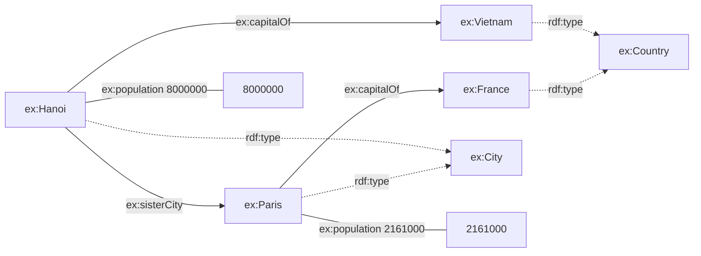
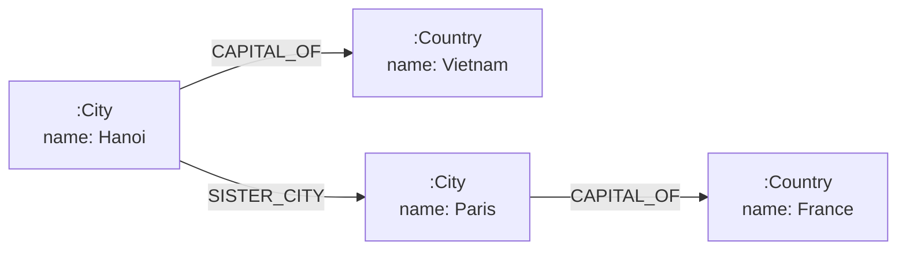

# Chapter 2 — Data Models and Query Languages

> **Chapter orientation**
>
> **Central question:** How does the choice of graph representation change what we can
> *express, query, reason about, exchange, and maintain*?
>
> **Why it matters:** The same knowledge about the real world can be stored in many
> different forms. The form you choose decides which questions are easy to answer, which
> data is easy to exchange with other systems, and what you pay as the system grows. Pick
> the wrong model, and you will pay for it with increasingly elaborate workaround code.
>
> **What you will understand:**
>
> - The RDF model: triples, IRIs, literals, blank nodes, a graph as a set of triples
> - Turtle is a *syntax* of RDF, not the RDF model itself
> - SPARQL matches graph patterns and returns solution mappings
> - The Labeled Property Graph model
> - Cypher queries property graphs
> - The same knowledge in two representations: what becomes easy, explicit, implicit, or
>   costly on each side
> - How to represent and query the RATE_OF_CHANGE mechanism (the capstone thread) in RDF
>   and in LPG — from here on, every concept in the chapter is exercised on the mechanism
>   graph
>
> **Prerequisites:** Chapter 1 (graph, data, semantics, context).
>
> **Concept map:**
>
> Real-world knowledge → Choose a representation model → RDF *or* Property Graph →
> Serialization syntax → Query language → Design trade-offs

## 2.0 Opening: One Question, Two Answers

Imagine you are asked to build a system that stores knowledge about cities and countries.
You have three facts:

- Hanoi is the capital of Vietnam.
- Paris is the capital of France.
- Hanoi and Paris are sister cities.

Sounds simple. But before writing any code, you must answer a design question: **how will
these three facts be represented?**

There are two large families of graph models that have become standard in practice
[@stanford-cs520-graph-data-models]:

1. **The RDF model** (Resource Description Framework) — the foundation of the Semantic
   Web, standardized by the W3C [@w3c-rdf11-concepts].
2. **The Labeled Property Graph** — the model used by Neo4j and many modern graph
   databases [@neo4j-data-modeling].

This chapter does not teach the syntax of any particular library. The goal is to understand
the **mechanism and the trade-offs** of each model family, by representing *the same
knowledge domain* on both sides and then comparing them directly.

> **Scope:** This is not a tutorial on RDFLib, SPARQL, Neo4j, or Cypher. The APIs are only
> a means of illustration; the concepts are what stays with you.

## 2.1 The RDF Model

### 2.1.1 The triple is the atomic unit

According to the RDF 1.1 Concepts and Abstract Syntax specification [@w3c-rdf11-concepts],
an **RDF graph** is a set of **RDF triples**. Each triple has three positions, and each
position has *exact* type constraints as follows:

| Position | Name | May contain |
|----------|------|-------------|
| Subject | subject | IRI or blank node |
| Predicate | predicate | **only** IRI |
| Object | object | IRI, literal, or blank node |

Three kinds of term appear in the table:

- An **IRI** (Internationalized Resource Identifier) is a string-form identifier, for
  example `http://example.org/Hanoi`.
- A **literal** is a data value such as the string `"Hanoi"` or the number `8418883`. A
  literal is only allowed in the object position.
- A **blank node** is a node without an IRI; we return to it in section 2.1.3.

Two points that are easy to miss:

- **The predicate is always an IRI.** Never a literal or a blank node.
- **The subject is never a literal.** You cannot have a triple whose subject is a string.

> **Do not confuse the model with the syntax.** An RDF graph is an *abstract data model*.
> Turtle, N-Triples, RDF/XML, and JSON-LD are only *concrete syntaxes* for writing that
> model out as text. The same graph can be written in many syntaxes.

### 2.1.2 IRI: a globally-scoped identification mechanism

IRIs are often described as "global identifiers", but this needs to be stated more
precisely to avoid misunderstanding.

**An IRI is a globally-scoped identifier mechanism**: syntactically, any two systems in the
world can write the same IRI string to point to the same resource. This is the core design
that lets RDF support linked data (**Linked Data** — data identified by IRIs so it is easy
to integrate across systems).

But there are two things an IRI does *not* automatically guarantee:

- **The same IRI does not prove that two parties are talking about the same real-world
  entity with the same meaning.** Two organizations can both use `http://example.org/Hanoi`
  yet assign it different properties, or understand "Hanoi" at different extents (city
  proper, metropolitan area, and so on).
- **Two different IRIs do not necessarily mean two different entities.**
  `http://dbpedia.org/resource/Hanoi` and `http://www.wikidata.org/entity/Q1858` both refer
  to Hanoi. Recognizing that they point to the same entity is the *identity resolution*
  problem, discussed in depth in Chapter 3.

In short: an IRI gives us a unified *namespace* so systems can refer to one another, but
**the meaning of that reference does not come bundled with the IRI string**.

### 2.1.3 Blank node: a resource that needs no global name

Blank nodes are usually introduced as "anonymous nodes used when no global identifier is
needed". That is true but incomplete. Let us clarify their intuitive semantics:

- A blank node represents **a resource that exists but is not named by an IRI**. It is
  still a full node of the graph: it can be the subject or the object of a triple.
- **A blank node label is not a global identifier.** When you see `_:b0` in an RDF document,
  the name `b0` only has meaning *within that document*. It is a serialization artifact,
  not a stable cross-system identifier.
- **Existential semantics.** Logically, a blank node carries the meaning "there exists some
  resource such that…". For example, the triple `(ex:Hanoi, ex:hasAddress, _:b0)` says
  "Hanoi has an address, and that address is some resource" — without needing to (or being
  able to) give that address a global name.

Because blank node labels are only local, two graphs that use different blank node labels
can still be *the same graph* semantically. This is exactly why comparing graphs needs the
concept of **isomorphism** rather than raw string comparison — we meet it again in section
2.1.5. This chapter keeps blank nodes at the intuitive level; full formal semantics is
reserved for later chapters.

Blank nodes have a concrete design consequence for the capstone. Suppose we model a
derivative application with a blank node:

```turtle
ex:rateOfChange_1 ex:hasApplication _:b1 .
_:b1 ex:differentiand ex:position_1 ;
     ex:withRespectTo ex:time_1 .
```

Design question: if this book is ingested into the system twice (two extractions), are the
two blank nodes `_:b1` and `_:b2` the same application? **No** — a blank node has no stable
identifier by which we could assert "this is that very application". By Chapter 6, when we
need to attach evidence to this specific application (the claim *"this application is
correct"*), the system has no way to point at the blank node durably. The design lesson:
blank nodes suit ephemeral existential structure; when an object will be referenced again
(identity, evidence, context), give it an IRI. Chapter 3 formalizes this lesson through the
n-ary model (`DerivativeApplication`).

### 2.1.4 Representing a knowledge domain in RDF

Now we represent the three opening facts with RDFLib [@rdflib-docs]. The knowledge domain
comprises Hanoi, Paris, Vietnam, France — the same domain used in Chapter 1, to keep
continuity.

> **Installation:** If you do not yet have RDFLib, install it with `pip install rdflib`.
> This library requires no Docker or external service.

```python
from rdflib import (
    Graph,
    Literal,
    Namespace,
    RDF,
    RDFS,
)  # RDF and RDFS are W3C standard namespaces

EX = Namespace("http://example.org/")  # Namespace: maps a short prefix to a full IRI
g = Graph()

g.add((EX.Hanoi, RDF.type, EX.City))
g.add((EX.Hanoi, RDFS.label, Literal("Hanoi")))
g.add((EX.Hanoi, EX.capitalOf, EX.Vietnam))
g.add((EX.Paris, RDF.type, EX.City))
g.add((EX.Paris, RDFS.label, Literal("Paris")))
g.add((EX.Paris, EX.capitalOf, EX.France))
g.add((EX.Hanoi, EX.sisterCity, EX.Paris))
g.add((EX.Vietnam, RDF.type, EX.Country))
g.add((EX.France, RDF.type, EX.Country))
g.add((EX.Hanoi, EX.population, Literal(8000000)))
g.add((EX.Paris, EX.population, Literal(2161000)))
```

This graph has **11 triples**. Each `g.add(...)` line adds exactly one triple; each triple
is an independent proposition. Because an RDF graph is a *set*, the order of insertion does
not matter and duplicate triples are automatically removed.



Figure: The capital knowledge domain as an RDF graph. Solid lines are domain relations
(capitalOf, sisterCity); dashed lines are classification (rdf:type); plain lines are data
properties (population).

Notice how RDF represents an entity's **type**: instead of a "kind" field stored inside the
node, RDF uses a `rdf:type` triple itself. This is a design choice with large consequences —
all information, including classification, is a triple, so all of it can be queried and
reasoned about with the same mechanism.

### 2.1.5 Turtle: a syntax, not the model

Turtle is the most common text syntax for writing RDF [@w3c-rdf11-turtle]. The Turtle below
represents **exactly the 11-triple graph** from section 2.1.4 — nothing missing, nothing
extra:

```turtle
@prefix ex:   <http://example.org/> .
@prefix rdf:  <http://www.w3.org/1999-02-22-rdf-syntax-ns#> .
@prefix rdfs: <http://www.w3.org/2000/01/rdf-schema#> .

ex:Hanoi a ex:City ;
    rdfs:label "Hanoi" ;
    ex:capitalOf ex:Vietnam ;
    ex:sisterCity ex:Paris ;
    ex:population 8000000 .

ex:Paris a ex:City ;
    rdfs:label "Paris" ;
    ex:capitalOf ex:France ;
    ex:population 2161000 .

ex:Vietnam a ex:Country .
ex:France  a ex:Country .
```

Three Turtle syntactic conveniences appear here:

- `@prefix` lets you write an IRI compactly with a prefix (`ex:Hanoi` instead of
  `<http://example.org/Hanoi>`). The prefix is only shorthand; it does **not** change the
  real IRI in the graph.
- The keyword `a` is shorthand for `rdf:type`.
- The semicolon `;` lets you list several predicates for the same subject; the comma `,`
  lets you list several objects for the same subject–predicate.

To verify that the Turtle above really is the original graph, we parse it back and compare:

```python
turtle_text = g.serialize(format="turtle")  # serialize: turn an RDF graph into text
g2 = Graph()
g2.parse(data=turtle_text, format="turtle")  # parse: read text into an RDF graph
assert set(g) == set(g2)  # the graphs are equivalent
```

Here we must be clear about **how graphs are compared**:

- For a graph *without blank nodes* like this example, comparing the set of triples
  (`set(g) == set(g2)`) happens to be enough, because each triple is fully determined by
  three named terms.
- But **the correct general concept is graph isomorphism**: two graphs are equivalent if
  there is a bijection between their nodes such that the triples are preserved. When blank
  nodes are present, their labels are local and may differ between two documents, so raw
  triple-set comparison gives the wrong result; you must use isomorphism to "match" the
  blank nodes. RDFLib provides isomorphism comparison via `rdflib.compare`.

  **Concrete example:** consider two graphs:

  ```
  G₁ = { (ex:Hanoi, ex:hasAddress, _:b0), (_:b0, ex:city, ex:Hanoi) }
  G₂ = { (ex:Hanoi, ex:hasAddress, _:x7), (_:x7, ex:city, ex:Hanoi) }
  ```

  Raw triple-set comparison: `_:b0` ≠ `_:x7` → different. But semantically, both say "Hanoi
  has an address, and that address is in Hanoi". The bijection _:b0 → _:x7 turns every
  triple of G₁ into the corresponding triple of G₂ → the two graphs are **isomorphic**. A
  blank node is an existential variable, not a name — so its local label carries no meaning.

  **Isomorphism and the capstone:** the same argument applies to the mechanism. The two
  graphs below:

  ```
  H₁ = { (ex:rateOfChange_1, ex:hasApplication, _:a1),
         (_:a1, ex:differentiand, ex:position_1),
         (_:a1, ex:withRespectTo, ex:time_1) }
  H₂ = { (ex:rateOfChange_1, ex:hasApplication, _:z9),
         (_:z9, ex:differentiand, ex:position_1),
         (_:z9, ex:withRespectTo, ex:time_1) }
  ```

  are **the same graph**: the bijection _:a1 → _:z9 preserves every triple. Both assert
  "there exists an application of RATE_OF_CHANGE whose differentiand is `position_1` and
  whose reference variable is `time_1`". In other words, isomorphism lets us say "two
  different extractions recorded the same application" — even when their blank nodes carry
  different names. Chapter 3 goes one step further: instead of leaving that application an
  anonymous existential variable, give it the IRI `ex:derivativeApplication_1` so it can be
  referenced and given context.

> **Common mistake:** comparing *raw Turtle strings* to conclude that two graphs are the
> same. Two Turtle documents that differ character by character (different prefixes,
> different line order, different `;`/`,` grouping) can still represent the same graph.
> Always compare the **parsed graph semantics**, never the text.

The same graph can also be serialized to N-Triples, RDF/XML, or JSON-LD and parsed back into
an equivalent graph. This confirms: **syntax is a replaceable shell; the graph model is the
invariant content.**

#### Representing the RATE_OF_CHANGE mechanism in Turtle

The syntax above is actually already enough to represent the capstone. Here is the book's
long-running mechanism — RATE_OF_CHANGE — written in Turtle (the canonical data is kept in
`datasets/mechanism_kg/rate_of_change.ttl`):

```turtle
@prefix ex:  <http://example.org/kgbook/mks#> .
@prefix rdf: <http://www.w3.org/1999-02-22-rdf-syntax-ns#> .
@prefix rdfs: <http://www.w3.org/2000/01/rdf-schema#> .
@prefix xsd: <http://www.w3.org/2001/XMLSchema#> .

ex:rateOfChange_1 a ex:RateOfChangeMechanism ;
    rdfs:label "RATE_OF_CHANGE (velocity)" ;
    ex:hasOperation ex:derivativeOperation_1 ;
    ex:hasInput ex:position_1 ;
    ex:hasReferenceVariable ex:time_1 ;
    ex:hasOutput ex:velocity_1 .

ex:velocity_1 a ex:Quantity ;
    rdfs:label "velocity" ;
    ex:hasValue "3.2"^^xsd:double .
```

This graph illustrates the **IRI-vs-literal policy** (choosing what is a resource and what
is a value):

| What you are recording | Write it as | Why |
|---|---|---|
| The mechanism, operation, quantity, reference variable themselves (`rateOfChange_1`, `derivativeOperation_1`, `position_1`, `time_1`, `velocity_1`) | IRI | These have *identity* and will be referenced again by later chapters: compared, given context, given evidence. |
| Human-readable labels (`"velocity"`, `"RATE_OF_CHANGE (velocity)"`) | literal | Labels are presentation data; they can change without changing meaning. |
| A measured value (`"3.2"^^xsd:double`) | literal + datatype | A number has no identity; it is a *value*, not a *resource*. |

The compact rule: **whatever will be referenced again gets an IRI; whatever is only data
gets a literal.** If we wrote `ex:velocity_1` as the literal `"velocity"`, we would lose the
ability to ask *which quantity this mechanism computes*, because a literal cannot be the
subject of a triple — nor can we attach `hasValue` to it. An IRI is an anchor from which the
graph keeps growing; a literal is a leaf of the graph.

At the same time, this policy explains why `RATE_OF_CHANGE` needs *three* separate triples
(`hasInput`, `hasReferenceVariable`, `hasOutput`) rather than a single `velocityOf`
predicate. Each role (input, reference variable, output) is an edge with a different
meaning; section 2.1.6 will use exactly these edges in a query.

### 2.1.6 SPARQL: graph pattern matching

**SPARQL** (SPARQL Protocol and RDF Query Language) is the standard query language for RDF
[@w3c-sparql11-overview]. Unlike SQL, which queries rows in tables, SPARQL performs
**graph pattern matching** [@w3c-sparql11-query].

#### Triple patterns and position constraints

A **triple pattern** looks like a triple, but each position may be a **variable**
(`?city`) or a constant. The position constraints of a triple pattern mirror the RDF model
exactly:

- The **subject** position: variable, IRI, or blank node — *not* a literal.
- The **predicate** position: variable or IRI — *not* a literal or blank node.
- The **object** position: variable, IRI, literal, or blank node.

In other words, it is not "any constant position may be an IRI or a literal"; the predicate
takes only IRIs, and the subject takes no literal.

#### Basic Graph Patterns and solution mappings

A **Basic Graph Pattern** (BGP) is a set of triple patterns. The query result is a
**multiset** of **solution mappings**: each mapping assigns each variable to a graph term
such that, when the variables are replaced by those terms, the whole BGP becomes a subgraph
of the graph being queried. Note: a multiset may contain duplicate solutions; `SELECT
DISTINCT` removes duplicates explicitly.

To see this mechanism work concretely, consider a BGP of one triple pattern:

```
{ (?city, rdf:type, ex:City) }
```

A solution mapping μ is a function assigning variable → term. For example:

```
μ₁ = { ?city ↦ ex:Hanoi }
```

Applying μ₁ to the triple pattern, we substitute `?city` with `ex:Hanoi`:

```
(ex:Hanoi, rdf:type, ex:City)
```

This triple **is present** in the graph → μ₁ is a valid solution mapping. Conversely, the
mapping μ' = { ?city ↦ ex:Vietnam } yields `(ex:Vietnam, rdf:type, ex:City)` — this triple
is **not present** in the graph → μ' is not a solution.

```sparql
PREFIX ex:  <http://example.org/>
PREFIX rdf: <http://www.w3.org/1999-02-22-rdf-syntax-ns#>

SELECT ?city
WHERE { ?city rdf:type ex:City }
```

Over the 11-triple graph, this query returns two solution mappings:

```
?city = http://example.org/Hanoi
?city = http://example.org/Paris
```

> 🖊 **Self-check:** Suppose the graph also contains the triple `(ex:DaNang, rdf:type,
> ex:City)`. Write out the new set of solution mappings for the query above. Then explain in
> words: why does SPARQL return a *mapping* rather than just a list of nodes? How does a
> mapping differ from a list when a query has several variables?

*Answer hint:* adding `DaNang` to the graph makes the set of mappings have three elements,
with `?city` taking `Hanoi`, `Paris`, `DaNang` in turn. On the second question: a SPARQL
result is a mapping rather than a list of nodes because a query can have several variables,
and the relationship among them lies *within a single solution* — `?city ↦ Hanoi` is only
meaningful when it comes together with `?country ↦ Vietnam` in the same solution, not as two
separate rows. A list of disconnected nodes would lose exactly the joining information that
section 2.1.6 below is using. (The step-by-step expansion tables in section 2.1.6 illustrate
this very property.)

#### Shared variables create joins

When two triple patterns share a variable, SPARQL automatically performs a join on that
variable:

```sparql
SELECT ?capital ?country
WHERE {
    ?capital ex:capitalOf ?country .
    ?country rdf:type ex:Country .
}
```

The variable `?country` joins the two patterns. Result:

```
?capital = Hanoi, ?country = Vietnam
?capital = Paris, ?country = France
```

#### FILTER and OPTIONAL

`FILTER` restricts solution mappings by a condition on values:

```sparql
SELECT ?city ?pop WHERE {
    ?city ex:population ?pop .
    FILTER (?pop > 5000000)
}
```

`OPTIONAL` extends results without dropping a solution when the sub-pattern does not match —
useful when a property may be absent:

```sparql
SELECT ?entity ?label WHERE {
    ?entity rdf:type ex:City .
    OPTIONAL { ?entity rdfs:label ?label }
}
```

> **"SPARQL is SQL for graphs"** is only a loose analogy, and should be used with care.
> SPARQL operates on graph structure and returns solution mappings of patterns; SQL queries
> tuples in relational tables. The underlying mechanisms of the two languages differ.

#### Running SPARQL on the capstone: one query, four matching steps

We bring the techniques just learned to bear on the mechanism graph. The central query of
this chapter — reading the pieces of an n-ary *mechanism application*:

```sparql
PREFIX ex: <http://example.org/kgbook/mks#>

SELECT ?mechanism ?applied ?quantity ?wrt
WHERE {
    ?mechanism ex:hasApplication ?applied .
    ?applied  ex:differentiand   ?quantity .
    ?applied  ex:withRespectTo   ?wrt .
}
```

To match the graph (the canonical data contains `rateOfChange_1` and `heatTransferRate_2`,
each mechanism with one `DerivativeApplication`), SPARQL processes each triple pattern, each
pattern *extending* the partial mappings:

**Step 1 — match the first pattern** `?mechanism ex:hasApplication ?applied`:

| ?mechanism | ?applied |
|---|---|
| ex:rateOfChange_1 | ex:derivativeApplication_1 |
| ex:heatTransferRate_2 | ex:derivativeApplication_2 |

Two partial mappings. At this step `?applied` is still loose — nothing constrains it yet.

**Step 2 — join the second pattern** `?applied ex:differentiand ?quantity`. For each
existing row, find an extension; rows that find none are dropped:

| ?mechanism | ?applied | ?quantity |
|---|---|---|
| ex:rateOfChange_1 | ex:derivativeApplication_1 | ex:position_1 |
| ex:heatTransferRate_2 | ex:derivativeApplication_2 | ex:thermalEnergy_1 |

**Step 3 — join the third pattern** `?applied ex:withRespectTo ?wrt`:

| ?mechanism | ?applied | ?quantity | ?wrt |
|---|---|---|---|
| ex:rateOfChange_1 | ex:derivativeApplication_1 | ex:position_1 | ex:time_1 |
| ex:heatTransferRate_2 | ex:derivativeApplication_2 | ex:thermalEnergy_1 | ex:time_1 |

One query reads the entire specialized structure of the mechanism application: each
mechanism pairs exactly one differentiand (what changes) with one reference variable (with
respect to what). The joining variable across the patterns is `?applied` — and precisely
because `DerivativeApplication` is an n-ary relation reified into an object, this join lives
*in the body of the graph*, rather than being assembled table-by-table by the query itself.

**Join versus Cartesian product.** If a newcomer writes the two patterns with two different
variable names where they should coincide:

```sparql
SELECT ?m ?a ?q WHERE {
    ?m ex:hasApplication ?a .
    ?x ex:differentiand ?q .
}
```

the second pattern (`?x ex:differentiand ?q`) cannot join with `?a` because they share no
variable. SPARQL matches each pattern independently and then joins on shared variable names
— with no shared variable, it joins by *Cartesian product*: 2 applications × 2
differentiands = **4 rows**, including meaningless ones such as `(rateOfChange_1,
derivativeApplication_1, thermalEnergy_1)`. The shared variable *is* the join; rename it or
drop it, and the result becomes a Cartesian product. This is why section 2.1.6 defines a BGP
through *solution mappings extended step by step*: each new pattern uses the current
variable state to narrow the result, like a natural join on shared variable names — not a
naive pairing of every row combination.

> 🖊 **Self-check:** If you remove the pattern `?applied ex:withRespectTo ?wrt` from the
> query, what does the result become? If you add the pattern `?mechanism ex:hasOutput
> ?output`, what column must be added and what is the join key? These two questions test
> whether you understand "mappings extended step by step" — not merely whether you can write
> the syntax.

*Answer hint:* removing the pattern `?applied ex:withRespectTo ?wrt` leaves the result at the
step-2 table — two rows, three columns `?mechanism ?applied ?quantity`, no `?wrt` column.
Adding the pattern `?mechanism ex:hasOutput ?output` requires adding an `?output` column; the
join key is `?mechanism` (the variable shared between the `ex:hasApplication` pattern and the
`ex:hasOutput` pattern), so each mechanism matches exactly its own output: `rateOfChange_1` →
`velocity_1`, `heatTransferRate_2` → `heatRate_2`. Both questions test joining on shared
variable names, not Cartesian product.

**The `rdf:type` trap with subclassing.** Now try the most intuitive query:

```sparql
SELECT ?m WHERE { ?m a ex:Mechanism }
```

The result is **empty** — even though `rateOfChange_1` is obviously a mechanism. The reason:
it is declared `a ex:RateOfChangeMechanism`, and plain RDF **does not infer subclassing**
(`RateOfChangeMechanism rdfs:subClassOf ex:Mechanism`). SPARQL only matches *triples present
in the graph*; it does not climb to a parent class on its own. To ask "every mechanism", you
must ask the declared class exactly (`a ex:RateOfChangeMechanism`), ask the union of the
concrete subclasses, or let inference (RDFS/OWL, Chapter 5) add the `rdf:type` triples. The
technical lesson: when you write `a ex:X`, ask yourself whether you want *exactly the
declared class* or *every mechanism* — those two questions are two different queries.

**FILTER on numeric values.** The mechanism data has measured values (`hasValue`). Ask
"which quantity is currently above 10 units":

```sparql
SELECT ?q ?v WHERE {
    ?q ex:hasValue ?v .
    FILTER (?v > 10)
}
```

| ?q | ?v |
|---|---|
| ex:position_1 | 12.5 |
| ex:thermalEnergy_1 | 300.0 |

`FILTER` dropped `ex:velocity_1` (3.2 ≤ 10). Compared with SQL, `FILTER` is close to the
`WHERE` clause; but because SPARQL matches patterns first and filters afterward, one does not
optimize `FILTER` by "shrinking tables before joining" as on a normalized relational schema —
the match-then-filter order is part of the semantics, not an optimization detail.

**OPTIONAL as a left join.** The `newtonCooling_1` mechanism (Newton cooling) has an
application condition (`uniformEnv_1`: a uniform environment); the other two mechanisms do
not. Ask "every mechanism and its condition, if any":

```sparql
SELECT ?m ?condition WHERE {
    ?m a ex:RateOfChangeMechanism .
    OPTIONAL { ?m ex:hasCondition ?condition }
}
```

Step 1 matches the left-hand subjects → three mappings. Step 2, with OPTIONAL, each mapping
*tries* to match `ex:hasCondition`; if it matches, it extends; if not, it stays with the
variable unbound:

| ?m | ?condition |
|---|---|
| ex:rateOfChange_1 | — (unbound) |
| ex:heatTransferRate_2 | — (unbound) |
| ex:newtonCooling_1 | ex:uniformEnv_1 |

OPTIONAL corresponds directly to a **LEFT JOIN** in SQL: left-hand rows are kept even when
there is no right-hand match. By contrast, an ordinary BGP pattern corresponds to an **INNER
JOIN**: remove `OPTIONAL`, and only `newtonCooling_1` appears while the other two mechanisms
vanish. This is the point of comparison with Cypher in §2.3 when we meet `OPTIONAL MATCH`.

### 2.1.7 Current development: RDF 1.2 and SPARQL 1.2

> ⚑ **RDF 1.2** (W3C Candidate Recommendation Snapshot, 2026-04-07) introduces a reification
> mechanism based on the triple term (`rdf:reifies`) as the preferred modern way to refer to
> a proposition; the older RDF 1.1 reification vocabulary is retained as legacy vocabulary for
> compatibility [@w3c-rdf12-concepts].
>
> ⚑ **SPARQL 1.2** (W3C Working Draft) is under development to support RDF 1.2 features
> [@w3c-sparql12-query].
>
> **This chapter uses RDF 1.1 and SPARQL 1.1 as the stable teaching baseline.** RDF 1.2 and
> SPARQL 1.2 appear only in "Current development" boxes like this one.

## 2.2 The Labeled Property Graph

Now we look at the same knowledge domain through the second model family.

### 2.2.1 Components of the model

The Labeled Property Graph model consists of the following components [@neo4j-data-modeling]
[@neo4j-modeling-fundamentals]:

- **Node**: represents an entity.
- **Label**: classifies a node. A node can carry several labels; for example, a node can be
  both `City` and `Capital`.
- **Property**: a name–value pair attached to a node or to a relationship, for example
  `name: "Hanoi"`.
- **Relationship**: a directed edge connecting two nodes.
- **Relationship type**: the name of the relationship, for example `CAPITAL_OF`.
- **Direction**: a relationship always has a direction (from one node to another), though a
  user may query ignoring direction.

The most important structural difference from RDF: **relationships are first-class citizens
and can carry their own properties**. In RDF, a triple cannot have properties; to attach
information to a relationship, you must use a reification technique or n-ary modeling (more
involved). In a property graph, you simply add a property to the relationship.

### 2.2.2 Identity: database-internal and domain identity

A subtle but important difference: in a property graph, each element (node, relationship)
has an **internal identifier** assigned by the database management system. For example, in
current Neo4j, the `elementId()` function returns this identifier as a *string*; the `id()`
function returns the integer that was previously deprecated [@neo4j-cypher-manual]. This
kind of identifier is an **implementation identifier**:

- It lets the system locate an element efficiently *inside* the database.
- **It is not stable across systems**: the same entity loaded into two different databases
  gets two different internal identifiers.
- **It is not guaranteed durable**: current Neo4j documentation guarantees element-ID
  uniqueness only within a single transaction, and warns that internal IDs may be reused
  after an element is deleted — applications that rely on them are brittle and can drift.
  Neo4j therefore recommends an **application-generated ID** [@neo4j-cypher-manual].
- **It is not a domain identity.** If you need an identifier that is business-meaningful and
  stable (for example an ISO country code, or an IRI), you store it as a *property* of the
  node.

The lesson is not which function to call, but a conceptual distinction that returns in
Chapter 3: **the database's element identifier is not the entity's identity in the domain**.
A property graph gives you convenience when manipulating data, but a "global" identifier is
not something the model provides out of the box — it is the designer's responsibility.

### 2.2.3 The general concept differs from Neo4j's behavior

We must clearly separate two levels:

- **The Labeled Property Graph** is a *general data model*. Many systems implement it:
  Neo4j, Amazon Neptune, JanusGraph, Memgraph, and so on.
- **Neo4j** is *one specific implementation* of that model, with its own choices about data
  types, indexes, transactions, and query language.

This chapter uses Neo4j as the concrete example because its documentation is rich and
widespread [@neo4j-data-modeling], but **does not equate the property-graph model with
Neo4j's behavior**. When a feature is specific to Neo4j (rather than to the general model),
we will say so.

### 2.2.4 The same knowledge domain, in property-graph form

The same three opening facts, as a property graph:

```
(:City  {name: "Hanoi"})    -[:CAPITAL_OF]-> (:Country {name: "Vietnam"})
(:City  {name: "Paris"})    -[:CAPITAL_OF]-> (:Country {name: "France"})
(:City  {name: "Hanoi"})    -[:SISTER_CITY]-> (:City {name: "Paris"})
```



Figure: The same knowledge domain as a Labeled Property Graph. Labels (`:City`, `:Country`)
classify nodes; the `name` property sits inside the node; the relationship type
(`CAPITAL_OF`, `SISTER_CITY`) is written on the edge.

Compared with the RDF picture in section 2.1.4, you can immediately see the difference in
"shape":

- In RDF, classification is a *triple* (`rdf:type`) pointing to a class node. In a property
  graph, classification is a *label* attached directly to the node.
- In RDF, the name ("Hanoi") is a *literal* in the object position of an `rdfs:label` triple.
  In a property graph, the name is a *property* of the node.

Both represent the same knowledge, but **the graph structures differ**. This is precisely the
chapter's central claim, analyzed fully in section 2.4.

**The same conversion, capstone domain.** The property graph represents the RATE_OF_CHANGE
mechanism exactly like the data in section 2.1.5 — only the "shape" differs:

```
(:RateOfChangeMechanism {iri:"http://example.org/kgbook/mks#rateOfChange_1", label:"RATE_OF_CHANGE"})
  -[:hasOperation]->         (:DerivativeOperation {iri:"...#derivativeOperation_1"})
  -[:hasInput]->             (:Quantity            {iri:"...#position_1", value: 12.5})
  -[:hasReferenceVariable]->(:ReferenceVariable   {iri:"...#time_1"})
  -[:hasOutput]->            (:Quantity            {iri:"...#velocity_1", value: 3.2})
```

Three conversion points from RDF are easy to see:

- **IRI becomes a property.** LPG does not provide a domain identity in the model (section
  2.2.2), so we store the IRI — or our own identifier — as an `iri` *property* on the node
  if we need cross-referencing with the RDF layer.
- **`rdf:type` becomes a label.** The class `RateOfChangeMechanism` becomes the node label
  `:RateOfChangeMechanism`.
- **Literal becomes a property.** `value: 3.2` sits right inside the node, not as a separate
  triple.

**Where does the n-ary relation go?** In RDF we had to reify it with a `DerivativeApplication`
node (because a triple carries no properties). LPG has *two* natural choices — and this is a
design decision, not syntax:

1. **Put the roles on the edge:** `-[:hasApplication {differentiand: 12.5, withRespectTo: "time"}]->`
   if you only need to record the two roles of that application.
2. **Use an intermediate node:** a `:DerivativeApplication` node with `-[:differentiand]->`
   and `-[:withRespectTo]->` edges — when the application carries more information
   (conditions, evidence, time) and needs to be referenced again.

Choosing option 2 yields the same "node-ify the relation" family as reification in RDF — a
sign that the n-ary problem belongs to no single model: it is a domain problem, and each
model answers it in its own syntax.

In LPG, the notion of *graph equivalence* also exists, but it revolves around internal
identifiers (section 2.2.2): two graphs loaded twice into two databases will have different
`elementId`s, yet if the node–edge–property structure is the same, they are "the same graph"
data-wise. This is the direct parallel of isomorphism in RDF (section 2.1.5) — except that in
RDF the meaningful carrier is the IRI, while in LPG a node has no domain identity of its own
and the meaning lies in the `iri` property if we choose to add one.

## 2.3 Cypher: querying property graphs

**Cypher** is a declarative query language developed by Neo4j, used to read and write data
in a property graph [@neo4j-cypher-manual].

### 2.3.1 MATCH and graph patterns

The `MATCH` keyword describes a graph pattern to find. The pattern uses intuitive ASCII-art
syntax: nodes in round parentheses `()`, relationships in square brackets `[]`, direction by
arrow `->`.

```cypher
MATCH (c:City)
RETURN c.name
```

The statement above finds every node labeled `City` and returns the `name` property. Over our
domain, the result is `Hanoi` and `Paris`.

### 2.3.2 Relationship patterns and property filters

You can describe relationships and filter by property:

```cypher
MATCH (capital:City)-[:CAPITAL_OF]->(country:Country)
RETURN capital.name, country.name
```

Result:

```
"Hanoi",   "Vietnam"
"Paris",   "France"
```

Filter with `WHERE`:

```cypher
MATCH (c:City)
WHERE c.population > 5000000
RETURN c.name, c.population
```

### 2.3.3 Variables and multi-hop traversal

Variables (`capital`, `country`) hold the matched nodes, like variables in SPARQL. Cypher
also allows traversing multiple relationship hops:

```cypher
MATCH (a:City)-[:SISTER_CITY]->(b:City)
RETURN a.name, b.name
```

**The same capstone problem as section 2.1.6 — multi-hop join through an intermediate node.**
The query finds the pieces of the mechanism application (using the LPG "intermediate node"
model chosen in section 2.2.4):

```cypher
MATCH (m:RateOfChangeMechanism)-[:hasApplication]->(app:DerivativeApplication)
      -[:differentiand]->(q:Quantity)
RETURN m.label, q.label
```

Structurally, this is a near character-for-character translation of the three-pattern BGP on
the SPARQL side: the chain `-[:hasApplication]->...-[:differentiand]->` expresses the same
three matching steps (mechanism → application → differentiand), only in ASCII-art syntax. The
difference lies in the *shape of the graph*, not in query capability: in RDF,
`DerivativeApplication` must be a node because a triple carries no properties; in LPG, it
*can* be a node (as we chose) but could also be just a property on the `hasApplication` edge —
and then the query is written quite differently:

```cypher
MATCH (m:RateOfChangeMechanism)-[a:hasApplication]->(q:Quantity)
RETURN m.label, a.differentiand, a.withRespectTo
```

The two queries answer the same question but assume two different designs — this is exactly
"the representation decision lives inside the query", a topic §2.4 analyzes.

**OPTIONAL MATCH corresponds to LEFT JOIN.** Cypher uses `OPTIONAL MATCH` for the same role
as SPARQL's `OPTIONAL` — asking "every mechanism and its condition, if any":

```cypher
MATCH (m:RateOfChangeMechanism)
OPTIONAL MATCH (m)-[:hasCondition]->(c:Condition)
RETURN m.label, c.label
```

`rateOfChange_1` and `heatTransferRate_2` still appear with `c` = NULL — exactly the meaning
of a LEFT JOIN; remove `OPTIONAL`, and they disappear.

### 2.3.4 Cypher differs from ISO GQL

> ⚑ **Cypher is not GQL.** GQL is a standard issued by **ISO** (International Organization
> for Standardization) (ISO/IEC 39075:2024) — precisely, it is the *standard language for
> querying and manipulating property graphs* [@iso-gql]. Cypher has considerable
> compatibility with GQL and was the main inspiration for the standard, but **the two
> languages do not coincide**: some mandatory GQL features are not in Cypher and vice versa
> [@neo4j-cypher-gql-conformance]. Note the standard's scope: GQL standardizes the **query
> language**, not a serialization or graph-data exchange format between systems. When you
> write code that runs on Neo4j, you are using Cypher; when you speak of the standard
> *query language* for graphs, you are speaking of GQL.

## 2.4 Same Knowledge, Different Representation

This is the heart of the chapter. We place the two representations side by side and compare
them aspect by aspect, over the same Hanoi–Vietnam–Paris–France domain. The goal is **not** to
declare a winner, but to answer: *what does each representation make easy, explicit,
implicit, or costly?*

### 2.4.1 Comparison table

| Aspect | RDF | Property Graph |
|--------|-----|----------------|
| **Identity** | IRI — a globally-scoped identifier mechanism, built into the model | Internal identifier assigned by the system; domain identity must be stored as a property |
| **Entity classification** | `rdf:type` triple pointing to a class node | Label attached directly to the node |
| **Literal property** | Triple with a literal in the object position | Property (name–value) on the node |
| **Relationship representation** | Triple (subject, predicate, object); a relation is a triple | Directed, typed edge, a first-class citizen |
| **Relationship metadata** | In RDF 1.1: not attached directly; use reification, an intermediate node, or an n-ary pattern (RDF 1.2 is developing the triple term / reifier) | Attach properties directly to the relationship |
| **n-ary relation / context** | Must be modeled with an intermediate node or reification | Can add properties to the relationship, or use an intermediate node |
| **Schema / semantics** | RDFS, OWL — standardized, with formal semantics | Schema is usually an application convention; no common formal-semantics standard |
| **Inference** | RDFS and OWL define formal **entailment** semantics (new conclusions derived from axioms) | Implementation-dependent; no general inference standard |
| **Interoperability** | High — W3C standards for both the data model and exchange formats | Converging on the *query language* via GQL; data exchange still system-dependent, with no cross-system serialization standard equivalent to Turtle/N-Triples |
| **Query model** | Graph pattern matching (SPARQL), solution mappings | Graph pattern matching (Cypher/GQL), path traversal |
| **Serialization** | Many standards: Turtle, N-Triples, RDF/XML, JSON-LD | Usually a per-system proprietary format |
| **Coupling to implementation** | A standard model independent of implementation | The data model can be discussed independently, but details (internal identity, serialization, schema, constraints, portability) depend more strongly on the implementation ecosystem |

### 2.4.2 The three differences worth the most thought

**One — relationship metadata.** Suppose you want to say "Hanoi has been the capital of
Vietnam *since 1976*". In a property graph, you add a property to the relationship:

```
(:City {name:"Hanoi"})-[:CAPITAL_OF {since: 1976}]->(:Country {name:"Vietnam"})
```

In RDF, the triple `(Hanoi, capitalOf, Vietnam)` has nowhere to attach `since`. With the
stable RDF 1.1 baseline, you must use **reification** (a technique that turns a
triple/relationship into a resource so you can attach more information to it; details in
Chapter 3), an intermediate node representing the "capital event", or an n-ary relation
pattern, then connect it to Hanoi, Vietnam, and 1976. These are standard patterns but cost
extra structure.

> ⚑ **Current development — RDF 1.2.** The RDF 1.2 drafts are developing a **triple term**
> mechanism and a **reifier** (an entity standing for a proposition), allowing a reference to
> a proposition to attach more information without building your own intermediate node
> [@w3c-rdf12-concepts]. This is a newer mechanism, not yet a stable teaching baseline; and it
> adds one more way to represent context rather than automatically solving every n-ary
> relation problem — choosing which structure fits a given domain remains a modeling decision.

**Two — identity.** RDF gives you the IRI as a global identifier mechanism right in the
model, supporting linked data across systems. A property graph gives you simplicity and
convenience when manipulating data, but cross-system identity is something you must design
yourself.

**Three — formal semantics.** RDF comes with a standard semantics system: **RDFS and OWL
define formal entailment semantics**. From `A capitalOf B` and the definition that
`capitalOf` has domain `City`, a reasoner can infer `A is a City`. The guarantee here is a
guarantee *about inference*: what is derived is a logical consequence of the stated axioms,
under the chosen semantics — it does **not** establish that the input statements are true in
fact. A property graph has no such standard semantics layer; the meaning of labels and
relationship types is an application convention. In return, property graphs are often more
accessible conceptually. Note that performance is not decided by the data model: it depends
on the specific implementation, indexes, storage engine, workload, queries, dataset, and
optimizer. Choosing a model is choosing a representation, not making a claim about speed.

### 2.4.3 So which do you choose?

There is no single answer — and that is exactly what this chapter wants you to take away.
Some practical heuristics:

- If you need to **exchange data across many systems**, **integrate many sources**, or have
  **formally inferable semantics**, RDF with W3C standards is the natural choice.
- If you need **property-rich relationships**, compact graph-traversal syntax, and work
  inside **one closed system**, a property graph is often more convenient.
- Many real systems use **both**: a property graph for the application, RDF for the
  integration and exchange layer.

> **What to remember:** the same real-world knowledge does **not** imply the same graph
> structure. The representation choice decides where identity lives, whether metadata is
> represented by structure or by property, how a relationship is "enriched", and how
> interoperable the result is.

**Applying this to the mechanism data.** The three differences in table 2.4.1 turn out to
decide directly how the Mechanism-KG system will operate:

- **Identity (§2.4.2, difference Two).** A mechanism integrated from two sources (two
  textbooks) needs a shared identifier so the system knows two passages are about the same
  mechanism. RDF provides the IRI out of the box; LPG forces us to *design* an identifier
  convention ourselves (the `iri` property as in section 2.2.4) — not wrong, but work that RDF
  already gives. Chapter 3 will use this very difference as the starting point of the identity
  resolution problem.
- **Relationship metadata (difference One).** Attaching an application condition to a
  mechanism application: in LPG, add a property to the `hasApplication` edge; in RDF, build a
  `DerivativeApplication` node (as in the canonical dataset). RDF's cost is one extra node —
  but the gain is that the application *object* has its own IRI, ready for attaching evidence
  and context in later chapters. LPG records faster, but the "application" does not become a
  first-class citizen to reference.
- **Formal semantics (difference Three).** The Mechanism-KG system must *infer* relations
  between mechanisms (for example `newtonCooling_1 requires rateOfChange_1`, Chapter 5). RDF
  carries a standard entailment layer (RDFS/OWL) for inference with defined semantics; LPG
  leaves that to application convention. For a knowledge system that needs verifiable
  inference, this is RDF's decisive advantage — and the reason this chapter makes RDF the
  primary representation of the capstone dataset.

This is no verdict that LPG is inferior — for a closed application graph, LPG is more
convenient. It illustrates exactly what §2.4.1 promised: **the representation choice is an
architecture choice**, and the Mechanism-KG system, with its ambitions of multi-source
integration and verifiable inference, leans toward RDF at its central knowledge layer.

## 2.5 Common Misconceptions

1. **"Turtle is RDF."** False. Turtle is a syntax for writing RDF; RDF is the graph model.
2. **"Comparing two Turtle files tells you whether two graphs are the same."** False. You
   must compare the parsed graph semantics; with blank nodes you need isomorphism.
3. **"SPARQL is SQL for graphs."** Only a loose analogy; the mechanism is graph pattern
   matching.
4. **"The same IRI surely refers to the same fact."** No. An IRI is an identification
   mechanism, not evidence of shared meaning.
5. **"The property graph and Neo4j are one and the same."** No. Neo4j is one implementation
   of the property-graph model.
6. **"Cypher is GQL."** No. Cypher is largely compatible with GQL but does not coincide.

## 2.6 Reflection Questions

- ★ Why does RDF choose to represent classification with a triple (`rdf:type`) rather than a
  field stored inside the node? What does this gain and what does it cost?
- ★ If you need to store "the sister-city relation between Hanoi and Paris began in 1998",
  how would you model it in RDF? In a property graph?
- ★★ Why do blank nodes make graph comparison need isomorphism rather than triple-set
  comparison?
- ★★ A system using a property graph wants to export its data to RDF to integrate with a
  partner. What identity and semantics difficulties will arise?
- ★★★ For the same question "Which cities are capitals?", compare the corresponding SPARQL
  and Cypher queries. Which side expresses closer to its own data model?

On the mechanism data:

- ★ In the capstone dataset, why does `?m a ex:Mechanism` return empty even though
  `rateOfChange_1` is a mechanism? What is the minimal fix, and what is the "durable" fix (see
  Chapter 5)?
- ★★ You are asked to design a sports-team graph: "a player scored a goal in a match". Draw
  it in RDF (needing a `DerivativeApplication`-style intermediate node) and in LPG (a property
  on the edge). Under which design is it simpler to ask "how many goals did this player score
  at home"? This exercise repeats exactly the design decision of §2.2.4.
- ★★★ `ex:hasValue` is a literal, so "the value 12.5 of `position_1`" cannot participate in a
  join (it cannot be a subject). What design lets you treat "the value" as an entity with a
  history (who measured it, when, with what error)? How does that model break the
  IRI-vs-literal principle of section 2.1.5 — and Chapter 6 will need it to.

## 2.7 What We Know

- An RDF graph is a set of triples with exact position constraints; an IRI is a
  globally-scoped identifier mechanism; a blank node is an unnamed resource with existential
  semantics.
- Turtle is one syntax of RDF; graph comparison must be based on semantics (isomorphism), not
  on strings.
- SPARQL matches Basic Graph Patterns and returns solution mappings.
- A Labeled Property Graph consists of nodes, labels, properties, and directed typed
  relationships; a relationship can carry properties.
- The same knowledge can be represented in both models, but the graph structure, identity,
  relationship metadata, and inference capability will differ.

**The SPARQL questions Mechanism-KG can now answer.** By the end of this chapter, the
mechanism graph (the file `rate_of_change.ttl`) can already answer the following queries:

- "What inputs does the RATE_OF_CHANGE mechanism have?" — `?m ex:hasInput ?q` with
  `?m = ex:rateOfChange_1`.
- "What applications does each mechanism have, what quantity does each application
  differentiate, and with what reference?" — the three-pattern query in section 2.1.6.
- "Which quantity is above threshold?" — `FILTER (?v > 10)` on `hasValue`.
- "Which mechanism has an application condition?" — `OPTIONAL { ?m ex:hasCondition ?condition }`.
- "Which mechanism depends on which?" — `?m ex:requires ?dependency` (in the current graph,
  only `newtonCooling_1 requires rateOfChange_1`).
- At the same time, the question "which mechanism is a RateOfChangeMechanism" — and the
  question "which mechanism is a Mechanism (in general)" — show the difference between graph
  matching and subclass inference. The first is answered immediately; the second needs
  RDFS/OWL (Chapter 5).

## 2.8 What We Have Not Yet Done

- We have only spoken about *syntax* and *model*; there is still no way for a machine to
  **understand the meaning** of `capitalOf` beyond a naming convention. In other words, there
  is not yet a formal **schema and ontology**.
- We have no mechanism yet to say "two different IRIs actually point to the same entity" — the
  **identity** and **resolution** problem.
- We have not considered **context**: where this information came from, over what time span it
  is true, how trustworthy it is.
- On the capstone dataset itself: we *cannot yet* answer "do two passages from two books talk
  about the same mechanism" (identity resolution), "when is this mechanism semantically
  correct" (formal schema/ontology), and "why trust this mechanism" (evidence, source). Those
  are exactly the three pillars of Chapter 3.

## 2.9 Bridge to Chapter 3

This chapter showed that the same knowledge can take many different graph shapes, and that
identity (the IRI) is a powerful mechanism that does not automatically carry meaning. The
natural next question is: **how do we organize identity, schema, and context so that
knowledge is both consistent and integrable?** Chapter 3 — *Schema, Identity, and Context* —
answers that, starting from the very gaps this chapter leaves behind.

For the capstone thread, the connection is concrete: section 2.1.3 left open the question "do
two extractions produce the same application?", and section 2.1.5 showed that two blank nodes
can be the same graph. Chapter 3 answers by giving that application a stable identifier
(`ex:derivativeApplication_1`) and building context around it — the first step of the formal
n-ary model.

## 2.10 Mechanism Knowledge System — Capability Gained

**BEFORE THIS CHAPTER** — the system had mechanism objects recognized informally (Chapter 1):
`rateOfChange_1`, `position_1`, `time_1`, `velocity_1` existed only in a mental model and
illustration tables; there was no standard representation to store and query, and the
mechanism graph's structure could not be read out from a query.

**AFTER THIS CHAPTER** — the system represents and queries mechanisms in standard languages:

- **RDF/Turtle:** a mechanism is represented as a triple graph; each IRI-vs-literal choice is
  justified by the rule "whatever is referenced again gets an IRI" (§2.1.5).
- **SPARQL:** multi-pattern BGP queries return solution mappings through each matching step —
  not just run and trust the result; shared variables create joins; FILTER and OPTIONAL
  (§2.1.6).
- **LPG/Cypher:** the same knowledge structure is translated into a labeled property graph and
  queried with Cypher; you can tell where the two models differ in shape but not in capability
  (§2.2–2.4).
- **The matching/inference boundary:** the system can explain why `?m a ex:Mechanism` may
  return empty — and what that says about the boundary between pattern matching and inference
  (§2.7).

**THE CONCRETE RATE_OF_CHANGE EXAMPLE** — the three-pattern query in section 2.1.6 reads
straight from the graph the exact pairs `(rateOfChange_1, position_1, time_1)` and
`(heatTransferRate_2, thermalEnergy_1, time_1)` — two applications of the same "rate of change"
concept retrieved by one BGP; the sentence *"Velocity is the rate of change of position with
respect to time"* is represented as the Turtle `ex:rateOfChange_1` (§2.1.5).

**STILL UNRESOLVED** — identity resolution (two IRIs, one mechanism), formal schema (what
`hasInput` means), subclass inference, and the context/evidence of each triple. Chapter 3 opens
the next rung: *RDFS schema, canonical identity, per-source context*.


## Terms encountered in this chapter

| Term | Short meaning | Covered in |
|------|---------------|------------|
| RDF (Resource Description Framework) | The W3C standard triple-based graph data model | §2.1 |
| IRI (Internationalized Resource Identifier) | A global string identifier | §2.1.2 |
| Literal | A data value (string, number) in the object position | §2.1.1 |
| Blank node | A resource that exists but has no IRI | §2.1.3 |
| Turtle | The common text syntax for writing RDF | §2.1.5 |
| N-Triples | A simple line format, one triple per line | §2.1.5 |
| RDF/XML | An RDF serialization in XML syntax | §2.1.5 |
| JSON-LD (JSON for Linked Data) | A JSON format for linked data | §2.1.5 |
| SPARQL (SPARQL Protocol and RDF Query Language) | The standard query language for RDF | §2.1.6 |
| Basic Graph Pattern (BGP) | A set of triple patterns in a SPARQL query | §2.1.6 |
| Solution mapping | An assignment of variables to graph terms that matches a pattern | §2.1.6 |
| Labeled Property Graph | A graph model of nodes, labels, properties, relationships | §2.2 |
| Cypher | A declarative query language for property graphs | §2.3 |
| GQL (Graph Query Language) | The ISO standard graph query language | §2.3.4 |
| ISO (International Organization for Standardization) | The International Organization for Standardization | §2.3.4 |
| RateOfChangeMechanism | The class of mechanisms computing a quantity's rate of change with respect to a variable; the type of `rateOfChange_1` | §2.1.5 |
| DerivativeApplication | A reified n-ary object: pins a mechanism application to its differentiand and reference variable | §2.1.6 |
| Quantity / ReferenceVariable / Condition | A measured value / the independent variable of a rate / an application condition | §2.1.5–2.1.6 |
| Namespace | Maps a short prefix to a full IRI | §2.1.4 |
| Linked Data | Data identified by IRIs so it can be integrated | §2.1.2 |
| Reification | A technique turning a triple into a resource to attach more information | §2.4.2, Chapter 3 |
| Triple term / Reifier | The RDF 1.2 mechanism for referring to a proposition | §2.1.7 |
| Entailment | A new conclusion derived from axioms | §2.4.1 |
| Serialize / Parse | Turn a graph into text / read text into a graph | §2.1.5 |
| Graph isomorphism | Two graphs are equivalent if a bijection preserves their triples | §2.1.5 |
| W3C (World Wide Web Consortium) | The organization that develops web standards | §2.0 |

## Further reading

- RDF 1.1 Primer [@w3c-rdf11-primer] — a friendly starting point for RDF.
- RDF 1.1 Concepts and Abstract Syntax [@w3c-rdf11-concepts] — the formal data model.
- RDF 1.1 Turtle [@w3c-rdf11-turtle] — the Turtle syntax specification.
- SPARQL 1.1 Query Language [@w3c-sparql11-query] — the full query reference.
- Neo4j Data Modeling [@neo4j-data-modeling] — designing property graphs.
- Neo4j Cypher Manual [@neo4j-cypher-manual] — the Cypher reference.
- What Are Graph Data Models? [@stanford-cs520-graph-data-models] — comparing RDF and
  property graphs at the conceptual level.
