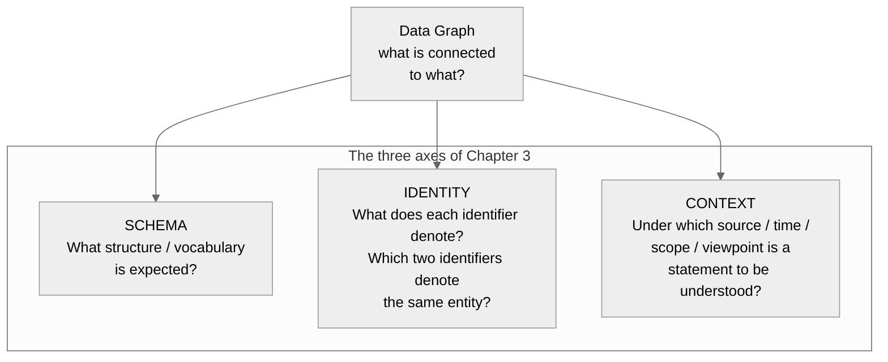
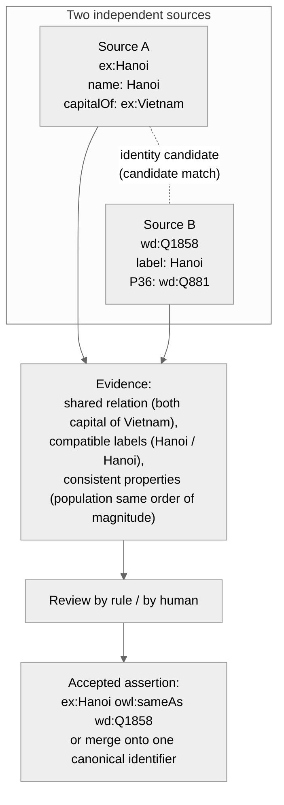
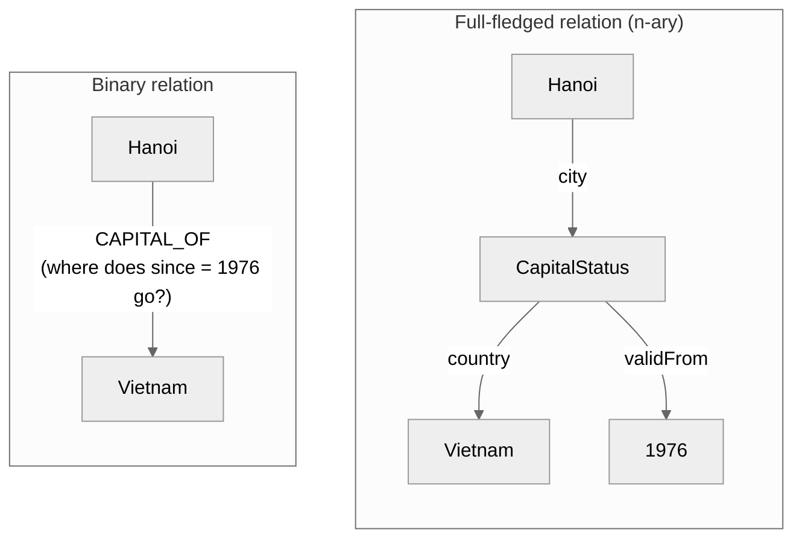
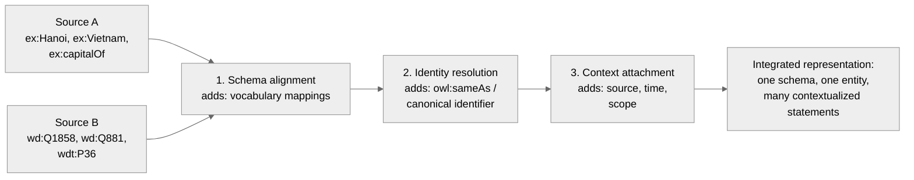

# Chapter 3 — Schema, Identity, and Context

> **Chapter orientation**
>
> **Central question:** A graph tells us *what is connected to what*. But how do we know
> what those things **are**, whether two identifiers point to **the same entity**, and
> within **which context** a statement must be understood?
>
> **Why it matters:** A knowledge graph in practice is almost always assembled from many
> sources. If these three problems are not resolved, your graph is just a pile of linked
> strings: the same city exists as two unrelated nodes, two sources contradict each other
> with no way to know why, and there is no way to trace a statement back to its origin.
>
> **What you will understand:**
>
> - A schema describes the expected structure and vocabulary of a data graph — and why a
>   schema is **not** an ontology
> - An identifier differs from the entity it denotes; why the same name does not
>   guarantee the same entity, and different names do not guarantee different entities
> - `owl:sameAs` is an assertion of **identity**, not "nearly the same"; and why OWL has
>   no unique name assumption
> - Context (source, time, scope, trust) is represented with named graphs, n-ary relation
>   entities, or relation properties — each mechanism only *represents* context; none of
>   them makes a statement true
> - The three axes Schema – Identity – Context are three **separate** problems, not to be
>   merged into one "ontology"
> - All three axes are applied at once to the mechanism knowledge graph: the schema of
>   Mechanism, the identity of one mechanism across two textbooks, and the context of a
>   `RATE_OF_CHANGE` application
>
> **Prerequisites:** Chapter 2 (RDF, IRI, property graph, triples, relations).
>
> **Concept map:**
>
> Data graph → Schema (expected structure) → Identity (two names, one entity?) → Context
> (within what scope is a statement true?) → Integrated representation

## 3.0 Opening: One city, two identifiers

Suppose you are building a knowledge graph about cities and countries. You have two data
sources.

**Source A** is an organization's internal database, using its own namespace `ex:`:

```turtle
@prefix ex: <http://example.org/> .

ex:Hanoi  ex:name        "Hanoi" ;
          ex:capitalOf   ex:Vietnam ;
          ex:population  8418883 .
```

**Source B** is Wikidata-style data, where every entity carries an opaque identifier
(of the form `Q…`) that suggests nothing about its name:

```turtle
@prefix wd:  <http://www.wikidata.org/entity/> .
@prefix wdt: <http://www.wikidata.org/prop/direct/> .

wd:Q1858  wdt:P31    wd:Q515 ;    # instance of: city
          wdt:P36    wd:Q881 ;    # capital of: Vietnam
          wdt:P1082  8053663 .    # population
```

To the human eye, it is obvious at once: both sources are talking about Hanoi, and both
say it is the capital of Vietnam. But **the graph does not know this**. With a purely
graph structure, none of the following questions has an automatic answer
[@hogan-knowledge-graphs]:

1. Are `ex:Hanoi` and `wd:Q1858` **the same entity**?
2. Are `ex:capitalOf` and `wdt:P36` **the same relation**? Which kind of concept does each
   property belong to?
3. **Which source** made the statement "is the capital", and which source should we trust?
4. During **what time interval**, within what scope is that statement true — or is it true
   unconditionally?

These four questions are not data errors; they are the essence of knowledge integration.
This chapter equips you with three corresponding conceptual tools, and they are three
**different** problems:



Figure: The three axes Schema – Identity – Context over the same data graph. Each axis
answers its own group of questions; no axis replaces the other two.

One important note before we begin: these three axes **are not an ontology**. Ontology —
the formal-semantic layer with axioms and inference — is the subject of Chapter 4. This
chapter builds only the "engineering" part: structure, identity, and context.

## 3.1 Schema — the expected structure

### 3.1.1 What problem does a schema solve?

A data graph is a set of nodes and edges: `ex:Hanoi ex:capitalOf ex:Vietnam`. In itself it
says nothing about **expectations**: what label must a node carry to count as a city? From
what kind to what kind does the `capitalOf` relation connect? How many population values
can a city have?

A **schema** is the part that describes the *expected structure and vocabulary* of a data
graph [@hogan-knowledge-graphs]:

- **Class / type**: the concept groups that are anticipated — `City`, `Country`.
- **Property / relation**: the relation names that are anticipated — `capitalOf`,
  `population`, `name`.
- **Domain vocabulary**: the set of standard terms that a data community agrees to use.
- **Structural constraints**: expectations about value domain, range, or cardinality — for
  example "the subject of `capitalOf` must be a `City`".

In short: the data graph answers *"what is there?"*; the schema answers *"what is allowed to
be there, and how should those names be understood?"*.

### 3.1.2 The data graph and the schema graph

Two layers must be distinguished:

- The **data graph** contains facts about the real world: Hanoi is the capital of Vietnam.
- The **schema graph** describes the structure of the data graph: `capitalOf` is a relation
  between a `City` and a `Country`.

In RDF, a schema is usually itself written *as an RDF graph*, using the RDFS vocabulary
[@w3c-rdf-schema]:

```turtle
@prefix rdfs: <http://www.w3.org/2000/01/rdf-schema#> .
@prefix ex:   <http://example.org/> .

ex:City       a rdfs:Class .
ex:Country    a rdfs:Class .
ex:capitalOf  rdfs:domain ex:City ;
              rdfs:range  ex:Country .
```

On the property-graph side, a schema is not a separate graph but an **application
convention** plus the constraints the DBMS supports [@neo4j-data-modeling]:

```cypher
CREATE CONSTRAINT city_id IF NOT EXISTS
FOR (c:City) REQUIRE c.id IS UNIQUE
```

Labels (`City`), relationship types (`CAPITAL_OF`), property keys (`name`, `population`),
and constraints (uniqueness, existence, data type) together form the "schema" in the
practical sense — but there is no common formal semantic standard on this side
[@neo4j-modeling-fundamentals].

### 3.1.3 The RDF-side schema: RDFS

RDFS (RDF Schema) provides four main tools for talking about expected structure
[@w3c-rdf-schema] [@hogan-knowledge-graphs]:

| Tool | What it says | Example |
|------|--------------|---------|
| `rdfs:Class` + `rdf:type` | Which class an entity belongs to | `ex:Hanoi rdf:type ex:City` |
| `rdfs:subClassOf` | This class is a subclass of that class | `ex:Capital rdfs:subClassOf ex:City` |
| `rdfs:domain` | Which class the subject of a relation belongs to | `ex:capitalOf rdfs:domain ex:City` |
| `rdfs:range` | Which class the object of a relation belongs to | `ex:capitalOf rdfs:range ex:Country` |

A subtle point met in Chapter 2 and worth repeating: `rdfs:domain` and `rdfs:range` are
**inference rules**, not validation constraints. From `ex:Hanoi ex:capitalOf X` and
`ex:capitalOf rdfs:domain ex:City`, a reasoner *infers* `ex:Hanoi rdf:type ex:City` — it
adds knowledge rather than rejecting data. Checking and rejecting bad data is the job of
the validation layer (Chapter 5).

### 3.1.4 The property-graph-side schema

The property-graph side has no standard semantic layer; a schema is an application
convention [@neo4j-data-modeling] [@stanford-cs520-create-kg]:

- **Labels** classify nodes: `:City`, `:Country`. A node may carry many labels or none.
- **Relationship types** name edges: `:CAPITAL_OF`.
- **Properties** are name–value pairs on nodes and relationships.
- **Constraints** — for example uniqueness constraints, property-existence constraints,
  type constraints — are the mechanisms a DBMS provides to keep data consistent with the
  design.

The same expectation "the subject of the capital relation must be a city" is expressed on
the RDF side with `rdfs:domain` (with standard inference semantics), and on the
property-graph side with a naming convention plus a constraint or an application-layer
check. This difference is a direct consequence of Chapter 2: one side has standard formal
semantics, the other has convenience.

### 3.1.5 A schema is not an ontology

This is the boundary most easily blurred, so it must be stated plainly: **schema ≠
ontology**.

A schema can:

- list the expected classes and relations,
- name properties and data types,
- state cardinality constraints,

while giving **no** full formal semantics at all: does this class *exclude* that class, are
two classes *equivalent*, is a relation *transitive*, what condition is *sufficient* for an
entity to belong to a class. Those questions belong to ontology and will be answered with
formal tools in Chapter 4 [@hogan-knowledge-graphs].

Put another way: a schema gives you the **skeleton of vocabulary and structure**; an
ontology gives that skeleton **inference-capable meaning**. This chapter needs only the
skeleton.

### 3.1.6 Three schema strategies

There is a common misconception: to build a knowledge graph you must design the entire
schema before loading any data. This is not true. The CS520 material states plainly that
you *can* start without a schema, and that both schema and data are accreted during
building; designing upfront is useful **to the extent that it is practical**
[@stanford-cs520-create-kg]. Hogan et al. distinguish three kinds of schema
[@hogan-knowledge-graphs]:

1. **Upfront schema**: define classes, relations, and constraints before loading data.
   Reasonable when the domain is stable and the business requirements are clear.
2. **Incremental schema**: the schema grows alongside the data; each new source may add new
   classes and relations.
3. **Emergent / bottom-up schema**: structure is *reverse-extracted* from existing data —
   for example by grouping nodes with the same connection shape — rather than being designed
   from the start.

These three strategies do not exclude one another. The criterion for choosing depends on
the stability of the domain and the degree of initial understanding:

- **Upfront** fits a well-understood domain — the mechanism schema in §3.1.7 can be designed
  upfront because its concepts (Mechanism, Operation, Quantity) are stable within a
  textbook's scope.
- **Incremental** fits continuous source integration — each new mechanism source can add a
  new Operation without breaking the current schema.
- **Emergent** helps when data comes first and the schema is unclear — extracting structure
  from a raw mechanism data store without knowing in advance which classes exist.

In our running example, source A and source B each carry their own "implicit schema"
(`ex:capitalOf` versus `wdt:P36`, `ex:name` versus Wikidata's labels). The first job of
integration is to make those two implicit schemas talk to each other — the *schema
alignment* step returns in §3.4.

> ⚑ **Does not imply:** having a schema does not mean the data is correct. A schema is about
> *structural expectations*; concrete data may still be wrong, missing, or outdated. Data
> validation is a separate problem (Chapter 5).

### 3.1.7 A schema for the mechanism domain

The same schema thinking — classes, relations, constraints — is applied to the mechanism
domain throughout the book. The following RDFS schema describes the expected classes and
relations in the knowledge graph about mechanisms:

```turtle
@prefix rdfs: <http://www.w3.org/2000/01/rdf-schema#> .
@prefix ex:   <http://example.org/kgbook/mks#> .

ex:Mechanism              a rdfs:Class .
ex:RateOfChangeMechanism  rdfs:subClassOf ex:Mechanism .
ex:Operation              a rdfs:Class .
ex:DerivativeOperation    rdfs:subClassOf ex:Operation .
ex:Quantity               a rdfs:Class .
ex:ReferenceVariable      a rdfs:Class .
ex:MechanismApplication   a rdfs:Class .

ex:hasOperation  rdfs:domain ex:Mechanism ;
                 rdfs:range  ex:Operation .
ex:hasInput      rdfs:domain ex:Mechanism ;
                 rdfs:range  ex:Quantity .
ex:hasOutput     rdfs:domain ex:Mechanism ;
                 rdfs:range  ex:Quantity .
ex:hasValue      rdfs:domain ex:Quantity ;
                 rdfs:range  rdfs:Literal .
```

This is a pure RDFS schema: it declares classes, relations, and domain/range — but says
nothing about inference semantics (exclusion, equivalence, necessary-and-sufficient
conditions). It tells you `ex:rateOfChange_1` is a `RateOfChangeMechanism`, and that
`ex:hasOperation` connects from Mechanism to Operation. It does not tell you that every
Mechanism must have at least one Operation, or that `RateOfChangeMechanism` and
`HeatTransferMechanism` exclude each other. Those semantics belong to ontology (Chapter 4).

Compared with the city schema in §3.1.3: the RDFS structure is identical — only the class
names, relation names, and domain differ. The schema tool is one; the application domain
changes.

## 3.2 Identity — naming is not understanding

This is the conceptual heart of the chapter. If schema answers "what *kind* of thing are we
talking about", identity answers "*which* thing are we talking about".

### 3.2.1 An identifier is not an entity

Let us separate three concepts that are usually conflated:

- **Entity**: an object in the real world or in the problem domain — the physical city of
  Hanoi, its people, its history.
- **Identifier**: a string used to *name* an entity within a system — `ex:Hanoi`,
  `wd:Q1858`, `"Hanoi"`.
- **Denotation**: the relation "this identifier *refers to* that entity".

The relation among them is not an equation: **an identifier is not an entity**. The same
entity can carry many identifiers (Hanoi is also called `Hanoi`, `wd:Q1858`, or — in older
texts — Thăng Long, Đông Kinh). And a string does not automatically carry along the entity
it denotes — that meaning is assigned to it by people and convention
[@hogan-knowledge-graphs].

First consequence: **the same identifier does not prove semantic agreement**. We met this in
Chapter 2: a shared IRI does not guarantee that both sides use it with the same intent. Two
systems can both use the name `Hanoi` for two different modeling choices, or even for two
different entities that happen to share a name.

Second consequence: **two different identifiers do not prove two different entities**.
`ex:Hanoi` and `wd:Q1858` differ character by character, yet very plausibly denote the same
city. The graph cannot conclude this on its own — and that is precisely the identity
problem.

Denotation — the relation between an identifier and an entity — has three properties worth
remembering throughout the chapter:

1. **Not intrinsic:** an IRI such as `ex:rateOfChange_1` does not automatically denote the
   rate-of-change mechanism; that meaning is assigned by its creators and readers. An IRI is
   just a string; denotation is a community convention.
2. **Contestable:** two communities can argue over whether `ex:rateOfChange_1` denotes
   "instantaneous velocity" or "average velocity". A unique identifier does not settle the
   dispute — only an agreement, or splitting the identifier, does.
3. **Can change over time:** an identifier `ex:newtonianGravity` denotes a physical theory;
   after Einstein it still denotes that theory, but our understanding of its range of
   validity has changed — the identifier does not change, the denotation does not change, but
   the knowledge attached to the entity changes.

### 3.2.2 Why are graphs full of duplicate identifiers?

Because a knowledge graph is rarely born from a single hand. Each data source names things
by its own convention:

- An internal source uses readable names: `ex:Hanoi`, `ex:Vietnam`.
- Wikidata uses language-neutral opaque identifiers: `wd:Q1858`, `wd:Q881`
  [@wikidata-statements].
- A third partner might use `geo:HanoiCapitalRegion` in their own namespace
  [@hogan-knowledge-graphs].

If you merely join the sources by graph union, you get **three disjoint nodes** for the same
city: one source's data does not connect to another's, and every query "find everything
about Hanoi" comes up short. Cross-source identity is something that must be *designed and
established*, not something already present [@stanford-cs520-kg-from-data].

### 3.2.3 OWL has no unique name assumption

In many familiar systems (for example relational databases), two different primary keys are
by default two different records. That intuition is called the **unique name assumption**
(UNA): *different names mean different entities*.

OWL does **not** make this assumption. The OWL 2 Primer states it plainly: OWL does not
assume that different names are names of different individuals; the absence of UNA is
especially suited to the Semantic Web environment, where different organizations may name
things independently without knowing they are talking about the same individual
[@w3c-owl2-primer].

In other words, in OWL:

- `ex:Hanoi` and `wd:Q1858` being different does **not imply** two different cities.
- To assert they are *different*, you must say so explicitly with `owl:differentFrom`.
- To assert they are *one*, you must say so explicitly with `owl:sameAs`.

Both "same" and "different" are **assertions that require evidence**, not system defaults.
This is a deep point worth pausing on: the graph's silence ("nothing says otherwise") is not
evidence of difference.

### 3.2.4 owl:sameAs is an identity assertion — not "nearly the same"

The standard tool for linking two identifiers of the same entity is `owl:sameAs`
[@w3c-owl2-primer] [@stanford-cs520-create-kg]:

```turtle
ex:Hanoi owl:sameAs wd:Q1858 .
```

Read this line at its true meaning: `ex:Hanoi` and `wd:Q1858` **are one and the same
individual**. Not "nearly the same", not "might be the same", not "approximately
equivalent". The OWL 2 Primer states the direct consequence: a reasoner may infer that
*any information known about `ex:Hanoi` also holds for `wd:Q1858`*, and vice versa
[@w3c-owl2-primer]. Information **propagates** through `owl:sameAs`: population, relations,
labels — everything attached to this node becomes information attached to that node.

It is exactly this propagation consequence that makes `owl:sameAs` both powerful and
dangerous:

- **Powerful**: a single correct identity assertion can merge data from many sources without
  copying anything.
- **Dangerous**: a single **wrong** assertion merges two entities that were in fact
  different, and all of their information mixes — causing cascading inference errors.

> 🖊 **Self-check:** Suppose the graph contains `ex:Hanoi owl:sameAs wd:Q1858` and `wd:Q1858 ex:population 8000000`. No triple directly states the population of `ex:Hanoi`. What will an OWL reasoner answer when asked "what is the population of ex:Hanoi"? Why? If the `owl:sameAs` line is wrong (the two IRIs are actually two different cities), what is the consequence?

That is why `owl:sameAs` is not a place to record "two things look alike". Relations like
"nearly the same", "partially match", "related" need different predicates with weaker
semantics — choosing and defining them belongs to the ontology layer (Chapter 4) and the
quality-assessment layer (Chapter 7).

> ⚑ **Rule of practice:** use `owl:sameAs` only when you are prepared to accept every
> consequence of the two names being one. If you hesitate, you have an *identity candidate*,
> not an identity assertion.

**A dangerous example in the mechanism domain.** Suppose a programmer hastily writes:

```turtle
ex:rateOfChange_1 owl:sameAs ex:heatTransferRate_2 .
```

Both mechanisms are `RateOfChangeMechanism` and both use `ex:derivativeOperation_1`, but they
differ in their input: `ex:rateOfChange_1` differentiates `ex:position_1`, whereas
`ex:heatTransferRate_2` differentiates `ex:thermalEnergy_1`. A wrong `owl:sameAs` assertion
merges them, leading a reasoner to conclude that `ex:heatTransferRate_2` has input
`ex:position_1` — a physically wrong inference. The consequences propagate: every query
"which mechanisms act on position" returns `heatTransferRate_2`, and every query about
thermal energy is contaminated with position data. A single wrong `owl:sameAs` edge on the
mechanism graph causes damage far beyond where it was written, because inference propagates
it across the whole graph.

> ⚑ **Lesson:** in the mechanism domain, `owl:sameAs` is even more dangerous because
> different mechanisms often *share* an operation, share an output type, and differ only in
> input or condition. Evidence of identity must be detailed enough to tell them apart (see
> §3.2.5).

### 3.2.5 From candidate to accepted assertion

How does a system know that `ex:Hanoi` and `wd:Q1858` denote the same city? There is no
magic; there is a process. In the data-integration literature this problem is called
**record linkage** or **identity resolution**: inferring whether two records in two sources
are the same real-world entity [@stanford-cs520-kg-from-data].

The conceptual process has three layers:



Figure: The flow from two independent sources to an identity assertion. A candidate match
becomes an assertion only after there is evidence and it is accepted by rule.

1. **Candidate match**: two identifiers are flagged as suspected to be one, based on initial
   signals — similar labels, the same relations to known entities, matching properties.
2. **Evidence and review**: the signals are weighed according to the organization's rules —
   automatically, or with human confirmation. In our example: both nodes are "capital of
   Vietnam", the labels `Hanoi`/`Hanoi` are compatible, the populations are the same order of
   magnitude. That is strong evidence — but still evidence, not a conclusion.
3. **Accepted identity assertion**: the organization decides to record the identity, in one of
   two forms:
   - add an edge `ex:Hanoi owl:sameAs wd:Q1858` and keep both nodes, or
   - choose a **canonical identifier** — for example `wd:Q1858` — and record the remaining
     names as **aliases**.

The last two concepts must be named correctly:

- **Canonical identifier**: the single identifier the system chooses as the entity's "true
  name"; every access resolves to it.
- **Alias**: other names that denote the same entity — including names in other languages and
  names in other sources.

Wikidata is a valuable real-world example: the identifier `Q1858` is opaque, carrying no
linguistic meaning, which makes it stable across renames and neutral between languages;
meanwhile "Hanoi" and "Hanoi" are labels and aliases attached to the entity, not the
identifier itself [@hogan-knowledge-graphs] [@wikidata-statements]. Separating the *name*
from the *identifier* is a deliberate design decision.

**A mechanism example — concept identity.** The same problem, but in the mechanism domain.
Two physics textbooks define "velocity" as follows:

- **Textbook A:** "Velocity is the rate of change of position with respect to time."
- **Textbook B:** "Speed in a given direction is the derivative of the position vector with
  respect to time."

Although the wording differs, both describe the same mechanism: `RATE_OF_CHANGE` applied to
`position` and `time`. In a data graph, each textbook might create its own IRI:

```turtle
@prefix ex: <http://example.org/kgbook/mks#> .
@prefix ta: <http://example.org/kgbook/textbookA#> .
@prefix tb: <http://example.org/kgbook/textbookB#> .

# Textbook A
ta:velocityDef  a  ex:Mechanism ;
    ex:hasOperation  ex:derivativeOperation_1 ;
    ex:hasInput      ex:position_1 ;
    ex:hasOutput     ex:velocity_1 .

# Textbook B
tb:speedDef  a  ex:Mechanism ;
    ex:hasOperation  ex:derivativeOperation_1 ;
    ex:hasInput      ex:position_1 ;
    ex:hasOutput     ex:velocity_1 .
```

Evidence of identity: (1) the same operation `ex:derivativeOperation_1`, (2) the same input
`ex:position_1`, (3) the same output `ex:velocity_1`. This is **definitional evidence**, not
geographic — it rests on conceptual content (the same transformation over the same quantity),
not on coordinates or population. After review, the accepted assertion is:

```turtle
ta:velocityDef owl:sameAs tb:speedDef .
```

Meanwhile `ex:heatTransferRate_2` also uses `ex:derivativeOperation_1`, but differs in input
(`ex:thermalEnergy_1` instead of `ex:position_1`). It is an identity candidate **rejected** at
the evidence step because of a differing participant. The rule to draw: *evidence of identity
must be enough to distinguish from the nearest look-alike* — if two mechanisms look alike on
the surface (same operation), only a full comparison of participants can tell them apart.

**Canonical identifier in the mechanism domain.** After recognizing identity, the system must
choose a **canonical identifier** — the "true" name every access resolves to. The selection
criteria (applied to `ex:rateOfChange_1`, versus `ta:velocityDef` and `tb:speedDef`):

- **Stable:** the canonical identifier does not change when a source renames. The mechanism's
  IRI within the system itself (`ex:rateOfChange_1`) is more stable than an IRI carrying a
  specific textbook's name.
- **Source-neutral:** not tied to a specific source; if textbook A ceases to exist,
  `ta:velocityDef` is still there but is no longer a sensible name.
- **Domain-owned:** controlled by the system (or the domain community), not preempted by a
  third party.

The remaining identifiers become **aliases**: still valid for lookup, linked back to the
canonical identifier by `owl:sameAs`. The lifecycle of a canonical identifier closes like
this: candidate → evidence → acceptance → recorded as an alias.

### The 6-step pipeline over two mechanism sources

Summarizing the integration of `ta:velocityDef` and `tb:speedDef` into a 6-step pipeline:

| Step | Operation | Input | Output |
|------|-----------|-------|--------|
| **1. Detection** | Notice that two sources describe the same domain (velocity) | `ta:velocityDef`, `tb:speedDef` | A set of candidates to process |
| **2. Schema alignment** | Compare vocabularies: both use `ex:hasOperation`/`ex:hasInput`/`ex:hasOutput` — match; if one side used `ex:involves`, record a mapping `involves → hasOperation` | The properties of the two sources | A vocabulary mapping (or a confirmed match) |
| **3. Identity candidate** | Propose the hypothesis: `ta:velocityDef` and `tb:speedDef` describe one mechanism | IRIs, labels, surface relations | `ta:velocityDef owl:sameAs tb:speedDef` (proposed) |
| **4. Evidence** | Compare operation, input, output; distinguish from `ex:heatTransferRate_2` (same operation, different input) | The graph structure of each source | Strong (definitional) evidence, or rejection |
| **5. Confirmation** | Accept or reject the mapping based on evidence | Evidence + organizational rules | `ta:velocityDef owl:sameAs tb:speedDef` (confirmed) |
| **6. Canonical identifier** | Choose `ex:rateOfChange_1` as the official name; record `ta:velocityDef` and `tb:speedDef` as aliases | The set of IRIs confirmed identical | `ex:rateOfChange_1` (canonical), `ta:velocityDef` (alias), `tb:speedDef` (alias) |

This pipeline shows that each step adds exactly one kind of information: schema (step 2) adds
a vocabulary mapping, identity (steps 3–5) adds an identity assertion, canonicalization
(step 6) chooses a stable name. No step adds wrong graph data — the pipeline only rejects or
integrates, it never destroys.

> ⚑ **Scope:** this chapter teaches the *problem* and the *conceptual process* of identity
> resolution. Industrial algorithms — blocking, matching, machine learning — belong to
> Chapter 7.

## 3.3 Context — a statement rarely stands alone

### 3.3.1 Why is context needed?

Consider the seemingly complete statement: "Hanoi is the capital of Vietnam."

Immediately one can ask further: **since when?** (Hanoi has been the capital of a unified
Vietnam since 1976; before that it was the capital of the Democratic Republic of Vietnam.)
**According to which source?** (Source A gives a population of 8,418,883; source B gives
8,053,663 — two different numbers, and both may be correct *at their own point in time*.)
**Within what scope?** (A statement may be true for one statistical scope but not another.)
**How trustworthy?**

Hogan et al. define context as the **scope of truth**: the setting within which a unit of
knowledge is considered true — over time, over geography/scope, over origin, or a combination
of several dimensions [@hogan-knowledge-graphs].

Note the boundary: this chapter teaches the **representation mechanisms** for context. A full
model of claim – evidence – provenance – time – contradiction is the work of Chapter 6.

### 3.3.2 Named graphs and RDF datasets: grouping and naming

The first mechanism on the RDF side is the **RDF dataset**: a set of RDF graphs, comprising
exactly one **default graph** and zero or more **named graphs**; each named graph is a pair
of a *graph name* (an IRI or blank node) and an RDF graph [@w3c-rdf11-concepts]. Below is the
TriG syntax — an extension of Turtle for writing a whole dataset:

```trig
@prefix ex: <http://example.org/> .

ex:sourceA {
    ex:Hanoi ex:capitalOf ex:Vietnam .
    ex:Hanoi ex:population 8418883 .
}

ex:sourceB {
    wd:Q1858 wdt:P36 wd:Q881 .
}
```

The same technique applies to the mechanism domain. We partition mechanism data by source:

```trig
@prefix ex:  <http://example.org/kgbook/mks#> .
@prefix xsd: <http://www.w3.org/2001/XMLSchema#> .

ex:textbookA {
    ex:rateOfChange_1  ex:hasOperation  ex:derivativeOperation_1 ;
                       ex:hasInput      ex:position_1 ;
                       ex:hasOutput     ex:velocity_1 .
}

ex:experimentData {
    ex:position_1  ex:hasValue  "12.5"^^xsd:double .
    ex:velocity_1  ex:hasValue  "3.2"^^xsd:double .
}
```

`ex:textbookA` holds the conceptual definition, `ex:experimentData` holds measured
experimental data. This separation lets you query each source separately (SPARQL `GRAPH`,
Chapter 2) and attach provenance to the whole group — for example asking "which value sets
come from the experiment?" without mixing in the textbook definition. Note the boundary
below: the meaning "the source asserted this" is an application convention, not intrinsic RDF
semantics.

A named graph lets you **group** statements and attach the whole group to a name — very
convenient for partitioning data by source, by version, by viewpoint.

But this is the most easily misunderstood point in the whole chapter. The RDF 1.1
specification states clearly: despite the word "name", **a graph name is not required to
denote the graph**; it is only *syntactically paired* with the graph; RDF places no formal
constraint on what resource that name denotes, or on the relation between that resource and
the graph [@w3c-rdf11-concepts].

To put it bluntly: **a named graph does not automatically mean "the source asserted these
triples"**. It is a grouping mechanism; the provenance meaning is an **application
convention** — a good and common convention, but one that becomes real semantics only when
the application describes it explicitly (for example with a provenance vocabulary like
**PROV** — PROV-O is a W3C standard providing classes and properties to describe origin,
agents, and activities that produced data; studied in detail in Chapter 6).

### 3.3.3 Full-fledged relation entities: the n-ary pattern

The second mechanism addresses a structural limit of RDF: an RDF property is a **binary**
relation — it connects exactly two terms. To see why this is a limit, distinguish three
levels:

- **Binary relation:** `(Hanoi, capitalOf, Vietnam)` — two participants, one relation. RDF
  represents this directly with one triple.
- **Ternary relation:** "Hanoi is the capital of Vietnam *since 1976*" — three participants:
  city, country, point in time. There is no slot in the triple for "since 1976".
- **n-ary relation:** the general case — when the number of participants exceeds two, or when
  the relation itself needs to carry additional properties (trust, time, scope). The W3C
  calls this the **n-ary relation** problem [@w3c-nary-relations].

The standard pattern (Pattern 1 in the W3C document): create an **intermediate entity**
representing the "relation event" itself, then connect it to each participant
[@w3c-nary-relations]:



Figure: From a binary relation to a full-fledged relation. The intermediate node
`CapitalStatus` represents the "is-capital" event, allowing a point in time (and any other
context dimension) to be attached without cramming it onto a binary edge.

```turtle
ex:capitalStatus_1  a            ex:CapitalStatus ;
                    ex:city      ex:Hanoi ;
                    ex:country   ex:Vietnam ;
                    ex:validFrom "1976" .
```

What you gain: each context dimension is a first-class node/edge; you can add as many
dimensions as you like (source, trust, effective-until date); you can talk about the event
itself ("this capital status was confirmed by…"). What you lose: extra structure, queries
must go through the intermediate node, and you must name the event [@w3c-nary-relations].

One valuable semantic detail from Hogan et al.: **a re-created edge is not automatically
asserted** — you can describe a relation *in order to say it is no longer true*, without
asserting it at all [@hogan-knowledge-graphs]. Representation and assertion are two different
things.

The technique of building an intermediate entity has its own name: **reification** ("treating
a statement as an object"). A relation is *reified* when you replace the binary edge with an
entity that can carry additional properties — exactly what we did with `CapitalStatus` above.

**In the mechanism domain, reify the application of the `RATE_OF_CHANGE` mechanism.** The
statement "velocity is the derivative of position with respect to time" is not a binary
relation: it has four participants — the mechanism, the operation, the differentiated
quantity, and the reference variable. This extends `CapitalStatus` (3 participants) directly
to `DerivativeApplication` (4 participants), from the book's canonical model
(MECHANISM_KG_CANONICAL_MODEL):

```turtle
ex:rateOfChange_1           ex:hasApplication  ex:derivativeApplication_1 .
ex:derivativeApplication_1  a                  ex:DerivativeApplication ;
    ex:hasOperation         ex:derivativeOperation_1 ;
    ex:differentiand        ex:position_1 ;
    ex:withRespectTo        ex:time_1 .
```

The four edges from `ex:derivativeApplication_1` bind the four "slots" of the n-ary relation:
*which mechanism* (via `ex:hasApplication` back to `ex:rateOfChange_1`), *which operation*
(`ex:hasOperation`), *which quantity is differentiated* (`ex:differentiand`), and *with
respect to which variable* (`ex:withRespectTo`). Now you can talk about that application
itself — who confirmed it, in which experiment it was measured, since when it holds — without
soiling the velocity relation at the data layer. This very `DerivativeApplication` will be
given full formal semantics (axioms) in Chapter 4 and confirmed by rule/SHACL in Chapter 5.

**Why not three binary edges instead of an intermediate node?** Suppose we represent the same
application with three direct edges from the mechanism (the flat representation from Chapter
2):

```turtle
ex:rateOfChange_1  ex:hasOperation  ex:derivativeOperation_1 ;
                   ex:hasInput      ex:position_1 ;
                   ex:hasReferenceVariable  ex:time_1 .
```

These three edges correctly describe three roles — but nothing *binds* them to the same
application. When the mechanism is applied a second time (the derivative of `velocity_1` with
respect to `time_1`), the three new edges spawn three parallel relations; to know whether
`hasInput position_1` goes with `hasOperation derivativeOperation_1` or some other operation,
no connection answers. The intermediate node solves exactly this: it is the common anchor all
roles point back to, and the only place to attach properties (evidence, time) about *that
application itself*.

> 🖊 **Self-check:** Suppose you need to represent "Alice worked at company X from 2020 to 2023, as a software engineer". Sketch the n-ary structure for this statement: what does the intermediate entity represent? How many edges connect from it? If Alice later returns to company X in a different role, can your structure handle it?
>
> *Answer hint:* the intermediate entity represents the *employment event*, not Alice and not
> the company — it can carry `employee`, `employer`, `startDate`, `endDate`, `role`. Edges
> from it: at minimum two participating entities (if you treat the event as a binary relation
> with properties), four if you separate both role and time interval into their own edges.
> Alice returning in a different role = a *new* employment event, not an overwrite of the old
> one — this is precisely the advantage of n-ary over a single property value: history is
> kept, not replaced.

### 3.3.4 Relation properties: the property-graph way

The property-graph side solves the same problem more compactly, because a relationship can
already carry properties (Chapter 2):

```
(:City {name: "Hanoi"})-[:CAPITAL_OF {since: 1976}]->(:Country {name: "Vietnam"})
```

This is the natural choice when the context is simple (one point in time, one source, one
trust value) and queries mostly traverse edges. When the context balloons — many time
intervals, many sources at once, or a need to query the context dimensions themselves — the
intermediate-entity pattern returns, even in a property graph [@stanford-cs520-create-kg].

### 3.3.5 Current development — RDF 1.2: triple term and reifier

> ⚑ **Current development.** RDF 1.2 is developing a *triple term* and *reifier* mechanism,
> allowing a proposition to be referenced and augmented with information without manually
> building an intermediate node [@w3c-rdf12-concepts]. This is a direction that adds a
> "tighter" context-representation mechanism for the RDF side; it is not yet a stable
> baseline, and it does not automatically solve every n-ary problem — choosing which
> structure to use remains a modeling decision.

### 3.3.6 Wikidata: context in a real system

Wikidata deserves a pause because it handles context at industrial scale
[@wikidata-statements] [@wikidata-qualifiers]:

- The data unit is a **statement** attached to an item: at its core a **property–value** pair
  (for example `population: 8053663`).
- A statement is extended by **qualifiers** (contextual modifiers): "population — *as of
  2011*" (a time dimension), "France — *excluding Adélie Land*" (a scope dimension),
  "population — *method: estimation*" (a method dimension).
- A statement carries **references** (citations) and **ranks** (preferred / normal /
  deprecated) to manage competing values without deleting any of them.

And a design principle worth learning: a statement *must still be useful standing alone*;
qualifiers only add information, they do not replace the core content
[@wikidata-qualifiers]. Context makes a statement **more precise to evaluate**, not a
replacement for the statement.

The general pattern behind the examples above is a fifth representation mechanism, complementing
the four in §3.3.2–3.3.5: the **qualifier** — a (property, value) pair attached to a statement
to add *one context dimension* without building a new node. Unlike an n-ary entity (which adds
structure and lets you talk about the statement itself), a qualifier only *clarifies the scope*
of that statement. Choose a qualifier when: the context dimension is single, there is no need
to reference the statement itself, and the core value must remain readable independently.

**Applied to the mechanism domain** — two measured values of the same quantity, not a
contradiction once the context dimensions are known:

| Statement | Context dimension to attach |
|-----------|-----------------------------|
| `ex:position_1 ex:hasValue "12.5"` | *as of* 14:00, *method*: GPS |
| `ex:position_1 ex:hasValue "12.3"` | *as of* 14:05, *method*: GPS |
| `ex:velocity_1 ex:hasValue "3.2"`  | *derived* from a position series, *rank*: preferred |

The same IRI (`ex:position_1`) having two different values is not an error — each value is
recorded with a point in time and a method; the reader queries by context to pick the right
value. This is how context lets you evaluate two competing statements without deleting either
— the foundation for contradiction management and claims in Chapter 6.

### 3.3.7 Context does not create truth

The four mechanisms just examined — named graph, n-ary entity, relation property, triple term
— are all **representation** mechanisms. Attaching `source: A`, `validFrom: 1976`, or placing
a triple inside a named graph named after source A does not make a statement more true; it
only tells you *within what scope the statement is being understood*.

> ⚑ **The sentence to remember from this chapter:**
> **"Context enables evaluation; context does not create truth."**

A false statement with full provenance is still a false statement — the only difference is
that you now know *who said it, and when*, and that is precisely the condition for evaluation.
Chapter 6 will build a full epistemic layer on this foundation: claims, evidence,
contradiction, and how they interact.

## 3.4 The three axes working together: one complete integration example

Now let us join the three axes over the very two sources from the opening. Each step adds one
well-defined kind of information to the graph.

**Step 0 — The raw graph.** The two sources sit disjoint, each in its own namespace:

```
Source A:  ex:Hanoi  --ex:capitalOf-->  ex:Vietnam
           ex:Hanoi  ex:population 8418883
Source B:  wd:Q1858  --wdt:P36-->       wd:Q881
           wd:Q1858  wdt:P1082 8053663
```

**Step 1 — Schema alignment.** We establish the vocabulary correspondences between the two
sources and the target schema [@stanford-cs520-kg-from-data]:

- `ex:capitalOf` and `wdt:P36` both play the "capital of" role → map to the target relation
  `capitalOf`.
- `ex:Vietnam` and `wd:Q881` both play the role of the country Vietnam → class `Country`.
- Both city nodes belong to class `City`.

Vocabularies do not match on their own; the mappings above are **the result of a process**,
not something obvious. The alignment process has three iterative steps:

1. **Candidate generation:** based on surface signals — similar names, definitions sharing
   words, (domain/range) that look like a match. Here: `capitalOf` and `wdt:P36` both have a
   subject that is a "city"-like class.
2. **Evidence:** check the *structure* — the domain and range of the two relations; check
   *matching entities* — two nodes both connecting to `Vietnam`/`wd:Q881`; check the
   *semantics* — the textual definitions "capital of" match.
3. **Validate / reject:** a mapping is accepted when the evidence is strong enough and *no
   competing alternative candidate exists*; otherwise it is rejected or flagged for human
   review.

**A mechanism-domain example — a rejected mapping.** Two textbooks describe the same mechanism
with two different relations:

```turtle
@prefix ex: <http://example.org/kgbook/mks#> .
@prefix ta: <http://example.org/kgbook/textbookA#> .
@prefix tc: <http://example.org/kgbook/textbookC#> .

# Textbook A
ta:velocityDef  ex:hasOperation  ex:derivativeOperation_1 ;
                ex:hasOutput     ex:velocity_1 .
# Textbook C
tc:speedDef      ex:involves      ex:derivativeOperation_1 ;
                 ex:involves      ex:velocity_1 .
```

`ex:involves` looks like `ex:hasOperation` (both link to `derivativeOperation_1`), but the
structural evidence rejects the mapping: `ex:involves` also links to `velocity_1`, an output
quantity — it has a wider range (`Operation` *or* `Quantity`), whereas `ex:hasOperation` has a
narrow range (`Operation` only). Despite sharing one instance, the two relations have
different structural signatures → **no mapping**. If you force a mapping because they "look
alike", every later query "which mechanism uses which operation" will return output figures
mixed in as well. The alignment process must *know how to refuse*, not only how to connect.

*Information added:* the vocabulary correspondences. The data graph has not changed; the change
is at the schema layer.

**Step 2 — Identity resolution.** With the schema aligned, the evidence becomes sharp: both
nodes are "capital of Vietnam" (same aligned relation), the labels `Hanoi`/`Hanoi` are
compatible, the populations are the same order of magnitude. After review, the accepted
assertion [@w3c-owl2-primer]:

```turtle
ex:Hanoi owl:sameAs wd:Q1858 .
ex:Vietnam owl:sameAs wd:Q881 .
```

*Information added:* the identity assertions. From here, the two sources' information can be
merged onto the same entity.

**Step 3 — Context attachment.** The two different population numbers are no longer a
puzzling contradiction: each statement is given a source and a point in time; the "capital"
statement is given an effective date [@hogan-knowledge-graphs] [@wikidata-statements]:

```turtle
ex:capitalStatus_1  a           ex:CapitalStatus ;
                    ex:city     ex:Hanoi ;
                    ex:country  ex:Vietnam ;
                    ex:validFrom "1976" ;
                    ex:source   ex:sourceA .
```

*Information added:* the source, time, and scope of each statement.

**Result — the integrated representation.** A single graph in which: structure follows a common
schema, each entity has a canonical identifier with cross-source aliases, and each statement
carries context for evaluation.



Figure: The full integration pipeline. Each step adds exactly one kind of information: schema
adds vocabulary correspondences, identity adds identity assertions, context adds
source/time/scope.

A summary table of what each step adds:

| Step | Mechanism | Information added |
|------|-----------|-------------------|
| Schema alignment | vocabulary mappings, classes, relations | "these two vocabularies say the same thing" |
| Identity resolution | `owl:sameAs` / canonical identifier + aliases | "these two names are one entity" |
| Context attachment | named graph / n-ary entity / relation property | "which source asserted this statement, over what time interval, within what scope/jurisdiction" |

These three steps are the skeleton of every knowledge-graph integration process — the
industrial algorithms in Chapter 7 only make them run at scale; they do not change the
conceptual structure.

## 3.5 Common modeling mistakes

1. **Treating a database key as a real-world identifier.** An internal identifier (such as a
   Neo4j element ID) is an implementation identifier: it may be reused after deletion, is not
   stable beyond the transaction scope, and is meaningless outside that system
   [@neo4j-cypher-manual]. A domain identifier must be created and managed by the application.
2. **Treating a matching string as a matching entity.** `"Hanoi"` appearing in two datasets is
   two identical *labels*, not one entity. A label is data for finding identity candidates, not
   evidence of identity.
3. **Using `owl:sameAs` for approximate similarity.** `owl:sameAs` is identity with
   graph-wide propagation consequences. "Nearly the same" needs a different predicate; writing
   one wrong sameAs edge merges two entities everywhere they appear.
4. **Treating a named graph as automatically meaning source/provenance.** A graph name is only
   syntactically paired with the graph; the meaning "the source asserted this" is an
   application convention that must be described explicitly [@w3c-rdf11-concepts].
5. **Treating a schema as an ontology.** Naming classes and relations does not create inference
   semantics: there is no exclusion, equivalence, or necessary-and-sufficient condition yet.
   Waiting for inference from a schema that only has naming conventions is waiting in the wrong
   place (Chapter 4).
6. **Encoding every property as a node.** Turning every value into a node bloats the graph,
   muddles queries, and forces everything to carry an identifier when many values (numbers,
   dates, strings) are just data.
7. **Encoding everything as a property.** The opposite direction is also wrong: an event that
   needs context (time, source) or needs to be referenced loses its anchor if it is compressed
   into a property on a node; an event that changes over time cannot be represented by a single
   property value [@stanford-cs520-create-kg].
8. **Treating the presence of context/provenance as making a statement trustworthy.**
   Provenance tells you *who said it, when*; it does not confirm *that what was said is true*.
   Assessing trustworthiness is a separate step on top of context (Chapter 6).

## 3.6 Reflection questions

- ★ Two datasets both contain `"Hanoi"`. What evidence is needed before merging them into one
  entity? Which evidence is strong, which is weak, and who is responsible for the decision?
- ★ If `A owl:sameAs B`, what logical consequences must follow? Why can one wrong sameAs edge
  in a large knowledge graph cause damage far beyond where it was written?
- ★★ Why can a named graph be used to store a partition by source and still *not* formally mean
  "this source asserted these triples"? What is missing for that meaning to become explicit?
- ★★ When should `since = 1976` be a property of the edge, and when should it be a node in an
  intermediate relation entity? Which criterion decides — the number of context dimensions, the
  need to query, or the possibility of a recurring event?
- ★★★ If you had to explain to an engineer who only knows relational databases, how would you
  argue that "different primary keys" in the RDF/OWL world is no longer evidence of "two
  different entities"?

---

**Mechanism-domain questions** — posed over the knowledge graph about mechanisms (MECHANISM_KG):

- ★ On the mechanism graph, how do `ex:rateOfChange_1` and `ex:velocity_1` differ in the nature
  of their identity (a mechanism versus a quantity)? What evidence do you need to be sure
  `ta:velocityDef` and `tb:speedDef` are the same mechanism, rather than merely "nearly the
  same"?
- ★★ The statement "velocity is the derivative of position with respect to time", once reified
  into `ex:derivativeApplication_1`, has four participants. Which context dimensions (source,
  time, measurement method) would you attach to that application, and why attach them to the
  intermediate node rather than to one of the four edges?
- ★★ Suppose there is a canonical identifier `ex:heatTransferRate_2` and an alias
  `tc:coolingRateDef` from a third textbook. If textbook C actually defines a different concept
  (average cooling rate, not instantaneous), which step in the candidate → evidence → acceptance
  process failed?
- ★★★ You have two mechanism sources: one describes the relation `ex:hasOperation`, the other
  describes `ex:involves` with a wider range. Draw the schema-alignment process you would run to
  keep the correct mapping and reject the wrong one (§3.4) — which evidence decides?

## 3.7 What we now know — and what we still cannot do

**What we know.** Three independent axes for turning a data graph into organized knowledge:

- **Schema**: the expected structure and vocabulary — classes, relations, constraints — with
  three strategies (upfront, incremental, emergent). A schema is not an ontology.
- **Identity**: an identifier differs from an entity; OWL has no unique name assumption;
  `owl:sameAs` is an identity assertion with propagation consequences; the candidate → evidence
  → accepted-assertion process.
- **Context**: named graph, n-ary relation entity, relation property (and RDF 1.2's triple
  term) are mechanisms for representing the scope of truth. Context enables evaluation; context
  does not create truth.

**What we still cannot do.** The following statements remain beyond our reach:

- "No entity is both a `City` and a `Country`" — two classes that **exclude** each other.
- "`Capital` and `AdministrativeCenter` are actually **one class**" — class equivalence.
- "Every object of `capitalOf` must be a `Country`, and each country has **at most one**
  capital" — a **logical constraint** on a property.
- "Something is a `Capital` **if and only if** it is a city that holds the role of
  administrative center" — a definition by necessary and sufficient condition.

A schema gives us vocabulary; but for that vocabulary to carry **formal semantics** — for a
machine to infer exclusion, equivalence, and necessary-and-sufficient conditions — a new layer
is needed: ontology.

**Chapter 4 — Ontologies and Formal Meaning** will provide that layer.

## 3.8 Mechanism Knowledge System — Capability gained

**BEFORE THIS CHAPTER** — the system represents and queries mechanisms with RDF and SPARQL
(Chapter 2), but two data sources about the same mechanism exist as two isolated clusters
unaware of each other; there is no way to answer "is the rateOfChange_1 mechanism in textbook A
the same as the speedDef mechanism in textbook B?", and no way to attach origin, time, or scope
context to statements about mechanisms.

**AFTER THIS CHAPTER** — the system has three axes for organizing mechanism knowledge:

- **Schema:** an RDFS architecture describing classes, relations, and domain/range for the whole
  mechanism knowledge graph (Mechanism, Operation, Quantity, ReferenceVariable, …).
- **Identity:** mechanisms are assigned a canonical identifier (`ex:rateOfChange_1`), with
  aliases and cross-source `owl:sameAs`; the candidate → evidence → acceptance process can
  distinguish true identity (same definition, same participants) from mere near-similarity.
- **Context:** mechanism statements are partitioned by source (named graphs `ex:textbookA`,
  `ex:experimentData`); the application of RATE_OF_CHANGE is reified into
  `ex:derivativeApplication_1` with four participants; measured values are tagged with
  point-in-time and method qualifiers.

**THE CONCRETE RATE_OF_CHANGE EXAMPLE** — the sentence *"Velocity is the rate of change of
position with respect to time"* is now placed within an integration framework comprising:

- An RDFS schema declaring `RateOfChangeMechanism`, `DerivativeOperation`, `Quantity`,
  `ReferenceVariable`, and the relations among them (§3.1.7).
- Two textbooks A and B describing the same mechanism, linked by `owl:sameAs` after comparing
  definitional evidence and excluding `heatTransferRate_2` (§3.2.5).
- The derivative application reified into `ex:derivativeApplication_1` with four participant
  constraints, allowing extra context to be attached without soiling the binary relation
  (§3.3.3).
- The experimental values of position and velocity partitioned into the named graph
  `ex:experimentData`, kept separate from the textbook definition in `ex:textbookA` (§3.3.2).

**STILL UNRESOLVED** — the RDFS schema has no inference semantics (class exclusion, property
equivalence, necessary-and-sufficient conditions); `owl:sameAs` is only an identity assertion
with no checking mechanism yet; context is at the representation level, with no
claim–evidence–contradiction model yet. Chapter 4 opens the next three rungs: *formal
semantics, ontology, automated inference*.

## Terms met in this chapter

| Term | Short meaning | Studied in detail |
|------|---------------|-------------------|
| Schema | Describes the expected structure and vocabulary of a data graph | §3.1 |
| RDFS (RDF Schema) | Vocabulary describing classes, subclasses, domain/range with inference semantics | §3.1.3 |
| Schema alignment | The process of finding and confirming vocabulary correspondences between sources | §3.4 |
| Identifier | A string used to name an entity within a system | §3.2.1 |
| Denotation | The relation "this identifier refers to that entity" | §3.2.1 |
| Entity resolution | Inferring whether two identifiers denote the same entity | §3.2.5 |
| Record linkage | The data-integration name for the record-matching problem | §3.2.5 |
| Canonical identifier | The single identifier chosen as an entity's "true name" | §3.2.5 |
| Alias | Other names denoting the same entity, linked back to the canonical identifier | §3.2.5 |
| owl:sameAs | Asserts two identifiers are one, entailing information propagation | §3.2.4 |
| Unique name assumption | The assumption that different names mean different entities — OWL has none | §3.2.3 |
| Named graph | A mechanism for grouping statements within an RDF dataset | §3.3.2 |
| N-ary relation | A relation with more than two participants, or one needing its own properties | §3.3.3 |
| Reification | Treating a statement as an object that can carry properties | §3.3.3 |
| Qualifier | A (property, value) pair attached to a statement to add a context dimension | §3.3.6 |
| Context | The scope of truth: source, time, scope, trust | §3.3.1 |

## Further reading

- Knowledge Graphs, Chapter 3 (Schema, Identity, Context) [@hogan-knowledge-graphs] — the
  academic backbone of this chapter.
- How to Create a Knowledge Graph? [@stanford-cs520-create-kg] — schema design, IRIs, and kinds
  of links.
- How to Create a Knowledge Graph from Data? [@stanford-cs520-kg-from-data] — schema mapping and
  record linkage.
- OWL 2 Primer, section 4.7 [@w3c-owl2-primer] — sameAs, differentFrom, and the unique name
  assumption.
- Defining N-ary Relations on the Semantic Web [@w3c-nary-relations] — patterns for relations of
  many places.
- RDF 1.1 Concepts, section RDF Datasets [@w3c-rdf11-concepts] — named graphs and the limits of
  their semantics.
- Wikidata Help: Statements and Qualifiers [@wikidata-statements] [@wikidata-qualifiers] —
  context in a real system.
- Neo4j Data Modeling [@neo4j-data-modeling] — the property-graph-side schema.
