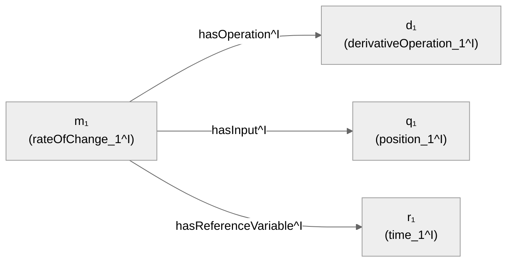

# Chapter 4 — Ontologies and Formal Meaning

> **Chapter orientation**
>
> **Central question:** How can the symbols in a graph be given a formal meaning precise
> enough for a machine to determine what follows *logically* from a set of axioms?
>
> **Why it matters:** The first three chapters built graph structure, RDF/property-graph
> representation, schema, identity, and context. But none of those layers yet answers the
> question: when is a conclusion *necessarily true* given true premises? This chapter
> supplies the formal mechanism to answer that question.
>
> **What you will understand:**
>
> - The difference between syntax (symbols) and formal semantics (mathematical meaning)
> - What an ontology is, and how it differs from a schema
> - The central mechanism: interpretation → model → entailment
> - Necessary and sufficient conditions in class definitions
> - The Open World Assumption and its consequences
> - The distinction between consistency, satisfiability, and entailment
> - An intuition for Description Logic and the OWL 2 profiles
>
> **Prerequisites:** Chapters 1–3. In particular: the RDF triple (§2.1), `owl:sameAs` and
> the unique name assumption (§3.2), RDFS domain/range as inference rules (§2.1, §3.1).
>
> **Concept map:**
>
> Symbol ≠ Meaning → Ontology = semantic commitment → Interpretation assigns meaning to
> symbols → Model = interpretation satisfying every axiom → Entailment = true in every
> model → Classes as sets → Necessary/sufficient conditions → Open world → Consistency vs
> satisfiability

## 4.1 Opening: Syntax is not meaning

In the first three chapters we worked with symbols like `City`, `Country`, `capitalOf`,
`Hanoi`, `Vietnam`. We used them to build graphs, run queries, and attach context. But there
is a foundational question we have not yet answered:

What does the character string `City` *mean* to a machine?

Nothing — at least not on its own. The name `City` is just a string of characters. It does
not automatically correspond to the set of cities in the real world. Likewise, the relation
`capitalOf` does not automatically carry any logical property (symmetric? transitive?
functional?) — unless we *state it explicitly* through a formal mechanism.

This is the chapter's core distinction:

```
syntax / symbols    ≠    formal semantics
```

Syntax is how you write. Formal semantics is the mathematical rule that fixes what a symbol
*means* — more precisely, it determines which interpretations are allowed and which
conclusions are necessarily true.

An **ontology** is the tool that connects syntax to meaning. In this chapter we study the
mechanism by which an ontology turns a pile of disconnected symbols into a system of meaning
a machine can reason over.

> 🖊 **Self-check:** Before reading on, try to explain in your own words: why is naming a
> node `City` in an RDF graph not enough for a machine to "understand" that the node stands
> for the class of cities? What additional information is required?

## 4.2 What is an ontology?

### From schema to ontology

Chapter 3 introduced a **schema** as the description of a data graph's expected structure
and vocabulary: which classes exist, which relations connect where to where, which
properties are allowed [@hogan-knowledge-graphs]. A schema describes organization,
vocabulary, and expected structure.

An **ontology** goes further: it makes **formal semantic commitments** about the concepts and
relations in a knowledge domain. In other words:

- A schema emphasizes expected structure and vocabulary.
- An ontology emphasizes the logical axioms that fix the meaning of those concepts.

> ⚠ **Terminology note:** The boundary between "schema" and "ontology" is not absolute;
> different communities use the two words with different degrees of overlap. In this book we
> use the distinction above as a pedagogical tool, not as a universal definition.

### Web Ontology Language (OWL)

The **Web Ontology Language (OWL)** is the W3C standard for representing ontologies on top of
RDF [@w3c-owl2-overview]. OWL provides a set of constructs for stating axioms about classes,
properties, and individuals.

An OWL ontology has three kinds of component:

1. **Entities**: the named objects — classes, object properties, data properties,
   individuals.
2. **Expressions**: combinations of entities that form more complex descriptions — for
   example, "the class of things that are both a City and have a `capitalOf` link to a
   Country".
3. **Axioms**: statements that constrain the meaning of entities and expressions — for
   example, "every CapitalCity is a City".

> ⚠ **Important distinction:**
>
> - **Name/label**: the string used to refer — `City`, `capitalOf`.
> - **Declaration**: associates an IRI with an OWL entity type (Class, ObjectProperty,
>   DataProperty, NamedIndividual, AnnotationProperty, Datatype). Declarations support
>   vocabulary management, classification, and disambiguation, but **produce no logical
>   consequence** under Direct Semantics [@w3c-owl2-syntax].
> - **Axiom**: a statement that constrains meaning — "every City is a Place". Axioms are what
>   generate entailment.
> - **Annotation**: information meant for humans — display labels, descriptions, comments.
>   Under OWL 2 Direct Semantics, annotations **have no semantic meaning** and are ignored
>   when computing entailment [@w3c-owl2-direct-semantics]. An axiom may carry annotations,
>   but those annotations still do not change the axiom's logical meaning. Applications may
>   interpret annotations outside OWL's logical semantics.

An annotation `rdfs:label "City"` helps a human read the graph, but a reasoner does not use
it to draw logical conclusions. Only axioms do that.

## 4.3 The central mechanism: Interpretation → Model → Entailment

This is the most important part of the chapter. Read it slowly.

### The minimal mathematics for this chapter

This chapter uses more mathematical notation than earlier ones. Here are the symbols that
will appear, with their meaning:

| Symbol | Read as | Meaning |
|--------|---------|---------|
| ∈ | "is an element of" | x ∈ S: x is an element of set S |
| ⊆ | "is a subset of" | A ⊆ B: every element of A is in B |
| ∩ | "intersection" | A ∩ B: the set of elements in both A and B |
| ∪ | "union" | A ∪ B: the set of elements in A or B |
| ∅ | "empty set" | the set with no elements |
| × | "Cartesian product" | A × B: the set of pairs (a,b) with a∈A, b∈B |
| ∀ | "for all" | ∀x: P(x) — P holds for every x |
| ∃ | "there exists" | ∃x: P(x) — at least one x makes P true |
| ⇒ | "implies" | P ⇒ Q: if P is true then Q is true |
| ⇔ | "if and only if" | P ⇔ Q: P is true exactly when Q is true |
| ⊑ | "is a subclass of" | C ⊑ D: C is a subclass of D (subsumption) |
| ⊓ | "intersection" (DL) | C ⊓ D: intersection of two classes in Description Logic |
| ⊔ | "union" (DL) | C ⊔ D: union of two classes in Description Logic |
| ¬ | "negation" | ¬C: the complement of class C |
| ⊨ | "entails" | O ⊨ α: ontology O entails α |
| ^I | "interpretation I" | C^I: the set that class C is interpreted as |

You do not need to memorize all of this at once. The table is a reference; each symbol is
explained in context when it first appears.

### Interpretation

An **interpretation** I is one way of assigning mathematical meaning to the symbols in an
ontology. Concretely, an interpretation consists of:

1. An **interpretation domain** Δ^I — a nonempty set containing the "objects" we are talking
   about.

2. An **interpretation function** (·)^I that maps each symbol to a mathematical object over
   the domain Δ^I.

Consider a concrete example. Suppose our ontology has the symbols `City`, `Country`, `Place`,
`capitalOf`, `Hanoi`, `Vietnam`. One interpretation I could be:

```
Δ^I = {h, v, p, f}
```

This is the interpretation domain — four abstract elements. Note: h, v, p, f are **not** the
character strings "Hanoi", "Vietnam". They are mathematical elements of the domain. The
connection between a name and a domain element lives in the interpretation function:

```
Hanoi^I   = h
Vietnam^I = v
```

Each individual name is assigned exactly one element of the domain. This is precisely the
difference between a **name** and an **entity** that Chapter 3 stressed: a name is a symbol,
while a domain element is the mathematical object the name denotes in this interpretation.

Classes are interpreted as **subsets** of the domain:

```
City^I    = {h, p}
Country^I = {v, f}
Place^I   = {h, v, p, f}
```

Read $City^I \subseteq \Delta^I$ as: "In interpretation I, the class City is assigned the
subset {h, p} of the domain." In other words, in this interpretation, h and p are "cities".

The set $\{h, p\}$ — the image of the symbol `City` under the interpretation function — is
called the **class extension** of `City` in interpretation I. Two different interpretations
may assign two different class extensions to the same class name; the ontology's job is to
force every model to choose a class extension that satisfies the axioms.

Object properties are interpreted as **binary relations** over the domain:

```
capitalOf^I = {(h, v), (p, f)}
```

Read $capitalOf^I \subseteq \Delta^I \times \Delta^I$ as: "In interpretation I, the relation
capitalOf is assigned the set of pairs {(h,v), (p,f)}." That is: in this interpretation, h is
related by capitalOf to v, and p is related by capitalOf to f.

The figure below illustrates the whole structure of an interpretation: the domain
$\Delta^I$, classes as subsets, individuals as concrete elements, and properties as relations
between elements. Read the figure left to right: symbol names outside, domain elements
inside, arrows for relations.


### Data properties and the data domain

OWL distinguishes two kinds of property. An **object property** connects an individual to an
individual: $R^I \subseteq \Delta^I \times \Delta^I$. A **data property** connects an
individual to a data value: $P^I \subseteq \Delta^I \times \Delta_D$, where $\Delta_D$ is the
**data domain** — the set of values such as strings, numbers, dates. The data domain
$\Delta_D$ is nonempty and **disjoint** from the object domain $\Delta^I$
[@w3c-owl2-direct-semantics].

For example: `hasName(Hanoi, "Hà Nội")` or `population(Hanoi, 8000000)`. Here `"Hà Nội"` and
`8000000` are elements of $\Delta_D$, not of $\Delta^I$.

> ⚠ **Pedagogical note:** The first part of the chapter uses the simplified notation
> $I = (\Delta^I, \cdot^I)$ to focus on the core mechanism. When you work with data
> properties, remember that the full semantics also includes the disjoint data domain
> $\Delta_D$. The simplified notation is not wrong — it is just not enough for data
> properties.

> ⚠ **Important:** An interpretation is only *one way* of assigning meaning. There are
> infinitely many different interpretations for the same set of symbols. For example, another
> interpretation J might assign $City^J = \{v\}$ — meaning that in J, only v is a "city".
> Interpretation J is perfectly valid mathematically, even though it does not match our
> intuition about cities. The ontology's role is to *rule out* interpretations that do not fit
> the modeling intent.

### Axioms and satisfaction

An **axiom** is a statement that constrains which interpretations are allowed. Consider the
axiom:

```
City ⊑ Place
```

Read: "City is a subclass of Place." The formal meaning of this axiom is the condition:

```
City^I ⊆ Place^I
```

That is: in any interpretation that satisfies this axiom, the set assigned to City must be a
subset of the set assigned to Place.

Back to the example: in interpretation I above, $City^I = \{h, p\}$ and
$Place^I = \{h, v, p, f\}$. Because $\{h, p\} \subseteq \{h, v, p, f\}$, interpretation I
**satisfies** the axiom `City ⊑ Place`.

Conversely, consider an interpretation K with $City^K = \{h, p\}$ and $Place^K = \{h\}$.
Because $\{h, p\} \not\subseteq \{h\}$ (the element p is in $City^K$ but not in $Place^K$),
interpretation K **does not satisfy** this axiom.

An interpretation **satisfies** an axiom when the axiom's semantic condition holds in that
interpretation.

### Model

A **model** of an ontology O is an interpretation that satisfies **all** the axioms in O.

In other words: a model is a "valid" interpretation — one in which every axiom is true.

```
Models(O) = { I | I satisfies every axiom in O }
```

Consider an ontology O with two axioms:

```
(1) City ⊑ Place
(2) Country ⊑ Place
```

Interpretation I above (with $Place^I = \{h, v, p, f\}$, $City^I = \{h, p\}$,
$Country^I = \{v, f\}$) satisfies both → I is a model of O.

Interpretation K (with $Place^K = \{h\}$) does not satisfy (1) → K is not a model of O.

> 🖊 **Self-check:** Why is a "model" not the same as an "ontology"? An ontology is a set of
> axioms (describing constraints). A model is a concrete interpretation that satisfies those
> constraints. One ontology can have many different models. Explain in your own words: why is
> having many models a design feature, not a bug?

### Entailment

We are now ready for the central concept:

```
O ⊨ α
```

Read: **"Ontology O entails alpha."**

The exact meaning: **every model of O satisfies α**.

In other words: α is true in *all* valid interpretations of O. No exceptions. If you can find
even one model of O in which α is false, then O ⊭ α (O does not entail α).

**Concrete example.** Consider an ontology O with:

```
(1) CapitalCity ⊑ City
(2) Hanoi : CapitalCity
```

(Axiom (2) says: the individual Hanoi belongs to the class CapitalCity.)

Question: does O entail `Hanoi : City`?

Take any model M of O. Because M satisfies (1), we have $CapitalCity^M \subseteq City^M$.
Because M satisfies (2), we have $Hanoi^M \in CapitalCity^M$. Combining the two:
$Hanoi^M \in City^M$. So `Hanoi : City` is true in M.

Because the argument above holds for *every* model M of O, we conclude:

```
O ⊨ Hanoi : City
```

This is not the machine "guessing" or "AI detecting" something. It is a necessary logical
consequence of the mathematical structure of the models.

> ⚠ **Entailment does NOT mean:**
>
> - α is true in reality (the premises may be false).
> - The data source is trustworthy (entailment does not assess provenance).
> - The input data is valid (entailment does not run validation).
> - The machine "understands" in the human sense (the machine manipulates mathematical
>   structure, with no awareness of meaning).
>
> Entailment means only: **if** the axioms are true, **then** α is also true. It is a
> conditional statement, not an absolute assertion.

### Mechanism summary

The figure below visualizes the relationship among interpretation, model, and entailment. The
largest set is all possible interpretations; the blue subset is the models of $O$ (satisfying
every axiom); α being true in all those models means $O \models \alpha$. Interpretations
outside the model set (like $J_1$, $J_2$) violate at least one axiom.


```
Vocabulary + Axioms
        ↓
Possible interpretations
        ↓ apply axioms: remove interpretations that violate them
Models(O)
        ↓ is α true in every model?
O ⊨ α
```

Ontology reasoning is not a machine "thinking like a person". It is the narrowing of the set
of possible interpretations by formal constraints, then checking whether a statement holds in
all the remaining interpretations.

### Interpretation over the mechanism domain — transferring the whole machinery

The city example teaches the *formal mechanism*. That machinery is not specific to geography:
interpret the same symbol system over the mechanism domain — the very `RATE_OF_CHANGE`
mechanism used throughout the book.

The interpretation domain has four mechanism elements:

```
Δ^I = { m₁, d₁, q₁, r₁ }
```

where $m_1$ will "play the role" of the rate-of-change mechanism, $d_1$ the derivative
operation, $q_1$ the position quantity, and $r_1$ the time variable. The interpretation
function assigns names to domain elements:

```
rateOfChange_1^I        = m₁
derivativeOperation_1^I = d₁
position_1^I            = q₁
time_1^I                = r₁
```

Classes are interpreted as subsets of the domain:

```
Mechanism^I              = { m₁ }
RateOfChangeMechanism^I  = { m₁ }
DerivativeOperation^I    = { d₁ }
Quantity^I               = { q₁ }
ReferenceVariable^I      = { r₁ }
```

Object properties are interpreted as binary relations:

```
hasOperation^I         = { (m₁, d₁) }
hasInput^I             = { (m₁, q₁) }
hasReferenceVariable^I = { (m₁, r₁) }
```



Figure: the same interpretation structure as the city example, over the mechanism domain. The
domain $\Delta^I = \{m_1, d_1, q_1, r_1\}$, classes are subsets, properties are relations.

Now check satisfaction. Consider the axiom defining `RateOfChangeMechanism` (written in full
in §4.13):

```
RateOfChangeMechanism ≡ Mechanism ⊓ ∃hasOperation.DerivativeOperation
                        ⊓ ∃hasInput.Quantity ⊓ ∃hasReferenceVariable.ReferenceVariable
```

In interpretation I:

- $m_1 \in \mathit{Mechanism}^I$ because $\mathit{Mechanism}^I = \{m_1\}$.
- $m_1 \in (\exists hasOperation.\mathit{DerivativeOperation})^I$ because there exists
  $\langle m_1, d_1\rangle \in hasOperation^I$ with $d_1 \in \mathit{DerivativeOperation}^I$.
- $m_1 \in (\exists hasInput.\mathit{Quantity})^I$ because $\langle m_1, q_1\rangle \in
  hasInput^I$ with $q_1 \in \mathit{Quantity}^I$.
- $m_1 \in (\exists hasReferenceVariable.\mathit{ReferenceVariable})^I$ because
  $\langle m_1, r_1\rangle \in hasReferenceVariable^I$ with $r_1 \in
  \mathit{ReferenceVariable}^I$.

All four conditions hold → $\mathit{rateOfChange\_1}^I = m_1 \in
\mathit{RateOfChangeMechanism}^I$. Interpretation I obeys the mechanism definition.

**Counter-example — an interpretation that satisfies the city ontology but violates the
mechanism axiom.** Consider an interpretation L that interprets the geographic symbols as
usual: $\mathit{City}^L = \{h, p\}$, $\mathit{capitalOf}^L = \{(h,v), (p,f)\}$ — L satisfies
`City ⊑ Place`, `capitalOf` linking city–country, and so on. But L assigns
$\mathit{rateOfChange\_1}^L = m_5$ with $hasOperation^L = \varnothing$. Then $m_5 \notin
(\exists hasOperation.\mathit{DerivativeOperation})^L$ — no element is both a
DerivativeOperation and linked by hasOperation to $m_5$ — so by the definition, $m_5 \notin
\mathit{RateOfChangeMechanism}^L$. Beyond the definition, the mechanism ontology also **asserts**
the individual `rateOfChange_1 : RateOfChangeMechanism` (rateOfChange_1 *is* a rate-of-change
mechanism). Because L places $\mathit{rateOfChange\_1}^L = m_5$ outside this class, L violates
that assertion. Hence L is a model of the city ontology but *not* a model of the mechanism
ontology. The lesson of §4.3 is reaffirmed over the mechanism domain: **satisfying one set of
axioms does not imply satisfying another**; an interpretation valid geographically can still be
"nonsensical" mechanistically.

> 🖊 **Self-check:** Build an interpretation M over the mechanism domain with five elements
> $\{m_1, d_1, d_2, q_1, r_1\}$ where $hasOperation^M = \{(m_1, d_1), (m_1, d_2)\}$ and
> $\mathit{DerivativeOperation}^M = \{d_1\}$. Question: does $m_1$ belong to
> $(\exists hasOperation.\mathit{DerivativeOperation})^M$? *Hint — answer:* check each pair in
> $hasOperation^M$. The pair $\langle m_1, d_1\rangle$ leads to $d_1$, and $d_1 \in
> \mathit{DerivativeOperation}^M$ → at least one such link exists → the answer is **yes**:
> $m_1$ satisfies the existential restriction. (Note: the pair $\langle m_1, d_2\rangle$ leads
> to $d_2 \notin \mathit{DerivativeOperation}^M$, but that does not overturn the answer — an
> existential restriction needs only *one* correct link. The formal definitions of $\exists
> R.C$ and $\forall R.C$ are in §4.6.)

## 4.4 Classes as sets: subclass, equivalence, disjointness

Now we apply the interpretation/model/entailment mechanism to relations between classes.

### Subclass

```
City ⊑ Place
```

Semantic condition: $City^I \subseteq Place^I$ in every model.

This is a **one-directional** relation. From `City ⊑ Place`, we know every City is a Place.
But we do **not** know that every Place is a City. Place may contain elements that are not in
City.

### Equivalent Classes

```
A ≡ B
```

Semantic condition: $A^I = B^I$ in every model.

Two classes are equivalent exactly when they have **the same members** in every model. This
is a two-directional relation: $A \equiv B$ is equivalent to both $A \sqsubseteq B$ and $B
\sqsubseteq A$.

> ⚠ **Common confusion:** mixing up `owl:equivalentClass` with `owl:sameAs`.
>
> - `owl:sameAs` (Chapter 3): two **individuals** are one. `ex:Hanoi owl:sameAs wd:Q1858`
>   means these two names denote the same individual.
> - `owl:equivalentClass`: two **classes** have the same members. $City \equiv UrbanArea$
>   means that in every model, the set of Cities equals the set of UrbanAreas.
>
> One is about individual identity. The other is about set equality. Do not confuse them.

### Disjoint Classes

```
City ⊓ Country ≡ ⊥
```

Semantic condition: $City^I \cap Country^I = \emptyset$ in every model.

That is: no element is both a City and a Country.

> ⚠ **Important:** Different class names are **not automatically** disjoint. The fact that
> `City` and `Country` are two different names does not imply $City^I \cap Country^I =
> \emptyset$. Disjointness must be **declared explicitly** with an axiom. This is a direct
> consequence of OWL having no unique name assumption (Chapter 3): different names do not
> imply different entities, and likewise different class names do not imply disjoint member
> sets.

**Counter-example:** Suppose an ontology has only `City` and `Country` with no disjointness
axiom. Then there exists a model in which $City^I = \{h, v\}$ and $Country^I = \{v, f\}$ —
the element v belongs to both classes. This model is perfectly valid because no axiom forbids
it.

## 4.5 Necessary and sufficient conditions

This is one of the deepest parts of the chapter. Read it carefully.

### SubClassOf is a one-directional sufficient condition

Consider:

```
CapitalCity ⊑ City
```

Read: "Every CapitalCity is a City." Logically:

- If x is a CapitalCity ⇒ x is a City. (A **sufficient** condition: being a CapitalCity is
  enough to conclude being a City.)
- If x is a City ⇒ x is a CapitalCity? **NO.** Being a City is not enough to conclude being a
  CapitalCity.

In other words, `CapitalCity ⊑ City` gives us: CapitalCity is **sufficient** for City (being a
CapitalCity guarantees being a City), and City is **necessary** for CapitalCity (to be a
CapitalCity you must first be a City). Direction matters: $A \sqsubseteq B$ means A is
sufficient for B, B is necessary for A.

### A necessary condition: SubClassOf with a class expression

Consider:

```
CapitalCity ⊑ City ⊓ ∃capitalOf.Country
```

Read: "Every CapitalCity is a City AND has a capitalOf link to at least one Country."

The right-hand side ($City \sqcap \exists capitalOf.Country$) describes the **necessary
conditions** for CapitalCity: if an individual is a CapitalCity, then it *must* satisfy both
conditions. But the converse does not yet hold: an individual satisfying the right-hand side
is not necessarily a CapitalCity (because the axiom is only one-directional).

### A necessary AND sufficient condition: EquivalentClasses

Consider:

```
CapitalCity ≡ City ⊓ ∃capitalOf.Country
```

Read: "Something is a CapitalCity if and only if it is a City and has a capitalOf link to at
least one Country."

Now the right-hand side is both necessary and sufficient. Any individual satisfying the
right-hand side is classified as a CapitalCity, and vice versa.

**Concrete example.** Suppose ontology O contains:

```
(1) CapitalCity ≡ City ⊓ ∃capitalOf.Country
(2) Hanoi : City
(3) Vietnam : Country
(4) capitalOf(Hanoi, Vietnam)
```

Question: does O ⊨ `Hanoi : CapitalCity`?

Take any model M of O:

- From (2): $Hanoi^M \in City^M$
- From (3): $Vietnam^M \in Country^M$
- From (4): $(Hanoi^M, Vietnam^M) \in capitalOf^M$

Combining: $Hanoi^M \in City^M$ and there exists $Vietnam^M \in Country^M$ such that
$(Hanoi^M, Vietnam^M) \in capitalOf^M$. So $Hanoi^M$ belongs to the set $\{x \mid x \in
City^M \text{ and } \exists y: (x,y) \in capitalOf^M \text{ and } y \in Country^M\}$.

From (1), this set is exactly $CapitalCity^M$. So $Hanoi^M \in CapitalCity^M$.

Because the argument holds for every model M:

```
O ⊨ Hanoi : CapitalCity
```

> 🖊 **Self-check:** Suppose we replace (1) with $CapitalCity \sqsubseteq City \sqcap \exists
> capitalOf.Country$ (only SubClassOf, not Equivalence). With the same data (2)-(4), does O
> entail `Hanoi : CapitalCity`? Why? Hint: consider whether there exists a model in which
> Hanoi satisfies the right-hand side but is not in $CapitalCity^M$.

## 4.6 Class expressions

OWL provides constructs to build complex class expressions from simple classes. Each
expression has an exact set-theoretic meaning.

### Intersection

```
C ⊓ D
```

Semantics: $(C \sqcap D)^I = C^I \cap D^I$

The set of elements in **both** C and D. For example: $City \sqcap HasAirport$ is the class
of cities that have an airport.

### Union

```
C ⊔ D
```

Semantics: $(C \sqcup D)^I = C^I \cup D^I$

The set of elements in C **or** D (or both).

Over the mechanism domain: `Quantity ⊔ ReferenceVariable` is the class of everything that is
either an input/output quantity or a reference variable. For example: `position_1 : Quantity`
and `time_1 : ReferenceVariable` — both belong to this union class.

### Complement

```
¬C
```

Semantics: $(\neg C)^I = \Delta^I \setminus C^I$

The set of elements in the domain **not** in C. Note: negation is relative to the
interpretation domain $\Delta^I$, not to "everything in the universe".

Over the mechanism domain: `¬RateOfChangeMechanism` is the class of every entity that is
**not** a rate-of-change mechanism. In interpretation I of §4.3, $\mathit{RateOfChangeMechanism}^I
= \{m_1\}$ while $\mathit{derivativeOperation\_1}^I = d_1 \notin \{m_1\}$, so $d_1 \in
(\neg\mathit{RateOfChangeMechanism})^I$ — that is, `derivativeOperation_1` falls into this
complement class. Important caveat: this holds *in I* because I assigns $d_1$ outside the mechanism
class; it is **not** a logical consequence of `DerivativeOperation ⊑ ¬RateOfChangeMechanism`. To
derive that consequence for *every* interpretation, we must axiomatize `DisjointClasses(DerivativeOperation,
RateOfChangeMechanism)` (see §4.4) — disjointness must not be assumed without an explicit axiom.
Negation lets you say "X is not of type Y" within a specific interpretation without listing
everything explicitly.

### Existential restriction

```
∃ R.C
```

Read: "things that have at least one R-link to an element of C."

Semantics:

```
(∃ R.C)^I = { x ∈ Δ^I | ∃y: (x,y) ∈ R^I and y ∈ C^I }
```

**Example:** $\exists capitalOf.Country$ is the class of individuals that have a capitalOf
link to at least one Country. In interpretation I above, $Hanoi^I = h$ and $(h,v) \in
capitalOf^I$ with $v \in Country^I$, so $h \in (\exists capitalOf.Country)^I$.

> ⚠ **An important consequence of the open world:** An existential restriction requires the
> **existence** of an element y in the interpretation domain, but y **need not have a name**
> in the RDF graph. That is: an ontology can require that "in every model, there exists a
> Country to which Hanoi has a capitalOf link" even when no Country individual is explicitly
> named in the data.
>
> **Mandatory distinction:**
> - **Semantic existence:** the ontology requires a suitable element in every model. This is
>   a statement about the mathematical structure of models.
> - **Materialization:** a particular reasoner *may* use a witness, a blank node, or a Skolem
>   representation to compute — but this is implementation behavior, not the entailment
>   relation itself.
> - **OWL entailment does NOT automatically add blank nodes or RDF triples to the source
>   graph.**
>
> Semantic existence ≠ a materialized/serialized node.

### Universal restriction

```
∀ R.C
```

Read: "things such that every R-link leads to an element of C."

Semantics:

```
(∀ R.C)^I = { x ∈ Δ^I | ∀y: (x,y) ∈ R^I ⇒ y ∈ C^I }
```

> ⚠ **A subtle boundary — two different levels:**
>
> **Level A — Within one specific interpretation I:** If x has no R-link *in I*, then x ∈
> (∀R.C)^I — vacuously true. This is a consequence of classical logic: "for all y, if (x,y) ∈
> R^I then y ∈ C^I" holds automatically when no y satisfies (x,y) ∈ R^I.
>
> **Level B — Entailment from the ontology/data:** If the RDF graph merely *does not contain*
> any R-triple for x, that does **NOT** entail $x : \forall R.C$. Because under the open world
> assumption, another model may exist containing an R-link not asserted in the data, and that
> link may lead to an element not in C.
>
> **Mandatory distinction:** Absence in the data/serialization ≠ absence in an interpretation.
>
> **Example:** Consider $\forall hasChild.Doctor$ ("every child is a doctor").
> - In a specific interpretation I where Alice has no children: $Alice \in (\forall
>   hasChild.Doctor)^I$ (vacuously).
> - But from RDF data that merely lacks a hasChild triple for Alice, we **cannot** entail
>   $Alice : \forall hasChild.Doctor$ — because there may exist a model in which Alice has a
>   child who is not a doctor.
>
> This is why a universal restriction cannot be used as a "must have at least one value"
> constraint.

The figure below compares the two kinds of restriction visually. Left: $\exists R.C$ requires
at least one $R$-link to an element of $C$. Right: $\forall R.C$ requires *every* $R$-link to
lead to $C$ — if there are no links, the condition holds vacuously. Note the warning at the
bottom about the difference between absence in the data and absence in an interpretation.


### Cardinality restrictions

OWL provides cardinality constraints:

```
≥ n R.C    (at least n R-links to elements of C)
≤ n R.C    (at most n R-links to elements of C)
= n R.C    (exactly n R-links to elements of C)
```

> ⚠ **OWL cardinality is NOT form validation.** In a database, a "required field" or "unique
> constraint" checks existing data. In OWL, under the open world assumption and with no unique
> name assumption:
>
> - $\geq 1\ hasChild.Person$ does not require the RDF data to contain an explicit hasChild
>   triple. The ontology requires that in every model, a suitable Person exists. A reasoner
>   may represent the witness internally or materialize a hidden node — but that is
>   implementation behavior, not the entailment relation itself.
> - $\leq 1\ hasNationalCapital.City$ with two names `Hanoi` and `HaNoiCity` does not
>   automatically cause an error. The ontology entails that Hanoi and HaNoiCity denote the
>   same individual (Chapter 3). A reasoner may represent this consequence with `owl:sameAs`,
>   but that is implementation behavior.
>
> Validation in the sense of "checking that data conforms to a rule" is the job of SHACL
> (Chapter 5), not OWL.

## 4.7 Property semantics

Beyond classes, OWL also lets you state axioms about properties. Below are the most important
characteristics, each explained through its mechanism rather than merely listed.

### Subproperty

```
capitalOf ⊑ locatedIn
```

Semantics: $capitalOf^I \subseteq locatedIn^I$ in every model.

If $(x,y) \in capitalOf^I$ then $(x,y) \in locatedIn^I$. Every capital–country pair is also a
"located-in" pair.

### Inverse

```
capitalOf⁻ ≡ hasCapital
```

Semantics: $(x,y) \in capitalOf^I \Leftrightarrow (y,x) \in hasCapital^I$.

If Hanoi capitalOf Vietnam then Vietnam hasCapital Hanoi, and vice versa.

### Symmetric

```
Sym(sisterCity)
```

Semantics: $(x,y) \in sisterCity^I \Rightarrow (y,x) \in sisterCity^I$.

If Hanoi sisterCity Paris then Paris sisterCity Hanoi.

### Transitive

```
Trans(locatedIn)
```

Semantics: $(x,y) \in locatedIn^I$ and $(y,z) \in locatedIn^I \Rightarrow (x,z) \in
locatedIn^I$.

If Hanoi locatedIn Vietnam and Vietnam locatedIn SoutheastAsia then Hanoi locatedIn
SoutheastAsia.

### Functional

```
Func(hasNationalCapital)
```

Semantics: $(x,y) \in hasNationalCapital^I$ and $(x,z) \in hasNationalCapital^I \Rightarrow y =
z$.

Each individual has **at most one** hasNationalCapital in a model.

> ⚠ **An important surprise for database engineers:** Suppose the ontology declares
> `Func(hasNationalCapital)` and the data contains:
>
> ```
> Vietnam hasNationalCapital Hanoi
> Vietnam hasNationalCapital HaNoiCity
> ```
>
> In a relational database, this violates a unique constraint. But in OWL, because there is no
> unique name assumption (Chapter 3), the ontology is **not inconsistent**. Instead, the
> ontology entails that the two names denote the same individual:
>
> ```
> O ⊨ Hanoi and HaNoiCity are the same individual
> ```
>
> A reasoner may represent this consequence with `owl:sameAs`, but the entailment relation
> itself is a semantic statement, not an action of adding a triple. If the ontology *also*
> asserts `Hanoi owl:differentFrom HaNoiCity`, then functionality makes the ontology
> **inconsistent**. If you want to reject duplicate data, use SHACL (Chapter 5).

### Inverse-functional

```
InvFunc(hasNationalCapital)
```

Semantics: $(x,z) \in hasNationalCapital^I$ and $(y,z) \in hasNationalCapital^I \Rightarrow x =
y$.

If two countries have the same capital (via hasNationalCapital), then those two countries are
one.

### Reflexivity, asymmetry, and property chains

OWL also supports three additional characteristics:

**Reflexive:** every individual is related to itself. `Reflexive(hasIdentity)` — everything
has an hasIdentity link to itself. $R^I$ contains $\{(x,x) \mid x \in \Delta^I\}$. Over the
mechanism domain: `ex:rateOfChange_1 ex:hasIdentity ex:rateOfChange_1` — each mechanism links
to itself via hasIdentity. This property is rarely used for content relations (for instance,
`requires` is not declared Reflexive) — it mainly serves identity relations.

**Irreflexive:** no individual is related to itself. `Irreflexive(hasProperPart)`. Over the
mechanism domain: `Irreflexive(requires)` — a mechanism cannot `require` itself. $R^I \cap
\{(x,x) \mid x \in \Delta^I\} = \varnothing$.

**Asymmetric:** if $x$ is related to $y$, then $y$ cannot be related to $x$.
`Asymmetric(hasInput)` — if mechanism M has input quantity Q, then Q cannot have input M. Over
the mechanism domain: `Asymmetric(requires)` — if `ex:newtonCooling_1 ex:requires
ex:rateOfChange_1`, then `ex:rateOfChange_1` cannot `require` `ex:newtonCooling_1`. $R^I \cap
(R^I)^{-1} = \varnothing$.

**Property chain:** OWL 2 lets you define one property as the composition of others. `hasPart
o hasPart ⊑ hasPart` means "a part of a part of something is also a part of that thing". Over
the mechanism domain: `requires o requires ⊑ requires` — if M1 requires M2 and M2 requires M3,
then M1 requires M3. Semantics: $(x,z) \in R^I$ if there exists $y$ such that $(x,y) \in
R_1^I$ and $(y,z) \in R_2^I$, where $R_1 \circ R_2 \sqsubseteq R$. Property chains are a
powerful tool for inferring indirect relations — and will be used in Chapter 5 in a
forward-chaining rule over the mechanism graph.

## 4.8 The Open World Assumption

This is one of the most surprising concepts for engineers used to databases. Take your time
with it.

### The database intuition: three different concepts

When comparing OWL to a database, we must distinguish three concepts that software engineers
often conflate:

**A. Closed World Assumption over database facts:** In many systems, the absence of a
row/event is treated as if it were false *for the represented state*. This is an application
convention, not a universal law.

**B. SQL NULL:** A separate concept using three-valued logic (true/false/unknown). NULL is
not simply false; comparisons with NULL return UNKNOWN, and `WHERE` filters out both false and
unknown. This is a mechanism for handling missing values, not a closed-world assumption.

**C. OWL Open World Assumption:** The absence of an assertion does not entail its negation.

```
Database (CWA):   absent event → often treated as false for the current state
SQL NULL:         missing value → UNKNOWN (≠ FALSE)
OWL (OWA):        absent assertion → unknown
```

### The OWL intuition: missing = unknown

OWL operates under the **Open World Assumption**:

```
OWL:
  no data → unknown
            unless falsity is entailed by the axioms
```

**Example:** The graph contains no triple about Hanoi's airport:

```
(absent) Hanoi hasAirport X
```

This does **NOT** entail:

```
"Hanoi has no airport"
```

It only means: we do not know whether Hanoi has an airport. Maybe it does, maybe it does not.
The ontology has not said.

**Mechanism-domain example — "missing a condition" is not "having no condition".** In the
mechanism graph, `ex:rateOfChange_1` and `ex:heatTransferRate_2` have no `ex:hasCondition`
triple, while `ex:newtonCooling_1` does (Chapter 2, OPTIONAL). An engineer used to the closed
world easily reads "the textbook records no condition for rateOfChange_1" as "rateOfChange_1
works unconditionally". OWL does not allow that conclusion: under OWA, the absence of an
assertion only means *unknown* — there exists a model in which rateOfChange_1 has a Condition
not recorded in the data. Recall Chapter 3: an application condition is one axis of context,
and must be *asserted with evidence*, not inferred from the absence of a relation. (Chapter 6
will manage this "unknown" knowledge deliberately through the claim–evidence layer.)

### Three entailment states

**Assume O is consistent** (has at least one model). Then a statement α whose negation is
expressible falls into exactly one of three states:

| State | Notation | Meaning |
|-------|----------|---------|
| Entailed | O ⊨ α | α is true in every model of O |
| Refuted | O ⊨ ¬α | α is false in every model of O |
| Undetermined | O ⊭ α and O ⊭ ¬α | Some model satisfies α, some satisfies ¬α |

The third state — **undetermined** — is a state traditional databases do not have. In OWL, it
is the default state for most statements the ontology has not constrained tightly enough.

> ⚠ **If the ontology is NOT consistent:** The three-state classification above breaks down
> under classical semantics. When Models(O) = ∅, every statement is entailed vacuously (ex
> falso quodlibet). This is why checking consistency is an important first step before
> reasoning — and one motivation for Chapter 5.

> ⚠ **OWL is not "anything can be true."** Axioms still rule out interpretations that do not
> fit. The open world means the absence of information is not evidence of negation — but the
> axioms still constrain the model set. The more axioms an ontology has, the smaller its model
> set, and the more statements become determined (entailed or contradicted).

### Consequences for validation

This is why OWL restrictions are not equivalent to:

```
required field / NOT NULL / schema validation
```

In a database, "required field" means the data must contain a value. In OWL, $\exists R.C$
means a model must contain an R-filler — but that filler may be an unnamed element, not
present in the data. OWL does not check data; OWL describes the structure of valid models.

Validation in the sense of "rejecting non-conforming data" belongs to SHACL (Chapter 5).

> 🖊 **Self-check:** Suppose the ontology has $Person \sqsubseteq \exists hasName.xsd\text{:}string$
> ("every Person has at least one name"). The RDF graph contains `ex:Alice rdf:type ex:Person`
> but no `ex:Alice ex:hasName ...` triple. According to OWL, is the ontology consistent? Is
> Alice a valid Person? Explain why the answer differs from the database intuition.

## 4.9 Consistency, satisfiability, entailment: three different questions

These three concepts are often confused. Let us distinguish them clearly.

### Ontology consistency

**Question:** Does at least one model of O exist?

```
O is consistent ⇔ Models(O) ≠ ∅
```

If the ontology contradicts itself (for example: it asserts both $A \sqsubseteq B$ and $A
\sqcap B \equiv \bot$ with $\exists x: x \in A$), then no model exists → the ontology is
inconsistent.

### Class satisfiability

**Question:** Can class C have at least one member in some model of O?

```
C is satisfiable w.r.t. O ⇔ ∃I ∈ Models(O): C^I ≠ ∅
```

> ⚠ **A subtle distinction:** An ontology can be **consistent** while a particular class is
> **unsatisfiable**.
>
> **Example:**
> ```
> City ⊓ Country ≡ ⊥          (City and Country are disjoint)
> ImpossiblePlace ≡ City ⊓ Country  (ImpossiblePlace = intersection of two disjoint classes)
> ```
> This ontology is still consistent — there exists a model in which $City^I = \{h\}$,
> $Country^I = \{v\}$, $ImpossiblePlace^I = \emptyset$. The class `ImpossiblePlace` is merely
> forced to have an empty set. It does not cause a contradiction; it simply cannot have
> members.
>
> Conversely, if we add the axiom $\exists x: x \in ImpossiblePlace$, the ontology becomes
> **inconsistent** — because no model satisfies both "ImpossiblePlace must have a member" and
> "ImpossiblePlace = ∅".

**The three questions over the mechanism domain.** The distinction above applies intact to the
mechanism ontology (using the tight definition from §4.13):

- **Inconsistency — mechanism example:**
  ```
  RateOfChangeMechanism ⊑ ∃hasApplication.DerivativeApplication
  rateOfChange_1 : RateOfChangeMechanism
  rateOfChange_1 : ¬∃hasApplication.DerivativeApplication
  ```
  The third line explicitly asserts the opposite of the first plus the second → no model
  satisfies all three → the ontology is inconsistent. Note: the third line must be an
  *assertion*; merely "missing a hasApplication triple" leaves the ontology consistent (OWA,
  §4.8).

- **Unsatisfiable class — mechanism example:**
  ```
  ElementaryMechanism ≡ RateOfChangeMechanism ⊓ ¬∃hasApplication.DerivativeApplication
  ```
  A member of `ElementaryMechanism` must be both a RateOfChangeMechanism (so it must have a
  DerivativeApplication) and have no application at all → empty in every model → this class is
  unsatisfiable. The ontology remains consistent *provided* no one asserts `x :
  ElementaryMechanism`. If later the data records `ex:newtonCooling_1 : ElementaryMechanism`,
  the ontology becomes inconsistent — and the reasoner will report it. This is exactly the
  mechanism that catches modeling errors before knowledge is trusted.

### Entailment

**Question:** Is α true in every model of O?

```
O ⊨ α
```

This is the question we met in §4.3. It differs from both consistency and satisfiability.

| Question | Object | Answer |
|----------|--------|--------|
| Consistency | The whole ontology | Does a model exist? |
| Satisfiability | A particular class | Can the class have a member? |
| Entailment | A statement | Is the statement true in every model? |

## 4.10 Description Logic intuition

Having understood the interpretation/model/entailment mechanism, we can place OWL in a wider
context.

**Description Logic (DL)** is a family of logical languages designed to balance:

```
expressiveness
        ↕ trade-off
reasoning feasibility (decidability / tractability)
```

DL is the theoretical foundation of OWL. OWL 2 Direct Semantics is tightly compatible with the
Description Logic SROIQ, extended with OWL-specific features such as datatypes and punning. We
do not need to learn all of DL to use OWL effectively, but understanding the DL intuition
helps avoid misconceptions.

> ⚠ **Distinction:** Description Logic is designed mainly to achieve useful expressiveness
> while preserving **decidability** for the important reasoning tasks. Not every DL is
> "fast" — strong computational tractability is the goal of the OWL profiles (§4.12), not of
> DL in general.

> **In practice.** The formal apparatus of this chapter — interpretations, models,
> entailment, TBox/ABox/RBox — is the standard content of the *Description Logic Handbook*
> [@dl-handbook], the canonical reference behind OWL's design. The reasoning tasks we defined
> are computed by production **DL reasoners** with a shared lineage: **FaCT++** established the
> optimized-tableau tradition [@factpp-reasoner]; **HermiT** replaced it with a hypertableau
> calculus and implements OWL 2 *Direct* Semantics [@hermit-reasoner]; **Konclude** is a
> state-of-the-art OWL 2 DL reasoner [@konclude-reasoner]; and **ELK** targets the OWL 2 EL
> profile for huge ontologies (§4.12) [@elk-reasoner]. You author the class expressions and
> axioms from this chapter in an editor such as **Protégé**, which drives these reasoners
> [@protege]. The takeaway for an engineer: "does this follow?" is a *decidable computation*
> these tools run, not a judgment call.

### TBox, ABox, RBox: a mental classification

In the DL tradition, axioms are often grouped into three kinds:

**TBox** (Terminological Box): general knowledge about the domain — class definitions,
subclass relations, equivalence, disjointness.

```
City ⊑ Place
CapitalCity ≡ City ⊓ ∃capitalOf.Country
City ⊓ Country ≡ ⊥
```

**ABox** (Assertional Box): facts about specific individuals.

```
Hanoi : City
Vietnam : Country
capitalOf(Hanoi, Vietnam)
```

**RBox** (Role Box): axioms about properties — transitivity, symmetry, functionality, and so
on.

```
Trans(locatedIn)
Func(hasNationalCapital)
capitalOf⁻ ≡ hasCapital
```

> ⚠ **Very important:** TBox/ABox/RBox are a **useful mental classification**, NOT mandatory
> physical parts of an OWL file. An OWL ontology is a flat set of axioms; no syntactic
> requirement forces you to split them into three files or three separate sections. The
> classification helps organize thought, not files.

## 4.11 OWL Direct Semantics and RDF-Based Semantics

OWL 2 has two official semantics [@w3c-owl2-direct-semantics] [@w3c-owl2-rdf-semantics]. The
distinction lies in the **semantic regime**, not the file format.

- **Direct Semantics**: defines model-theoretic semantics directly on the constructs of the OWL
  structural specification. Compatible with the Description Logic SROIQ extended with
  OWL-specific features (datatypes, punning). Applies to OWL 2 DL ontologies satisfying the
  global restrictions. This is the semantics used in this chapter because it lets us explain
  interpretation → model → entailment cleanly and directly.

- **RDF-Based Semantics**: defines semantics directly on RDF graphs, extending RDFS semantics.
  Supports OWL 2 Full (undecidable) and is more broadly compatible with general RDF data.
  Under RDF-Based Semantics, annotations have a weak semantic meaning (unlike Direct Semantics,
  where annotations are ignored entirely).

> ⚠ **Mandatory distinction:** Serialization syntax ≠ semantic regime. An OWL 2 DL ontology
> written in RDF/Turtle can still be interpreted via Direct Semantics after mapping to the OWL
> structural form. Conversely, the same RDF document can be processed with RDF-Based Semantics
> without conversion. The choice of semantics depends on the reasoning task and application
> requirements, not on the storage format.

This chapter mainly uses the Direct Semantics / OWL 2 DL viewpoint for a pedagogical goal: to
help you understand the entailment mechanism without being distracted by serialization
details. When deploying on real RDF data, consult RDF-Based Semantics to understand the
differences.

## 4.12 OWL 2 Profiles

Full OWL 2 is highly expressive, but reasoning over it can be expensive. W3C defines three
**profiles** — subsets of OWL 2 that trade representational power for reasoning performance
[@w3c-owl2-profiles]:

| Profile | Designed for | Reasoning characteristics |
|---------|-------------|---------------------------|
| **OWL 2 EL** | Large ontologies with many classes/properties | Core reasoning (consistency, subsumption, instance checking) in polynomial time; conjunctive query answering remains EXPTIME. Suited to medical/biological taxonomies |
| **OWL 2 QL** | Querying very large instance data | Supports query rewriting to SQL; suited to very large ABoxes |
| **OWL 2 RL** | Rule-style reasoning over RDF data | Compatible with rule engines; suited to forward-chaining over RDF stores. Completeness is not guaranteed on arbitrary RDF graphs |

> ⚠ **There is no "best" profile.** The choice depends on the ontology's structure and the
> specific reasoning task. EL is not "faster than QL" in every case; QL is not "better than RL"
> for every application. Choose based on real requirements, not on a generic ranking.

> **Real-world anchors.** Each profile exists because a class of production systems needs it.
> **EL** is the profile of large biomedical terminologies: **SNOMED CT**, the clinical terminology
> behind electronic health records, is the flagship OWL 2 EL ontology named in the W3C Profiles
> spec [@snomed-ct], classified by polynomial-time EL reasoners such as **ELK** [@elk-reasoner]
> and **Snorocket** (EL++ with concrete domains, from the group that maintains SNOMED CT tooling)
> [@snorocket]; the **Gene Ontology** and **UBERON** are OBO Foundry terminologies of the same
> class-rich shape [@gene-ontology] [@uberon]. **QL** is the profile of virtual knowledge graphs:
> **Ontop** rewrites SPARQL into SQL over relational databases and explicitly supports OWL 2 QL
> [@ontop-obda], built on the **DL-Lite** family whose first-order rewritability gives LOGSPACE
> data complexity [@dl-lite-family]. **RL** is the profile of scalable rule engines: **RDFox**
> materializes OWL 2 RL consequences with incremental, parallel forward chaining [@rdfox], and
> **Apache Jena**'s GenericRuleReasoner fires RL-style rules over an RDF model with a RETE engine
> [@apache-jena-rules]; the W3C **RIF** suite standardizes the rule interchange RL interoperates
> with [@w3c-rif-overview].

**Classifying the mechanism ontology.** Which profile does our Mechanism Knowledge Graph ontology
fall into? Consider the axioms we have written:

- `DerivativeApplication ⊑ MechanismApplication`, `DerivativeApplication ⊑ ∃differentiand.Quantity`
  → EL (allows ⊑, ⊓, ∃)
- `RateOfChangeMechanism ≡ Mechanism ⊓ ∃hasApplication.DerivativeApplication`
  → EL (≡ is a combination of two ⊑)
- `Reflexive(hasIdentity)` → EL (`ReflexiveObjectProperty` is an OWL 2 EL property axiom. Note:
  this is a *property characteristic*, not the `Self` restriction `∃R.Self` — the Self constructor
  is *not* part of EL, whose class expressions are limited to ⊤, ⊥, named classes, ⊓, ∃R.C and
  ≥n R.C.)
- `requires o requires ⊑ requires` → **EL** (property chains *are* in OWL 2 EL: the grammar admits
  `SubObjectPropertyOf` with an `ObjectPropertyChain`, subject only to a range-propagation
  bookkeeping restriction [@w3c-owl2-profiles])
- `Irreflexive(requires)`, `Asymmetric(hasInput)`, `Asymmetric(requires)` → **not** EL (these three
  property characteristics lie outside the EL grammar)

So the **conceptual core** (Mechanism, RateOfChangeMechanism, DerivativeApplication) belongs to
**OWL 2 EL** — appropriate because this is a TBox-heavy terminology that needs polynomial-time
classification. The asymmetry/irreflexivity characteristics are not EL; they are members of the
**OWL 2 RL** and **OWL 2 DL** grammars. A DL-conformant mechanism ontology that keeps them is
therefore **OWL 2 DL** (or **OWL 2 RL** if you target a rule engine) — *not* OWL 2 Full. OWL 2
Full is the undecidable superset that applies OWL vocabulary to arbitrary RDF graphs without the
DL global restrictions; ordinary use of `Asymmetric`/`Irreflexive` inside a DL ontology does not
reach it. If you only query instance data (the ABox) without needing classification, **OWL 2 QL**
lets you rewrite the query down to SQL.

> 🖊 **Self-check:** Can the mechanism ontology be reduced to OWL 2 EL, and by dropping which
> properties? What is the trade-off?
>
> <details><summary>Answer</summary>
>
> Drop exactly the three non-EL property characteristics: `Irreflexive(requires)`,
> `Asymmetric(hasInput)`, `Asymmetric(requires)`. `Reflexive(hasIdentity)` and the
> `requires o requires ⊑ requires` chain **stay** — both are already in the OWL 2 EL grammar
> [@w3c-owl2-profiles]. After this reduction every remaining axiom is EL, so subsumption
> (classification) runs in polynomial time. The cost is that the three dropped constraints are
> simply lost: you can no longer detect an invalid dependency cycle or a self-loop through
> `requires` (that was the role of `Asymmetric`/`Irreflexive`). Note what you do **not** lose:
> because the chain is kept, `A requires B` + `B requires C` still entails `A requires C`. This is
> a general caution — reducing an ontology to a profile is a *syntactic* rewrite that does not
> preserve entailments; whatever expressivity the profile forbids is gone, not approximated.
> </details>

## 4.13 The bridge to the Mechanism Knowledge Graph

Why does an ontology matter for the Mechanism Knowledge System this book is building toward?

Consider the example: we want to formally define what a **Rate of Change Mechanism** is. Using
OWL, we can write:

```
RateOfChangeMechanism
≡
Mechanism
⊓ ∃hasOperation.DerivativeOperation
⊓ ∃hasInput.Quantity
⊓ ∃hasReferenceVariable.ReferenceVariable
```

Read: "Something is a RateOfChangeMechanism if and only if it is a Mechanism, has at least one
DerivativeOperation, has at least one Quantity as input, and has at least one
ReferenceVariable."

This lets the ontology **classify automatically**: if an individual m satisfies all the
conditions on the right, the reasoner will entail `m : RateOfChangeMechanism` without anyone
attaching an explicit label.

> ⚠ **This is a pedagogical toy structural signature, NOT an ontology sufficient for
> cross-domain mechanism recognition.** Three limitations exist independently: the definition
> above does NOT say that the DerivativeOperation, Quantity, and ReferenceVariable participate
> in the *same* derivative application. An individual can satisfy all three existentials
> through completely unrelated fillers.

Let us make the statement pay — with a two-model proof. Consider individual $m_9$ and two
possible models:

**Model $M_1$** (satisfies the toy definition, but is "nonsensical" mechanistically):

```
Δ^{M1} = { m₉, d₁, q₁, q₂, r₁ }
Mechanism^M1              = { m₉ }
DerivativeOperation^M1    = { d₁ }
Quantity^M1               = { q₁, q₂ }
ReferenceVariable^M1      = { r₁ }
hasOperation^M1           = { (m₉, d₁) }
hasInput^M1               = { (m₉, q₁) }
hasReferenceVariable^M1   = { (m₉, r₁) }
```

Check: $m_9 \in \mathit{Mechanism}^{M_1}$, has a hasOperation link to a DerivativeOperation
($d_1$), has a hasInput to a Quantity ($q_1$), has a hasReferenceVariable to a
ReferenceVariable ($r_1$). All three clauses hold → by the toy definition, $m_9 \in
\mathit{RateOfChangeMechanism}^{M_1}$. But $M_1$ has **no** DerivativeApplication at all — the
three fillers $d_1, q_1, r_1$ merely co-occur, not bound into a single "derivative
application". A machine that has a derivative operation, has an input quantity, has a reference
variable — but has no *activity* binding those three together — is called a
RateOfChangeMechanism by the toy definition. That is the hole.

**Model $M_2$** (satisfies the tight definition):

```
Δ^{M2} = { m₉, d₁, q₁, r₁, a₁ }
Mechanism^M2              = { m₉ }
DerivativeApplication^M2  = { a₁ }
hasApplication^M2         = { (m₉, a₁) }
differentiand^M2          = { (a₁, q₁) }
withRespectTo^M2          = { (a₁, r₁) }
hasOperation^M2           = { (a₁, d₁), (m₉, d₁) }
```

In $M_2$, $m_9$ has a hasApplication to $a_1 \in \mathit{DerivativeApplication}^{M_2}$ →
satisfies the tight definition (below). The two-model difference is exactly the hole exposed:
the three-independent-existentials definition *admits* $M_1$; the definition with a tight
intermediate *requires* $M_2$ with $a_1$ binding all three participants.

**The tight definition — DerivativeApplication.** From Chapter 3 (§3.3.3, n-ary), a derivative
application is a four-participant intermediate entity. Now we write it with DL axioms:

```
DerivativeApplication ⊑ MechanismApplication
DerivativeApplication ⊑ ∃differentiand.Quantity
DerivativeApplication ⊑ ∃withRespectTo.ReferenceVariable
DerivativeApplication ⊑ ∃hasOperation.DerivativeOperation
RateOfChangeMechanism ≡ Mechanism ⊓ ∃hasApplication.DerivativeApplication
```

From the last line: the reasoner classifies `rateOfChange_1` as a RateOfChangeMechanism if and
only if it has a hasApplication to a DerivativeApplication individual — that is, when there
exists a *unique* derivative application binding differentiand, withRespectTo, and hasOperation.
If the three participants merely exist "in pieces" as in $M_1$, the reasoner does not
classify. This is precisely the promise of §3.3.3 fulfilled: the auxiliary node
`derivativeApplication_1` that Chapter 3 built by hand now has full formal meaning, and
Chapter 5 will confirm it with SHACL/rules over the mechanism graph itself.

> Lesson: **the quality of a class definition depends on the quality of the conceptual model.**
> OWL reasons precisely according to the axioms we supply; it does not repair a weak conceptual
> model. The difference between $M_1$ and $M_2$ is a modeling problem, not a logic problem.
> Chapter 6 returns to managing this formally in the epistemic layer — a MechanismApplication
> is attached a claim, evidence, and governance state.

But an ontology **cannot solve**:

- How to extract mechanism descriptions from textbook text?
- How to judge that two noisy descriptions denote the same mechanism?
- How to assess evidence quality?
- How to handle contradictions between sources?
- How to manage validity over time?
- How to decide when a candidate becomes accepted knowledge?

Those problems belong to later chapters (Chapters 6–10). An ontology provides the formal
semantic foundation — a structure for saying "what follows from what" — but it cannot replace
the process of acquiring, assessing, and evolving knowledge.

## 4.14 Common misconceptions

**Error 1: "Ontology = taxonomy."** An ontology often contains a subclass hierarchy, but it
also adds equivalence, disjointness, restrictions, property characteristics, and more complex
axioms. A taxonomy can stand alone as a classification product; an ontology extends it with
formal semantic commitments.

**Error 2: "Ontology = schema."** A schema describes expected organization/vocabulary/
structure. An ontology emphasizes formal semantic commitments and logical consequences. The
boundary is fuzzy, but the distinction is useful. Validation determines whether specific data
meets requirements — that is the job of SHACL (Chapter 5), not OWL.

**Error 3: "OWL automatically assigns human meaning to words."** OWL assigns mathematical
meaning (sets, relations), not natural-language meaning. `City` in OWL is a subset of Δ^I, not
the concept "city" in a human mind.

**Error 4: "`owl:equivalentClass` is like `owl:sameAs`."** Analyzed in §4.4. equivalentClass =
equality of class sets. sameAs = identity of individuals.

**Error 5: "Different class names are automatically disjoint."** Analyzed in §4.4. Disjointness
must be declared explicitly.

**Error 6: "Missing information means false."** Analyzed in §4.8. OWL uses the Open World
Assumption: missing = unknown.

**Error 7: "An OWL restriction is a database validation rule."** Analyzed in §4.6 and §4.8.
OWL describes model structure, it does not check data. Use SHACL for validation.

**Error 8: "`minCardinality 1` means the RDF data must contain a value."** No. OWL requires
semantic existence in every model — but this does not mean the RDF data must contain an
explicit triple, nor that a reasoner automatically adds a triple to the source graph. Semantic
existence ≠ materialization.

**Error 9: "Formal entailment proves real-world truth."** Entailment only proves a logical
consequence: if the premises are true, the conclusion is true. The premises may be false.

**Error 10: "A reasoner 'creatively' generates knowledge via AI."** A reasoner manipulates
mathematical structure. It does not create; it computes the logical consequences of axioms.

**Error 11: "TBox/ABox/RBox are mandatory OWL files."** Analyzed in §4.10. They are a mental
classification, not a physical requirement.

**Error 12: "The more expressive the language, the better."** Higher expressiveness usually
comes with higher reasoning cost. Choose the profile that fits the task, not the most powerful
language.

## 4.15 Reflection questions

1. (★) Given $CapitalCity \sqsubseteq City$ and the data `Hanoi : City`. Can we conclude
   `Hanoi : CapitalCity`? Why?

2. (★★) Given $CapitalCity \equiv City \sqcap \exists capitalOf.Country$ and the data:
   ```
   Hanoi : City
   Hanoi capitalOf Vietnam
   Vietnam : Country
   ```
   Why is Hanoi classified as a CapitalCity? Explain using set/model semantics, without OWL
   keywords.

3. (★★) The graph contains no `hasChild` triple for Alice. Can OWL conclude that Alice has no
   children? What additional statement is needed to establish something stronger?

4. (★★★) Suppose `hasNationalCapital` is declared functional and we have:
   ```
   Vietnam hasNationalCapital Hanoi
   Vietnam hasNationalCapital HaNoiCity
   ```
   with no axiom saying Hanoi and HaNoiCity are different. Why might OWL NOT treat this as a
   contradiction? Connect your answer to Chapter 3.

5. (★★★) Can an ontology be consistent while containing an unsatisfiable class? Build an
   example. (Hint: look at the `ElementaryMechanism` example in §4.9 — the ontology stays
   consistent until someone asserts `x : ElementaryMechanism`.)

6. (★★) An ontology contains `RateOfChangeMechanism ⊑ ∃hasApplication.DerivativeApplication`
   and the individual `rateOfChange_1 : RateOfChangeMechanism`, but the data (ABox) contains no
   `hasApplication` triple for `rateOfChange_1`. Is the ontology inconsistent? What can the
   reasoner entail about the existence of a derivative application?

7. (★★★) `hasInput` is declared Asymmetric (§4.7). The ontology has `rateOfChange_1 hasInput
   position_1`. Can the reasoner entail `position_1 hasInput rateOfChange_1`? What happens if a
   different dataset (from a second source, §3.3.2) records `position_1 hasInput rateOfChange_1`?

8. (★★★) You need classification reasoning over the mechanism TBox (hundreds of classes) and
   want to guarantee polynomial time. Based on §4.12, which properties of the current ontology
   must you give up? If instead you only need to query a large ABox via SQL, which profile fits
   better?

### 4.15.1 Suggested answers

**Question 1 (★).** Given $CapitalCity \sqsubseteq City$ and the data `Hanoi : City`. Can we conclude `Hanoi : CapitalCity`? Why?

No. From `CapitalCity ⊑ City` we can only reason in one direction. Reason: the subclass axiom means $CapitalCity^I \subseteq City^I$ in every model, while the data gives $Hanoi^I \in City^I$ — the element for Hanoi is in the **larger** set (City). Being in the parent set does not imply being in the subset: there always exists a model M with $City^M \supseteq \{h\}$ but $CapitalCity^M$ not containing h, so M is a model of O where "Hanoi : CapitalCity" is false, hence O ⊭ `Hanoi : CapitalCity`. This is exactly the one-directionality of SubClassOf: CapitalCity is **sufficient** for City, while City is only **necessary** for CapitalCity — "being a City" is not enough to conclude "being a CapitalCity". To classify Hanoi as a CapitalCity you need a sufficient condition in the reverse direction, namely an equivalence axiom $CapitalCity \equiv City \sqcap \exists capitalOf.Country$ plus data showing Hanoi satisfies the right-hand side. Evidence: §4.4 states Subclass is one-directional ("from `City ⊑ Place` we do **not** know every Place is a City"); §4.5 states explicitly "If x is a City ⇒ x is a CapitalCity? NO"; §4.8 (OWA) reinforces that the absence of an assertion `Hanoi : CapitalCity` lets us neither refute nor affirm it.

**Question 2 (★★).** Given $CapitalCity \equiv City \sqcap \exists capitalOf.Country$ and the data `Hanoi : City`, `Hanoi capitalOf Vietnam`, `Vietnam : Country`. Why is Hanoi classified as a CapitalCity? Explain using set/model semantics, without OWL keywords.

In every model M of O, the equivalence axiom means $CapitalCity^M = (City \sqcap \exists capitalOf.Country)^M$, i.e. the CapitalCity set is **exactly** the intersection of the City set with $(\exists capitalOf.Country)^M = \{x \mid \exists y: (x,y) \in capitalOf^M \text{ and } y \in Country^M\}$. Reason: from the data, in every M we have $Hanoi^M \in City^M$; $(Hanoi^M, Vietnam^M) \in capitalOf^M$; $Vietnam^M \in Country^M$. The last two place $Hanoi^M$ in the set $\{x \mid \exists y (x,y)\in capitalOf^M \wedge y\in Country^M\}$. Combined with the first, $Hanoi^M$ is in the intersection of the two sets, and that intersection is exactly $CapitalCity^M$. Because the argument holds for **every** model, by the definition of entailment O ⊨ `Hanoi : CapitalCity`. No OWL keyword is needed — only "set equals set" and "belongs to the intersection". Evidence: §4.5 presents exactly this example and concludes `O ⊨ Hanoi : CapitalCity`; §4.6 gives the set semantics of ⊓ (intersection) and ∃R.C (existential restriction); §4.3 defines entailment as "true in every model".

**Question 3 (★★).** The graph contains no `hasChild` triple for Alice. Can OWL conclude that Alice has no children? What additional statement is needed to establish something stronger?

No. Under the open world assumption, the absence of a `hasChild` triple for Alice does **not** let OWL conclude "Alice has no children". Reason: the absence of an assertion only means *unknown* — there exists a model in which Alice has a child not recorded in the data, so O ⊭ ¬∃hasChild.Thing(Alice). §4.6 distinguishes two levels: in a specific interpretation where Alice has no R-link, $Alice \in (\forall hasChild.C)^I$ vacuously (Level A), but from the graph merely *lacking* the triple we cannot infer it (Level B). Additional statements to establish something stronger: (i) to conclude Alice **has at least one child**, you must explicitly assert $\exists hasChild.Thing(Alice)$ (or `≥1 hasChild.Thing(Alice)`, or a concrete `hasChild` triple); (ii) to conclude Alice **has no child**, OWL cannot do it from absence — you need to close the world (domain closure / unique name) or add an explicit negation axiom such as $Alice \sqsubseteq \neg\exists hasChild.Thing$. Evidence: §4.8 (OWA: "absent assertion → unknown", the three-state table); §4.6 (the vacuous-truth boundary Level A/Level B and cardinality-is-not-validation); §4.14 (Error 6 "missing information means false").

**Question 4 (★★★).** Suppose `hasNationalCapital` is declared functional and we have `Vietnam hasNationalCapital Hanoi`, `Vietnam hasNationalCapital HaNoiCity` with no axiom saying Hanoi and HaNoiCity are different. Why might OWL NOT treat this as a contradiction? Connect your answer to Chapter 3.

Because OWL has **no unique name assumption** (Unique Name Assumption — Chapter 3). Functionality only says "at most one value": $(x,y)\in R^I \wedge (x,z)\in R^I \Rightarrow y=z$. With the two triples above, instead of a contradiction, the ontology forces $Hanoi^I = HaNoiCity^I$ in every model — the two names denote the **same** individual. Reason: two different names do not automatically denote two different entities, so "two values" can perfectly well be "one value written with two names". Only when the ontology *also* asserts `Hanoi owl:differentFrom HaNoiCity` does functionality make the ontology inconsistent. This is the surprise for database engineers: in an RDBMS this is a unique-constraint violation, whereas in OWL it is an identity entailment. Evidence: §4.7 (the "important surprise for database engineers" box gives exactly this example and concludes `O ⊨ Hanoi and HaNoiCity are the same individual`); §4.4 (different names do not imply different entities/disjoint sets, a direct consequence of OWL having no UNA as in Chapter 3); §4.9 (inconsistency arises only when a differentFrom assertion is added).

**Question 5 (★★★).** Can an ontology be consistent while containing an unsatisfiable class? Build an example. (Hint: look at the `ElementaryMechanism` example in §4.9.)

Yes. Consistency asks "Models(O) ≠ ∅?" (the whole ontology), while the satisfiability of a class C asks "is there some model in which $C^I \neq \emptyset$?" — two independent questions, so a consistent ontology can still contain a class forced to be empty. Example: `City ⊓ Country ≡ ⊥` and `ImpossiblePlace ≡ City ⊓ Country`. The ontology is consistent because there exists a model with $City^I=\{h\}$, $Country^I=\{v\}$, $ImpossiblePlace^I=\emptyset$; but `ImpossiblePlace` is **unsatisfiable** because every model forces it empty. Over the mechanism domain: `ElementaryMechanism ≡ RateOfChangeMechanism ⊓ ¬∃hasApplication.DerivativeApplication` — a member must both have a DerivativeApplication (because it is a RateOfChangeMechanism) and have no application → empty in every model → unsatisfiable; the ontology stays consistent **until** someone asserts `x : ElementaryMechanism`, at which point it becomes inconsistent. Reason: an empty class does not break a model; only asserting "it has a member" does. Evidence: §4.9 defines consistency and satisfiability separately with exactly the `ImpossiblePlace` and `ElementaryMechanism` examples; §4.4 (disjointness forces an empty intersection).

**Question 6 (★★).** An ontology contains `RateOfChangeMechanism ⊑ ∃hasApplication.DerivativeApplication` and the individual `rateOfChange_1 : RateOfChangeMechanism`, but the data (ABox) contains no `hasApplication` triple for `rateOfChange_1`. Is the ontology inconsistent? What can the reasoner entail about the existence of a derivative application?

No — the ontology **remains consistent**. Under OWA, the absence of a `hasApplication` triple for `rateOfChange_1` does not violate the subclass axiom, because $\exists hasApplication.DerivativeApplication$ requires a filler to **exist in every model**, not to be named or materialized in the RDF graph. Reason: `rateOfChange_1 : RateOfChangeMechanism` entails that in every model M there is an element $a \in DerivativeApplication^M$ with $(rateOfChange\_1^M, a) \in hasApplication^M$; $a$ may be an anonymous witness. The reasoner therefore entails `O ⊨ ∃y (hasApplication(rateOfChange_1, y) ∧ y : DerivativeApplication)` — i.e. **semantic existence** of a derivative application — but does **not** automatically add a blank node or triple to the source graph (that would only be implementation behavior if it materializes). Evidence: §4.6 (the "important consequence of the open world" box: semantic existence ≠ materialization; "OWL entailment does NOT automatically add blank nodes or RDF triples to the source graph"); §4.8 (OWA: missing = unknown, not a violation); §4.9 (inconsistency only when there is an explicit contrary assertion).

**Question 7 (★★★).** `hasInput` is declared Asymmetric (§4.7). The ontology has `rateOfChange_1 hasInput position_1`. Can the reasoner entail `position_1 hasInput rateOfChange_1`? What happens if a different dataset (from a second source, §3.3.2) records `position_1 hasInput rateOfChange_1`?

No — the opposite holds. Asymmetric means $R^I \cap (R^I)^{-1} = \varnothing$, i.e. $(x,y)\in hasInput^I \Rightarrow (y,x)\notin hasInput^I$. From `rateOfChange_1 hasInput position_1`, the reasoner entails the **negation**: `O ⊨ ¬(position_1 hasInput rateOfChange_1)`. Reason: asymmetry forbids the reverse direction, so not only can we not derive `position_1 hasInput rateOfChange_1`, the ontology **refutes** it. If a second source (Chapter 3, multi-source context) records `position_1 hasInput rateOfChange_1`, then merging it with the axiom `Asymmetric(hasInput)` and the first triple creates a situation no model can satisfy: both $(a,b)$ and $(b,a)$ must be in $hasInput^I$ while $R^I \cap (R^I)^{-1}=\varnothing$ → the ontology is **inconsistent**. This is exactly the mechanism that catches modeling errors / source conflicts before knowledge is trusted. Evidence: §4.7 (Asymmetric: definition and the `hasInput`/`requires` examples); §4.9 (inconsistency when Models(O)=∅); §4.8 (the ex falso quodlibet warning box when the ontology is inconsistent).

**Question 8 (★★★).** You need classification reasoning over the mechanism TBox (hundreds of classes) and want to guarantee polynomial time. Based on §4.12, which properties of the current ontology must you give up? If instead you only need to query a large ABox via SQL, which profile fits better?

To keep classification reasoning within OWL 2 EL's polynomial time, you must drop the property characteristics that EL forbids: `Irreflexive(requires)`, `Asymmetric(hasInput)`, `Asymmetric(requires)`. The trade-off: you lose the ability to detect illegal dependency cycles (which the asymmetric/irreflexive `requires` provided). One important standards note: the property chain `requires o requires ⊑ requires` does **not** need to be dropped — per the OWL 2 Profiles (W3C), the EL grammar allows `SubObjectPropertyOf` with an `ObjectPropertyChain`, so property chains are **within** EL; EL only excludes Symmetric/Asymmetric/Irreflexive characteristics and `DisjointObjectProperties`. So the minimal set to drop is **three** characteristics, not four. If you only need to query a large ABox via SQL: choose **OWL 2 QL** — designed for query rewriting into a relational language, suited to very large ABoxes. Evidence: §4.12 (the EL/QL/RL table and the mechanism-ontology classification), cross-checked against the W3C OWL 2 Profiles recommendation for the property-chain point.

## 4.16 What we now know

- Syntax (symbols) differs from formal semantics (mathematical meaning).
- An ontology is a set of axioms constraining how symbols are interpreted.
- An interpretation assigns mathematical meaning to symbols: classes → sets, properties →
  relations, individuals → domain elements.
- A model is an interpretation satisfying every axiom.
- Entailment (O ⊨ α) means α is true in every model of O.
- SubClassOf: A ⊑ B means A is sufficient for B, B is necessary for A. Equivalence: A ≡ B
  means A and B are necessary and sufficient for each other.
- An existential restriction requires existence in a model, not necessarily in the data.
- A universal restriction does not assert the existence of a link.
- OWL uses the Open World Assumption: missing ≠ false.
- OWL cardinality is logical semantics, not form validation.
- Property characteristics (symmetric, transitive, functional, reflexive, asymmetric, property
  chains) are constraints on relations, holding in *every* model.
- Consistency, satisfiability, and entailment are three different questions.
- TBox/ABox/RBox are a mental classification, not a physical requirement.
- OWL 2 EL / QL / RL are subsets trading expressiveness for performance; the mechanism
  ontology can be classified into each profile (§4.12).

## 4.17 What we cannot do yet

We now understand **what formal semantics is** and **how logical consequence is defined**. But
we have not yet answered:

- By what **algorithm** does a reasoner **compute** those consequences?
- Should we **materialize** (precompute) or reason at query time?
- How do rule systems relate to OWL/RDFS semantics?
- How do we distinguish **inference** from **validation**?
- How does SHACL check non-conformance?
- How do we repair invalid data?

These questions open **Chapter 5 — Deduction, Rules, and Validation**.

## 4.18 Mechanism Knowledge System — capability gained

**BEFORE THIS CHAPTER** — the system had an RDFS schema (Chapter 3) but a schema is only a
list of syntactic declarations: no formal semantics, no way to know whether a statement
*must* be true or only *may* be true, no notion of a consistent or inconsistent ontology.

**AFTER THIS CHAPTER** — the system has an ontology formally describing the mechanism domain:
the class `RateOfChangeMechanism` is defined necessary-and-sufficiently by the existence of a
`DerivativeApplication` (§4.13), `DerivativeApplication` is constrained by existentials over
`Quantity`, `ReferenceVariable`, `DerivativeOperation`; the asymmetric relation `requires`
blocks dependency cycles (§4.7). The system designer knows the questions "is the ontology
consistent", "which classes are satisfiable" (§4.9), knows OWA makes "missing triple ≠ false"
(§4.8), and knows which profile the mechanism ontology falls into in order to choose a
reasoner (§4.12).

**CONCRETE RATE_OF_CHANGE EXAMPLE** — the ontology classifies `rateOfChange_1 :
RateOfChangeMechanism` automatically from its having a `hasApplication` pointing to
`derivativeApplication_1` (which has `differentiand` = `position_1`, `withRespectTo` =
`time_1`). Conversely, it detects a modeling error: if someone asserts that `rateOfChange_1`
is both a RateOfChangeMechanism and has no derivative application, the ontology becomes
**inconsistent** and the reasoner reports it (§4.9). The two-model proof (§4.13) shows the
"toy" definition is not tight enough: it can be satisfied with unrelated fillers.

**STILL UNRESOLVED** — an ontology is a *declaration*; the questions of *computing* the
consequences by which algorithm, distinguishing inference from validation, and checking how
data conforms to constraints — remain unanswered. Chapter 5 opens the next rung: *deduction,
rules, and validation*.

## Terms encountered in this chapter

| Term | Short meaning | Detailed in |
|------|---------------|-------------|
| Ontology | A set of axioms constraining the formal semantics of symbols | §4.2 |
| Axiom | A statement constraining meaning | §4.2 |
| Interpretation | A way of assigning mathematical meaning to symbols | §4.3 |
| Model | An interpretation satisfying every axiom | §4.3 |
| Entailment | O ⊨ α: α is true in every model of O | §4.3 |
| Subclass | C ⊑ D: C^I ⊆ D^I | §4.4 |
| Equivalent Classes | A ≡ B: A^I = B^I | §4.4 |
| Disjoint Classes | C ⊓ D ≡ ⊥: C^I ∩ D^I = ∅ | §4.4 |
| Class Expression | Class combination: intersection, union, complement, restrictions | §4.6 |
| Existential Restriction | ∃R.C: at least one R-link to C | §4.6 |
| Universal Restriction | ∀R.C: every R-link leads to C | §4.6 |
| Reflexive / Irreflexive | Every element self-linked / no element self-linked | §4.7 |
| Asymmetric | (x,y) ∈ R^I ⇒ (y,x) ∉ R^I | §4.7 |
| Property Chain | R ∘ S ⊑ T: take two steps, infer one | §4.7 |
| Class Extension | C^I: the set of elements in class C in an interpretation | §4.3 |
| Necessary Condition | A ⊑ B: B is necessary for A | §4.5 |
| Sufficient Condition | A ⊑ B: A is sufficient for B | §4.5 |
| Necessary & Sufficient | A ≡ B: A and B are necessary and sufficient for each other | §4.5 |
| Open World Assumption | Missing ≠ false | §4.8 |
| Consistency | At least one model exists | §4.9 |
| Satisfiability | A class can have a member in a model | §4.9 |
| Description Logic | A family of logical languages balancing expressiveness and reasoning feasibility | §4.10 |
| TBox / ABox / RBox | Mental classification: general / individual / property knowledge | §4.10 |
| OWL 2 EL / QL / RL | Profiles trading expressiveness for performance | §4.12 |

## Further reading

- OWL 2 Web Ontology Language Primer [@w3c-owl2-primer] — a comprehensive introduction to OWL 2.
- OWL 2 Direct Semantics [@w3c-owl2-direct-semantics] — the standard formal semantics.
- Hogan et al., *Knowledge Graphs*, Chapter 6: Deductive Knowledge [@hogan-knowledge-graphs] — entailment and ontology.
- OWL 2 Profiles [@w3c-owl2-profiles] — EL, QL, RL design rationale.
