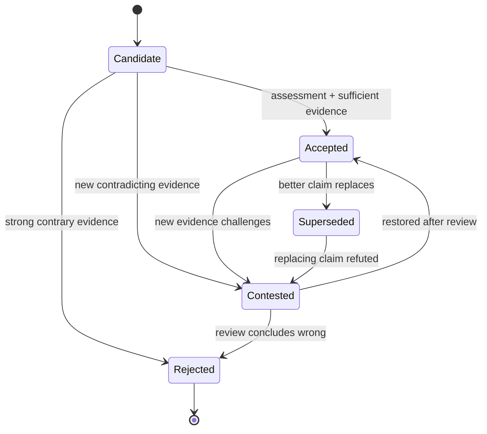

# Chapter 6 — Claims, Evidence, Provenance, Time, and Contradiction

> **Chapter orientation**
>
> **Central question:** A knowledge graph contains claims. But who made a given claim?
> On what evidence? True over what time interval? And when two sources disagree, what
> should the system do — delete one side, or keep both and flag the contradiction?
>
> **Why it matters:** The previous five chapters built the foundation: the data graph
> (Ch1–2), identity and context (Ch3), formal semantics (Ch4), inference and validation
> (Ch5). But all of them assumed that every claim in the graph is *true* — or at least
> that there is no need to ask "true according to whom, true when?". Reality is not like
> that. Knowledge always comes from a specific source, at a specific moment, with a
> specific level of trustworthiness. If the system cannot represent these dimensions, it
> cannot distinguish "Hanoi is the capital" (a present fact) from "Hue was the capital"
> (a historical fact), nor answer "why does the system believe this?"
>
> **You will understand:**
>
> - The book's epistemic model: Observation → Assertion → Claim → Evidence → Accepted
>   Knowledge
> - The distinction Proposition – Assertion – Claim
> - Source is different from Evidence
> - The PROV-O provenance model: Entity, Activity, Agent and the provenance chain
> - The kinds of contradiction and how context reconciles them
> - Multiple time clocks: assertion time, valid time, observation time, system time
> - Knowledge governance states: Candidate, Accepted, Rejected, Contested, Superseded
> - Why LLM output is CandidateKnowledge, not confirmed knowledge
>
> **Prerequisites:** Chapter 3 (named graph, n-ary, context), Chapter 4 (OWA, models),
> Chapter 5 (conformance ≠ truth, consistency ≠ correctness).
>
> **Concept map:**
>
> Data graph + Semantics → **Epistemic layer**: claims with provenance, evidence, time,
> state → Contradiction governance → Accepted knowledge (conditional)

## 6.0 Introduction: Two sources, two numbers

Suppose you are integrating Hanoi population data from two sources:

**Source A** — General Statistics Office of Vietnam, reported in 2019:

```turtle
ex:claim_A  a           ex:PopulationClaim ;
            ex:entity   ex:Hanoi ;
            ex:value    8093100 ;
            ex:source   ex:GSO_Vietnam ;
            ex:asOf     "2019-07-01"^^xsd:date .
```

**Source B** — Wikidata, accessed on 2024-03-15:

```turtle
ex:claim_B  a           ex:PopulationClaim ;
            ex:entity   wd:Q1858 ;
            ex:value    8053663 ;
            ex:source   ex:Wikidata ;
            ex:retrievedAt "2024-03-15"^^xsd:date .
```

Two different numbers: 8,093,100 versus 8,053,663. What should the system do?

The naive approach: pick one, delete the other. But this loses information. The number
8,093,100 is the figure the General Statistics Office published in 2019. The number
8,053,663 is the data Wikidata returned when accessed in 2024 (its own valid time — §6.7).
Both may be correct — in their respective contexts.

This chapter builds the epistemic layer for a knowledge graph: instead of storing triples
as absolute facts, we treat each claim as a **first-class epistemic object** — carrying
provenance, evidence, time, and governance state. When two claims contradict, the system
does not delete; it **preserves the contradiction** and provides tools to assess it.

This is the chapter that moves from "what the graph contains" to "what the graph *knows*
about what it contains".

## 6.1 The epistemic model: from observation to accepted knowledge

### Intuition

In everyday life, we do not treat all information as equal. A number from an official
report differs from a number from a social-media post. We assess information based on its
origin, the evidence supporting it, and the time it applies. A knowledge graph needs to do
the same.

### Mechanism

The book defines an **epistemic model** of five stages. This is a **BOOK-DEFINED**
framework (built by the book, not a W3C standard): the book uses it to organize the
concepts in this chapter.


```
Observation → Assertion → Claim → Evidence → Accepted Knowledge
```

Each stage:

1. **Observation:** Raw data from the world — a measured number, a spreadsheet row, a
   sentence in a document. An observation has not yet been interpreted as a claim about an
   entity.

2. **Assertion:** The observation represented as graph data — an RDF triple, an edge in a
   property graph. An assertion is *data structure*, not yet carrying epistemic context.

3. **Claim:** A first-class epistemic object. A claim consists of asserted content +
   source + time + evidence + state. Two claims may have the same content but differ in
   source, time, evidence — and they are two distinct objects.

4. **Evidence:** Information that supports or refutes a claim. Evidence is not the source
   — the source is where the claim came from; evidence is the reason to believe or
   disbelieve the claim.

5. **Accepted Knowledge:** A claim that has passed a governance process and been assigned
   the "Accepted" state. Acceptance does not mean permanently true — it means "currently,
   given the available evidence, this claim is the most trustworthy in the given context".

> ⚠️ **Important distinction:** This model is the book's conceptual framework, not a W3C
> standard. PROV-O provides vocabulary for provenance; OWL-Time provides vocabulary for
> time; but no standard defines "Claim" or "Accepted Knowledge" as first-class objects. The
> book builds this layer *on top of* existing standards.

### Application

Back to the Hanoi population example:

- `ex:claim_A` and `ex:claim_B` are two distinct **claims**.
- Their content is the same (Hanoi population) but their values differ.
- Each claim carries its own source (`ex:GSO_Vietnam`, `ex:Wikidata`) and time.
- The system does not pick one; it keeps both and flags their state.
- If the General Statistics Office publishes new data (2024), the old claim is not deleted
  — it is marked `Superseded` by the new claim.

> 🖊 **Self-check:** Explain in your own words: why are "assertion" and "claim" two
> different concepts? Give an example where the same assertion appears in two different
> claims.

## 6.2 Proposition – Assertion – Claim: three layers of the same content

### Intuition

The same content — "Hanoi is the capital of Vietnam" — can exist at three different levels
of abstraction. Distinguishing these three levels is the key to building a knowledge system
that can manage contradiction without descending into chaos.

### Mechanism

A **Proposition** is abstract content — the meaning of a statement, independent of
language, speaker, or moment. In logic, a proposition is usually written P. Example:
P = "Hanoi is the capital of Vietnam". A proposition does not live in the graph; it is a
mathematical/logical object.

An **Assertion** is the representation of a proposition in the data graph. In RDF, it is a
triple:

```turtle
ex:Hanoi  ex:capitalOf  ex:Vietnam .
```

An assertion is pure data structure. It does not say who made it, when, or on what
evidence. In Ch3, we learned that a named graph can attach a source name to a group of
assertions — but the graph name is only an application convention, not formal semantics
[@w3c-rdf11-concepts].

A **Claim** is a first-class epistemic object. It consists of the assertion plus full
epistemic context:

```turtle
ex:claim_1  a              ex:Claim ;
            ex:content     [ ex:Hanoi ex:capitalOf ex:Vietnam ] ;
            ex:hasSource    ex:Government_Decree_72 ;
            ex:statedAt    "1976-07-02"^^xsd:date ;
            ex:hasEvidence ex:evidence_legal_document ;
            ex:status      ex:Accepted .
```

A claim is a node in the graph. It has its own IRI. We can talk about it, query it, link
it to evidence, and assign it a state.

### Why this distinction matters

Without the distinction, we fall into one of two traps:

**Trap 1: Treating an assertion as a claim.** When we store
`ex:Hanoi ex:capitalOf ex:Vietnam` as a bare triple, we lose the ability to attach source,
time, evidence. Every assertion looks equal — no way to distinguish "present fact" from
"outdated information".

**Trap 2: Treating a proposition as a claim.** If we use the proposition P itself as the
identifier, then two sources saying the same thing point to the same object. We lose the
ability to attach per-source provenance. Claim identity ≠ content identity — two claims C₁
and C₂ may have content(C₁) = content(C₂) yet remain two distinct objects with their own
provenance.

### Application

In the n-ary mechanism of Ch3 (§3.3.3), the intermediate entity `CapitalStatus` is a
simplified form of a claim — it represents the "relationship event" and allows attaching
time. Chapter 6 extends this pattern: add source, evidence, state, and multiple time
dimensions.

> 🖊 **Self-check:** Given the proposition P = "Hanoi's population is 8 million". Write out
> (a) an RDF assertion representing P, and (b) a claim containing that assertion with
> source and time. Explain why (a) and (b) are not interchangeable.

**Example on the mechanism domain.** Take the proposition P₇₂ = "Velocity is the rate of
change of position with respect to time" (the book's source sentence). Three levels:

- **Proposition:** P₇₂ — abstract content, independent of vocabulary.
- **Assertion:** the bare triple `ex:rateOfChange_1 ex:hasOutput ex:velocity_1` — data
  structure, not saying who said it, when, or based on what. This is exactly the triple
  form Ch2/Ch4 used.
- **Claim:** two distinct claims both carrying P₇₂ but from different sources — the same
  situation as `ta:velocityDef` and `tb:speedDef` in Ch3 §3.2.5:

```turtle
ex:claim_roc_A  a            ex:Claim ;
                ex:content   ex:prop_velocity_rate_of_change ;
                ex:hasSource  ex:textbook_A ;
                ex:statedAt  "2021-06-01"^^xsd:date ;
                ex:status    ex:Accepted .

ex:claim_roc_B  a            ex:Claim ;
                ex:content   ex:prop_velocity_rate_of_change ;   # same proposition!
                ex:hasSource  ex:textbook_B ;
                ex:statedAt  "2023-02-14"^^xsd:date ;
                ex:status    ex:Candidate .
```

The two claims share the same proposition but are two distinct objects — one Accepted from
textbook A, one fresh Candidate from textbook B. **Trap 2 (§6.2): if we use the proposition
P₇₂ itself as the claim identifier, we merge the two sources into one and lose the ability
to mark B as not yet accepted.**

## 6.3 Source is different from Evidence

### Intuition

When someone says "Hanoi has a population of 8 million", we ask two different questions:
"Who said it?" (source) and "Based on what?" (evidence). The two answers can be entirely
different.

### Mechanism

The **Source** answers "where did this claim come from?" — who produced it, through which
channel, when. In PROV-O, the source is represented by `wasAttributedTo` (attributed to an
Agent) or `wasGeneratedBy` (generated by an Activity).

**Evidence** answers "why should we believe (or disbelieve) this claim?" — raw data,
collection method, reference documents, or other claims that support/refute.

Example:

```turtle
ex:claim_pop_2019  ex:hasSource     ex:GSO_Vietnam ;       # SOURCE
                   ex:hasEvidence  ex:census_2019_data ;  # EVIDENCE
                   ex:hasEvidence  ex:sampling_methodology .
```

The source is `ex:GSO_Vietnam` (General Statistics Office). The evidence is
`ex:census_2019_data` (2019 census data) and `ex:sampling_methodology` (sampling method).
Source and evidence are two separate information dimensions.

A trustworthy source can make a claim lacking evidence. A low-prestige source can happen to
make a claim supported by strong evidence. Source reliability is different from claim
confidence.

### Application

In Wikidata, a **reference** is a pointer to an external source (usually via the property
`stated in` (P248)), not the evidence itself — the evidence lies in the cited source. A
statement can have many references, but many references are not necessarily many pieces of
independent evidence: independence holds only when the underlying sources are genuinely
separate. Rank (preferred/normal/deprecated) reflects an aggregate assessment, not direct
evidence [@wikidata-statements].

> ⚠️ **Common misconception:** "Trustworthy source → correct claim." Wrong. A trustworthy
> source raises the *probability* that a claim is correct, but does not guarantee it.
> Evidence is the deciding factor. The system must store both dimensions separately.

## 6.4 The PROV-O provenance model: Entity, Activity, Agent

### Intuition

Provenance answers "where did this data come from, how was it produced, by whom?" PROV-O
(the PROV Ontology) is a W3C standard providing RDF vocabulary to represent provenance
[@prov-o].

### Mechanism

PROV-O defines three core classes [@prov-dm]:

- **Entity** (prov:Entity): "A thing — physical, digital, conceptual, or otherwise — with
  certain fixed aspects." In a KG, an entity is a data node, a document, a dataset, or a
  computation result.

- **Activity** (prov:Activity): "Something that occurs in time, acting upon or using
  entities." Examples: a census, an ETL pipeline run, a data analysis.

- **Agent** (prov:Agent): "A thing that bears responsibility for an activity, for the
  existence of an entity, or for the activity of another agent." Examples: the General
  Statistics Office, a researcher, an automated system.

The relations among these three classes follow PROV-DM [@prov-dm]:

- **Entity and Activity are disjoint:** "An activity is not an entity" — an activity is not
  an entity, and an entity is not an activity.

- **Agent is not locked into the two classes above:** PROV-DM says an agent "may be a
  particular type of entity or activity" — an agent can be an entity (a person, an
  organization) or an activity (an automated process). Therefore these three classes are
  **not** pairwise disjoint, and **Agent is not a universal subclass of Entity**.

The core relations:

| Relation | Meaning | Example |
|----------|---------|---------|
| `prov:wasGeneratedBy` | Entity generated by an Activity | `census_report wasGeneratedBy census_2019` |
| `prov:used` | Activity used an Entity | `census_2019 used survey_forms` |
| `prov:wasAttributedTo` | Entity attributed to an Agent | `census_report wasAttributedTo GSO` |
| `prov:wasAssociatedWith` | Agent responsible for an Activity | `census_2019 wasAssociatedWith GSO` |
| `prov:wasDerivedFrom` | Entity derived from another Entity | `population_claim wasDerivedFrom census_report` |
| `prov:wasInformedBy` | Activity informed by another Activity | `analysis wasInformedBy census_2019` |

A provenance chain forms a **directed graph** pointing back into the past: from the present
entity → the activity that generated it → the activity's input entities → the earlier
activity → ... This chain lets us trace the entire history of a piece of knowledge.

### Application

Applying PROV-O to the Hanoi population example:

```turtle
@prefix prov: <http://www.w3.org/ns/prov#> .

ex:population_claim_A
    a                ex:Claim ;
    ex:value         8093100 ;
    prov:wasDerivedFrom ex:census_2019_report ;
    prov:wasAttributedTo ex:GSO_Vietnam .

ex:census_2019_report
    a                prov:Entity ;
    prov:wasGeneratedBy ex:census_2019_activity ;
    prov:wasAttributedTo ex:GSO_Vietnam .

ex:census_2019_activity
    a                prov:Activity ;
    prov:startedAtTime "2019-04-01T00:00:00Z"^^xsd:dateTime ;
    prov:endedAtTime   "2019-07-01T00:00:00Z"^^xsd:dateTime ;
    prov:wasAssociatedWith ex:GSO_Vietnam ;
    prov:used          ex:survey_questionnaire_2019 .
```

The provenance chain: `population_claim_A ← census_2019_report ← census_2019_activity ←
survey_questionnaire_2019`. Each step records one provenance layer.


> 🖊 **Self-check:** Draw the provenance chain for a claim "Hanoi has 12 districts"
> automatically extracted from Wikipedia by an NLP pipeline. It needs at least three nodes
> (Entity, Activity, Agent) and the appropriate relations.

**Example on the mechanism domain.** The claim about `ex:rateOfChange_1` from a textbook
passes through a full provenance chain:

```turtle
@prefix prov: <http://www.w3.org/ns/prov#> .

ex:claim_roc_A  a ex:Claim ;
    prov:wasDerivedFrom ex:obs_velocity_def_1 ;
    prov:wasAttributedTo ex:textbook_A .

ex:obs_velocity_def_1  a prov:Entity ;    # also an ex:Observation; fully described in §6.17 Step 1
    prov:wasGeneratedBy ex:extraction_activity_7 ;
    prov:wasAttributedTo ex:textbook_A .

ex:extraction_activity_7  a prov:Activity ;
    prov:used ex:textbookA_sec42_raw ;
    prov:wasAssociatedWith ex:extractor_pipeline_v3 .
```

The chain: `claim_roc_A ← obs_velocity_def_1 ← extraction_activity_7 ←
textbookA_sec42_raw`. Each link answers a "from where, by whom, how" question. If one link
is missing, the chain **breaks**:

```turtle
ex:claim_roc_C  a ex:Claim ;
    prov:wasDerivedFrom ex:unknown_section ;
    ex:hasSource ex:unknown_author .    # no Agent, no Activity, no definite Entity
```

This is a **broken chain**: the system cannot answer "where did this claim come from, who
is responsible". A broken provenance chain does not make a claim *wrong*, but it makes the
claim *unverifiable* — the system has no path to trace back for assessment. In knowledge
governance (§6.12), a claim with a broken provenance chain should be kept in the `Candidate`
state, not promoted to `Accepted` without independent evidence.

## 6.5 Evidence relations: supports, contradicts, isRelevantTo

### Intuition

Evidence does not merely "support" or "refute" — there are many degrees of relevance. A
document can be relevant to a claim without directly confirming or denying it.

### Mechanism

The book defines three evidence relations:

- **supports(E, C):** Evidence E supports claim C. E increases C's trustworthiness.
- **contradicts(E, C):** Evidence E refutes claim C. E decreases C's trustworthiness.
- **isRelevantTo(E, C):** Evidence E is relevant to claim C but does not directly support
  or refute it. E provides additional context.

These relations are **not symmetric**: if E supports C, we cannot infer C supports E. They
are also **not transitive**: if E₁ supports C and E₂ supports C, we cannot infer E₁ and E₂
support each other.

In RDF:

```turtle
ex:census_2019_data  ex:supports     ex:claim_pop_A .
ex:wiki_article_X    ex:contradicts  ex:claim_pop_A .
ex:gso_methodology   ex:isRelevantTo ex:claim_pop_A .
```

### Evidence is not proof

A supporting piece of evidence does not make a claim true. It increases the *confidence* —
but confidence is a subjective assessment that depends on the system's policy. There is no
universal formula to compute confidence from a set of evidence.

> ⚠️ **Common misconception:** "Many supporting pieces of evidence → claim is true." Wrong.
> Many sources can repeat the same mistake (echo chamber). Evidence quality matters more
> than evidence quantity.

**A fuzzy classification boundary.** The three relations above are not always clear-cut. A
piece of evidence can be *half supporting, half refuting* depending on context. Example on
the mechanism domain: claim C₁ says "RATE_OF_CHANGE is only valid in the macroscopic,
low-velocity regime". An experiment observing a fast-moving particle shows the classical
formula fails near light speed — it **contradicts** the unbounded version (no limit), but
**supports** the macroscopic-restricted version.

```turtle
ex:fast_particle_exp  ex:contradicts  ex:claim_roc_universal ;
                     ex:supports     ex:claim_roc_restricted .
```

Classifying a piece of evidence requires specifying *which claim* we are comparing against.
The same measurement can be supporting evidence for one claim and refuting evidence for
another. This is why an evidence relation must record the explicit pair `(evidence, claim)`,
rather than assigning an "evidence trustworthiness" on a separate table.

## 6.6 Contradiction taxonomy

### Intuition

"Contradiction" is not a single phenomenon. Two sources disagreeing can be for many
different reasons, and each reason demands a different handling.

### Mechanism

The book defines five kinds of contradiction:


**1. Logical contradiction:** Two claims cannot both be true under any interpretation.
Example: `capitalOf(Hanoi, Vietnam)` and `¬capitalOf(Hanoi, Vietnam)`. This is a genuine
contradiction — at least one side is wrong.

**2. Value conflict:** Two claims assign different values to the same property of the same
entity, in the same context. Example: `population(Hanoi) = 8093100` and
`population(Hanoi) = 8053663`. Could be due to different measurements, rounding, or error.

**3. Temporal disagreement:** Two claims true at different times. Example: "Hue is the
capital" (true 1802–1945) and "Hanoi is the capital" (true from 1976). This is not a genuine
contradiction — it only needs correct time labels.

**4. Scope disagreement:** Two claims true in different scopes. Example: "France's
population is 67 million" (nationwide) and "France's population is 55 million" (metropolitan
Europe only, excluding overseas territories). Scope context reconciles.

**5. Source disagreement:** Two sources give different values for the same property, same
time, same scope. This is the most common and hardest-to-handle case — it requires assessing
source quality, method, and evidence.

### Context reconciles contradiction

Before declaring two claims "contradictory", check whether **context can reconcile them**.
Four context dimensions need alignment:

1. **Entity identity:** Are the two claims about the same entity? (Ch3: identity resolution)
2. **Predicate meaning:** Do the two predicates have the same semantics? (`population` could
   be de jure — by official registration — versus de facto — by actual residence)
3. **Temporal scope:** Do the two claims apply over the same time interval?
4. **Spatial/legal scope:** Do the two claims share the same jurisdiction?

If, after aligning the four dimensions, the contradiction still stands, it is a **genuine
contradiction** — and the system must preserve it rather than delete it.

> 🖊 **Self-check:** Given two claims: (A) "Vietnam's population is 96 million" (source:
> World Bank, 2019) and (B) "Vietnam's population is 98 million" (source: GSO, 2021).
> Classify this contradiction using the taxonomy above. Which context could reconcile it?

**The five contradiction kinds on the mechanism domain.** Same taxonomy, applied to
Mechanism-KG data:

| Kind | Mechanism example | Reconciling context |
|------|-------------------|---------------------|
| **Logical** | `rateOfChange_1 hasInput position_1` and a claim saying `rateOfChange_1 has NO input` | Not reconcilable — at least one side is wrong |
| **Value** | Two claims assign `differentiand` of `derivativeApplication_1` as `position_1` and `distance_1` respectively, under the same definition of "position" | Not reconcilable — measured under two different definitions? Check the predicate |
| **Temporal** | "The RATE_OF_CHANGE mechanism holds" (valid [1687, 1905) — Newtonian mechanics) and "classical RATE_OF_CHANGE fails" (valid [1905, now) — relativity) | Reconciled by valid time (§6.7) |
| **Scope** | "RATE_OF_CHANGE of velocity with respect to time" (vₓ) and "RATE_OF_CHANGE with respect to distance" (dₛ) | Reconciled by `withRespectTo`: the graph records the reference variable explicitly |
| **Source** | textbook A defines velocity = ds/dt; textbook B defines speed = \|ds/dt\| | Not reconcilable by context — needs source and evidence assessment (§6.11) |

The **Temporal** row is the key example: the two sentences "the mechanism holds" and "the
mechanism fails" are both true — each within its own validity interval. Without representing
valid time, the system thinks they contradict and tags them `Contested`; in fact they only
need correct time labels. The **Scope** row is similar: a different `withRespectTo` means a
different sub-mechanism, not a contradiction — Ch3 §3.3.3 prepared for this via reification.

## 6.7 Multiple time clocks

### Intuition

Time in a knowledge graph is not a single axis. The same claim has at least three "clocks"
running in parallel, and confusing them is the source of many design errors.

### Mechanism

Four time clocks must be distinguished:


**1. Valid time:** The interval over which the claim is true *in the real world*. "Hanoi is
the capital" has valid time = [1976-07-02, now). "Hue is the capital" has valid time =
[1802, 1945-08-30). Valid time answers "when is this true in the world?"

**2. Assertion time:** The moment the claim was *entered into the system*. Assertion time
answers "when did the system learn this?"

**3. Observation time:** The moment the data was *collected from the world*. The 2019 census
has observation time = 2019-04-01 to 2019-07-01, but assertion time might be 2020-01-15
(when the report was published). Observation time answers "when was the data measured?"

**4. System/Transaction time:** The moment the system *stored* the claim. System time answers
"when was this record written to the database?"

These four clocks are **not interchangeable**. A claim can have:
- Valid time = [2019, 2024) (true in the world from 2019 to 2024)
- Observation time = 2019-07-01 (measured in July 2019)
- Assertion time = 2020-01-15 (published in January 2020)
- System time = 2020-01-20T10:30:00 (entered into the system on 2020-01-20)

### Bitemporal intuition

The **bitemporal** model (two times) is a particularly important special case: valid time +
system time. Valid time says "when is this true in the world"; system time says "when did
the system know this".

Example: On 2020-01-15, the system records "Hanoi population = 8,093,100" (valid time =
2019). On 2024-06-01, the system receives new data: "Hanoi population = 8,418,883" (valid
time = 2024). The old record is not deleted — system time lets us query "what did the system
believe on 2022?" and get the correct answer.

### The 2D bitemporal coordinate grid

The intuition above becomes a *formal mechanism* when we draw the two time axes
perpendicular to each other. Snodgrass's **bitemporal** model [@snodgrass-temporal-1999]
treats each record as occupying a **rectangle** in a two-dimensional plane:

$$
R \;=\; \bigl[T_v^{\text{start}},\, T_v^{\text{end}}\bigr] \times \bigl[T_{tx}^{\text{start}},\, T_{tx}^{\text{end}}\bigr]
$$

- The horizontal axis $T_v$ = **valid time** — over which interval the claim is true *in the
  world*.
- The vertical axis $T_{tx}$ = **transaction/system time** — over which interval the *system
  believes* the claim.

A claim is no longer a single point or a single interval; it is a **region** in the grid.
Two claims about the same quantity but entered at different system times occupy two
rectangles that *partially overlap* — and that is exactly where the bitemporal model beats
merely storing "the latest record".

![The 2D bitemporal coordinate grid. Horizontal axis = valid time, vertical axis = transaction/system time. Claim C1 (range [300K,450K]) occupies the blue rectangle; after a sensor correction, claim C2 (range [300K,400K]) occupies the orange rectangle overlaying the retrospective region. C1 is not deleted. Two point-probes fall into different cells and give different answers.](figures/generated/ch06-bitemporal-grid.pdf)

**The point-probe mechanism.** A bitemporal query is a **point** $(T_v^*, T_{tx}^*)$ in the
grid. The question it asks, read literally: *"At system time $T_{tx}^*$, what did the system
believe about the validity interval $T_v^*$?"* The answer is the claim whose rectangle
contains that point — checked with two inequalities:

$$
T_v^{\text{start}} \le T_v^* < T_v^{\text{end}}
\quad\text{and}\quad
T_{tx}^{\text{start}} \le T_{tx}^* < T_{tx}^{\text{end}}
$$

In the figure above, the same validity year $T_v^* = 2022$ but two different query moments
give two different answers:

| Probe | $T_{tx}^*$ (asked at) | $T_v^*$ (about year) | Falls in cell | System believes |
|-------|----------------------|----------------------|---------------|-----------------|
| Probe 1 | 2021 | 2022 | C1 | range [300K, 450K] |
| Probe 2 | 2024 | 2022 | C2 | range [300K, 400K] |

The same past event (the year 2022), two different answers — not a contradiction, only a
reflection of the system's *belief history*. Probe 1 asks before the sensor was corrected, so
it gets the old number; Probe 2 asks after, so it gets the corrected number.

**The Append-Only (non-destructive) principle.** When C2 appears, C1 is **not deleted**; C2
merely *overlays* the retrospective region by closing C1's system-time interval
($T_{tx}^{\text{end}} \leftarrow 2024$) and opening a new rectangle. This is what separates
the bitemporal model from a relational `UPDATE`: belief history is **immutable**, every
"modification" is really an **append**. As a result, the system answers both *retrospective*
questions ("what did we believe in June 2021?") and *present* questions ("what do we believe
now?") without needing a separate backup.

> ⚠️ **Common misconception:** "Bitemporal = two timestamp columns." Wrong. Two discrete
> timestamp columns only record the *moment* a claim was born. A true bitemporal model stores
> *two intervals* (valid interval + transaction interval), i.e. a rectangle, and lets a
> point-probe fall into any cell of the grid. The difference is that **retrospection works on
> the valid-time axis too**, not only the system-time axis.

### Representing with OWL-Time

OWL-Time [@owl-time] provides RDF vocabulary for time:

```turtle
@prefix time: <http://www.w3.org/2006/time#> .

ex:claim_pop_A  time:hasTime [
    a               time:ProperInterval ;
    time:hasBeginning [ time:inXSDDate "2019-07-01"^^xsd:date ] ;
    time:hasEnd       [ time:inXSDDate "2024-01-01"^^xsd:date ]
] .
```

This is valid time. Assertion time and system time are represented by separate properties:

```turtle
ex:claim_pop_A  ex:assertedAt  "2020-01-15"^^xsd:date ;
                ex:systemTime  "2020-01-20T10:30:00"^^xsd:dateTime .
```

> ⚠️ **Common misconception:** "Time in RDF is valid time." Wrong. RDF has no built-in notion
> of time. Every temporal annotation is an application convention. OWL-Time provides the
> vocabulary, but assigning meaning (valid vs assertion vs system) is the designer's
> responsibility.

**Temporal Entity.** Before attaching time, we need a standalone definition. In OWL-Time
[@owl-time], a **temporal entity** (`time:TemporalEntity`) is an object denoting a time
interval or instant, and can be used as the value of `time:hasTime`. The most important
subclass is `time:ProperInterval` — *a time interval with a start point and an end point,
the two not coinciding*:

```turtle
@prefix time: <http://www.w3.org/2006/time#> .

ex:validity_newtonian a time:ProperInterval ;
    time:hasBeginning [ time:inXSDDateTime "1687-07-05T00:00:00Z"^^xsd:dateTime ] ;
    time:hasEnd       [ time:inXSDDateTime "1905-09-26T00:00:00Z"^^xsd:dateTime ] .
```

**The temporal validity of a mechanism.** Apply this concept to the RATE_OF_CHANGE mechanism
itself. In classical mechanics, velocity is the derivative $ds/dt$ with no speed limit. From
1905, relativistic mechanics replaces it: velocity is bounded by the speed of light. Two
claims about the *same* mechanism have different valid times — they do not exclude each other:

```turtle
ex:claim_roc_classical  ex:content    ex:prop_roc_velocity_unbounded ;
                        ex:hasTime    ex:validity_newtonian ;
                        ex:status     ex:Superseded .

ex:claim_roc_relativist ex:content    ex:prop_roc_velocity_bounded ;
                        ex:hasTime    [
                            a            time:ProperInterval ;
                            time:hasBeginning [ time:inXSDDateTime "1905-09-26T00:00:00Z"^^xsd:dateTime ]
                        ] ;
                        ex:status     ex:Accepted .
```

The correct answer to "is the RATE_OF_CHANGE mechanism correct?" depends on *when you ask*:
before 1905 the classical claim is the best; from 1905, the relativistic claim is the best.
This is exactly **temporal disagreement** reconciled by valid time (§6.6).

**Bitemporal query for the mechanism.** Combining valid time + system time lets us answer:
"On 2021-06-01, what did the system believe about the maximum speed of RATE_OF_CHANGE?" — a
*retrospective* query. Bitemporal state is represented by two intervals:

```turtle
ex:claim_roc_unbounded  ex:content  ex:prop_roc_velocity_unbounded ;
    ex:validInterval [
        a time:ProperInterval ;
        time:hasBeginning [ time:inXSDDateTime "1687-07-05T00:00:00Z"^^xsd:dateTime ] ;
        time:hasEnd       [ time:inXSDDateTime "1905-09-26T00:00:00Z"^^xsd:dateTime ]
    ] ;
    ex:systemInterval [
        a time:ProperInterval ;
        time:hasBeginning [ time:inXSDDateTime "2020-01-20T10:30:00Z"^^xsd:dateTime ] ;
        time:hasEnd       [ time:inXSDDateTime "2024-06-01T11:05:00Z"^^xsd:dateTime ]   # already superseded
    ] .
```

The SPARQL query "what did the system believe on 2021-06-01?" — with the condition that the
query date lies *within both* intervals:

```sparql
PREFIX ex: <http://example.org/kgbook/mks#>
PREFIX time: <http://www.w3.org/2006/time#>

SELECT ?claim ?content WHERE {
    ?claim ex:content ?content ;
           ex:validInterval [ time:hasBeginning ?vb ; time:hasEnd ?ve ] ;
           ex:systemInterval [ time:hasBeginning ?sb ; time:hasEnd ?se ] .
    FILTER ("2021-06-01T00:00:00Z"^^xsd:dateTime >= ?vb
        && "2021-06-01T00:00:00Z"^^xsd:dateTime <= ?ve
        && "2021-06-01T00:00:00Z"^^xsd:dateTime >= ?sb
        && "2021-06-01T00:00:00Z"^^xsd:dateTime <= ?se)
}
```

On 2021-06-01, the query returns `claim_roc_unbounded` — and only it: the relativistic claim
had not yet been entered into the system (its system interval begins 2024-06-01, when it
superseded the old claim). The old record is not deleted (contradiction preservation, §6.14);
it remains queryable within its system-time frame. This is the practical answer to "what did
the system believe, and when".

## 6.8 A claim's time differs from the event's time

### Intuition

"Hanoi became the capital in 1976" and "the claim 'Hanoi is the capital' was entered in 2020"
are two entirely different temporal events. Confusing them leads to serious query errors.

### Mechanism

**Event time** is when the event (or state) described occurred in the world. For a claim
describing a state, event time usually coincides with valid time — "Hue is the capital" has
its event and state true together over [1802, 1945). But the two concepts are not universally
identical: a claim asserting "event X happened at t" has event time the point t, while the
claim's valid time extends from t to now.

**Claim time** is assertion time — when the claim was entered into the system.

Example:

| Claim | Event time | Claim time |
|-------|-----------|------------|
| "Hue is the capital" | [1802, 1945) | 2020-01-15 |
| "Hanoi is the capital" | [1976, now) | 2020-01-15 |
| "Hanoi is the capital" (updated) | [1976, now) | 2024-06-01 |

The last two claims have the same event time but different claim times. The second is an
update — content unchanged, but the assertion moment changed (possibly due to a new source,
re-verification, or data migration).

### Application

When querying "what is Vietnam's capital now?", the system must:
1. Find all claims about `capitalOf(Vietnam)`.
2. Filter by valid time containing the current moment.
3. Among the qualifying claims, pick the one with state `Accepted` and the most recent claim
   time (or strongest evidence).

If the system confuses event time and claim time, it might return "Hue" because the claim
about Hue was entered into the system *more recently* — even though its content expired in
1945.

## 6.9 The Wikidata statement model: subject–property–value + qualifiers + references + rank

### Intuition

Wikidata is the world's largest knowledge system handling contradiction at industrial scale.
Its statement model deserves study as a real-world case study [@wikidata-statements]
[@wikidata-qualifiers].

### Mechanism

A **statement** in Wikidata consists of:

- **Subject:** the Item (Q-id) — the entity being described.
- **Property–Value:** the property–value pair — the core content.
- **Qualifiers:** contextual modifiers — clarifying scope, time, method.
- **References:** citations — supporting evidence.
- **Rank:** Preferred / Normal / Deprecated — managing competing values.

Example: Hanoi population in Wikidata:

```
Item: Q1858 (Hanoi)
Property: P1082 (population)
Value: 8053663
Qualifier: P585 (point in time) = 2011
Reference: P248 (stated in) = Q... (census source)
Rank: normal
```

### Rank is not a truth score

Rank in Wikidata is **not** a truth score. It is a governance mechanism:

- **Preferred:** The value prioritized for display when several exist. Usually the current or
  most trustworthy value.
- **Normal:** A normal value, shown when there is no preferred.
- **Deprecated:** A value no longer recommended (outdated, wrong), but still kept for
  historical traceability.

Rank reflects **the editorial community's assessment**, not evidence in itself. A deprecated
statement still exists in the graph — it is not deleted.

### References are not proof

A reference in Wikidata records a *citation*, not a *proof*. A statement can have many
references, but many references are not necessarily many pieces of independent evidence — they
may point back to the same origin. The presence of a reference does not guarantee a statement
is correct; it lets the reader *check*.

### Relation to the book's model

| Wikidata | Book model (Ch6) |
|----------|------------------|
| Statement (core) | Assertion |
| Statement + qualifiers + references + rank | Claim |
| Reference | Evidence (one form) |
| Rank | Governance state (one form) |
| Qualifier | Context dimension |
| Item (Q-id) | Entity |

Wikidata proves that a production knowledge system must treat context as first-class. A bare
property–value pair is rarely the whole story [@wikidata-qualifiers].

> ⚑ **The term "claim" is overloaded.** Wikidata uses the word "claim" in its own sense: in
> Wikidata, a claim is a statement **without references** (subject–property–value +
> qualifiers), while statement = claim + references. This concept is **entirely different**
> from the book model's Claim: a Claim (book) is a full statement — content, source, evidence,
> time, governance state. The same word "claim" denotes two different concepts; when reading
> Wikidata documentation, understand their meaning correctly.

> 🖊 **Self-check:** In Wikidata, an item can have multiple statements for the same property
> with different ranks. Explain why this is not a "data error" but a deliberate design.
> Relate it to Ch6's concept of "contradiction preservation".

## 6.10 Representing a Claim in RDF: design choices

### Intuition

How do we represent a Claim as a first-class object in RDF? There are several ways, each with
its own trade-off.

### Mechanism

Three main choices:

**Choice 1: N-ary pattern (Ch3 §3.3.3)**

Create an entity representing the claim, linking it to content, source, time, evidence:

```turtle
ex:claim_1  a              ex:Claim ;
            ex:subject     ex:Hanoi ;
            ex:predicate   ex:capitalOf ;
            ex:object      ex:Vietnam ;
            ex:hasSource    ex:Gov_Decree_72 ;
            ex:validFrom   "1976-07-02"^^xsd:date ;
            ex:status      ex:Accepted ;
            ex:hasEvidence ex:evidence_legal_doc .
```

Pros: flexible, each context dimension is a first-class edge. Cons: queries must traverse the
intermediate node; the asserted content is "decomposed" into separate subject/predicate/object.

**Choice 2: Named graph + metadata**

Place the assertion in a named graph, then describe that named graph:

```trig
ex:claim_1_graph {
    ex:Hanoi ex:capitalOf ex:Vietnam .
}

ex:claim_1_graph  ex:hasSource   ex:Gov_Decree_72 ;
                  ex:validFrom  "1976-07-02"^^xsd:date ;
                  ex:status     ex:Accepted .
```

Pros: the assertion keeps its triple form; SPARQL GRAPH queries are natural. Cons: each claim
needs its own named graph — heavy when there are millions of claims; a graph name does not
automatically carry provenance meaning [@w3c-rdf11-concepts].

**Choice 3: RDF 1.2 Triple Terms (emerging)**

RDF 1.2 is developing a triple-term mechanism that allows direct reference to a triple
[@w3c-rdf12-concepts]:

```turtle
<< ex:Hanoi ex:capitalOf ex:Vietnam >>  ex:hasSource  ex:Gov_Decree_72 ;
                                        ex:validFrom "1976-07-02"^^xsd:date .
```

Pros: compact, keeps the triple, no intermediate node. Cons: not yet stable (Candidate
Recommendation); limited tooling; does not support every n-ary case.

> ⚑ **Ongoing development.** RDF 1.2 Triple Terms is a Candidate Recommendation (2026-04).
> RDF 1.2 distinguishes the triple term `<<( s p o )>>` (a triple used as a term in another
> triple — only referencing content, asserting nothing yet) from the reifier triple
> `<< s p o >>` (short syntax for a new reifier `rdf:reifies <<( s p o )>>`, usually with
> annotations — leaning toward "asserting" a claim). The book uses the n-ary pattern as the
> stable baseline; both are mentioned as a future direction.

### The book's choice

The book chooses **Choice 1 (n-ary pattern)** as the default representation because:
- Stable (W3C Note 2006, not dependent on RDF 1.2)
- Most flexible (supports every context dimension)
- Compatible with PROV-O (claim entity = prov:Entity)
- Fits the mental model "a Claim is a first-class object"

**Counter-example: a claim missing required components.** Not all knowledge out there is a
valid claim. A claim missing source, missing time, or missing evidence cannot be assessed:

```turtle
ex:claim_malformed_1  a ex:Claim ;
    ex:content [ ex:rateOfChange_1 ex:hasOutput ex:velocity_1 ] .
    #   NO ex:hasSource       — who said it?
    #   NO ex:statedAt       — when?
    #   NO ex:hasEvidence    — based on what?
    #   NO ex:status         — has it been assessed?
```

This is a **malformed claim**: missing so much metadata that the system cannot decide whether
to believe it. It should really be only an Assertion (a bare triple), not a Claim. A minimally
valid claim must have: a source (`ex:hasSource`), a moment (`ex:statedAt`), and a state
(`ex:status`). The example `ex:claim_roc_A` in §6.17 is a fully valid claim.

## 6.11 The semantics of trustworthiness: Confidence must say what it is assessing

### Intuition

What does "confidence 0.8" mean? There is no single answer. Confidence can measure many
different things, and confusing them leads to serious errors.

### Mechanism

When assigning confidence to a claim, we must specify clearly **what the confidence is
assessing**:

| Confidence kind | What it assesses | Example |
|----------------|------------------|---------|
| Extraction confidence | Accuracy of the extraction process | Named Entity Recognition (NER) assigns 0.92 to the entity "Hanoi" |
| Source reliability | Trustworthiness of the source | GSO rated 0.95 based on track record |
| Evidence assessment | How strongly evidence supports | 3 independent sources confirm → 0.9 |
| Temporal validity | Likelihood the claim is still in effect | Last updated 5 years ago → 0.7 |
| Composite confidence | Combines several factors | Weighted combination of above |

There is no universal formula to compute composite confidence. Each system must define its own
policy — and that policy must be recorded explicitly in the system.

### Source reliability ≠ Claim confidence

A trustworthy source (high source reliability) can make a claim lacking evidence (low evidence
assessment). Conversely, a low-prestige source can happen to make a claim supported by strong
evidence.

```turtle
ex:claim_X  ex:sourceReliability  0.95 ;   # Very trustworthy source
            ex:evidenceScore      0.30 ;   # But weak evidence
            ex:compositeConfidence ??? .   # Depends on policy
```

> ⚠️ **Common misconception:** "Confidence = probability the claim is true." Wrong. Confidence
> is a subjective assessment depending on policy and context. It is not an objective
> probability unless the system explicitly defines probabilistic semantics.

**A computable policy.** "Depends on policy" does not mean arbitrary. A good policy is a
*computable function*: the same input always yields the same output, and the formula is
recorded in metadata. For example, the Mechanism-KG system defines:

```
composite(C) = 0.6 · sourceReliability(C) + 0.4 · evidenceScore(C)
```

with `sourceReliability` taken from the source-ranking model below, and `evidenceScore`
computed by the evidence-assessment procedure. Applied to the mechanism claim from §6.2:

```turtle
ex:claim_roc_A  ex:sourceReliability  0.9 ;
                ex:evidenceScore      0.8 ;
                ex:compositeConfidence 0.86 .   # 0.6·0.9 + 0.4·0.8
```

The value 0.86 is a *consequence of the policy*, recomputable and auditable — not a random
number. When the policy changes, all old composite values must be marked stale rather than
kept unchanged.

### When linear averaging collapses: Dempster–Shafer and Subjective Logic

The `0.6·source + 0.4·evidence` policy suffices when the signals *agree*. It collapses in
exactly the two situations an epistemic system must handle: **conflict** and **ignorance**.

Consider conflict. Source A says the probability the claim is true is 0.9; independent
evidence says 0.1. Linear averaging gives `0.6·0.9 + 0.4·0.1 = 0.58`. But the number 0.58 is
*indistinguishable* from the case "both sources only vaguely know, around 50/50". The average
has **erased the trace of disagreement**: two sources are arguing fiercely, yet the output
looks like a neutral, hesitant assessment. A system storing only a scalar cannot tell when to
*trust* and when to *withhold judgment*.

Consider ignorance. No source, no evidence. The correct confidence must reflect "we don't
know", not "0.5". But 0.5 is also exactly the value averaging returns when two sources
conflict. **The same number, two opposite meanings.** Scalar confidence is not expressive
enough.

The two theories below fix this defect by carrying a *width* (a confidence interval) instead
of a point.

**Dempster–Shafer theory of evidence.** Shafer [@shafer-evidence-1976] generalizes Bayesian
probability. Instead of assigning a probability to each proposition, it assigns **mass** to
*sets* of propositions within a **frame of discernment** $\Theta$ — the set of mutually
exclusive hypotheses. With $\Theta = \{\text{Acc}, \text{Rej}\}$:

- A **mass function** $m : 2^{\Theta} \to [0,1]$ satisfying $m(\emptyset) = 0$ and
  $\sum_{B \subseteq \Theta} m(B) = 1$.
- Mass placed on the *whole* $\Theta$ expresses **total ignorance**: $m(\Theta) = 1$ means
  "not yet leaning toward any hypothesis", quite different from $m(\{\text{Acc}\}) = 0.5$.
- The **belief** and **plausibility** functions bracket a claim into an interval:

$$
\mathrm{Bel}(A) = \sum_{B \subseteq A} m(B), \qquad
\mathrm{Pl}(A) = 1 - \mathrm{Bel}(\bar{A})
$$

  The interval $[\mathrm{Bel}(A), \mathrm{Pl}(A)]$ is the **confidence interval**: the width
  $\mathrm{Pl} - \mathrm{Bel}$ *is* the uncommitted ignorance. Bayes is the special case where
  all mass sits on singletons (width = 0).

**Dempster's rule of combination.** Two independent sources $m_1, m_2$ combine via set
intersection:

$$
(m_1 \oplus m_2)(A) = \frac{1}{1 - K} \sum_{B \cap C = A} m_1(B)\, m_2(C), \qquad
K = \sum_{B \cap C = \emptyset} m_1(B)\, m_2(C)
$$

$K$ measures the **degree of conflict** — mass falling into the empty intersection. Mechanism-KG
example, two assessors about `claim_roc_A`:

- Source 1 (peer-reviewed cross-check): $m_1(\{\text{Acc}\}) = 0.8,\; m_1(\Theta) = 0.2$.
- Source 2 (contradicting evidence): $m_2(\{\text{Rej}\}) = 0.7,\; m_2(\Theta) = 0.3$.

Compute: $K = 0.8 \cdot 0.7 = 0.56$; $1 - K = 0.44$. The normalized result:

| Set | Combined mass | Computation |
|-----|---------------|-------------|
| $\{\text{Acc}\}$ | $0.545$ | $(0.8\cdot0.3 + 0.2\cdot0)/0.44$ |
| $\{\text{Rej}\}$ | $0.318$ | $(0.2\cdot0.7)/0.44$ |
| $\Theta$ | $0.136$ | $(0.2\cdot0.3)/0.44$ |

$\mathrm{Bel}(\text{Acc}) = 0.545$, $\mathrm{Pl}(\text{Acc}) = 1 - 0.318 = 0.682$.

> ⚠️ **Zadeh's paradox.** Note $K = 0.56$ — the two sources are *nearly opposed*. Yet Dempster's
> rule **discards** all the conflicting mass ($0.56$) and renormalizes the remainder, producing
> a *confident-looking* conclusion ($\mathrm{Bel} = 0.545$) from two arguing witnesses. As
> $K \to 1$, the denominator $1-K \to 0$ and the combination becomes numerically arbitrary. The
> lesson: Dempster–Shafer combines *agreeing* evidence well and represents *ignorance*, but
> **must not be used to force two conflicting sources into a single number**. When $K$ is large,
> the book keeps the two branches separate in the Claim Ledger with state `Contested` (§6.14) —
> preserving the contradiction rather than blending it.

**Subjective Logic.** Jøsang [@josang-subjective-logic-2016] presents the same idea in a more
visual coordinate. An **opinion** is a quadruple $\omega = (b, d, u, a)$:

- $b$ = belief, $d$ = disbelief, $u$ = uncertainty, with $b + d + u = 1$;
- $a \in [0,1]$ = **base rate** (default prior probability, usually $0.5$).

Because $b+d+u=1$, an opinion lives on an **equilateral 2-simplex** (a triangle) with three
vertices Belief–Disbelief–Uncertainty — barycentric coordinates. The $u$ vertex = total
ignorance; the base edge $u=0$ = fully committed (pure Bayes). The **reference (subjective)
probability**:

$$
P(x) = b + a \cdot u
$$

The **cumulative fusion** $\oplus$ for two independent opinions $\omega_1, \omega_2$ (same $a$):

$$
b_{\oplus} = \frac{b_1 u_2 + b_2 u_1}{u_1 + u_2 - u_1 u_2}, \quad
d_{\oplus} = \frac{d_1 u_2 + d_2 u_1}{u_1 + u_2 - u_1 u_2}, \quad
u_{\oplus} = \frac{u_1 u_2}{u_1 + u_2 - u_1 u_2}
$$

The key property — **monotonic shrinkage of uncertainty**: when two sources agree,
$u_{\oplus} \le \min(u_1, u_2)$; converging evidence makes the confidence interval *narrower*,
belief *stronger*. Example, two sources both leaning accept $\omega_1 = \omega_2 = (0.6, 0,
0.4)$:

$$
u_{\oplus} = \frac{0.4 \cdot 0.4}{0.4 + 0.4 - 0.16} = \frac{0.16}{0.64} = 0.25, \quad
b_{\oplus} = \frac{0.6\cdot0.4 + 0.6\cdot0.4}{0.64} = 0.75
$$

Two agreeing sources push belief from $0.6$ up to $0.75$ and *reduce* uncertainty from $0.4$
to $0.25$ — matching the intuition "adding independent same-direction evidence makes us more
certain". With $a=0.5$, the subjective probability $P = 0.75 + 0.5\cdot0.25 = 0.875$.

Subjective Logic and Dempster–Shafer are numerically equivalent (the same conflict example
above gives $b=0.545, d=0.318, u=0.136$ — exactly the Bel/Pl values computed). The difference
lies in *presentation*: SL gives a geometric coordinate from which you can immediately see
whether a claim sits near the ignorance vertex or near the committed edge, and it separates $b$
from $d$ so you **see both directions of conflict** rather than compressing them into one
scalar. That is what the linear averaging at the start of this section cannot do.

**A source-reliability model for mechanisms.** "Trustworthy source" must be quantified. A
simple model: tiered ranking, each source given a base score, adjustable by history:

| Tier | Example source | Base score | Note |
|------|----------------|-----------|------|
| 1. Peer-reviewed | Paper on mechanism inference | 0.95 | Has an independent review process |
| 2. Textbook | textbook A, textbook B | 0.85 | Prestigious but slow to update |
| 3. Technical doc / standard | RDFS/OWL spec | 0.90 | Standardized, maintained |
| 4. Automatic extraction (LLM, NLP) | LLM pipeline | 0.60 | Fast, cheap, but prone to hallucinate |

Base scores can be adjusted: a tier-2 source with a good track record (many verified Accepted
claims) is raised; a tier-1 source with a history of errors is lowered. Most importantly, this
is a *public model*, stored in the graph, so anyone can explain why `claim_roc_B` (from
textbook B, Candidate) is rated lower than `claim_roc_A` (from textbook A, Accepted).

### Assessment must be a structured object

A bare confidence number (e.g. `0.86`) cannot justify itself — where did it come from, by whom,
how, when? The system must represent an **assessment** as a separate object with explicit
structure:

| Component | Meaning | Example |
|-----------|---------|---------|
| target | What is being assessed | `ex:claim_roc_A` |
| assessor | Who/what assessed it | `ex:kg_admin_1`, `ex:evidence_processor_2` |
| method | Assessment method | Cross-source check, manual review, formula |
| scale | Score scale | 0–1, 1–5, {low, medium, high} |
| value | Value on the scale | 0.86 |
| assessedAt | When assessed | 2021-06-10 |
| rationale | Reason — process, evidence used | "Matches textbook B; correct mechanism grammar" |

```turtle
ex:assessment_roc_A_1  a ex:Assessment ;
    ex:target     ex:claim_roc_A ;
    ex:assessor   ex:kg_reviewer_1 ;
    ex:method     ex:cross_source_check ;
    ex:scale      ex:scale_0_to_1 ;
    ex:value      0.86 ;
    ex:assessedAt "2021-06-10"^^xsd:date ;
    ex:rationale  "Matches textbook B on the definition of rate of change; correct mechanism grammar; tier-2 source" .
```

Because an assessment is a separate object, a claim can have many assessments over time — each
re-assessment creates a new record, not overwriting the old one. This enables history tracing:
"who believed what, when, based on where".

**Four assessment kinds to distinguish** — different target, different meaning:

| Assessment kind | Target | Asks |
|-----------------|--------|------|
| Extraction assessment | The extraction process (extractor) | Was the extraction accurate? |
| Source assessment | The source | Is this source trustworthy? |
| Evidence assessment | The evidence | Does the evidence support the claim strongly/weakly? |
| Claim assessment | The claim | Aggregate: is the claim worthy of Accepted? |

Confusing these four is the root of "confidence that doesn't say what it's assessing" (§6.11
opening). In the example above, `ex:assessment_roc_A_1` is a *claim assessment* — the
extraction/source/evidence assessments of the same claim are stored in other objects with their
respective targets.

## 6.12 Knowledge governance states: Candidate, Accepted, Rejected, Contested, Superseded

### Intuition

Knowledge in a living system is not static. It goes through a lifecycle: proposed, assessed,
accepted, challenged, superseded. The system must represent these states explicitly.

### Mechanism

Five governance states:

| State | Meaning | Action |
|-------|---------|--------|
| **Candidate** | Newly proposed, not yet assessed | Keep, await review |
| **Accepted** | Assessed, considered most trustworthy currently | Used in queries, inference |
| **Rejected** | Assessed, refused (wrong, lacking evidence) | Keep for traceability, not used |
| **Contested** | Currently challenged by new evidence or another claim | Keep, flag for review |
| **Superseded** | Replaced by a newer/better claim | Keep for history, point to replacement |

**State machine (FSM).** These five states form a finite state machine. Each transition is a
recorded **governance event** — not a random change:



The important loop: `Contested → Accepted` lets a challenged claim later be restored when new
evidence supports it. No rule says states move only one way.

**The lifecycle of a mechanism claim.** Follow the velocity-definition claim throughout:

| Moment | Event | State | Why |
|--------|-------|-------|-----|
| 2021-06-01 | `claim_roc_A` from textbook A enters the system | Candidate | Not yet assessed |
| 2021-06-10 | Verified: matches textbook B, correct mechanism grammar | Accepted | Sufficient evidence, tier-2 source |
| 2024-05-20 | `claim_roc_relativist` appears with valid time [1905, now) | Contested | New evidence challenges the scope |
| 2024-06-01 | Cross-check: the two claims differ in valid time, not a contradiction | Accepted (old) → Superseded | `claim_roc_relativist` is better for now; the old one is still true within its interval |

Note the last step: the classical claim is **not refuted** — it is *superseded* while remaining
true within its valid time. This is Supersession ≠ Contradiction (§6.13).

**Query semantics of Accepted.** This state is the system's **query default**: when a user asks
"what is the definition of velocity now?", the system only considers claims with
`ex:status ex:Accepted` (and still in effect by valid time). Candidate/Rejected/Contested are
not used for default answers — they appear only in governance queries:

```sparql
PREFIX ex: <http://example.org/kgbook/mks#>
SELECT ?claim ?content WHERE {
    ?claim ex:content ?content ;
           ex:status  ex:Accepted .
}
```

If this query runs after 2024-06-01, it returns `claim_roc_relativist` rather than
`claim_roc_A` (now Superseded). The query semantics of Accepted is the answer to "what the
system *believes*" — different from "what the system *knows*" (all claims in the ledger).

### Accepted ≠ eternal truth

The `Accepted` state means "currently, given the available evidence, this is the most
trustworthy claim". It does **not** mean "true forever". When new evidence appears, an Accepted
claim can move to Contested or Superseded.

### Rejected ≠ deletion

A rejected claim is **not deleted from the graph**. It is kept with state `Rejected` and a
rejection reason. This enables:
- History tracing ("why did we once think X?")
- Avoiding repeated mistakes ("we already tried X, rejected because of Y")
- Audit trail for compliance

### Application

```turtle
ex:claim_pop_old  ex:status  ex:Superseded ;
                  ex:supersededBy ex:claim_pop_new ;
                  ex:supersededAt "2024-06-01"^^xsd:date ;
                  ex:reason "New census data available" .

ex:claim_pop_new  ex:status  ex:Accepted ;
                  ex:value   8418883 ;
                  ex:source  ex:GSO_Vietnam ;
                  ex:asOf    "2024-01-01"^^xsd:date .
```

> 🖊 **Self-check:** Explain why "Accepted" does not mean "true". Give an example where an
> Accepted claim moves to Contested when new evidence appears.

## 6.13 Supersession differs from Contradiction

### Intuition

When a new claim replaces an old one, that is not necessarily a contradiction. It may just be
an update — same question, better answer.

### Mechanism

**Supersession:** A new claim replaces an old one because it is *better* — newer, more
detailed, based on stronger evidence — for **the same question, the same reference context**.
The old claim is not necessarily *wrong*; it is simply no longer the best choice.

Example: Same question "what is Hanoi's population in 2024?". Early in the year, a quick
estimate records `population = 8,400,000` (from a growth forecast). Late in the year, the
official census publishes `population = 8,418,883`. The quick estimate is **superseded** by the
census figure — same reference context (Hanoi, 2024), the later figure from a more trustworthy
source. The old estimate is not deleted: it is kept with state `Superseded` and reason
`supersededBy`.

**Do not confuse with the world changing (temporal evolution).** Compare with §6.7: the figures
"Hanoi population 2019 = 8,093,100" and "Hanoi population 2024 = 8,418,883" are both true — each
true *at its moment*. Over time the real population grew; this is **the world changing**, not our
knowledge being revised, and neither claim "supersedes" the other. Only when the **reference
context is the same** and the result is corrected/refined is it supersession.

> ⚑ **WORLD CHANGED ≠ OUR KNOWLEDGE WAS REVISED.** Two situations look alike on the surface —
> "a new number enters the system" — but differ in essence:
> - **World changed:** new data for a new moment (2024 population differs from 2019 population).
>   Both claims are true; valid time reconciles (§6.7).
> - **Knowledge revised:** same question, same moment, a better new result (estimate → census).
>   The old claim is superseded (`supersededBy`).
> Different handling: evolution uses valid time; supersession uses `supersededBy`.

**Contradiction:** Two claims cannot both be true in the same context. At least one side is
wrong.

Example: "Hanoi has 12 districts" and "Hanoi has 30 districts" (same time, same definition of
"district"). This is a contradiction — investigate which side is wrong.

### Distinguishing in practice

| Criterion | Supersession | Contradiction | Temporal evolution |
|-----------|--------------|---------------|--------------------|
| Reference context | Same | Same | Different (different moment) |
| Old claim wrong? | Not necessarily | At least one side wrong | No — still true in its valid time |
| Cause | Better evidence, improvement | Error, disagreement | The real world changed |
| Handling | Mark Superseded, keep old | Mark Contested, investigate | Keep as-is, distinguish by valid time |
| Old state | Superseded | Contested or Rejected | Unchanged |

> ⚠️ **Common misconception:** "A newer claim is always more correct than an older one." Wrong.
> Newer does not mean more correct. An old source can be more accurate than a newer but less
> trustworthy one. Supersession is a governance decision, not a law of nature.

**Supersession of an algorithm — the old version isn't wrong, just old.** The principle above
also applies to the *extractor itself* in the Mechanism-KG pipeline. Imagine the history before
§6.17: the first version `extractor_pipeline_v1` produced Candidate claims. When the dev team
releases `extractor_pipeline_v3` with better relation recognition (e.g. reading the structure
"velocity *is the rate of change of* position" instead of just grabbing the phrase "rate of
change"), the new version **supersedes** the old:

- `extractor_pipeline_v3 prov:wasDerivedFrom extractor_pipeline_v1` — v3 inherits and improves.
- V1 is not marked Rejected: its results are not wrong, just coarser.
- But newly produced claims **must** record provenance pointing to v3, and when the assessor
  chooses which claims to promote to Accepted (§6.11), claims from v3 are preferred over
  same-content claims from v1.

This creates a **git-like system for knowledge**: each algorithm version is a "release", each
claim is a provenance-bearing "commit". Later inference inherits the whole history — nothing
deleted, only layers added.

### Formal foundations: AGM belief revision

"Nothing deleted, only layers added" is a design principle. It has a *formal* counterpart in
belief-revision theory: the **AGM** framework of Alchourrón, Gärdenfors and Makinson
[@alchourron-agm-1985] — the canonical answer to "how must a belief set change *rationally* when
it meets contrary evidence?". AGM works on a **belief set** $K$ — closed under logical
consequence — with three transformations:

- **Expansion** $K + \varphi$: add $\varphi$ to $K$ then close under logic. Simple but *does not
  self-heal contradiction* — if $\neg\varphi \in K$ then $K+\varphi$ becomes trivially
  inconsistent.
- **Contraction** $K \div \varphi$: remove $\varphi$ from $K$ so the remainder stays logically
  closed and **loses as little information as possible** (minimal information loss).
- **Revision** $K * \varphi$: accept $\varphi$ *even though it contradicts* $K$, by giving up the
  old beliefs that stand in the way — but giving up as little as possible.

Two **identities** linking the three operations show revision is not primitive:

$$
K * \varphi \;=\; (K \div \neg\varphi) + \varphi \qquad \text{(Levi identity)}
$$
$$
K \div \varphi \;=\; K \cap (K * \neg\varphi) \qquad \text{(Harper identity)}
$$

Levi says: *revise* by $\varphi$ = first *contract* the opposite $\neg\varphi$, then *expand* by
$\varphi$. This is precisely the "move the old claim to Superseded, then add the new claim"
operation that §6.13 described in words.

AGM states **6 postulates** for a revision (accepting $\varphi$):

| # | Postulate | Content |
|---|-----------|---------|
| 1 | Success | $\varphi \in K * \varphi$ — after revising, we must believe $\varphi$ |
| 2 | Inclusion | $K * \varphi \subseteq \mathrm{Cn}(K \cup \{\varphi\})$ — add nothing beyond the consequences of what we have |
| 3 | Vacuity | If $\neg\varphi \notin \mathrm{Cn}(K)$ then $\mathrm{Cn}(K \cup \{\varphi\}) \subseteq K * \varphi$ — when $\varphi$ does not conflict, just expand, don't drop anything |
| 4 | Consistency | $K * \varphi$ is trivially inconsistent only if $\varphi$ itself is |
| 5 | Extensionality | $\varphi \equiv \psi \Rightarrow K * \varphi \equiv K * \psi$ — depends on content, not syntax |
| 6 | Super- & Sub-expansion | $(K * \varphi) + \psi \subseteq K * (\varphi \wedge \psi)$, equality when $\neg\psi \notin K * \varphi$ — revision is "economical", never dropping more than necessary |

**The bridge to the Claim Ledger.** Classical AGM is *destructive*: $K * \varphi$ **replaces**
$K$, the old set is gone (only an abstract "entrenchment" ordering survives). The book's Claim
Ledger architecture reverses this into a **lossless projection**. The raw graph $G_{\text{raw}}$
only **appends** every claim forever; the "active belief set" at system time $t_{tx}$ is a
*projection function*:

$$
K_{\text{active}}(t_{tx}) \;=\; \Pi_{\text{active}}\bigl(G_{\text{raw}},\, t_{tx}\bigr)
$$

AGM revision happens **in the projection layer**, not in the raw store: $\Pi_{\text{active}}$
"contracts" a claim by closing its system-time interval (§6.7) rather than deleting it. Each
$t_{tx}$ slice of the projection satisfies the AGM postulates (consistency, minimality), but
$G_{\text{raw}}$ itself keeps the whole history for retrospective point-probing.

| Criterion | Classical AGM (belief set) | Claim Ledger (book) |
|-----------|----------------------------|---------------------|
| Object | Logically closed set $K$ | Raw graph $G_{\text{raw}}$ + projection $\Pi_{\text{active}}$ |
| Revision | $K * \varphi$ **replaces** $K$ | Append new claim, close old claim's system time |
| Information loss | Minimal (minimal loss) | **None** (lossless) — history intact |
| Retrospection | No (only abstract entrenchment) | Yes — point-probe any $t_{tx}$ (§6.7) |
| State | A single belief set | Many claims with governance state (§6.12) |

> ℹ️ **Why this matters.** AGM gives us the *rationality standard* of belief change (revision
> must be economical, consistent, content-respecting). The Claim Ledger gives us a
> *non-destructive storage mechanism*. Combined: the system behaves AGM-rationally at the view
> layer while never losing evidence at the raw layer — the "git for knowledge" now has a formal
> foundation behind it.

## 6.14 The evidence graph and contradiction preservation

### Intuition

Evidence forms its own graph — the evidence graph — linking claims to each other through
supports/contradicts/isRelevantTo relations. This graph runs parallel to the data graph and
provides the assessment layer.

### Mechanism

The evidence graph consists of:
- **Nodes:** Claims and Evidence (which can overlap — a claim can be evidence for another claim)
- **Edges:** supports, contradicts, isRelevantTo

Example:

```turtle
# Claim A: Hanoi population = 8,093,100 (GSO 2019)
# Claim B: Hanoi population = 8,053,663 (Wikidata 2024)
#   — Different valid time → not a genuine contradiction (§6.6)
# Claim C: Hanoi population = 8,500,000 (same 2019, different source — genuine contradiction)
# Evidence E1: Census 2019 methodology doc
# Evidence E2: Wikidata edit history showing multiple revisions

ex:evidence_E1  ex:supports     ex:claim_A .
ex:evidence_E2  ex:isRelevantTo ex:claim_B .
ex:claim_A      ex:contradicts  ex:claim_C .  # Value conflict, same valid time
```

### Contradiction preservation

The system **does not delete contradictions**. Instead, it:
1. Records the contradiction explicitly (a `contradicts` relation).
2. Classifies the contradiction (§6.6).
3. Attaches reconciling context if possible (§6.6).
4. If it cannot be reconciled, marks `Contested` and awaits review.

Contradiction preservation enables:
- **Audit:** Who said what, when, based on what?
- **Re-evaluation:** When new evidence appears, an old contradiction may be resolved.
- **Multi-perspective queries:** "According to source A, what is X? According to source B?"

> ⚠️ **Common misconception:** "A knowledge system must be consistent." Wrong. A system can be
> *logically consistent* (containing no P ∧ ¬P in the same context) while still *containing
> contradictory claims* from different sources. Contradictions are contextualized into separate
> claim objects — the system is consistent at the metadata layer, not necessarily at the content
> layer.

## 6.15 The claim ledger: architecture of the epistemic layer

### Intuition

The epistemic layer is an architectural layer sitting on top of the data graph. It does not
replace the data graph — it adds epistemic metadata to each claim.

### Mechanism

A three-layer architecture:


```
┌─────────────────────────────────────────┐
│              Governance Layer            │
│  Status, Confidence, Review decisions   │
├─────────────────────────────────────────┤
│              Epistemic Layer             │
│  Claims, Evidence, Provenance, Time     │
├─────────────────────────────────────────┤
│              Data Graph Layer            │
│  Entities, Relations, Attributes        │
└─────────────────────────────────────────┘
```

**The data layer** contains pure entities and relations — what Ch1–5 built.

**The epistemic layer** contains Claim objects, linked to content in the data layer, with
provenance (PROV-O), evidence, and time (OWL-Time).

**The governance layer** contains state, confidence, and review decisions. This layer depends on
the specific system's policy.

### The Claim Ledger

The Claim Ledger is the set of all Claim objects in the system. Each claim has:
- A unique IRI (claim identity)
- Content (a link to the assertion in the data layer)
- Provenance (PROV-O relations)
- Evidence (supports/contradicts/isRelevantTo)
- Temporal annotations (valid time, assertion time)
- Governance state (Candidate/Accepted/Rejected/Contested/Superseded)

The Claim Ledger is not a separate data structure — it is the set of claim nodes in the same RDF
graph, queried with SPARQL like any other data.

### Canonical Knowledge View

**Intuition.** The Claim Ledger contains *every* claim — including contradictory, rejected, or
outdated claims. But when the system answers a user's question, it cannot return the whole
ledger. It needs a **Canonical Knowledge View**: the set of claims the system treats as "true" at
the current moment, according to a fixed projection policy.


**Mechanism.**

Three key points distinguish the Claim Ledger from the Canonical Knowledge View:

**1. Storing a claim does not automatically assert its content (I30).** When a claim enters the
ledger, its asserted content has **not** yet become the system's "truth". The claim
`ex:claim_roc_A` in Candidate state may contain the assertion "velocity is the rate of change of
position", but that assertion is not used to answer queries until the claim is assessed and
accepted. The Ledger stores; the Canonical View asserts. These two layers do not auto-sync.

**2. The projection policy is a design decision.** The Canonical Knowledge View is produced on
each query (or materialized periodically) by filtering the ledger according to a policy:

- Keep only claims with state `Accepted`.
- Filter by valid time: keep only claims still in effect at the query moment.
- If several claims qualify: prefer the strongest evidence or the most recent claim time.

Different policies for different use cases — a history-archiving system may project even
`Superseded` claims to reproduce knowledge at a past moment.

**3. Competition can create inconsistency (I31).** Two contradictory claims can **coexist** in
the ledger: `claim_roc_A` says velocity = 10 m/s, `claim_roc_B` says velocity = 11 m/s, both
Accepted, same valid time. The ledger is perfectly consistent with itself — it *records* both.
But when the projection policy projects both into the Canonical View, the view becomes
inconsistent: same entity, same property, two different values. The inconsistency is not in the
ledger — it is at the **projection boundary**. This is a signal to the system: reassess or change
the policy, do not blindly delete a claim.

### Application

```sparql
PREFIX ex: <http://example.org/kgbook/mks#>

# Canonical Knowledge View = Accepted + still in effect
SELECT ?content WHERE {
    ?claim ex:status ex:Accepted ;
           ex:content ?content ;
           ex:validFrom ?vf .
    FILTER (?vf <= NOW())
}
```

This query returns canonical knowledge. Querying the whole ledger (without `ex:status
ex:Accepted`) returns "everything the system knows" — for audit, not for default answers.

> ⚑ **Distinguish the two views.** Claim Ledger = "everything the system knows" (complete, keeps
> contradictions). Canonical Knowledge View = "everything the system believes" (filtered by
> policy). Users query the view; administrators audit the ledger. Confusing the two leads to the
> classic design error: treating the storage of a claim as its assertion of truth.
>
> ⚠️ **Note:** "Everything the system knows" is a statement about all claims loaded into the
> ledger — an application-layer design choice, not a semantic commitment. Unlike OWA (§6.20): the
> absence of a claim in the ledger does not mean the claim is false, only that the system has not
> yet considered it.

> 🖊 **Self-check:** The ledger contains two Accepted claims: "velocity = 10 m/s" and "velocity =
> 11 m/s", same valid time. Explain why the ledger is not "wrong" for holding both, and why the
> Canonical Knowledge View can become inconsistent. What should the system do?

## 6.16 LLM output is CandidateKnowledge

### Intuition

LLMs produce fluent and often correct text. But LLM output is not confirmed knowledge — it is
*knowledge candidate* that needs verification.

### Mechanism

When an LLM produces a claim, the system should:

1. **Assign the Candidate state.** LLM output has not been assessed.
2. **Record provenance.** The LLM is an Agent; the inference run is an Activity; prompt + context
   are input entities.
3. **Require independent evidence.** LLM output cannot be evidence for itself. At least one
   independent source is needed to upgrade from Candidate to Accepted.
4. **Do not self-verify.** Using the same LLM to "check" its own output does not produce
   independent evidence. That is circular verification.

```turtle
ex:llm_claim_1  a              ex:Claim ;
                ex:content     [ ... ] ;
                ex:status      ex:Candidate ;
                prov:wasGeneratedBy ex:llm_inference_run_42 ;
                prov:wasAttributedTo ex:GPT4 .
    # No evidence link yet — that very absence expresses the Candidate state.
```

### Why LLM output cannot self-verify

An LLM works by predicting the next token based on training data and input context. This
generation process is not itself verification: even if the LLM is hooked to retrieval tools (web
search, retrieval, API), its "checking" of its own output is still comparing prediction with
prediction — not with reality. Verification must come from a source independent of the generation
process.

This does not mean LLM output is worthless. It is highly valuable as a *candidate* — but it needs
external evidence to become *accepted knowledge*.

> ⚠️ **Common misconception:** "The LLM said it correctly → the claim is correct." Wrong. LLMs can
> hallucinate — producing plausible-sounding but false information. Headline confidence (the LLM
> sounding sure) ≠ actual correctness. Always require independent evidence.

**The LLM extraction mechanism → CandidateMechanism.** Connecting to Chapter 5: when the LLM
pipeline extracts a new mechanism from a document, the output enters the system as an
`ex:CandidateMechanism` (Ch5 §5.6 — the very object `CandidateMechanismShape` validates). Four
processing steps:

```turtle
ex:candidateRateOfChange_1  a ex:CandidateMechanism ;
    rdfs:label "RATE_OF_CHANGE (draft)" ;
    ex:hasOperation ex:derivativeOperation_1 ;
    ex:hasInput ex:position_1 ;
    prov:wasGeneratedBy ex:llm_extraction_run_42 ;
    prov:wasAttributedTo ex:LLM_pipeline_v3 ;
    ex:status ex:Candidate .
```

1. **Assign the Candidate state.** LLM output has not been assessed; it is *not* yet promoted to
   `AcceptedKnowledge`.
2. **Record provenance.** The LLM is a `prov:Agent`; the extraction run is a `prov:Activity`; the
   source text is an input entity. Note: the LLM is not the *source* — `ex:LLM_pipeline_v3` is
   only responsible for the extraction activity, it does not prove the content.
3. **Validate structure.** Run `CandidateMechanismShape` (Ch5 §5.6): if `ex:hasOutput` is missing,
   report a violation → the candidate stays Candidate, awaiting repair (Ch5 §5.12).
4. **Require independent evidence.** To promote from Candidate to Accepted, at least one
   independent source (e.g. textbook B from §3.2.5) must confirm the same content. Using the LLM
   itself to "check" its output is circular verification — not evidence.

The reasoner is also a kind of Agent: when the OWL reasoner (Ch4) infers
`ex:rateOfChange_1 a ex:Mechanism` from subClassOf, the inferred triple is tagged
`prov:wasGeneratedBy ex:reasoner_run_7 ; prov:wasAttributedTo ex:reasoner_owl2rl_v2` —
distinguished from triples asserted from raw data. This is Ch5 §5.4's "inferred ≠ asserted", now
with provenance metadata attached.

## 6.17 Mechanism KG example: applying the epistemic layer

### Intuition

Chapters 1–5 continuously built one central mechanism: RATE_OF_CHANGE — `ex:rateOfChange_1` takes
`ex:position_1` as `differentiand`, `ex:time_1` as reference variable, producing
`ex:velocity_1`. In this chapter, the system moves from "knowing how to model a mechanism" to
"knowing how to *manage knowledge* about a mechanism": every statement about the mechanism has a
source, evidence, time, and state. This applies the whole epistemic framework just learned.

### Mechanism

**The full pipeline: from observation to accepted knowledge.** Follow one piece of knowledge
through the five stages of §6.1:

**Step 1 — Observation:** the book's source sentence — *"Velocity is the rate of change of
position with respect to time"* — is observed in textbook A, page 42. This is raw data at the
observation level, not yet an RDF assertion. It is the entity `obs_velocity_def_1` that already
appeared in the §6.4 provenance chain, now fully described with epistemic fields:

```turtle
ex:obs_velocity_def_1  a ex:Observation ;
    ex:observedAt "2021-06-01T09:00:00Z"^^xsd:dateTime ;
    ex:observedBy ex:extractor_pipeline_v3 ;
    ex:sourceText "Velocity is the rate of change of position with respect to time" .
```

**Step 2 — Assertion:** the observation is represented as RDF triples (exactly as Ch2/Ch4 used,
now as supplied data):

```turtle
ex:rateOfChange_1  ex:hasOperation       ex:derivativeOperation_1 ;
                   ex:hasInput           ex:position_1 ;
                   ex:hasReferenceVariable ex:time_1 ;
                   ex:hasOutput          ex:velocity_1 .
```

**Step 3 — Claim:** the assertions above are wrapped into a first-class epistemic object with
source + time + state:

```turtle
ex:claim_roc_A  a           ex:Claim ;
    ex:content  ex:prop_velocity_rate_of_change ;
    ex:hasSource ex:textbook_A ;
    ex:statedAt "2021-06-01"^^xsd:date ;
    ex:status   ex:Accepted ;
    prov:wasDerivedFrom ex:obs_velocity_def_1 .
```

**Step 4 — Evidence:** two pieces of independent evidence attach to the claim:

```turtle
ex:evidence_derivative_calc  ex:supports ex:claim_roc_A .
ex:textbookB_velocity_def    ex:supports ex:claim_roc_A .
```

**Step 5 — Accepted knowledge:** once evidence is sufficient, the claim is kept at `Accepted`
(§6.12). Not eternal truth: when `claim_roc_relativist` appears with valid time [1905, now)
(§6.7), `claim_roc_A` moves to `Contested` then `Superseded` — while remaining true within its
validity interval.

**The mechanism's evidence graph.** Connect everything:

```turtle
# Claim B — same proposition from textbook B, newly entered (Chapter 3 §3.2.5)
ex:claim_roc_B  a ex:Claim ;
    ex:content ex:prop_velocity_rate_of_change ;   # same proposition!
    ex:hasSource ex:textbook_B ;
    ex:statedAt "2023-02-14"^^xsd:date ;
    ex:status   ex:Candidate .

ex:evidence_derivative_calc  ex:supports     ex:claim_roc_A .
ex:textbookB_velocity_def    ex:supports     ex:claim_roc_B .
# DO NOT write: ex:claim_roc_relativist ex:contradicts ex:claim_roc_classical .
# The classical/relativistic pair differs only in valid time (§6.7) — a reconciled temporal
# disagreement, not a contradiction. The §6.18 pipeline runs on exactly this example.
```

The evidence `textbookB_velocity_def` supports both claims (they share the proposition) but does
not by itself promote `claim_roc_B` to Accepted — promotion is a governance decision based on
source assessment (§6.12, §6.11).

**A claim about a computational mechanism (Chapter 5).** Not only physical mechanisms — knowledge
about *the inference mechanisms themselves* is also a claim. Example from Ch5 §5.2:

"The forward-chaining mechanism guarantees termination when the graph is finite, the rule set is
finite, function-free, with safe variables."

```turtle
ex:claim_fc_term  a              ex:Claim ;
    ex:subject     ex:ForwardChaining ;
    ex:predicate   ex:terminationGuarantee ;
    ex:object      ex:FiniteGraphSafeRules ;
    ex:hasSource    ex:Hogan_et_al_2021 ;
    ex:validFrom   "2021-01-01"^^xsd:date ;
    ex:status      ex:Accepted ;
    prov:wasDerivedFrom ex:hogan_ch4_section_4_3 ;
    ex:hasEvidence ex:rif_safeness_theorem ;
    ex:hasEvidence ex:datalog_termination_proof .
```

If another source says "forward chaining does not guarantee termination with SWRL rules" — this
is not a contradiction with the claim above. SWRL rules fall outside the "finite, function-free,
safe" scope — this is **scope disagreement** (§6.6). Reconciling context: the first claim applies
to Horn clauses/Datalog; the new claim applies to SWRL.

**Three mechanism claims — summary.** This chapter used at least three mechanism claims with full
metadata:

| Claim | Content | Source | State | Valid time | More in |
|-------|---------|--------|-------|-----------|---------|
| `claim_roc_A` | Velocity = rate of change (pos, time) | textbook A | Accepted → Superseded | [1687, 1905) | §6.2, §6.17 |
| `claim_roc_B` | Same proposition, from source B | textbook B | Candidate | [1687, 1905) | §6.2 |
| `claim_roc_relativist` | Velocity bounded by the speed of light | [relativity] | Accepted | [1905, now) | §6.7 |
| `claim_fc_term` | Forward chaining terminates within the safe scope | Hogan et al. | Accepted | [2021, now) | §6.17 |

This is exactly "the reader can manage mechanism knowledge epistemically from start to finish" —
from an observed sentence, through an RDF assertion, to a claim with evidence, time, and
governance state.

## 6.18 The contradiction-detection pipeline

### Intuition

Automated contradiction detection is a hard problem. The pipeline below is a conceptual framework,
not a complete algorithm.

### Mechanism

Four steps:

1. **Alignment:** Align entity identity, predicate semantics, temporal scope, spatial scope
   between claims. If they cannot be aligned, they cannot be compared.

2. **Comparison:** Compare content after alignment. Determine the contradiction kind (§6.6).

3. **Contextualization:** Attach reconciling context if possible. If temporal disagreement → attach
   valid time. If scope disagreement → attach scope qualifier.

4. **Flagging:** If genuine contradiction (unreconcilable) → mark `Contested`, record the
   `contradicts` relation, wait for human review or an automated resolution policy.

This pipeline **does not automatically resolve** contradictions. It only detects and classifies.
Resolving contradictions requires assessing source quality, evidence, and context — tasks that
demand judgment, not just computation.

**Running on a real claim pair.** Take the two claims built in §6.7: `ex:claim_roc_classical`
("velocity unbounded", valid [1687-07-05, 1905-09-26)) and `ex:claim_roc_relativist` ("velocity
bounded by speed of light", valid [1905-09-26, now)) — both about the mechanism
`ex:rateOfChange_1`. Run the pipeline:

| Step | Operation on the pair | Result |
|------|----------------------|---------|
| 1. Alignment | Entity: both talk about `rateOfChange_1` → match. Predicate: both talk about the mechanism's speed limit → match. Temporal scope: [1687, 1905) vs [1905, now) → **different** | Cannot yet compare content directly |
| 2. Comparison | After aligning temporal scope, compare: "unbounded" vs "bounded" | Looks like a value conflict (type 2, §6.6) on the surface |
| 3. Contextualization | Temporal disagreement (type 3): attach valid time to each side | Can be reconciled — each sentence is true in its own interval |
| 4. Flagging | No genuine contradiction after reconciliation | No permanent flag; `claim_roc_classical` stays `Superseded`, `claim_roc_relativist` stays `Accepted` (§6.12) |

If the system started with raw comparison and only then ran context, it would temporarily mark
`Contested` when `claim_roc_relativist` appeared (the 2024-05-20 milestone in the §6.12
lifecycle) — but after the Cross-check step (2024-06-01), the contradiction is reconciled and the
old claim is reclassified as `Superseded`. Either way leads to the same conclusion: this is not a
genuine contradiction. The difference is *raw detection first, reconciliation later* or
*reconciliation before concluding* — the table above follows the second approach.

The table above is also why two claims with different valid times are **not automatically**
concluded to be contradictory. If steps 1–3 were skipped, the system would permanently declare
`contradicts` for a pair that does not conflict at all — exactly the "newer claim is always more
correct" misconception (§6.12).

**The irreconcilable case.** Keep entity, predicate, and temporal scope the same — both claims
apply to the present:

```turtle
ex:claim_roc_now_1  a ex:Claim ;
    ex:content  ex:prop_roc_velocity_unbounded ;
    ex:validFrom "2020-01-01"^^xsd:date ;
    ex:hasSource ex:textbook_A ;
    ex:status   ex:Candidate .

ex:claim_roc_now_2  a ex:Claim ;
    ex:content  ex:prop_roc_velocity_bounded ;
    ex:validFrom "2020-01-01"^^xsd:date ;
    ex:hasSource ex:textbook_B ;
    ex:status   ex:Candidate .
```

| Step | Result |
|------|--------|
| 1. Alignment | Match entity, predicate, temporal scope, scope — can compare |
| 2. Comparison | Logical contradiction (type 1): same context, two mutually exclusive contents |
| 3. Contextualization | No reconciling context |
| 4. Flagging | `ex:claim_roc_now_1 -- ex:contradicts -- ex:claim_roc_now_2`; both marked `Contested` |

No reconciling means the contradiction is genuine. The system must keep both and await human
review or automated resolution. The `contradicts` relation is explicit and queryable.

## 6.19 The capstone: pipeline from extraction to canonical knowledge

### Intuition

The full pipeline connects all the pieces from Ch1–6: from raw text to canonical knowledge, with
provenance, evidence, governance, and contradiction detection.

### Mechanism

```
Text → Observation → Assertion → Claim → Evidence → Assessment → Governance → Accepted → Canonical View
```

The whole pipeline for a single mechanism knowledge entry:

**Stage 1 — Extraction (Ch5):** The NLP pipeline reads text from a source document, passes
`CandidateMechanismShape` validation, and produces a CandidateMechanism (Ch5 §5.6, §5.12).

**Stage 2 — Claim creation (Ch6 §6.1, §6.10):** The CandidateMechanism is wrapped into a Claim
object with source, assertion time, and initial state `Candidate`.

**Stage 3 — Evidence collection (Ch6 §6.5):** The system searches for independent evidence
(supports/contradicts/isRelevantTo). If another source says the same thing, that is supporting
evidence.

**Stage 4 — Assessment (Ch6 §6.11):** The assessor computes source reliability, evidence
strength, and optionally confidence values. If the evidence is sufficient, the claim is promoted
to `Accepted`.

**Stage 5 — Governance (Ch6 §6.12):** Accepted claims enter the Canonical Knowledge View. Later,
if new claims contest them, the state changes and the contradiction pipeline (§6.18) runs.

**Example with the mechanism claim `claim_roc_A`:**

| Stage | What happens | Metadata produced |
|-------|-------------|-------------------|
| 1. Extraction | LLM reads "velocity is the rate of change..." from textbook A | `CandidateMechanism triples`, `ex:extraction_activity_7` |
| 2. Claim creation | Wrap into `ex:claim_roc_A` with status `Candidate` | `ex:claim_roc_A` |
| 3. Evidence collection | `ex:textbookB_velocity_def` supplies `ex:supports` | `ex:supports` relation |
| 4. Assessment | Tier-2 source, evidence sufficient → promoted to `Accepted` | `ex:compositeConfidence 0.86` |
| 5. Governance | `claim_roc_relativist` appears → `claim_roc_A` becomes `Superseded` | `ex:status ex:Accepted → ex:Superseded` |

The pipeline is **not fully automated** — assessment and governance require human judgment at
critical points. But the pipeline provides a **traceable, auditable framework** for every piece of
knowledge in the system.

## 6.20 Negation is different from Absence

### Intuition

The system saying "P is false" (Negation) is different from the system saying "we have no claim
about P" (Absence). Confusing the two is the source of reasoning errors.

### Mechanism

| State | Meaning | Example |
|-------|---------|---------|
| Claim(P) holds | The system has a claim asserting P | "Hanoi is the capital of Vietnam" |
| Claim(¬P) holds | The system has a claim asserting the negation of P | "Hanoi is NOT the capital of Vietnam" |
| No claim(P) exists | The system has no knowledge about P | The system has not yet considered whether Hanoi is a capital |

The third state is **epistemic absence**. It differs from negation:

- **Negation:** Claim(¬P) — the system has an explicit statement that P is false.
- **Absence:** No claim(P) — the system has never considered P.

> ⚠️ **Common misconception:** "No claim about P → P is false." Wrong. This is the CWA (Closed
> World Assumption), not OWA. In a KG with OWA, absence of evidence ≠ evidence of absence.

### Application

When querying "Is there any claim saying Hue is NOT the capital?", the system must look for a
Claim with explicit negative content — not just check for the absence of a Claim("Hue is the
capital").

## 6.21 Contradiction differs from Inconsistency

### Intuition

Two sources can disagree while the system remains *logically consistent*. This distinction is
important to avoid confusing "conflicting data" with "a broken system".

### Mechanism

**Contradiction:** Two claims cannot both be true. This is a property of *content* — P and ¬P
cannot both be true in the same interpretation.

**Inconsistency:** The system contains P and ¬P *in the same logical context*, making it
impossible for any interpretation to satisfy both. This is a property of the *system*.

When two contradictory claims are contextualized into two separate claim objects (with different
sources, different times, different scopes), the system **remains consistent** — because no
interpretation forces both claims to be true simultaneously. The contradiction exists at the
content layer; consistency is maintained at the metadata layer.

Example:
- `ex:claim_A says population(Hanoi) = 8093100` (GSO, 2019)
- `ex:claim_B says population(Hanoi) = 8053663` (Wikidata, 2024)

The system is not inconsistent — it contains two separate claim objects. An OWL reasoner does not
find an inconsistency because no axiom forces `population` to be single-valued across all claims.

> ⚠️ **Common misconception:** "Two sources disagree → the system is inconsistent." Wrong. The
> system is only inconsistent if it asserts both P and ¬P in the same logical context. When the
> contradiction is contextualized, the system remains consistent.

## 6.22 Chapter summary

| Concept | Short definition |
|---------|-----------------|
| Epistemic model | Observation → Assertion → Claim → Evidence → Accepted Knowledge |
| Proposition | Abstract content, independent of representation |
| Assertion | Proposition represented in the graph (triple, edge) |
| Claim | First-class epistemic object: assertion + source + time + evidence + status |
| Source ≠ Evidence | Source = where the claim came from; Evidence = reason to believe/disbelieve |
| PROV-O | Entity, Activity, Agent + provenance relations |
| Contradiction types | Logical, Value, Temporal, Scope, Source |
| Context dissolution | Align identity, predicate, time, scope before declaring contradiction |
| Valid time | When the claim is true in the world |
| Assertion time | When the claim was entered into the system |
| Observation time | When the data was collected |
| System time | When the record was stored |
| Bitemporal 2D grid | Rectangle $[T_v^{\text{start}}, T_v^{\text{end}}] \times [T_{tx}^{\text{start}}, T_{tx}^{\text{end}}]$ + point-probe |
| Point-probe | Query point $(T_v, T_{tx})$ falls into which cell |
| Append-Only (non-destructive) | Old claim never deleted — only new claim added to overlay |
| Dempster–Shafer evidence | Frame $\Theta$, mass $m:2^{\Theta}\to[0,1]$, $\mathrm{Bel}$, $\mathrm{Pl}$, interval $[\mathrm{Bel},\mathrm{Pl}]$ |
| Dempster's rule | $(m_1\oplus m_2)(A) = \frac{1}{1-K}\sum_{B\cap C=A} m_1(B)m_2(C)$; $K$ = conflict degree |
| Zadeh's paradox | $K\approx 1$ → Dempster forces two conflicting sources into a wrong conclusion |
| Subjective Logic opinion | Tuple $\omega = (b,d,u,a)$ with $b+d+u=1$, $P(x)=b+a\cdot u$ |
| Cumulative fusion $\oplus$ | $u_{\oplus} = u_1 u_2 / (u_1+u_2-u_1u_2)$ — monotonic uncertainty shrinkage |
| AGM belief revision | $K+\varphi$ / $K\div\varphi$ / $K*\varphi$; Levi/Harper identities; 6 postulates |
| Levi identity | $K*\varphi = (K\div\neg\varphi) + \varphi$ |
| Claim Ledger lossless projection | $\Pi_{\text{active}}(G_{\text{raw}}, t_{tx})$ — AGM without destruction |
| Governance states | Candidate, Accepted, Rejected, Contested, Superseded |
| Supersession ≠ Contradiction | Replacement = better; Contradiction = at least one side wrong |
| LLM output | CandidateKnowledge — needs independent evidence |
| Claim identity ≠ Content identity | Same content, different provenance → different claim |
| Negation ≠ Absence | Claim(¬P) ≠ no Claim(P) |
| Contradiction ≠ Inconsistency | Contradiction at content layer; consistency at metadata layer |

### Minimal mathematics for this chapter

This chapter uses very few mathematical symbols. The notation that appears:
- P, ¬P: proposition and negation (basic propositional logic, Ch4)
- $T_v$, $T_{tx}$: valid time and transaction/system time
- $R = [T_v^{\text{start}}, T_v^{\text{end}}] \times [T_{tx}^{\text{start}}, T_{tx}^{\text{end}}]$: bitemporal rectangle
- $m: 2^{\Theta} \to [0,1]$: mass function (Dempster–Shafer)
- $\mathrm{Bel}$, $\mathrm{Pl}$: belief and plausibility
- $K$, $K+\varphi$, $K\div\varphi$, $K*\varphi$: belief set and AGM operations
- Sets and relations (Ch1)

### End-of-chapter self-check

> 🖊 Draw the epistemic model diagram in your own words, explaining each stage with a concrete
> example from the mechanism KG domain.

> 🖊 Given a statement "X is Y", list all the epistemic metadata needed to make it a complete
> Claim object.

> 🖊 Explain why the system can hold two contradictory claims while remaining logically consistent.

#### Suggested answers

**Question 1.** Draw the epistemic model diagram in your own words, explaining each stage with a concrete example from the mechanism KG domain.

The epistemic model is a five-stage chain that the book defines (BOOK-DEFINED, not a W3C standard — see the ⚠️ box at §6.1): **Observation → Assertion → Claim → Evidence → Accepted Knowledge**. (1) *Observation*: raw data from the world, not yet interpreted as a statement about an entity. (2) *Assertion*: the observation represented as a graph structure (an RDF triple), not yet carrying epistemic context. (3) *Claim*: a first-class object consisting of content + source + time + evidence + state. (4) *Evidence*: reason to believe/disbelieve, different from the source. (5) *Accepted Knowledge*: a claim that has passed governance and received the Accepted state — "most trustworthy currently", not permanently true.

Example on the mechanism domain, following the §6.17 pipeline: the sentence "Velocity is the rate of change of position with respect to time" in textbook A page 42 is the **Observation** (`ex:obs_velocity_def_1`); the triples `ex:rateOfChange_1 ex:hasInput ex:position_1 …` are **Assertions**; `ex:claim_roc_A` (with `ex:hasSource ex:textbook_A`, `ex:statedAt`, `ex:status`) is the **Claim**; `ex:evidence_derivative_calc` and `ex:textbookB_velocity_def` with `ex:supports` are **Evidence**; after sufficient evidence the claim reaches the **Accepted** state (§6.12).

Reason: knowledge always comes from a specific source at a specific moment, so this framework transforms raw data into fully contextualized objects so the system can answer "why do we believe this?". Evidence: §6.1 defines the five stages and notes this is the book's framework; §6.17 follows one piece of knowledge through all five steps.

**Question 2.** Given a statement "X is Y", list all the epistemic metadata needed to make it a complete Claim object.

A Claim = assertion + source + time + evidence + state (§6.2, §6.15). For the statement "X is Y", the required metadata is:

- **Content (`ex:content`)**: link to the proposition/assertion "X is Y", keeping the claim separate from the content (§6.2, §6.10).
- **Source (`ex:hasSource`)**: who provided the claim — the Agent, document, or system (§6.3, §6.4).
- **Time (`ex:statedAt`)**: when the claim was entered into the system (assertion time). May also include valid time, observation time, and system time (§6.7, §6.8).
- **Evidence (`ex:hasEvidence`)**: links to evidence objects (supports/contradicts/isRelevantTo) (§6.5).
- **State (`ex:status`)**: one of the five governance states — Candidate, Accepted, Rejected, Contested, Superseded (§6.12).
- **Provenance (`prov:wasDerivedFrom`)** (optional but recommended): connection to the observation and activity that produced the claim (§6.4).

Minimum requirement for a valid claim: source (`ex:hasSource`), moment (`ex:statedAt`), and state (`ex:status`). Without these, the claim is malformed and the system cannot assess it (§6.10 counter-example).

**Question 3.** Explain why the system can hold two contradictory claims while remaining logically consistent.

The system can hold two contradictory claims at the content layer while remaining logically consistent at the metadata layer because the contradiction is *contextualized*. Each claim is a separate object with its own source, time, scope, and state (§6.2, §6.15). An OWL reasoner does not see `P ∧ ¬P` in a single logical context — it sees two separate claim objects, each with its own provenance and governance state. The system is consistent as long as no axiom forces the two claims to be simultaneously true in the same interpretation (I31, §6.15).

Concretely, the Claim Ledger contains `ex:claim_A` (population = 8,093,100) and `ex:claim_B` (population = 8,053,663). No OWL axiom says `population` must be globally single-valued. The system is not inconsistent — it records two different statements about the same property, possibly with different valid times (§6.7) or different sources (§6.3). The *Canonical Knowledge View* (§6.15) may become inconsistent when the projection policy projects both, but the ledger itself is always consistent. This is similar to Wikidata's model: an item can have multiple statements for the same property with different ranks and references — the system is not broken, it is *epistemically honest*.

## Terms encountered in this chapter

| Term | Short meaning | More in |
|------|---------------|---------|
| Epistemic model | Observation → Assertion → Claim → Evidence → Accepted Knowledge | §6.1 |
| Proposition / Assertion / Claim | Abstract content / language representation / record with metadata | §6.2 |
| Provenance | Who made it, from where, when — PROV-O Entity/Activity/Agent | §6.4 |
| Evidence | Record affecting a claim's trustworthiness — different from source | §6.3, §6.5 |
| supports / contradicts / isRelevantTo | Three evidence relations between evidence and claim | §6.5 |
| Contradiction taxonomy | 5 types: logical, value, temporal, scope, source | §6.6 |
| Valid / assertion / observation / system time | Four different clocks for the same claim | §6.7, §6.8 |
| Bitemporal | Store both valid time and system time | §6.7 |
| 2D bitemporal grid | Rectangle $[T_v^{\text{start}}, T_v^{\text{end}}] \times [T_{tx}^{\text{start}}, T_{tx}^{\text{end}}]$ + point-probe | §6.7 |
| Point-probe | Query $(T_v, T_{tx})$ falls into which cell | §6.7 |
| Append-Only (non-destructive) | Old claim never deleted — only new claim added to overlay | §6.7 |
| Dempster–Shafer evidence | Frame $\Theta$, mass $m:2^{\Theta}\to[0,1]$, $\mathrm{Bel}$, $\mathrm{Pl}$, interval $[\mathrm{Bel},\mathrm{Pl}]$ | §6.11 |
| Dempster's rule | $(m_1\oplus m_2)(A) = \frac{1}{1-K}\sum_{B\cap C=A} m_1(B)m_2(C)$; $K$ = conflict | §6.11 |
| Zadeh's paradox | $K\approx 1$ → Dempster forces conflicting sources into wrong conclusion | §6.11 |
| Subjective Logic opinion | Tuple $\omega = (b,d,u,a)$, $b+d+u=1$, $P(x)=b+a\cdot u$ | §6.11 |
| Cumulative fusion $\oplus$ | $u_{\oplus} = u_1 u_2 / (u_1+u_2-u_1u_2)$ — monotonic uncertainty shrinkage | §6.11 |
| AGM belief revision | $K+\varphi$ / $K\div\varphi$ / $K*\varphi$; Levi/Harper identities; 6 postulates | §6.13 |
| Levi identity | $K*\varphi = (K\div\neg\varphi) + \varphi$ | §6.13 |
| Claim Ledger lossless projection | $\Pi_{\text{active}}(G_{\text{raw}}, t_{tx})$ — AGM without destruction | §6.13 |
| ProperInterval (OWL-Time) | Time interval with start and end points | §6.7 |
| Qualified statement (n-ary) | Wrapping a relation into an object to attach metadata (Wikidata pattern) | §6.9 |
| Governance states | Candidate, Accepted, Rejected, Contested, Superseded | §6.12 |
| Supersession ≠ Contradiction | Replacement = better; Contradiction = at least one side wrong | §6.13 |
| Claim ledger | Immutable journal containing every claim, including contradictions | §6.15 |
| CandidateKnowledge | LLM output — needs independent evidence before Accepted | §6.16 |
| Confidence policy | 0.6·sourceReliability + 0.4·evidenceScore | §6.11 |
| Negation ≠ Absence | Claim(¬P) differs from "no claim about P" | §6.20 |
| Contradiction ≠ Inconsistency | Contradiction at content layer; consistency at metadata layer | §6.21 |

## Further reading

- PROV-O: The PROV Ontology [@prov-o]
- PROV Data Model (PROV-DM) [@prov-dm]
- Time Ontology in OWL [@owl-time]
- Wikidata Help:Statements [@wikidata-statements]
- Wikidata Help:Qualifiers [@wikidata-qualifiers]
- RDF 1.1 Concepts and Abstract Syntax [@w3c-rdf11-concepts]
- Defining N-ary Relations on the Semantic Web [@w3c-nary-relations]
- Knowledge Graphs (Hogan et al.) [@hogan-knowledge-graphs]
- A Mathematical Theory of Evidence (Shafer 1976) [@shafer-evidence-1976]
- Subjective Logic: A Formal Framework for Human Reasoning (Jøsang 2016) [@josang-subjective-logic-2016]
- On the Logic of Theory Change (Alchourrón, Gärdenfors & Makinson 1985) [@alchourron-agm-1985]
- Developing Time-Oriented Database Applications in SQL (Snodgrass 1999) [@snodgrass-temporal-1999]
