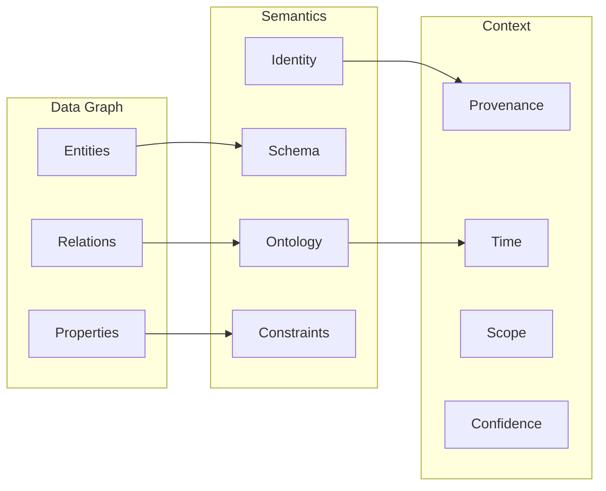

# Chương 1 — Từ Đồ thị đến Tri thức

> **Định hướng chương**
>
> **Câu hỏi trung tâm:** Điều gì biến một đồ thị dữ liệu thành tri thức mà máy có thể
> biểu diễn, truy vấn, suy luận, kiểm chứng và sử dụng?
>
> **Vì sao quan trọng:** Trước khi xây bất kỳ hệ thống tri thức nào, bạn cần một mô hình
> tinh thần để phân biệt "có cấu trúc đồ thị" với "có tri thức". Nếu không, bạn sẽ dễ nhầm
> một cơ sở dữ liệu đồ thị lớn với một hệ thống tri thức thực sự.
>
> **Bạn sẽ hiểu:**
>
> - Đồ thị, bộ ba, thực thể, quan hệ
> - Sự khác nhau giữa đồ thị dữ liệu, phân loại (taxonomy), bản thể học (ontology)
> - Định nghĩa tối thiểu của Đồ thị Tri thức (Knowledge Graph)
> - Mô hình kỹ thuật của sách: *Knowledge Graph = Data Graph + Semantics + Context*
> - Vì sao nhãn (label) đơn thuần chưa phải là ý nghĩa
>
> **Tiên quyết:** Không có. Đây là chương nền tảng.
>
> **Bản đồ khái niệm:**
>
> Đồ thị cấu trúc → Nhãn có ý nghĩa → Lược đồ / Bản thể học → Định danh → Ngữ cảnh →
> Suy luận

## 1.1 Mở đầu: Khi dữ liệu cần được "hiểu"

Trong thực tế kỹ thuật, chúng ta thường xuyên làm việc với dữ liệu có cấu trúc quan hệ:
bảng trong cơ sở dữ liệu, JSON lồng nhau, hoặc các API trả về danh sách đối tượng liên
kết. Tuy nhiên, khi hệ thống cần *hiểu* ý nghĩa của các mối quan hệ — chứ không chỉ lưu
trữ và truy xuất — mô hình dữ liệu thông thường bộc lộ giới hạn.

Chương này trả lời câu hỏi nền tảng: **Điều gì biến một đồ thị dữ liệu thành tri thức mà
máy có thể biểu diễn, truy vấn, suy luận, kiểm chứng, cập nhật và sử dụng?**

Chúng ta bắt đầu từ khái niệm đồ thị thuần túy, tiến dần qua đồ thị dữ liệu, phân loại
(taxonomy), bản thể học (ontology), và cuối cùng là Đồ thị Tri thức (Knowledge Graph).
Mỗi bước được minh họa bằng một thí nghiệm trong kho mã đồng hành để bạn tự kiểm chứng
sự khác biệt; tuy nhiên, lập luận chính của chương có thể đọc trọn vẹn mà không cần chạy
bất kỳ dòng mã nào.

> **Lưu ý quan trọng:** Mô hình tinh thần "Knowledge Graph = Data Graph + Semantics +
> Context" được giới thiệu trong chương này là một **mô hình học tập dành cho kỹ sư**,
> KHÔNG phải là định nghĩa hình thức được chấp nhận rộng rãi trong giới học thuật. Nó giúp
> phân tách các lớp trách nhiệm khi thiết kế hệ thống tri thức, nhưng không thay thế các
> định nghĩa chuẩn từ **W3C** (World Wide Web Consortium — tổ chức phát triển chuẩn web) hay tài liệu nghiên cứu chuyên ngành.

## 1.2 Mô hình tinh thần

> 📦 **Preview — Ba thuật ngữ chuẩn sẽ gặp trong chương này**
>
> Chương này nhắc đến một số thuật ngữ từ thế giới chuẩn web. Đây là bản giới thiệu ngắn:
>
> - **W3C** (World Wide Web Consortium): tổ chức phát triển chuẩn web, bao gồm các chuẩn RDF và OWL.
> - **RDF** (Resource Description Framework): mô hình dữ liệu đồ thị bộ ba chuẩn của W3C. Sẽ học chi tiết ở Chương 2.
> - **IRI** (Internationalized Resource Identifier): định danh toàn cục dạng chuỗi, dùng để đặt tên cho entity trong RDF. Sẽ học chi tiết ở Chương 2.
>
> Các thuật ngữ khác như RDFS, OWL, SHACL, SPARQL sẽ được giới thiệu khi chúng xuất hiện lần đầu ở các chương tương ứng. Bạn không cần nhớ trước.

### Knowledge Graph = Data Graph + Semantics + Context



Hình: Ba lớp Data Graph, Semantics và Context. Mỗi lớp trả lời một nhóm câu hỏi khác nhau
về cùng một đồ thị.

Ba lớp này giải quyết ba vấn đề khác nhau:

1. **Data Graph** trả lời: "Có những nút và cạnh nào?"
2. **Semantics** trả lời: "Các nút và cạnh đó *nghĩa là gì*? Chúng tuân theo quy tắc nào?"
3. **Context** trả lời: "Thông tin này đến từ đâu? Khi nào đúng? Trong phạm vi nào? Đáng
   tin đến mức nào?"

Trong mô hình kỹ thuật của sách, Data Graph cung cấp cấu trúc, Semantics cung cấp ý nghĩa
cho máy, và Context hỗ trợ đánh giá độ tin cậy cũng như khả năng kiểm toán. Đây là các lớp
năng lực bổ sung, không phải điều kiện tiên quyết để một đồ thị được gọi là Knowledge
Graph theo định nghĩa tối thiểu [@stanford-cs520-what-is-kg].

### Vì sao không phải mọi đồ thị đều là Knowledge Graph?

Xét hai trường hợp:

- **Trường hợp A**: Một đồ thị chứa `(Alice) --[:KNOWS]--> (Bob)` nhưng không định nghĩa
  `:KNOWS` nghĩa là gì, không có schema, không có nguồn gốc. Đây là data graph.
- **Trường hợp B**: Cùng đồ thị trên, nhưng `:KNOWS` được định nghĩa là quan hệ xã hội hai
  chiều giữa hai Person, có ngữ nghĩa **RDFS** (RDF Schema — từ vựng và ngữ nghĩa bổ sung cho RDF, cung cấp các khái niệm lớp, quan hệ cha-con, domain/range để suy diễn kiểu; sẽ học chi tiết ở Chương 2) (**domain** (miền: loại thực thể làm chủ thể) và **range** (phạm vi: loại thực thể làm đối tượng) dùng để suy diễn kiểu), có
  timestamp, có nguồn trích dẫn. Đây là knowledge graph.

Sự khác biệt nằm ở semantics và context, không nằm ở cấu trúc đồ thị.

## 1.3 Khái niệm cốt lõi

**Graph (Đồ thị).** Một đồ thị G = (V, E) gồm tập đỉnh V và tập cạnh E ⊆ V × V. Trong ngữ
cảnh Knowledge Graph, chúng ta chủ yếu làm việc với **đồ thị có hướng, có nhãn** (directed
labeled graph): mỗi cạnh có tên/nhãn xác định loại quan hệ.

**Triple (Bộ ba).** Đơn vị cơ bản nhất của biểu diễn tri thức dạng đồ thị:
`(subject, predicate, object)`. Ví dụ: `(Hanoi, isCapitalOf, Vietnam)`. Mỗi triple tương
ứng với một cạnh có nhãn trong đồ thị.

**Entity (Thực thể).** Một đối tượng trong thế giới thực hoặc miền vấn đề. Khi biểu diễn
entity trong đồ thị tri thức, cần phân biệt rõ bốn tầng:

1. **Real-world entity**: Đối tượng thực tế (thành phố Hà Nội, con người Nguyễn Văn A).
2. **Graph node**: Nút trong đồ thị đại diện cho entity đó.
3. **Identifier**: Tên/IRI dùng để tham chiếu node (ví dụ: `ex:Hanoi`).
4. **Label**: Chuỗi hiển thị cho con người đọc (ví dụ: "Hà Nội").

Bốn tầng này **không phải là một**. Cùng một real-world entity có thể được biểu diễn bằng
nhiều graph node khác nhau trong các hệ thống khác nhau, mỗi node có identifier riêng và
label riêng. Ngược lại, hai identifier khác nhau có thể cùng trỏ đến một entity — đây chính
là vấn đề **entity resolution** (phân giải thực thể, sẽ học ở Chương 3).

> ⚠ **Ngộ nhận phổ biến:** Nhầm lẫn identifier với entity. `ex:Hanoi` là một chuỗi ký tự
> dùng làm định danh; nó không *là* thành phố Hà Nội. Khi hệ thống nói "`ex:Hanoi` là thủ
> đô của `ex:Vietnam`", nó đang nói về các ký hiệu trong đồ thị, không trực tiếp về thực
> tế. Sự kết nối giữa ký hiệu và thực tế nằm ở semantics và context, không nằm ở bản thân
> identifier.

> 🖊 **Tự kiểm tra:** Nếu hai hệ thống khác nhau đều có node mang label "Hà Nội" nhưng dùng
> identifier khác nhau (`ex:Hanoi` vs `wd:Q1858`), chúng có đang nói về cùng một entity
> không? Làm sao bạn biết? Thông tin nào ngoài label và identifier sẽ giúp trả lời câu hỏi
> này?

**Relation (Quan hệ).** Mối liên hệ giữa hai entity, được biểu diễn bằng cạnh có nhãn. Quan
hệ mang semantics: `isCapitalOf` khác `isLocatedIn` dù cả hai đều nối hai địa danh.

**Data Graph (Đồ thị dữ liệu).** Tập hợp các entity, relation, và property mà KHÔNG có định
nghĩa hình thức về ý nghĩa. Data graph trả lời được "có gì" nhưng không trả lời được
"nghĩa là gì".

**Taxonomy (Phân loại).** Hệ thống phân cấp các khái niệm dựa trên quan hệ cha-con
(subclass/superclass). Taxonomy thêm cấu trúc phân cấp vào data graph. Trong mô hình kỹ
thuật của sách, taxonomy là một trong nhiều lớp năng lực có thể kết hợp; bản thân taxonomy
vẫn là một dạng đồ thị tri thức theo định nghĩa tối thiểu [@stanford-cs520-what-is-kg].

**Ontology (Bản thể học).** Định nghĩa hình thức các khái niệm, quan hệ, ràng buộc, và tiên
đề trong một miền tri thức. Ontology cung cấp semantics mà data graph và taxonomy thiếu.

**Knowledge Graph (Đồ thị Tri thức).** Có hai cách tiếp cận cần phân biệt:

- *Định nghĩa học thuật (tối thiểu):* Theo Stanford CS520 [@stanford-cs520-what-is-kg],
  một knowledge graph là **đồ thị có hướng có nhãn** trong đó các nhãn mang ngữ nghĩa được
  định nghĩa rõ ràng. Một cách hình thức tối thiểu: cho tập đỉnh N và tập nhãn L, knowledge
  graph là một tập con của N × L × N — tức là một tập các bộ ba có hướng. Các định nghĩa
  khác nhau tồn tại trong tài liệu nghiên cứu [@hogan-knowledge-graphs]; không có một định
  nghĩa duy nhất được chấp nhận rộng rãi.
- *Mô hình kỹ thuật của sách:* Để phục vụ thiết kế hệ thống tri thức trong thực tế, sách
  dùng mô hình phân tách **Knowledge Graph = Data Graph + Semantics + Context**, trong đó
  Data Graph gồm entities/relations/properties; Semantics gồm schema/ontology/identity/
  constraints; Context gồm provenance/time/scope/confidence. Đây là **mô hình học tập dành
  cho kỹ sư**, không phải định nghĩa phổ quát. Nó trả lời câu hỏi: "Những khả năng bổ sung
  nào chúng ta muốn hệ thống tri thức dựa trên đồ thị mang lại?"

## 1.4 Cơ chế

Cơ chế cốt lõi của chương là **sự bổ sung tuần tự các lớp năng lực lên cấu trúc đồ thị**.
Đây không phải là thang bậc trưởng thành cứng nhắc (một data graph vẫn có thể là knowledge
graph theo nghĩa học thuật), mà là mô hình tích lũy các khả năng kỹ thuật:

```
Graph Structure (đỉnh + cạnh)
  + Semantic Commitments (nhãn có ý nghĩa)
    + Schema/Ontology (định nghĩa hình thức, domain/range, subclass)
      + Identity (IRI bền vững, entity resolution, sameAs)
        + Context/Provenance (nguồn, thời gian, phạm vi, độ tin cậy)
          + Constraints/Validation (**SHACL** (Shapes Constraint Language — ngôn ngữ ràng buộc dữ liệu RDF, sẽ học ở Chương 5) shapes, **cardinality** (số lượng giá trị được phép của một quan hệ/thuộc tính))
            + Inference Capabilities (**entailment** (suy diễn logic: kết luận mới được suy ra từ các tiên đề), rules, reasoning)
```

Mỗi lớp bổ sung giải quyết một giới hạn cụ thể của lớp trước:

- Semantic commitments phân biệt được loại quan hệ (thay vì nhãn tùy ý).
- Schema/ontology cho phép máy hiểu ý nghĩa và suy diễn kiểu.
- Identity giải quyết vấn đề cùng một entity có nhiều tên/biểu diễn.
- Context/provenance cho phép quản lý tri thức trong thực tế (nguồn gốc, thời gian, độ tin
  cậy).
- Constraints/validation phát hiện dữ liệu không phù hợp với chính sách đã định.
- Inference capabilities tạo ra tri thức mới từ tri thức hiện có.

Lưu ý: các lớp này **không loại trừ lẫn nhau**. Một hệ thống có thể có inference mà chưa có
validation đầy đủ, hoặc có context mà chưa có ontology hình thức.

> 🖊 **Tự kiểm tra:** Chọn một hệ thống đồ thị bạn đã từng làm việc (cơ sở dữ liệu quan hệ,
> API REST, file JSON, v.v.). Nó thuộc lớp nào trong mô hình trên? Lớp nào còn thiếu để nó
> trở thành Knowledge Graph theo mô hình kỹ thuật của sách? Giải thích tại sao lớp thiếu đó
> lại quan trọng.

## 1.5 Mô hình hình thức

> ⚠ Ký hiệu dưới đây do cuốn sách này định nghĩa cho mục đích học tập. Nó không phải là
> ký hiệu chuẩn từ W3C hay tài liệu học thuật.

> 📐 **Toán học tối thiểu cho chương này**
>
> - **Tập hợp (set):** Một tập hợp S là một bộ sưu tập các phần tử phân biệt. Ký hiệu x ∈ S
>   nghĩa là "x thuộc S". Ví dụ: V = {Hanoi, Vietnam} là tập gồm hai phần tử.
> - **Tích Descartes (Cartesian product):** A × B là tập tất cả các cặp có thứ tự (a, b) với
>   a ∈ A và b ∈ B. Ví dụ: nếu V = {Hanoi, Vietnam} thì V × V chứa (Hanoi, Hanoi),
>   (Hanoi, Vietnam), (Vietnam, Hanoi), (Vietnam, Vietnam).
> - **Tập con (subset):** A ⊆ B nghĩa là mọi phần tử của A đều thuộc B.
> - **Hàm (function):** f: A → B gán mỗi phần tử của A đúng một phần tử của B.
>
> Bạn chỉ cần hiểu bốn khái niệm trên để theo dõi toàn bộ mô hình hình thức trong chương này.

### Vì sao không dùng G = (V, E, λ)?

Một cách tiếp cận phổ biến trong lý thuyết đồ thị là mô hình **labeled directed graph**
G = (V, E, λ) với E ⊆ V × V và hàm gán nhãn λ: E → L. Tuy nhiên, mô hình này có một giới
hạn quan trọng đối với Knowledge Graph: giữa cùng hai đỉnh, chỉ có **một** cạnh duy nhất
trong E (vì E là tập hợp các cặp), nên chỉ gán được **một** nhãn. Trong thực tế, hai thực
thể thường có nhiều mối quan hệ đồng thời:

```
(Hanoi, locatedIn, Vietnam)
(Hanoi, capitalOf, Vietnam)
```

Để biểu diễn cả hai triple trên bằng G = (V, E, λ), ta cần hai cạnh khác nhau giữa cùng
cặp đỉnh — nhưng E ⊆ V × V không cho phép điều này.

### Mô hình triple trực tiếp

Thay vì đi qua cấu trúc cạnh trung gian, chúng ta định nghĩa Knowledge Graph **trực tiếp**
dưới dạng tập các bộ ba:

Cho tập đỉnh V (entities) và tập nhãn L (predicates/relations):

$$K \subseteq V \times L \times V$$

Mỗi phần tử (s, p, o) ∈ K là một **triple**, trong đó s là subject (chủ thể), p là predicate
(vị từ/nhãn quan hệ), và o là object (đối tượng).

**Ví dụ cụ thể:** Với V = {Hanoi, Vietnam} và L = {locatedIn, capitalOf}:

$$K = \{(Hanoi,\; locatedIn,\; Vietnam),\;\; (Hanoi,\; capitalOf,\; Vietnam)\}$$

Hai triple cùng chia sẻ subject và object nhưng khác predicate — điều mà G = (V, E, λ) không
biểu diễn được một cách tự nhiên.

> 🖊 **Tự kiểm tra:** Tại sao mô hình K ⊆ V × L × V phù hợp hơn G = (V, E, λ) cho Knowledge
> Graph? Hãy giải thích bằng cách đưa ra một ví dụ cụ thể mà G = (V, E, λ) gặp khó khăn.

**Data Graph**: K với các nhãn tùy ý, không có ràng buộc ngữ nghĩa bổ sung.

**Taxonomy**: Data Graph + tập khái niệm C ⊆ V và quan hệ phân cấp ⊑ ⊆ C × C (subclassOf).
Trong mô hình đơn giản hóa của sách, ⊑ được xem như một partial order trên C (phản xạ, bắc
cầu, phản đối xứng). Lưu ý: ngữ nghĩa RDFS chuẩn của `rdfs:subClassOf` chỉ yêu cầu tính phản
xạ và bắc cầu, không đảm bảo phản đối xứng; do đó mô hình partial-order ở đây là một ràng
buộc bổ sung của sách, không phải ngữ nghĩa RDFS đầy đủ. Khi hai lớp A và B thỏa mãn cả
A ⊑ B lẫn B ⊑ A, theo **OWL** (Web Ontology Language — ngôn ngữ bản thể học chuẩn W3C cho biểu diễn các tiên đề logic về lớp, thuộc tính và cá thể; sẽ học chi tiết ở Chương 4) chúng được coi là **equivalent classes** (lớp tương đương, sẽ học
ở Chương 4) — tức là chúng có cùng tập thành viên trong mọi mô hình hợp lệ.

**Ontology** (theo nghĩa RDFS và OWL): Tập tiên đề T bao gồm các khai báo domain, range,
subclass (do RDFS cung cấp), cùng equivalence, disjointness, property characteristics và class
restrictions (do OWL bổ sung). Ngữ nghĩa được xác định bởi formal semantics và entailment
relations của từng chuẩn, không phải bởi constraint checking.

**Book Engineering Model** (ký hiệu riêng của sách): KSE = (K, T, C) trong đó K ⊆ V × L × V
là tập triple, T là tập tiên đề ontology và C là thông tin context (provenance, time, scope,
confidence). Ký hiệu này do sách định nghĩa, không phải chuẩn công nghiệp.

## 1.6 Ví dụ xuyên suốt

Xét miền tri thức về các thành phố và quốc gia — miền sẽ theo ta qua nhiều chương.

**Bước 1 — Plain Graph:**

```
Node A --- Node B --- Node C
```

Không có nhãn, không có ý nghĩa.

**Bước 2 — Data Graph:**

```
(Hanoi) --[:LOCATED_IN]--> (Vietnam)
(Hanoi) --[:HAS_POPULATION]--> (8000000)
```

Có nhãn, nhưng `:LOCATED_IN` nghĩa là gì? Có khác `:CAPITAL_OF` không? Máy không biết.

**Bước 3 — Taxonomy:**

```
City    là subclass của Place
Country là subclass của Place
Capital là subclass của City
```

Máy biết Capital là một loại City, City là một loại Place. Nhưng vẫn chưa biết
`:LOCATED_IN` áp dụng cho loại nào.

> ⚠ Ở đây chúng ta dùng ký hiệu khái niệm ("là subclass của") thay vì cú pháp cụ thể. Cú
> pháp biểu diễn thực tế (ví dụ: `rdfs:subClassOf` trong RDF/Turtle) sẽ được học ở Chương 2.
> Điều quan trọng ở bước này là **ý nghĩa phân cấp**, không phải cách viết.

**Bước 4 — Ontology:**

```
Quan hệ locatedIn:
  - domain (miền chủ thể): Place
  - range (phạm vi đối tượng): Place

Quan hệ capitalOf:
  - domain: City
  - range: Country
```

Máy biết `capitalOf` có domain là City và range là Country. Theo ngữ nghĩa RDFS (suy diễn,
không phải kiểm tra ràng buộc), nếu xuất hiện triple `(Vietnam) --[:capitalOf]--> (Hanoi)`,
máy sẽ **suy ra** rằng Vietnam thuộc lớp City và Hanoi thuộc lớp Country — ngay cả khi điều
này mâu thuẫn với thực tế. RDFS domain/range thêm thông tin kiểu, chúng không từ chối hay
báo lỗi dữ liệu "sai".

> ⚠ **Phân biệt quan trọng:** Suy diễn theo formal semantics (`statement → entailment`) khác với xác nhận
> ràng buộc SHACL (`data → constraint check → conforms/violation`). Việc phát hiện và từ chối
> dữ liệu không phù hợp thuộc về validation (Chương 5), không phải ngữ nghĩa RDFS tiêu chuẩn.

**Bước 5 — Knowledge Graph (thêm Context):**

```
(Hanoi) --[:capitalOf {source: wikidata, validFrom: 1976}]--> (Vietnam)
```

Máy biết tuyên bố này đến từ Wikidata, đúng từ năm 1976. Nếu có tuyên bố mâu thuẫn từ nguồn
khác, hệ thống có thể so sánh và đánh giá.

## 1.7 Các thiết kế thay thế

**Property Graph thay vì RDF.** Property graph (như Neo4j) gộp property trực tiếp vào
node/edge thay vì dùng triple riêng. Ưu điểm: trực quan, mô hình dữ liệu gần với cách lập
trình viên thường nghĩ về đồ thị. Nhược điểm: semantics phụ thuộc vào ứng dụng, không có
formal semantics và entailment relations chuẩn như RDF/RDFS/OWL. Chương 2 sẽ so sánh chi tiết.

**Schema-less Knowledge Graph.** Một số hệ thống (Wikidata) cho phép thêm statement mà không
cần ontology đầy đủ trước. Ưu điểm: linh hoạt, cộng đồng đóng góp dễ dàng. Nhược điểm: chất
lượng không đồng đều, khó suy diễn tự động. Wikidata giải quyết bằng
qualifiers/references/ranks thay vì OWL axioms.

**Embedding-based "Knowledge".** Graph embeddings biểu diễn entity/relation dưới dạng vector
trong không gian liên tục. Có thể dự đoán quan hệ mới nhưng kết quả là xác suất, không phải
entailment. Chương 8 sẽ phân biệt rõ induction vs deduction.

## 1.8 Những ngộ nhận thường gặp

**Sai lầm 1: "Neo4j = Knowledge Graph".** Neo4j là một property graph database. Nó lưu trữ và
truy vấn đồ thị hiệu quả, nhưng bản thân nó không cung cấp semantics. KG yêu cầu thêm schema,
ontology, hoặc ít nhất là convention có tài liệu.

**Sai lầm 2: "Nhiều node/cạnh hơn = nhiều tri thức hơn".** Tri thức nằm ở semantics và context,
không nằm ở kích thước đồ thị. Một đồ thị nhỏ với ontology chặt chẽ và provenance rõ ràng chứa
nhiều tri thức hữu ích hơn một đồ thị lớn không có ý nghĩa.

**Sai lầm 3: "Ontology phải hoàn chỉnh trước khi xây dựng KG".** KG là hệ thống sống. Ontology
có thể tiến hóa cùng dữ liệu. Bắt đầu với taxonomy đơn giản, mở rộng dần khi nhu cầu suy diễn
phát sinh.

**Sai lầm 4: "Triple = Fact".** Trong RDF, một triple trong đồ thị là một **assertion** (tuyên
bố) — nó khẳng định rằng mệnh đề đó đúng trong ngữ cảnh của đồ thị. Tuy nhiên, assertion ≠
accepted knowledge trong hệ thống tri thức thực tế. Phân biệt hai cấp độ:

- **Representation semantics** (RDF): Triple trong graph = asserted proposition. RDF không
  phân biệt "tin" hay "không tin" — nếu triple có mặt, nó được assert.
- **Epistemic governance policy** (hệ thống tri thức của chúng ta): Khi nào hệ thống CHỌN
  promote một assertion thành accepted knowledge? Điều này phụ thuộc vào provenance,
  validation, confidence, và chính sách của hệ thống.

Chương 6 sẽ phân tích sâu sự phân biệt: Observation ≠ Assertion ≠ Claim ≠ Evidence ≠ Accepted
Knowledge.

## 1.9 Thí nghiệm đồng hành

Các thí nghiệm của chương nằm trong kho mã đồng hành (`chapter01/`), cho phép bạn tự kiểm
chứng từng bước chuyển từ plain graph đến knowledge graph. Chúng là phần bổ trợ; lập luận
chính của chương đứng vững độc lập với chúng. Trong phiên bản sách v0.1, các thí nghiệm này
đã hoàn tất và chạy được; trạng thái chi tiết xem `docs/EXPERIMENT_STATUS.md`.

| Thí nghiệm | Độ khó | Nội dung |
|------------|--------|----------|
| 1-1 | ★ | Plain graph không ngữ nghĩa |
| 1-2 | ★ | Data graph vs taxonomy |
| 1-3 | ★★ | Chuyển đổi tiệm tiến thành KG (miền sister-city) |
| 1-4 | ★★ | Data graph → KG đơn giản với suy luận **forward-chaining** (suy diễn theo chiều thuận: từ luật và dữ liệu suy ra kết luận mới) |
| 1-5 | ★★★ | Định nghĩa ngữ nghĩa của một quan hệ (đối xứng, bắc cầu, nghịch đảo) |

## 1.10 Câu hỏi suy ngẫm

1. (★) Cho đồ thị `(A)--[R]-->(B)` và `(C)--[R]-->(D)` với cùng nhãn R. Nếu không có
   ontology, bạn có thể khẳng định R có cùng ý nghĩa trong cả hai trường hợp không? Giải thích.
2. (★★) Hai đồ thị chứa cùng tập triples nhưng dùng IRI khác nhau cho cùng một thực thể thế
   giới thực. Chúng có biểu diễn cùng tri thức không? Cần thêm giả định gì để khẳng định "có"?
3. (★★) Wikidata cho phép bất kỳ ai thêm statement mà không cần ontology approval. Điều này
   ảnh hưởng thế nào đến khả năng suy diễn tự động? Wikidata bù đắp bằng cơ chế nào?
4. (★★★) Giả sử bạn thiết kế KG cho một hệ thống AI agent cần đưa ra quyết định y khoa. Lớp
   Context cần chứa những thông tin gì mà lớp Semantics không cung cấp được? Tại sao chỉ
   Semantics là không đủ?

## 1.11 Chúng ta đã biết gì

- Đồ thị là cấu trúc dữ liệu; Knowledge Graph là cấu trúc tri thức.
- Sự khác biệt nằm ở ba lớp: Data Graph, Semantics, Context.
- Mô hình "KG = Data Graph + Semantics + Context" là công cụ học tập cho kỹ sư, không phải
  định nghĩa chuẩn.
- Ontology cung cấp formal semantics; context cung cấp provenance, time, confidence.
- Không phải mọi đồ thị đều là KG; nhãn đơn thuần chưa phải là ý nghĩa.

## 1.12 Chúng ta chưa làm được gì

- Biểu diễn và truy vấn đồ thị bằng ngôn ngữ chuẩn (cần RDF/**SPARQL** (Simple Protocol and RDF Query Language — ngôn ngữ truy vấn RDF, sẽ học ở Chương 2) hoặc **Cypher** (ngôn ngữ truy vấn đồ thị thuộc tính, sẽ học ở Chương 2)).
- Phân biệt rõ ràng giữa RDF và Property Graph trong thực hành.
- Xử lý identity resolution khi cùng một entity có nhiều tên/IRI.
- Biểu diễn **n-ary relations** (quan hệ có nhiều hơn hai thành phần, hoặc quan hệ cần mang thêm thuộc tính) vượt quá binary triples.
- Quản lý **named graphs** (đồ thị có tên, cho phép gom nhóm phát biểu theo ngữ cảnh) và contextual statements.

Những giới hạn này dẫn trực tiếp đến **Chương 2: Mô hình Dữ liệu và Ngôn ngữ Truy vấn**.


## Thuật ngữ đã gặp trong chương này

| Thuật ngữ | Nghĩa ngắn | Học chi tiết |
|-----------|-----------|--------------|
| Entity (thực thể) | Đối tượng trong thế giới thực hoặc miền vấn đề | §1.3 |
| Relation (quan hệ) | Mối liên hệ giữa hai entity | §1.3 |
| Triple (bộ ba) | Đơn vị cơ bản: (subject, predicate, object) | §1.3 |
| Data Graph (đồ thị dữ liệu) | Tập hợp entity/relation/property chưa có nghĩa hình thức | §1.3 |
| Taxonomy (phân loại) | Hệ thống phân cấp subclass/superclass | §1.3 |
| Ontology (bản thể học) | Định nghĩa hình thức khái niệm, quan hệ, ràng buộc | §1.3 |
| Knowledge Graph (đồ thị tri thức) | Đồ thị có hướng có nhãn mang ngữ nghĩa | §1.3 |
| W3C (World Wide Web Consortium) | Tổ chức phát triển chuẩn web | Preview box §1.2 |
| RDF (Resource Description Framework) | Mô hình dữ liệu đồ thị bộ ba chuẩn | Chương 2 |
| IRI (Internationalized Resource Identifier) | Định danh toàn cục dạng chuỗi | Chương 2 |
| RDFS (RDF Schema) | Từ vựng và ngữ nghĩa bổ sung cho RDF (lớp, subclass, domain/range) | Chương 2 |
| OWL (Web Ontology Language) | Ngôn ngữ bản thể học chuẩn W3C | Chương 4 |
| SHACL (Shapes Constraint Language) | Ngôn ngữ ràng buộc dữ liệu RDF | Chương 5 |
| SPARQL (Simple Protocol and RDF Query Language) | Ngôn ngữ truy vấn RDF | Chương 2 |
| Cypher | Ngôn ngữ truy vấn đồ thị thuộc tính | Chương 2 |
| Schema (lược đồ) | Mô tả cấu trúc và từ vựng được kỳ vọng | §1.2, Chương 3 |
| Provenance (nguồn gốc) | Ai/đâu/bằng cách nào tạo ra phát biểu | §1.4, Chương 6 |
| Entailment (suy diễn logic) | Kết luận mới suy ra từ tiên đề | §1.4, Chương 4 |
| Domain / Range | Miền chủ thể / Phạm vi đối tượng của quan hệ | §1.3, Chương 3 |
| Cardinality (số lượng) | Số giá trị được phép của quan hệ/thuộc tính | §1.4 |
| Forward-chaining | Suy diễn theo chiều thuận | Thí nghiệm 1-4 |
| N-ary relation | Quan hệ nhiều ngôi hoặc cần thuộc tính bổ sung | §1.12, Chương 3 |
| Named graph | Đồ thị có tên để gom nhóm theo ngữ cảnh | §1.12, Chương 3 |
| Partial order | Quan hệ thứ tự bộ phận (phản xạ, bắc cầu, phản đối xứng) | §1.5 |

## Đọc thêm

- What is a Knowledge Graph? [@stanford-cs520-what-is-kg] — định nghĩa tối thiểu và trực giác.
- Hogan et al., *Knowledge Graphs* [@hogan-knowledge-graphs] — cái nhìn tổng quan nghiên cứu.
- RDF 1.1 Concepts and Abstract Syntax [@w3c-rdf11-concepts] — mô hình dữ liệu chuẩn.
- RDF 1.2 Concepts and Abstract Data Model [@w3c-rdf12-concepts] — phát triển hiện tại (emerging).
