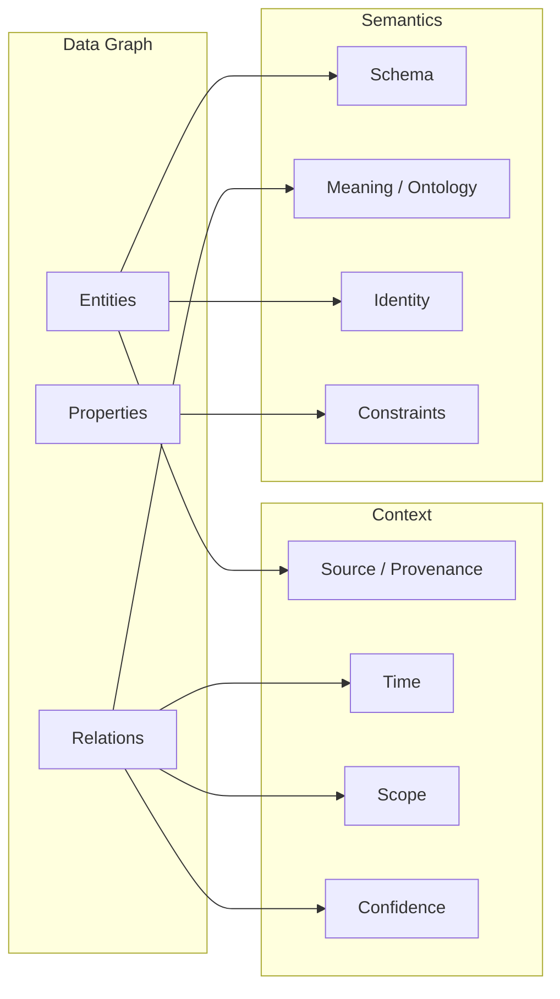

# Chapter 1: Từ Đồ thị đến Tri thức

## Motivation

Trong thực tế kỹ thuật, chúng ta thường xuyên làm việc với dữ liệu có cấu trúc quan hệ: bảng trong cơ sở dữ liệu, JSON lồng nhau, hoặc các API trả về danh sách đối tượng liên kết. Tuy nhiên, khi hệ thống cần *hiểu* ý nghĩa của các mối quan hệ — không chỉ lưu trữ và truy xuất — mô hình dữ liệu thông thường bộc lộ giới hạn.

Chương này trả lời câu hỏi nền tảng: **Điều gì biến một đồ thị dữ liệu thành tri thức mà máy có thể biểu diễn, truy vấn, suy luận, kiểm chứng, cập nhật và sử dụng?**

Chúng ta bắt đầu từ khái niệm đồ thị thuần túy, tiến dần qua đồ thị dữ liệu, phân loại (taxonomy), bản thể học (ontology), và cuối cùng là Đồ thị Tri thức (Knowledge Graph). Mỗi bước đều đi kèm thí nghiệm chạy được để người đọc tự kiểm chứng sự khác biệt.

> **Lưu ý quan trọng:** Mô hình tinh thần "Knowledge Graph = Data Graph + Semantics + Context" được giới thiệu trong chương này là một **mô hình học tập dành cho kỹ sư**, KHÔNG phải là định nghĩa hình thức được chấp nhận rộng rãi trong giới học thuật. Nó giúp phân tách các lớp trách nhiệm khi thiết kế hệ thống tri thức, nhưng không thay thế các định nghĩa chuẩn từ W3C hay tài liệu nghiên cứu chuyên ngành.

## Mental Model

### Mô hình 1: Knowledge Graph = Data Graph + Semantics + Context



Ba lớp này giải quyết ba vấn đề khác nhau:

1. **Data Graph** trả lời: "Có những nút và cạnh nào?"
2. **Semantics** trả lời: "Các nút và cạnh đó *nghĩa là gì*? Chúng tuân theo quy tắc nào?"
3. **Context** trả lời: "Thông tin này đến từ đâu? Khi nào đúng? Trong phạm vi nào? Đáng tin đến mức nào?"

Một đồ thị chỉ có Data Graph là một cấu trúc dữ liệu. Thêm Semantics, nó trở nên có ý nghĩa với máy. Thêm Context, nó trở nên đáng tin cậy và có thể quản lý được trong thực tế.

### Tại sao không phải mọi đồ thị đều là Knowledge Graph?

Xét hai trường hợp:

- **Trường hợp A**: Một đồ thị chứa `(Alice) --[:KNOWS]--> (Bob)` nhưng không định nghĩa `:KNOWS` nghĩa là gì, không có schema, không có nguồn gốc. Đây là data graph.
- **Trường hợp B**: Cùng đồ thị trên, nhưng `:KNOWS` được định nghĩa là quan hệ xã hội hai chiều giữa hai Person, có domain/range ràng buộc, có timestamp, có nguồn trích dẫn từ LinkedIn API. Đây là knowledge graph.

Sự khác biệt nằm ở semantics và context, không nằm ở cấu trúc đồ thị.

## Core Concepts

### Graph (Đồ thị)

Một đồ thị G = (V, E) gồm tập đỉnh V và tập cạnh E ⊆ V × V. Trong ngữ cảnh Knowledge Graph, chúng ta chủ yếu làm việc với **đồ thị có hướng, có nhãn** (directed labeled graph): mỗi cạnh có tên/nhãn xác định loại quan hệ.

### Triple (Bộ ba)

Đơn vị cơ bản nhất của biểu diễn tri thức dạng đồ thị: `(subject, predicate, object)`. Ví dụ: `(Hanoi, isCapitalOf, Vietnam)`. Mỗi triple tương ứng với một cạnh có nhãn trong đồ thị.

### Entity (Thực thể)

Một đối tượng trong thế giới thực hoặc miền vấn đề được biểu diễn bằng một nút trong đồ thị. Entity có identity (danh tính) — thường là IRI trong RDF hoặc node ID trong property graph.

### Relation (Quan hệ)

Mối liên hệ giữa hai entity, được biểu diễn bằng cạnh có nhãn. Quan hệ mang semantics: `isCapitalOf` khác `isLocatedIn` dù cả hai đều nối hai địa danh.

### Data Graph (Đồ thị dữ liệu)

Tập hợp các entity, relation, và property mà KHÔNG có định nghĩa hình thức về ý nghĩa. Data graph trả lời được "có gì" nhưng không trả lời được "nghĩa là gì".

### Taxonomy (Phân loại)

Hệ thống phân cấp các khái niệm dựa trên quan hệ cha-con (subclass/superclass). Taxonomy thêm cấu trúc vào data graph nhưng chưa đủ để tạo ra KG vì thiếu ràng buộc và ngữ nghĩa đầy đủ.

### Ontology (Bản thể học)

Định nghĩa hình thức các khái niệm, quan hệ, ràng buộc, và tiên đề trong một miền tri thức. Ontology cung cấp semantics mà data graph và taxonomy thiếu.

### Knowledge Graph (Đồ thị Tri thức)

Data graph + semantics (schema, ontology, identity, constraints) + context (provenance, time, scope, confidence). KG cho phép máy không chỉ lưu trữ mà còn suy luận, kiểm chứng, và tiến hóa tri thức.

## Mechanism

Cơ chế cốt lõi của chương này là **sự bổ sung tuần tự các lớp ý nghĩa lên đồ thị dữ liệu**:

```
Plain Graph → Data Graph → Taxonomy → Ontology → Knowledge Graph
     ↑              ↑           ↑          ↑            ↑
  Structure      Labels     Hierarchy   Semantics    Context
```

Mỗi bước chuyển tiếp giải quyết một giới hạn cụ thể của bước trước:
- Data Graph thêm labels vào plain graph → phân biệt được loại quan hệ
- Taxonomy thêm hierarchy vào data graph → tổ chức được khái niệm
- Ontology thêm formal semantics vào taxonomy → máy hiểu được ý nghĩa và ràng buộc
- Context thêm provenance/time/confidence vào ontology-backed graph → quản lý được tri thức trong thực tế

## Formal Model

Gọi G = (V, E, L_V, L_E) là đồ thị có nhãn, trong đó:
- V là tập đỉnh (entities)
- E ⊆ V × L_E × V là tập cạnh có nhãn (relations)
- L_V: V → Σ_V là hàm gán nhãn cho đỉnh
- L_E: E → Σ_E là hàm gán nhãn cho cạnh

**Data Graph** = G với L_V, L_E tùy ý, không có ràng buộc.

**Taxonomy** = Data Graph + quan hệ ≤_sub trên L_V sao cho ≤_sub là partial order (phản xạ, phản đối xứng, bắc cầu).

**Ontology** = Taxonomy + tập tiên đề A (axioms) bao gồm domain/range constraints, equivalence, disjointness, cardinality.

**Knowledge Graph** = (G, O, C) trong đó O là ontology và C là hàm context: C: (V ∪ E) → P(Provenance × Time × Scope × Confidence).

## Worked Example

Xét miền tri thức về các thành phố và quốc gia:

**Bước 1 — Plain Graph:**
```
Node A --- Node B --- Node C
```
Không có nhãn, không có ý nghĩa.

**Bước 2 — Data Graph:**
```
(Hanoi) --[:LOCATED_IN]--> (Vietnam)
(Hanoi) --[:HAS_POPULATION]--> (8000000)
```
Có nhãn, nhưng `:LOCATED_IN` nghĩa là gì? Có khác `:CAPITAL_OF` không? Máy không biết.

**Bước 3 — Taxonomy:**
```
City rdfs:subClassOf Place
Country rdfs:subClassOf Place
Capital rdfs:subClassOf City
```
Máy biết Capital là một loại City, City là một loại Place. Nhưng vẫn chưa biết `:LOCATED_IN` áp dụng cho loại nào.

**Bước 4 — Ontology:**
```
:locatedIn rdf:type owl:ObjectProperty ;
    rdfs:domain :Place ;
    rdfs:range :Place .

:capitalOf rdf:type owl:ObjectProperty ;
    rdfs:domain :City ;
    rdfs:range :Country .
```
Máy biết `:capitalOf` chỉ áp dụng từ City đến Country. Nếu ai đó viết `(Vietnam) --[:capitalOf]--> (Hanoi)`, máy phát hiện vi phạm.

**Bước 5 — Knowledge Graph (thêm Context):**
```
(Hanoi) --[:capitalOf {source: wikidata, validFrom: 1976}]--> (Vietnam)
```
Máy biết tuyên bố này đến từ Wikidata, đúng từ năm 1976. Nếu có tuyên bố mâu thuẫn từ nguồn khác, hệ thống có thể so sánh và đánh giá.

## Alternative Designs

### Property Graph thay vì RDF

Property graph (như Neo4j) gộp property trực tiếp vào node/edge thay vì dùng triple riêng. Ưu điểm: trực quan, hiệu năng cao cho traversal. Nhược điểm: semantics phụ thuộc vào ứng dụng, không có standard entailment như RDF/RDFS/OWL. Chương 2 sẽ so sánh chi tiết.

### Schema-less Knowledge Graph

Một số hệ thống (Wikidata) cho phép thêm statement mà không cần ontology đầy đủ trước. Ưu điểm: linh hoạt, cộng đồng đóng góp dễ dàng. Nhược điểm: chất lượng không đồng đều, khó suy diễn tự động. Wikidata giải quyết bằng qualifiers/references/ranks thay vì OWL axioms.

### Embedding-based "Knowledge"

Graph embeddings (TransE, ComplEx) biểu diễn entity/relation dưới dạng vector. Có thể dự đoán quan hệ mới nhưng kết quả là xác suất, không phải entailment. Chương 8 sẽ phân biệt rõ induction vs deduction.

## Common Misconceptions

**Sai lầm 1: "Neo4j = Knowledge Graph"**
Neo4j là một property graph database. Nó lưu trữ và truy vấn đồ thị hiệu quả, nhưng bản thân nó không cung cấp semantics. KG yêu cầu thêm schema, ontology, hoặc ít nhất là convention có tài liệu.

**Sai lầm 2: "Nhiều node/cạnh hơn = nhiều tri thức hơn"**
Tri thức nằm ở semantics và context, không nằm ở kích thước đồ thị. Một đồ thị nhỏ với ontology chặt chẽ và provenance rõ ràng chứa nhiều tri thức hữu ích hơn một đồ thị lớn không có ý nghĩa.

**Sai lầm 3: "Ontology phải hoàn chỉnh trước khi xây dựng KG"**
KG là hệ thống sống. Ontology có thể tiến hóa cùng dữ liệu. Bắt đầu với taxonomy đơn giản, mở rộng dần khi nhu cầu suy diễn phát sinh.

**Sai lầm 4: "Triple = Fact"**
Triple là một tuyên bố (statement/assertion). Nó chỉ trở thành fact khi được kiểm chứng, có nguồn gốc, và nằm trong ngữ cảnh phù hợp. Chương 6 sẽ phân tích sâu vấn đề này.

## Experiments

| Experiment | Difficulty | Status | Description |
|---|---|---|---|
| [1-1](chapter01/exp_1_1/) | ★ | 🚧 | Plain graph without semantics |
| [1-2](chapter01/exp_1_2/) | ★ | 🚧 | Data graph vs taxonomy |
| [1-3](chapter01/exp_1_3/) | ★★ | 🚧 | Reproduce Winterthur/sister-city lesson with original code |
| [1-4](chapter01/exp_1_4/) | ★★ | 🚧 | Turn a data graph into a simple KG |
| [1-5](chapter01/exp_1_5/) | ★★★ | 🚧 | Define the semantics of a relation |

## Thought Questions

1. (★) Cho đồ thị `(A)--[R]-->(B)` và `(C)--[R]-->(D)` với cùng nhãn R. Nếu không có ontology, bạn có thể khẳng định R có cùng ý nghĩa trong cả hai trường hợp không? Giải thích.

2. (★★) Hai đồ thị chứa cùng tập triples nhưng dùng IRI khác nhau cho cùng một thực thể thế giới thực. Chúng có biểu diễn cùng tri thức không? Cần thêm giả định gì để khẳng định "có"?

3. (★★) Wikidata cho phép bất kỳ ai thêm statement mà không cần ontology approval. Điều này ảnh hưởng thế nào đến khả năng suy diễn tự động? Wikidata bù đắp bằng cơ chế nào?

4. (★★★) Giả sử bạn thiết kế KG cho một hệ thống AI agent cần đưa ra quyết định y khoa. Lớp Context cần chứa những thông tin gì mà lớp Semantics không cung cấp được? Tại sao chỉ Semantics là không đủ?

## What We Now Know

- Đồ thị là cấu trúc dữ liệu; Knowledge Graph là cấu trúc tri thức.
- Sự khác biệt nằm ở ba lớp: Data Graph, Semantics, Context.
- Mô hình "KG = Data Graph + Semantics + Context" là công cụ học tập cho kỹ sư, không phải định nghĩa chuẩn.
- Ontology cung cấp formal semantics; context cung cấp provenance, time, confidence.
- Không phải mọi đồ thị đều là KG; label alone ≠ meaning.

## What We Still Cannot Do

- Biểu diễn và truy vấn đồ thị bằng ngôn ngữ chuẩn (cần RDF/SPARQL hoặc Cypher)
- Phân biệt rõ ràng giữa RDF và Property Graph trong thực hành
- Xử lý identity resolution khi cùng một entity có nhiều tên/IRI
- Biểu diễn n-ary relations (quan hệ nhiều ngôi) vượt quá binary triples
- Quản lý named graphs và contextual statements

→ Những giới hạn này dẫn trực tiếp đến **Chương 2: Data Models and Query Languages**.

## Sources / Further Reading

### Primary sources
- Stanford CS520 Lecture 1: What is a Knowledge Graph? — https://web.stanford.edu/class/cs520/
- Hogan et al., *Knowledge Graphs*, Chapter 1: Introduction — https://kgbook.org/
- W3C RDF 1.1 Concepts and Abstract Syntax (Recommendation, 2014-02-25) — https://www.w3.org/TR/rdf11-concepts/
- W3C RDF 1.2 Concepts and Abstract Data Model (Candidate Recommendation, 2026-04-07) — https://www.w3.org/TR/rdf12-concepts/
- Stanford Ontology Development 101 — https://protege.stanford.edu/
- Wikidata Data Model — https://www.wikidata.org/wiki/Wikidata:Data_model

### Standards referenced
- RDF 1.1 Concepts: W3C Recommendation 2014-02-25 (Stable)
- RDF 1.2 Concepts: W3C Candidate Recommendation 2026-04-07 (Emerging)

</content>