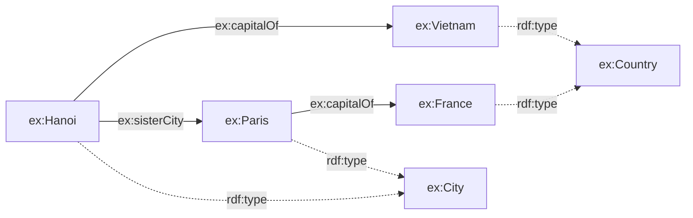
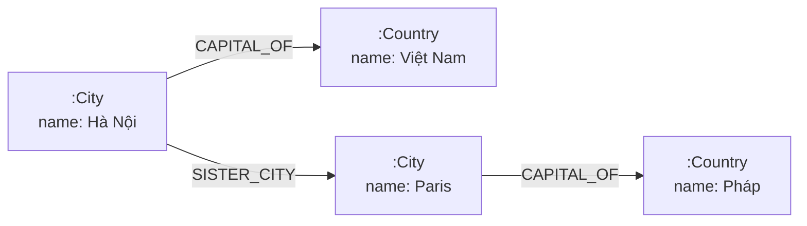

# Chương 2 — Mô hình Dữ liệu và Ngôn ngữ Truy vấn

> **Định hướng chương**
>
> **Câu hỏi trung tâm:** Lựa chọn cách biểu diễn đồ thị thay đổi những gì chúng ta
> có thể *biểu đạt, truy vấn, suy luận, trao đổi và bảo trì* như thế nào?
>
> **Vì sao quan trọng:** Cùng một tri thức về thế giới thực có thể được lưu trữ dưới
> nhiều hình thức khác nhau. Hình thức bạn chọn quyết định câu hỏi nào dễ trả lời,
> dữ liệu nào dễ trao đổi với hệ thống khác, và chi phí phải trả khi hệ thống lớn lên.
> Chọn sai mô hình, bạn sẽ trả giá bằng những đoạn mã "lách luật" ngày càng phức tạp.
>
> **Bạn sẽ hiểu:**
>
> - Mô hình RDF: bộ ba, IRI, literal, blank node, đồ thị như một tập bộ ba
> - Turtle là một *cú pháp* của RDF, không phải bản thân mô hình RDF
> - SPARQL khớp mẫu đồ thị và trả về các ánh xạ nghiệm (solution mappings)
> - Mô hình Đồ thị Thuộc tính có nhãn (Labeled Property Graph)
> - Cypher truy vấn đồ thị thuộc tính
> - Cùng một tri thức nhưng hai cách biểu diễn: điều gì trở nên dễ, rõ, ngầm định,
>   hoặc tốn kém trong mỗi bên
>
> **Tiên quyết:** Chương 1 (đồ thị, dữ liệu, ngữ nghĩa, ngữ cảnh).
>
> **Bản đồ khái niệm:**
>
> Tri thức thế giới thực → Chọn mô hình biểu diễn → RDF *hoặc* Property Graph →
> Cú pháp tuần tự hóa → Ngôn ngữ truy vấn → Đánh đổi thiết kế

## 2.0 Mở đầu: Một câu hỏi, hai câu trả lời

Hãy tưởng tượng bạn được giao xây dựng một hệ thống lưu trữ tri thức về các thành phố
và quốc gia. Bạn có ba sự kiện:

- Hà Nội là thủ đô của Việt Nam.
- Paris là thủ đô của Pháp.
- Hà Nội và Paris là thành phố kết nghĩa.

Nghe có vẻ đơn giản. Nhưng trước khi viết bất kỳ dòng mã nào, bạn phải trả lời một
câu hỏi thiết kế: **ba sự kiện này sẽ được biểu diễn như thế nào?**

Có hai họ mô hình đồ thị lớn đã trở thành chuẩn mực trong thực tế [@stanford-cs520-graph-data-models]:

1. **Mô hình RDF** (Resource Description Framework) — nền tảng của Semantic Web,
   được chuẩn hóa bởi W3C [@w3c-rdf11-concepts].
2. **Đồ thị Thuộc tính có nhãn** (Labeled Property Graph) — mô hình được Neo4j và
   nhiều cơ sở dữ liệu đồ thị hiện đại sử dụng [@neo4j-data-modeling].

Chương này không dạy cú pháp của một thư viện cụ thể. Mục tiêu là hiểu **cơ chế và sự
đánh đổi** của mỗi họ mô hình, bằng cách biểu diễn *cùng một miền tri thức* ở cả hai
phía rồi so sánh trực tiếp.

> **Phạm vi:** Đây không phải hướng dẫn RDFLib, SPARQL, Neo4j hay Cypher. API chỉ là
> phương tiện minh họa; khái niệm mới là thứ ở lại với bạn.

## 2.1 Mô hình RDF

### 2.1.1 Bộ ba là đơn vị nguyên tử

Theo đặc tả RDF 1.1 Concepts and Abstract Syntax [@w3c-rdf11-concepts], một **đồ thị
RDF** (RDF graph) là một tập hợp các **bộ ba RDF** (RDF triple). Mỗi bộ ba gồm ba vị
trí, và mỗi vị trí có những ràng buộc kiểu dữ liệu *chính xác* như sau:

| Vị trí | Tên | Được phép chứa |
|--------|-----|----------------|
| Chủ thể | subject | IRI hoặc blank node |
| Vị từ | predicate | **chỉ** IRI |
| Đối tượng | object | IRI, literal, hoặc blank node |

Ba loại hạng mục (term) xuất hiện trong bảng:

- **IRI** (Internationalized Resource Identifier) là một định danh dạng chuỗi, ví dụ
  `http://example.org/Hanoi`.
- **Literal** là giá trị dữ liệu như chuỗi `"Hà Nội"` hay số `8418883`. Literal chỉ
  được phép ở vị trí đối tượng.
- **Blank node** là một nút không có IRI; ta sẽ quay lại nó ở mục 2.1.3.

Hai điểm dễ bị bỏ sót:

- **Vị từ luôn là IRI.** Không bao giờ là literal hay blank node.
- **Chủ thể không bao giờ là literal.** Bạn không thể có một bộ ba mà chủ thể là chuỗi.

> **Đừng nhầm mô hình với cú pháp.** Đồ thị RDF là một *mô hình dữ liệu trừu tượng*.
> Turtle, N-Triples, RDF/XML, JSON-LD chỉ là các *cú pháp cụ thể* (concrete syntax) để
> viết mô hình đó ra thành văn bản. Cùng một đồ thị có thể được viết bằng nhiều cú pháp.

### 2.1.2 IRI: cơ chế định danh phạm vi toàn cục

IRI thường được mô tả là "định danh toàn cục", nhưng cần nói chính xác hơn để tránh
hiểu nhầm.

**IRI là một cơ chế định danh có phạm vi toàn cục** (globally scoped identifier
mechanism): về mặt cú pháp, hai hệ thống bất kỳ trên thế giới đều có thể viết ra cùng
một chuỗi IRI để cùng trỏ đến một tài nguyên. Đây là thiết kế cốt lõi giúp RDF hỗ trợ
dữ liệu liên kết (Linked Data).

Nhưng có hai điều IRI *không* tự động đảm bảo:

- **Cùng một IRI không chứng minh rằng hai bên đang nói về cùng một thực thể thế giới
  thực với cùng ngữ nghĩa.** Hai tổ chức có thể dùng `http://example.org/Hanoi` nhưng
  gán cho nó những thuộc tính khác nhau, hoặc hiểu "Hà Nội" theo phạm vi khác nhau
  (địa giới hành chính, vùng đô thị, v.v.).
- **Hai IRI khác nhau không nhất thiết nghĩa là hai thực thể khác nhau.**
  `http://dbpedia.org/resource/Hanoi` và `http://www.wikidata.org/entity/Q1858` đều nói
  về Hà Nội. Việc nhận ra chúng cùng trỏ một thực thể là bài toán *đồng nhất định danh*
  (identity resolution), sẽ được bàn sâu ở Chương 3.

Nói ngắn gọn: IRI cho ta một *không gian tên* thống nhất để các hệ thống có thể tham
chiếu lẫn nhau, nhưng **ý nghĩa của tham chiếu đó không tự động đi kèm chuỗi IRI**.

### 2.1.3 Blank node: tài nguyên không cần tên toàn cục

Blank node thường được giới thiệu là "nút ẩn danh dùng khi không cần định danh toàn
cục". Điều đó đúng nhưng chưa đủ. Hãy làm rõ ngữ nghĩa trực giác của nó:

- Blank node biểu diễn **một tài nguyên tồn tại nhưng không được đặt tên bằng IRI**.
  Nó vẫn là một nút đầy đủ của đồ thị: có thể là chủ thể hoặc đối tượng của bộ ba.
- **Nhãn blank node không phải định danh toàn cục.** Khi bạn thấy `_:b0` trong một tài
  liệu RDF, cái tên `b0` chỉ có ý nghĩa *trong phạm vi tài liệu đó*. Nó là một sản phẩm
  của tuần tự hóa (serialization artifact), không phải một định danh ổn định xuyên hệ
  thống.
- **Ngữ nghĩa tồn tại.** Về mặt logic, blank node mang nghĩa "tồn tại một tài nguyên
  nào đó sao cho…". Ví dụ, bộ ba `(ex:Hanoi, ex:hasAddress, _:b0)` nói rằng "Hà Nội có
  một địa chỉ, và địa chỉ đó là một tài nguyên nào đó" — mà không cần (hoặc chưa thể)
  đặt tên toàn cục cho địa chỉ ấy.

Vì nhãn blank node chỉ là cục bộ, hai đồ thị dùng hai nhãn blank node khác nhau vẫn có
thể là *cùng một đồ thị* về mặt ngữ nghĩa. Đây chính là lý do việc so sánh đồ thị cần
khái niệm **đẳng cấu** (isomorphism) thay vì so sánh chuỗi thô — ta sẽ gặp lại ở mục
2.1.5. Chương này giữ blank node ở mức trực giác; ngữ nghĩa hình thức đầy đủ được dành
cho các chương sau.

### 2.1.4 Biểu diễn miền tri thức bằng RDF

Bây giờ ta biểu diễn ba sự kiện mở đầu bằng RDFLib [@rdflib-docs]. Miền tri thức gồm
Hà Nội, Paris, Việt Nam, Pháp — chính là miền đã dùng ở Chương 1 để đảm bảo tính liên
tục.

```python
from rdflib import Graph, Literal, Namespace, RDF, RDFS

EX = Namespace("http://example.org/")
g = Graph()

g.add((EX.Hanoi,   RDF.type,     EX.City))
g.add((EX.Hanoi,   RDFS.label,   Literal("Hà Nội")))
g.add((EX.Hanoi,   EX.capitalOf, EX.Vietnam))
g.add((EX.Paris,   RDF.type,     EX.City))
g.add((EX.Paris,   RDFS.label,   Literal("Paris")))
g.add((EX.Paris,   EX.capitalOf, EX.France))
g.add((EX.Hanoi,   EX.sisterCity, EX.Paris))
g.add((EX.Vietnam, RDF.type,     EX.Country))
g.add((EX.France,  RDF.type,     EX.Country))
```

Đồ thị này có **9 bộ ba**. Mỗi dòng `g.add(...)` thêm đúng một bộ ba; mỗi bộ ba là một
mệnh đề độc lập. Vì đồ thị RDF là một *tập hợp*, thứ tự thêm không quan trọng và bộ ba
trùng lặp tự động bị loại bỏ.



Hình: Miền tri thức thủ đô dưới dạng đồ thị RDF. Nét liền là quan hệ miền
(capitalOf, sisterCity); nét đứt là phân loại (rdf:type).

Lưu ý cách RDF biểu diễn **kiểu của thực thể**: thay vì một trường "loại" gắn trong nút,
RDF dùng chính một bộ ba `rdf:type`. Đây là một lựa chọn thiết kế có hệ quả lớn — mọi
thông tin, kể cả phân loại, đều là bộ ba, nên đều có thể được truy vấn và suy luận bằng
cùng một cơ chế.

### 2.1.5 Turtle: cú pháp, không phải mô hình

Turtle là cú pháp văn bản phổ biến nhất để viết RDF [@w3c-rdf11-turtle]. Đoạn Turtle dưới
đây biểu diễn **chính xác đồ thị 9 bộ ba** ở mục 2.1.4 — không thiếu, không thừa:

```turtle
@prefix ex:   <http://example.org/> .
@prefix rdf:  <http://www.w3.org/1999/02/22-rdf-syntax-ns#> .
@prefix rdfs: <http://www.w3.org/2000/01/rdf-schema#> .

ex:Hanoi a ex:City ;
    rdfs:label "Hà Nội" ;
    ex:capitalOf ex:Vietnam ;
    ex:sisterCity ex:Paris .

ex:Paris a ex:City ;
    rdfs:label "Paris" ;
    ex:capitalOf ex:France .

ex:Vietnam a ex:Country .
ex:France  a ex:Country .
```

Ba tiện ích cú pháp của Turtle xuất hiện ở đây:

- `@prefix` cho phép viết gọn IRI bằng tiền tố (`ex:Hanoi` thay vì
  `<http://example.org/Hanoi>`). Tiền tố chỉ là cách viết tắt; nó **không** thay đổi IRI
  thật trong đồ thị.
- Từ khóa `a` là cách viết tắt của `rdf:type`.
- Dấu chấm phẩy `;` cho phép liệt kê nhiều vị từ cho cùng một chủ thể; dấu phẩy `,`
  cho phép liệt kê nhiều đối tượng cho cùng một chủ thể–vị từ.

Kiểm chứng rằng đoạn Turtle trên đúng là đồ thị ban đầu, ta parse nó trở lại và so sánh:

```python
turtle_text = g.serialize(format="turtle")
g2 = Graph()
g2.parse(data=turtle_text, format="turtle")
assert set(g) == set(g2)   # đồ thị tương đương
```

Ở đây cần nói rõ về **cách so sánh đồ thị**:

- Với đồ thị *không có blank node* như ví dụ này, so sánh tập bộ ba (`set(g) == set(g2)`)
  tình cờ là đủ, vì mỗi bộ ba đã được xác định hoàn toàn bởi ba hạng mục có tên.
- Nhưng **khái niệm đúng tổng quát là đẳng cấu đồ thị** (graph isomorphism): hai đồ thị
  tương đương nếu tồn tại một song ánh giữa các nút của chúng sao cho các bộ ba được bảo
  toàn. Khi có blank node, nhãn của chúng là cục bộ và có thể khác nhau giữa hai tài
  liệu, nên so sánh tập bộ ba thô sẽ cho kết quả sai; phải dùng đẳng cấu để "khớp" các
  blank node với nhau. RDFLib cung cấp so sánh đẳng cấu qua `rdflib.compare`.

> **Sai lầm phổ biến:** so sánh *chuỗi Turtle thô* để kết luận hai đồ thị giống nhau.
> Hai tài liệu Turtle khác nhau từng ký tự (khác tiền tố, khác thứ tự dòng, khác cách
> gom nhóm `;`/`,`) vẫn có thể biểu diễn cùng một đồ thị. Luôn so sánh **ngữ nghĩa đồ
> thị đã parse**, không so sánh văn bản.

Cùng một đồ thị cũng có thể serialize thành N-Triples, RDF/XML hay JSON-LD và parse lại
thành đồ thị tương đương. Điều này khẳng định: **cú pháp là lớp vỏ có thể thay thế; mô
hình đồ thị mới là nội dung bất biến.**

### 2.1.6 SPARQL: khớp mẫu đồ thị

SPARQL là ngôn ngữ truy vấn chuẩn cho RDF [@w3c-sparql11-overview]. Khác với SQL truy
vấn các hàng trong bảng, SPARQL **khớp mẫu đồ thị** (graph pattern matching)
[@w3c-sparql11-query].

#### Mẫu bộ ba và ràng buộc vị trí

Một **mẫu bộ ba** (triple pattern) giống một bộ ba, nhưng mỗi vị trí có thể là một
**biến** (`?city`) hoặc một hằng. Ràng buộc vị trí của mẫu bộ ba phản ánh đúng mô hình
RDF:

- Vị trí **chủ thể**: biến, IRI, hoặc blank node — *không* phải literal.
- Vị trí **vị từ**: biến hoặc IRI — *không* phải literal hay blank node.
- Vị trí **đối tượng**: biến, IRI, literal, hoặc blank node.

Nói cách khác, không phải "mọi vị trí hằng đều có thể là IRI hoặc literal"; vị từ chỉ
nhận IRI, và chủ thể không nhận literal.

#### Basic Graph Pattern và ánh xạ nghiệm

Một **Basic Graph Pattern** (BGP) là một tập hợp các mẫu bộ ba. Kết quả truy vấn là một
tập các **ánh xạ nghiệm** (solution mappings): mỗi ánh xạ gán mỗi biến với một hạng mục
của đồ thị sao cho khi thay biến bằng hạng mục đó, toàn bộ BGP trở thành một đồ thị con
của đồ thị đang truy vấn.

```sparql
PREFIX ex:  <http://example.org/>
PREFIX rdf: <http://www.w3.org/1999/02/22-rdf-syntax-ns#>

SELECT ?city
WHERE { ?city rdf:type ex:City }
```

Trên đồ thị 9 bộ ba, truy vấn này trả về hai ánh xạ nghiệm:

```
?city = http://example.org/Hanoi
?city = http://example.org/Paris
```

#### Biến dùng chung tạo phép nối

Khi hai mẫu bộ ba chia sẻ một biến, SPARQL tự động thực hiện phép nối trên biến đó:

```sparql
SELECT ?capital ?country
WHERE {
    ?capital ex:capitalOf ?country .
    ?country rdf:type ex:Country .
}
```

Biến `?country` nối hai mẫu. Kết quả:

```
?capital = Hanoi, ?country = Vietnam
?capital = Paris, ?country = France
```

#### FILTER và OPTIONAL

`FILTER` giới hạn các ánh xạ nghiệm theo một điều kiện trên giá trị:

```sparql
SELECT ?city ?pop WHERE {
    ?city ex:population ?pop .
    FILTER (?pop > 5000000)
}
```

`OPTIONAL` mở rộng kết quả mà không loại bỏ nghiệm khi mẫu con không khớp — hữu ích khi
một thuộc tính có thể vắng mặt:

```sparql
SELECT ?entity ?label WHERE {
    ?entity a ?type .
    OPTIONAL { ?entity rdfs:label ?label }
}
```

> **"SPARQL là SQL cho đồ thị"** chỉ là một phép loại suy lỏng lẻo, và nên được dùng
> thận trọng. SPARQL hoạt động trên cấu trúc đồ thị và trả về ánh xạ nghiệm của các mẫu;
> SQL truy vấn các bộ trong bảng quan hệ. Cơ chế nền tảng của hai ngôn ngữ là khác nhau.

### 2.1.7 Phát triển hiện tại: RDF 1.2 và SPARQL 1.2

> ⚑ **RDF 1.2** (W3C Candidate Recommendation) giới thiệu cơ chế tái hiện dựa trên
> triple-term (`rdf:reifies`) như cách hiện đại được ưu tiên để tham chiếu một mệnh đề;
> từ vựng tái hiện kiểu cũ của RDF 1.1 vẫn được giữ lại như từ vựng kế thừa cho tương
> thích [@w3c-rdf12-concepts].
>
> ⚑ **SPARQL 1.2** (W3C Working Draft) đang phát triển để hỗ trợ các tính năng RDF 1.2
> [@w3c-sparql12-query].
>
> **Chương này dùng RDF 1.1 và SPARQL 1.1 làm baseline giảng dạy ổn định.** RDF 1.2 và
> SPARQL 1.2 chỉ xuất hiện trong các khung "Phát triển hiện tại" như thế này.

## 2.2 Đồ thị Thuộc tính có nhãn (Labeled Property Graph)

Bây giờ ta nhìn cùng miền tri thức qua họ mô hình thứ hai.

### 2.2.1 Các thành phần của mô hình

Mô hình Đồ thị Thuộc tính có nhãn gồm các thành phần sau [@neo4j-data-modeling]
[@neo4j-modeling-fundamentals]:

- **Nút** (node): đại diện cho một thực thể.
- **Nhãn** (label): phân loại nút. Một nút có thể mang nhiều nhãn, ví dụ một nút vừa là
  `City` vừa là `Capital`.
- **Thuộc tính** (property): cặp tên–giá trị gắn trên nút hoặc trên quan hệ, ví dụ
  `name: "Hà Nội"`.
- **Quan hệ** (relationship): một cạnh có hướng nối hai nút.
- **Kiểu quan hệ** (relationship type): tên của quan hệ, ví dụ `CAPITAL_OF`.
- **Hướng** (direction): quan hệ luôn có hướng (từ nút này đến nút kia), dù người dùng
  có thể truy vấn bỏ qua hướng.

Điểm khác biệt cấu trúc quan trọng nhất so với RDF: **quan hệ là công dân hạng nhất và
có thể mang thuộc tính riêng**. Trong RDF, một bộ ba không thể có thuộc tính; muốn gắn
thông tin vào một quan hệ, bạn phải dùng kỹ thuật tái hiện hoặc mô hình hóa n-ary
(phức tạp hơn). Trong đồ thị thuộc tính, bạn chỉ việc thêm thuộc tính vào quan hệ.

### 2.2.2 Định danh: nội bộ cơ sở dữ liệu và định danh miền

Một khác biệt tinh tế nhưng quan trọng: trong đồ thị thuộc tính, mỗi phần tử (nút, quan
hệ) có một **định danh nội bộ** do hệ quản trị cơ sở dữ liệu cấp. Ví dụ trong Neo4j hiện
hành, hàm `elementId()` trả về định danh này dưới dạng *chuỗi*; hàm `id()` trả về số
nguyên trước đây đã bị loại bỏ dần (deprecated) [@neo4j-cypher-manual]. Định danh dạng
này là **định danh triển khai** (implementation identifier):

- Dùng để hệ thống định vị phần tử một cách hiệu quả *bên trong* cơ sở dữ liệu.
- **Không ổn định xuyên hệ thống**: cùng một thực thể được nạp vào hai cơ sở dữ liệu
  khác nhau sẽ có hai định danh nội bộ khác nhau.
- **Không được bảo đảm bền vững**: tài liệu Neo4j hiện hành chỉ bảo đảm tính duy nhất
  của element ID trong phạm vi một giao dịch, và cảnh báo rằng ID nội bộ có thể được tái
  sử dụng sau khi phần tử bị xóa — ứng dụng dựa vào chúng sẽ giòn và có thể sai lệch.
  Vì vậy Neo4j khuyến nghị dùng **định danh do ứng dụng tự tạo** (application-generated
  ID) [@neo4j-cypher-manual].
- **Không phải là định danh miền** (domain identity). Nếu bạn cần một định danh có ý
  nghĩa nghiệp vụ và ổn định (ví dụ mã quốc gia ISO, hay một IRI), bạn lưu nó như một
  *thuộc tính* của nút.

Bài học không nằm ở chỗ gọi hàm nào, mà ở một phân biệt khái niệm sẽ còn quay lại ở
Chương 3: **định danh phần tử của cơ sở dữ liệu không phải là định danh của thực thể
trong miền**. Đồ thị thuộc tính cho bạn sự tiện lợi khi thao tác, nhưng định danh
"toàn cục" không phải là thứ mô hình cấp sẵn — nó là trách nhiệm của người thiết kế.

### 2.2.3 Khái niệm chung khác với hành vi của Neo4j

Cần phân biệt rõ hai tầng:

- **Đồ thị Thuộc tính có nhãn** là một *mô hình dữ liệu khái quát*. Nhiều hệ thống triển
  khai nó: Neo4j, Amazon Neptune, JanusGraph, Memgraph, v.v.
- **Neo4j** là *một triển khai cụ thể* của mô hình đó, với những lựa chọn riêng về kiểu
  dữ liệu, chỉ mục, giao dịch, và ngôn ngữ truy vấn.

Chương này dùng Neo4j làm ví dụ cụ thể vì tài liệu phong phú và phổ biến
[@neo4j-data-modeling], nhưng **không đồng nhất mô hình đồ thị thuộc tính với hành vi
của Neo4j**. Khi một tính năng là đặc thù của Neo4j (chứ không phải của mô hình chung),
chúng tôi sẽ nói rõ.

### 2.2.4 Cùng miền tri thức, biểu diễn kiểu đồ thị thuộc tính

Cùng ba sự kiện mở đầu, dưới dạng đồ thị thuộc tính:

```
(:City  {name: "Hà Nội"})   -[:CAPITAL_OF]-> (:Country {name: "Việt Nam"})
(:City  {name: "Paris"})    -[:CAPITAL_OF]-> (:Country {name: "Pháp"})
(:City  {name: "Hà Nội"})   -[:SISTER_CITY]-> (:City {name: "Paris"})
```



Hình: Cùng miền tri thức dưới dạng Đồ thị Thuộc tính có nhãn. Nhãn (`:City`,
`:Country`) phân loại nút; thuộc tính `name` nằm trong nút; kiểu quan hệ
(`CAPITAL_OF`, `SISTER_CITY`) ghi trên cạnh.

So với hình RDF ở mục 2.1.4, bạn có thể thấy ngay sự khác biệt về "hình dạng":

- Trong RDF, phân loại là một *bộ ba* (`rdf:type`) trỏ đến một nút lớp. Trong đồ thị
  thuộc tính, phân loại là một *nhãn* gắn trực tiếp trên nút.
- Trong RDF, tên ("Hà Nội") là một *literal* ở vị trí đối tượng của bộ ba `rdfs:label`.
  Trong đồ thị thuộc tính, tên là một *thuộc tính* của nút.

Cả hai đều biểu diễn cùng tri thức, nhưng **cấu trúc đồ thị thì khác nhau**. Đây chính
là luận điểm trung tâm của chương, sẽ được phân tích đầy đủ ở mục 2.4.

## 2.3 Cypher: truy vấn đồ thị thuộc tính

**Cypher** là ngôn ngữ truy vấn khai báo do Neo4j phát triển, dùng để đọc và ghi dữ liệu
trong đồ thị thuộc tính [@neo4j-cypher-manual].

### 2.3.1 MATCH và mẫu đồ thị

Từ khóa `MATCH` mô tả một mẫu đồ thị cần tìm. Mẫu dùng cú pháp ASCII-art trực quan: nút
trong ngoặc tròn `()`, quan hệ trong ngoặc vuông `[]`, hướng bằng mũi tên `->`.

```cypher
MATCH (c:City)
RETURN c.name
```

Câu lệnh trên tìm mọi nút có nhãn `City` và trả về thuộc tính `name`. Trên miền của ta,
kết quả là `Hà Nội` và `Paris`.

### 2.3.2 Mẫu quan hệ và lọc thuộc tính

Bạn có thể mô tả quan hệ và lọc theo thuộc tính:

```cypher
MATCH (capital:City)-[:CAPITAL_OF]->(country:Country)
RETURN capital.name, country.name
```

Kết quả:

```
"Hà Nội", "Việt Nam"
"Paris",  "Pháp"
```

Lọc với `WHERE`:

```cypher
MATCH (c:City)
WHERE c.population > 5000000
RETURN c.name, c.population
```

### 2.3.3 Biến và duyệt nhiều bước

Biến (`capital`, `country`) giữ các nút khớp được, giống biến trong SPARQL. Cypher cũng
cho phép duyệt nhiều bước quan hệ:

```cypher
MATCH (a:City)-[:SISTER_CITY]->(b:City)
RETURN a.name, b.name
```

### 2.3.4 Cypher khác với ISO GQL

> ⚑ **Cypher không phải là GQL.** GQL là chuẩn do ISO ban hành (ISO/IEC 39075:2024) —
> chính xác thì nó là *ngôn ngữ chuẩn để truy vấn và thao tác đồ thị thuộc tính*
> [@iso-gql]. Cypher có mức độ tương thích đáng kể với GQL và là nguồn cảm hứng chính
> cho chuẩn này, nhưng **hai ngôn ngữ không trùng khớp**: một số tính năng bắt buộc của
> GQL chưa có trong Cypher và ngược lại [@neo4j-cypher-gql-conformance]. Cần chú ý phạm
> vi của chuẩn: GQL chuẩn hóa **ngôn ngữ truy vấn**, chứ không phải một định dạng tuần
> tự hóa hay trao đổi dữ liệu đồ thị giữa các hệ thống. Khi viết mã chạy trên Neo4j, bạn
> đang dùng Cypher; khi nói về chuẩn *ngôn ngữ truy vấn* đồ thị, bạn đang nói về GQL.

## 2.4 Cùng tri thức, khác biểu diễn

Đây là phần trọng tâm của chương. Ta đặt hai biểu diễn cạnh nhau và so sánh từng khía
cạnh, với cùng miền Hà Nội–Việt Nam–Paris–Pháp. Mục tiêu **không phải** để tuyên bố bên
nào thắng, mà để trả lời: *mỗi biểu diễn làm điều gì trở nên dễ, rõ, ngầm định, hoặc tốn
kém?*

### 2.4.1 Bảng so sánh

| Khía cạnh | RDF | Đồ thị Thuộc tính |
|-----------|-----|-------------------|
| **Định danh** | IRI — cơ chế định danh phạm vi toàn cục, sẵn có trong mô hình | Định danh nội bộ do hệ thống cấp; định danh miền phải lưu làm thuộc tính |
| **Phân loại thực thể** | Bộ ba `rdf:type` trỏ đến nút lớp | Nhãn gắn trực tiếp trên nút |
| **Thuộc tính literal** | Bộ ba với literal ở vị trí đối tượng | Thuộc tính (tên–giá trị) trên nút |
| **Biểu diễn quan hệ** | Bộ ba (chủ thể, vị từ, đối tượng); quan hệ là một bộ ba | Cạnh có hướng, có kiểu, là công dân hạng nhất |
| **Siêu dữ liệu của quan hệ** | Trong RDF 1.1: không gắn trực tiếp; dùng tái hiện, nút trung gian, hoặc mẫu n-ary (RDF 1.2 đang phát triển triple term/reifier) | Gắn thuộc tính trực tiếp lên quan hệ |
| **Quan hệ n-ary / ngữ cảnh** | Phải mô hình hóa bằng nút trung gian hoặc tái hiện | Có thể thêm thuộc tính cho quan hệ, hoặc dùng nút trung gian |
| **Lược đồ / ngữ nghĩa** | RDFS, OWL — chuẩn hóa, có ngữ nghĩa hình thức | Lược đồ thường là quy ước ứng dụng; không có chuẩn ngữ nghĩa hình thức chung |
| **Suy luận** | RDFS và OWL định nghĩa ngữ nghĩa entailment hình thức | Phụ thuộc triển khai; không có chuẩn suy luận chung |
| **Khả năng liên tác** | Cao — chuẩn W3C cho cả mô hình dữ liệu lẫn định dạng trao đổi | Hội tụ về *ngôn ngữ truy vấn* qua GQL; trao đổi dữ liệu vẫn phụ thuộc hệ thống, chưa có chuẩn tuần tự hóa liên hệ thống tương đương Turtle/N-Triples |
| **Mô hình truy vấn** | Khớp mẫu đồ thị (SPARQL), ánh xạ nghiệm | Khớp mẫu đồ thị (Cypher/GQL), duyệt theo đường dẫn |
| **Tuần tự hóa** | Nhiều chuẩn: Turtle, N-Triples, RDF/XML, JSON-LD | Thường là định dạng riêng của từng hệ thống |
| **Gắn với triển khai** | Mô hình chuẩn độc lập triển khai | Mô hình gắn chặt với hệ quản trị cụ thể |

### 2.4.2 Ba khác biệt đáng suy nghĩ nhất

**Một — siêu dữ liệu của quan hệ.** Giả sử bạn muốn nói "Hà Nội là thủ đô của Việt Nam
*từ năm 1976*". Trong đồ thị thuộc tính, bạn thêm thuộc tính vào quan hệ:

```
(:City {name:"Hà Nội"})-[:CAPITAL_OF {since: 1976}]->(:Country {name:"Việt Nam"})
```

Trong RDF, bộ ba `(Hanoi, capitalOf, Vietnam)` không có chỗ để gắn `since`. Với baseline
RDF 1.1 ổn định, bạn phải dùng tái hiện (reification), một nút trung gian đại diện cho
"sự kiện thủ đô", hoặc mẫu quan hệ n-ary, rồi nối nó với Hà Nội, Việt Nam, và năm 1976.
Đây là những mẫu hình chuẩn nhưng tốn thêm cấu trúc.

> ⚑ **Phát triển hiện tại — RDF 1.2.** Các bản dự thảo RDF 1.2 đang phát triển cơ chế
> *triple term* và *reifier*, cho phép tham chiếu đến một mệnh đề (proposition) để gắn
> thêm thông tin mà không phải tự dựng nút trung gian [@w3c-rdf12-concepts]. Đây là cơ
> chế mới hơn, chưa phải baseline ổn định để giảng dạy; và nó bổ sung thêm một cách biểu
> diễn ngữ cảnh chứ không tự động giải quyết mọi bài toán quan hệ n-ary — chọn cấu trúc
> nào cho miền cụ thể vẫn là quyết định mô hình hóa.

**Hai — định danh.** RDF cho bạn IRI như một cơ chế định danh toàn cục ngay trong mô
hình, hỗ trợ liên kết dữ liệu giữa các hệ thống. Đồ thị thuộc tính cho bạn sự đơn giản
và tiện lợi khi thao tác, nhưng định danh xuyên hệ thống là việc bạn phải tự thiết kế.

**Ba — ngữ nghĩa hình thức.** RDF đi kèm một hệ ngữ nghĩa chuẩn: **RDFS và OWL định
nghĩa ngữ nghĩa entailment hình thức**. Từ `A capitalOf B` và định nghĩa `capitalOf`
có miền là `City`, một bộ suy luận có thể suy ra `A là City`. Bảo đảm ở đây là bảo đảm
*về mặt suy luận*: những gì được suy ra là hệ quả logic của các tiên đề đã nêu, dưới hệ
ngữ nghĩa đã chọn — nó **không** xác lập rằng các phát biểu đầu vào là đúng về mặt sự
thật. Đồ thị thuộc tính không có tầng ngữ nghĩa chuẩn như vậy; ý nghĩa của nhãn và kiểu
quan hệ là quy ước của ứng dụng. Đổi lại, đồ thị thuộc tính thường dễ tiếp cận hơn về
mặt khái niệm. Lưu ý rằng hiệu năng không do mô hình dữ liệu quyết định: nó phụ thuộc
triển khai cụ thể, chỉ mục, engine lưu trữ, khối lượng công việc, câu hỏi, tập dữ liệu,
và bộ tối ưu. Chọn mô hình là chọn cách biểu diễn, không phải một tuyên bố về tốc độ.

### 2.4.3 Vậy chọn cái nào?

Không có câu trả lời duy nhất — và đó chính xác là điều chương này muốn bạn rút ra.
Những heuristic thực tế:

- Nếu bạn cần **trao đổi dữ liệu giữa nhiều hệ thống**, **tích hợp nhiều nguồn**, hoặc
  **ngữ nghĩa suy luận hình thức**, RDF với chuẩn W3C là lựa chọn tự nhiên.
- Nếu bạn cần **mô hình quan hệ giàu thuộc tính**, cú pháp duyệt đồ thị gọn, và làm việc
  trong **một hệ thống khép kín**, đồ thị thuộc tính thường tiện lợi hơn.
- Nhiều hệ thống thực tế dùng **cả hai**: đồ thị thuộc tính cho ứng dụng, RDF cho tầng
  tích hợp và trao đổi.

> **Điều cần nhớ:** cùng một tri thức thế giới thực **không** kéo theo cùng một cấu trúc
  đồ thị. Lựa chọn biểu diễn quyết định định danh nằm ở đâu, siêu dữ liệu được biểu diễn
  bằng cấu trúc hay bằng thuộc tính, quan hệ được "làm giàu" thế nào, và khả năng liên
  tác ra sao.

## 2.5 Những ngộ nhận thường gặp

1. **"Turtle là RDF."** Sai. Turtle là một cú pháp để viết RDF; RDF là mô hình đồ thị.
2. **"So sánh hai file Turtle là biết hai đồ thị có giống nhau không."** Sai. Phải so
   ngữ nghĩa đồ thị đã parse; với blank node cần đẳng cấu.
3. **"SPARQL là SQL cho đồ thị."** Chỉ là loại suy lỏng lẻo; cơ chế là khớp mẫu đồ thị.
4. **"Cùng một IRI thì chắc chắn nói về cùng một thực tế."** Không. IRI là cơ chế định
   danh, không phải bằng chứng về ngữ nghĩa chung.
5. **"Đồ thị thuộc tính và Neo4j là một."** Không. Neo4j là một triển khai của mô hình
   đồ thị thuộc tính.
6. **"Cypher chính là GQL."** Không. Cypher tương thích phần lớn với GQL nhưng không
   trùng khớp.

## 2.6 Câu hỏi suy ngẫm

- ★ Vì sao RDF chọn biểu diễn phân loại bằng một bộ ba (`rdf:type`) thay vì một trường
  gắn trong nút? Điều này được gì và mất gì?
- ★ Nếu bạn cần lưu "quan hệ kết nghĩa giữa Hà Nội và Paris bắt đầu từ năm 1998", bạn
  sẽ mô hình hóa thế nào trong RDF? Trong đồ thị thuộc tính?
- ★★ Vì sao blank node làm cho việc so sánh đồ thị cần đến đẳng cấu thay vì so tập bộ ba?
- ★★ Một hệ thống dùng đồ thị thuộc tính muốn xuất dữ liệu sang RDF để tích hợp với đối
  tác. Những khó khăn nào về định danh và ngữ nghĩa sẽ xuất hiện?
- ★★★ Cùng một câu hỏi "Những thành phố nào là thủ đô?", hãy so sánh truy vấn SPARQL và
  Cypher tương ứng. Bên nào diễn đạt sát với mô hình dữ liệu của nó hơn?

## 2.7 Chúng ta đã biết gì

- Đồ thị RDF là tập hợp các bộ ba với ràng buộc vị trí chính xác; IRI là cơ chế định
  danh phạm vi toàn cục; blank node là tài nguyên không tên với ngữ nghĩa tồn tại.
- Turtle là một cú pháp của RDF; so sánh đồ thị phải dựa trên ngữ nghĩa (đẳng cấu), không
  dựa trên chuỗi.
- SPARQL khớp các Basic Graph Pattern và trả về ánh xạ nghiệm.
- Đồ thị Thuộc tính có nhãn gồm nút, nhãn, thuộc tính, quan hệ có hướng và có kiểu; quan
  hệ có thể mang thuộc tính.
- Cùng một tri thức có thể biểu diễn bằng cả hai mô hình, nhưng cấu trúc đồ thị, định
  danh, siêu dữ liệu quan hệ, và khả năng suy luận sẽ khác nhau.

## 2.8 Chúng ta chưa làm được gì

- Ta mới nói về *cú pháp* và *mô hình*; chưa có cách nào để máy **hiểu ý nghĩa** của
  `capitalOf` ngoài quy ước đặt tên. Nói cách khác, chưa có **lược đồ và bản thể học**
  chính thức.
- Ta chưa có cơ chế để nói "hai IRI khác nhau thật ra cùng trỏ một thực thể" — bài toán
  **định danh** và **đồng nhất**.
- Ta chưa xét **ngữ cảnh**: thông tin này đến từ đâu, đúng trong khoảng thời gian nào,
  đáng tin đến mức nào.

## 2.9 Cầu nối đến Chương 3

Chương này đã cho thấy cùng một tri thức có thể mang nhiều hình dạng đồ thị khác nhau,
và rằng định danh (IRI) là một cơ chế mạnh nhưng không tự động mang theo ngữ nghĩa. Câu
hỏi tự nhiên tiếp theo là: **làm sao để tổ chức định danh, lược đồ và ngữ cảnh sao cho
tri thức vừa nhất quán vừa có thể tích hợp?** Chương 3 — *Lược đồ, Định danh và Ngữ cảnh*
— sẽ trả lời điều đó, bắt đầu từ chính những khoảng trống mà chương này để lại.

## Đọc thêm

- RDF 1.1 Primer [@w3c-rdf11-primer] — điểm khởi đầu thân thiện cho RDF.
- RDF 1.1 Concepts and Abstract Syntax [@w3c-rdf11-concepts] — mô hình dữ liệu hình thức.
- RDF 1.1 Turtle [@w3c-rdf11-turtle] — đặc tả cú pháp Turtle.
- SPARQL 1.1 Query Language [@w3c-sparql11-query] — tham chiếu truy vấn đầy đủ.
- Neo4j Data Modeling [@neo4j-data-modeling] — thiết kế đồ thị thuộc tính.
- Neo4j Cypher Manual [@neo4j-cypher-manual] — tham chiếu Cypher.
- What Are Graph Data Models? [@stanford-cs520-graph-data-models] — so sánh RDF và đồ thị
  thuộc tính ở mức khái niệm.
