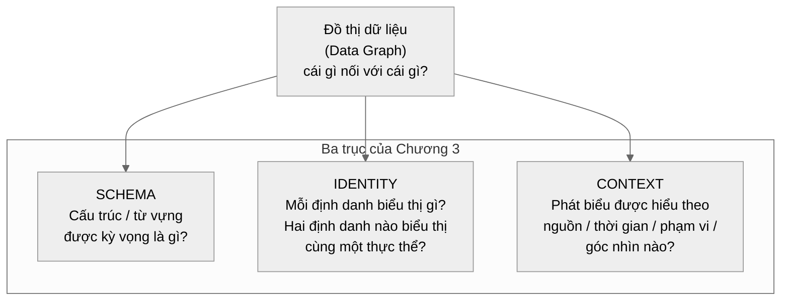
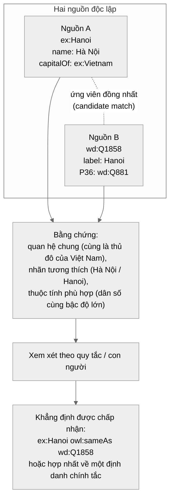
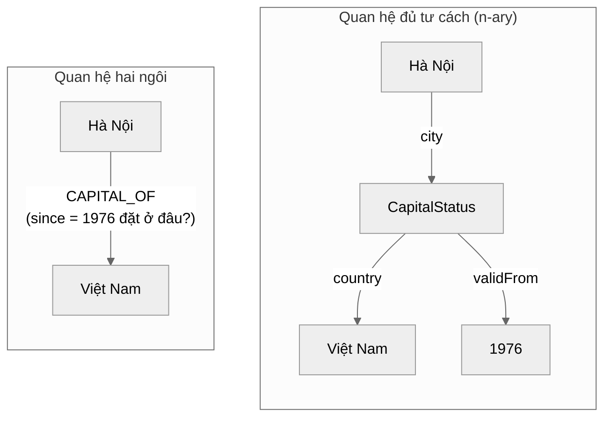
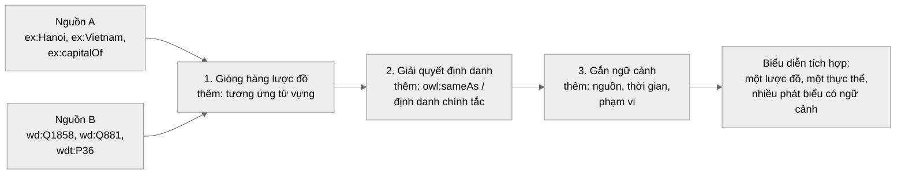

# Chương 3 — Lược đồ, Định danh và Ngữ cảnh

> **Định hướng chương**
>
> **Câu hỏi trung tâm:** Đồ thị cho ta biết *cái gì nối với cái gì*. Nhưng làm sao để
> biết những thứ đó **là gì**, hai định danh có trỏ đến **cùng một thực thể** hay không,
> và một phát biểu phải được hiểu **trong ngữ cảnh nào**?
>
> **Vì sao quan trọng:** Một knowledge graph trong thực tế gần như luôn được ghép từ
> nhiều nguồn. Nếu không giải quyết ba bài toán này, đồ thị của bạn chỉ là một đống
> chuỗi ký tự nối với nhau: cùng một thành phố tồn tại thành hai nút không liên quan,
> hai nguồn mâu thuẫn nhau mà không ai biết vì sao, và không còn cách nào truy ngược
> một phát biểu về nguồn gốc của nó.
>
> **Bạn sẽ hiểu:**
>
> - Lược đồ (schema) mô tả cấu trúc và từ vựng được kỳ vọng của đồ thị dữ liệu —
>   và vì sao lược đồ **không phải** là bản thể học (ontology)
> - Định danh (identifier) khác thực thể (entity) mà nó biểu thị; vì sao cùng tên
>   chưa chắc cùng thực thể, và khác tên chưa chắc khác thực thể
> - `owl:sameAs` là khẳng định **đồng nhất**, không phải "gần giống"; và vì sao OWL
>   không có giả định tên duy nhất (unique name assumption)
> - Ngữ cảnh (nguồn, thời gian, phạm vi, độ tin cậy) được biểu diễn bằng named graph,
>   thực thể quan hệ n-ary, hoặc thuộc tính của quan hệ — mỗi cơ chế chỉ *biểu diễn*
>   ngữ cảnh chứ không làm phát biểu trở thành đúng
> - Ba trục Schema – Identity – Context là ba bài toán **riêng biệt**, không gộp chung
>   thành "ontology"
> - Cả ba trục được áp dụng đồng thời lên knowledge graph cơ chế: lược đồ của
>   Mechanism, định danh của một cơ chế xuyên qua hai giáo trình, và ngữ cảnh của
>   một ứng dụng `RATE_OF_CHANGE`
>
> **Tiên quyết:** Chương 2 (RDF, IRI, đồ thị thuộc tính, bộ ba, quan hệ).
>
> **Bản đồ khái niệm:**
>
> Đồ thị dữ liệu → Lược đồ (cấu trúc kỳ vọng) → Định danh (hai tên, một thực thể?) →
> Ngữ cảnh (phát biểu đúng trong phạm vi nào?) → Biểu diễn tích hợp

## 3.0 Mở đầu: Một thành phố, hai định danh

Giả sử bạn đang xây dựng một knowledge graph về các thành phố và quốc gia. Bạn có hai
nguồn dữ liệu.

**Nguồn A** là cơ sở dữ liệu nội bộ của một tổ chức, dùng không gian tên riêng
`ex:`:

```turtle
@prefix ex: <http://example.org/> .

ex:Hanoi  ex:name        "Hà Nội" ;
          ex:capitalOf   ex:Vietnam ;
          ex:population  8418883 .
```

**Nguồn B** là dữ liệu kiểu Wikidata, nơi mọi thực thể mang một định danh opaque
(dạng `Q…`) không gợi ý gì về tên gọi:

```turtle
@prefix wd:  <http://www.wikidata.org/entity/> .
@prefix wdt: <http://www.wikidata.org/prop/direct/> .

wd:Q1858  wdt:P31    wd:Q515 ;    # instance of: city
          wdt:P36    wd:Q881 ;    # capital of: Vietnam
          wdt:P1082  8053663 .    # population
```

Nhìn bằng mắt, con người nhận ra ngay: cả hai nguồn đều đang nói về Hà Nội, và cả hai
đều nói nó là thủ đô của Việt Nam. Nhưng **đồ thị không biết điều đó**. Với cấu trúc
đồ thị thuần túy, không câu hỏi nào sau đây có câu trả lời tự động
[@hogan-knowledge-graphs]:

1. `ex:Hanoi` và `wd:Q1858` có phải **cùng một thực thể** không?
2. `ex:capitalOf` và `wdt:P36` có phải **cùng một quan hệ** không? Thuộc tính nào
   thuộc về loại khái niệm nào?
3. Phát biểu "là thủ đô" do **nguồn nào** đưa ra, và ta nên tin nguồn nào?
4. Phát biểu đó đúng **trong khoảng thời gian nào**, trong phạm vi nào — hay đúng vô
   điều kiện?

Bốn câu hỏi này không phải lỗi dữ liệu; chúng là bản chất của việc tích hợp tri thức.
Chương này trang bị ba công cụ khái niệm tương ứng, và chúng là ba bài toán **khác
nhau**:



Hình: Ba trục Schema – Identity – Context trên cùng một đồ thị dữ liệu. Mỗi trục trả
lời một nhóm câu hỏi riêng; không trục nào thay thế hai trục còn lại.

Một lưu ý quan trọng trước khi bắt đầu: ba trục này **không phải là ontology**.
Ontology — tầng ngữ nghĩa hình thức với tiên đề và suy luận — là chủ đề của Chương 4.
Chương này chỉ xây dựng phần "kỹ thuật": cấu trúc, định danh, và ngữ cảnh.

## 3.1 Lược đồ — cấu trúc được kỳ vọng

### 3.1.1 Lược đồ giải quyết vấn đề gì?

Đồ thị dữ liệu (data graph) là tập hợp các nút và cạnh: `ex:Hanoi ex:capitalOf
ex:Vietnam`. Tự thân nó không nói gì về **kỳ vọng**: nút mang nhãn gì thì được coi là
thành phố? Quan hệ `capitalOf` nối từ loại gì đến loại gì? Một thành phố có thể có bao
nhiêu giá trị dân số?

**Lược đồ** (schema) là phần mô tả *cấu trúc và từ vựng được kỳ vọng* của đồ thị dữ
liệu [@hogan-knowledge-graphs]:

- **Lớp / kiểu** (class / type): những nhóm khái niệm được chờ đợi — `City`,
  `Country`.
- **Thuộc tính / quan hệ** (property / relation): những tên quan hệ được chờ đợi —
  `capitalOf`, `population`, `name`.
- **Từ vựng miền** (domain vocabulary): tập thuật ngữ chuẩn mà cộng đồng dữ liệu đó
  thống nhất dùng.
- **Ràng buộc cấu trúc** (structural constraints): kỳ vọng về miền giá trị, phạm vi,
  hoặc số lượng — ví dụ "chủ thể của `capitalOf` phải là một `City`".

Nói ngắn gọn: đồ thị dữ liệu trả lời *"có gì?"*, lược đồ trả lời *"được phép có gì,
và nên hiểu các tên gọi kia thế nào?"*.

Một phép loại suy mở đường: đồ thị dữ liệu không có lược đồ là một **hộp linh kiện không
kèm bản vẽ lắp ráp** — mọi chi tiết cắm được vào mọi chi tiết khác, nên bạn không phân
biệt nổi một sản phẩm lắp *đúng* với một sản phẩm lắp *trông có vẻ* đúng.

Và lược đồ tồn tại vì cái giá của "trông có vẻ đúng" là vô hình. Giả sử một script nạp dữ
liệu gõ nhầm tên quan hệ:

```turtle
ex:Hanoi  ex:captialOf  ex:Vietnam .    # thiếu một chữ "a": captialOf
```

Đồ thị **không báo lỗi** — nó coi `ex:captialOf` là một vị từ hoàn toàn hợp lệ. Hậu quả
lộ ra ở tầng truy vấn: `ex:Hanoi` không còn cạnh `ex:capitalOf` nào, nên câu hỏi "Hà Nội
là thủ đô của nước nào" trả về rỗng, dù dữ liệu "vẫn nằm ở đó" chỉ sai tên. Nếu không có
lược đồ, `captialOf` chỉ là *một vị từ nữa* và không có gì là *sai* cả — chính tập từ
vựng được kỳ vọng (§3.1.2) mới tạo ra điểm chuẩn để nói "vị từ này không thuộc về đồ
thị". Còn việc *bắt* lỗi đó lúc nạp dữ liệu là việc của tầng kiểm định (Chương 5).

### 3.1.2 Đồ thị dữ liệu và đồ thị lược đồ

Cần phân biệt hai tầng:

- **Đồ thị dữ liệu** chứa các sự kiện về thế giới thực: Hà Nội là thủ đô của Việt
  Nam.
- **Đồ thị lược đồ** mô tả cấu trúc của đồ thị dữ liệu: `capitalOf` là quan hệ giữa
  một `City` và một `Country`.

Trong RDF, lược đồ thường cũng được viết *như một đồ thị RDF*, dùng từ vựng RDFS
[@w3c-rdf-schema]:

```turtle
@prefix rdfs: <http://www.w3.org/2000/01/rdf-schema#> .
@prefix ex:   <http://example.org/> .

ex:City       a rdfs:Class .
ex:Country    a rdfs:Class .
ex:capitalOf  rdfs:domain ex:City ;
              rdfs:range  ex:Country .
```

Đọc kỹ bốn dòng trên: bộ ba dữ liệu `ex:Hanoi ex:capitalOf ex:Vietnam` (từ §3.0) là *một
cạnh*; hai dòng `rdfs:domain`/`rdfs:range` là **giàn giáo** mà cạnh đó lắp vào — chỗ chủ
thể phải là một `City`, chỗ đối tượng phải là một `Country`. Cùng tư duy trên miền cơ chế:

```turtle
ex:hasInput  rdfs:domain ex:Mechanism ;
             rdfs:range  ex:Quantity .
```

dựng giàn giáo cho cạnh dữ liệu `ex:rateOfChange_1 ex:hasInput ex:position_1`. Hai tầng
này — giàn giáo và cạnh — luôn đi cặp như vậy, ở mọi miền.

Phía đồ thị thuộc tính, lược đồ không phải là một đồ thị riêng mà là **quy ước của
ứng dụng** cộng với các ràng buộc mà hệ quản trị hỗ trợ [@neo4j-data-modeling]:

```cypher
CREATE CONSTRAINT city_id IF NOT EXISTS
FOR (c:City) REQUIRE c.id IS UNIQUE
```

Nhãn (`City`), kiểu quan hệ (`CAPITAL_OF`), khóa thuộc tính (`name`, `population`), và
các ràng buộc (duy nhất, tồn tại, kiểu dữ liệu) hợp thành "lược đồ" theo nghĩa thực
hành — nhưng không có một chuẩn ngữ nghĩa hình thức chung cho phía này
[@neo4j-modeling-fundamentals].

Hai bên không chỉ khác cú pháp mà khác cả **hành vi**: ràng buộc Cypher *từ chối* dữ liệu
ngay lúc ghi, còn bộ bốn RDFS ở trên *suy ra* tri thức lúc đọc. Đối lập "từ chối khi ghi"
so với "suy ra khi đọc" là chủ đề của mục tiếp theo.

### 3.1.3 Lược đồ phía RDF: RDFS

RDFS (RDF Schema) cung cấp bốn công cụ chính để nói về cấu trúc kỳ vọng
[@w3c-rdf-schema] [@hogan-knowledge-graphs]:

| Công cụ | Nói điều gì | Ví dụ |
|---------|-------------|-------|
| `rdfs:Class` + `rdf:type` | Thực thể thuộc lớp nào | `ex:Hanoi rdf:type ex:City` |
| `rdfs:subClassOf` | Lớp này là lớp con của lớp kia | `ex:Capital rdfs:subClassOf ex:City` |
| `rdfs:domain` | Chủ thể của quan hệ thuộc lớp nào | `ex:capitalOf rdfs:domain ex:City` |
| `rdfs:range` | Đối tượng của quan hệ thuộc lớp nào | `ex:capitalOf rdfs:range ex:Country` |

Một điểm tinh tế đã gặp ở Chương 2 và cần nhắc lại: `rdfs:domain` và `rdfs:range` là
**quy tắc suy diễn**, không phải ràng buộc kiểm tra. Hãy chạy thật quy tắc đó, không mô
tả nó. Bắt đầu từ một đồ thị chỉ chứa đúng cạnh của §3.0, cộng giàn giáo của §3.1.2:

```turtle
ex:Hanoi  ex:capitalOf  ex:Vietnam .
```

Bộ suy luận làm ba việc:

1. Khớp mẫu `?s ex:capitalOf ?o` với cạnh trên, được `?s = ex:Hanoi`, `?o = ex:Vietnam`.
2. Đối chiếu `ex:capitalOf rdfs:domain ex:City` → thêm `ex:Hanoi rdf:type ex:City`.
3. Đối chiếu `ex:capitalOf rdfs:range ex:Country` → thêm `ex:Vietnam rdf:type ex:Country`.

Vòng lặp thứ hai không sinh bộ ba mới nào, nên phép suy **đóng ở đúng hai bộ ba mới**.
Không ai từng viết `ex:Hanoi rdf:type ex:City` — nó *nảy ra* từ cạnh. Đó là nghĩa của
"thêm tri thức chứ không từ chối dữ liệu".

Cái giá của "không từ chối" là một lỗi có thể bị **thăng cấp** thành tri thức. Giả sử ai
đó nhầm lẫn khai báo `ex:DaNang rdf:type ex:Country` rồi nạp `ex:DaNang ex:capitalOf
ex:Laos`. RDFS trung thành suy ra `ex:DaNang rdf:type ex:City` (theo domain). Giờ Đà Nẵng
*vừa là City vừa là Country*, không công cụ nào phàn nàn, và cái sai ban đầu đã được biến
thành một khẳng định *có kiểu* mà mọi truy vấn phía dưới sẽ tin dùng. RDFS không có khái
niệm "hai lớp loại trừ nhau" — đó là việc của ontology (Chương 4).

Cơ chế này chạy y hệt trên miền cơ chế. Từ cạnh `ex:rateOfChange_1 ex:hasInput
ex:position_1` và giàn giáo `ex:hasInput rdfs:domain ex:Mechanism ; rdfs:range ex:Quantity`,
bộ suy luận thêm `ex:rateOfChange_1 rdf:type ex:Mechanism` và `ex:position_1 rdf:type
ex:Quantity`. Đồ thị cơ chế *lấy kiểu của nút từ chính các cạnh của nó*, thay vì phải ghi
kiểu thủ công cho từng nút.

Kiểm tra và từ chối dữ liệu sai là việc của một tầng khác — validation, Chương 5.

### 3.1.4 Lược đồ phía đồ thị thuộc tính

Phía đồ thị thuộc tính không có tầng ngữ nghĩa chuẩn; lược đồ là quy ước ứng dụng
[@neo4j-data-modeling] [@stanford-cs520-create-kg]:

- **Nhãn** phân loại nút: `:City`, `:Country`. Một nút có thể mang nhiều nhãn hoặc
  không nhãn nào.
- **Kiểu quan hệ** đặt tên cho cạnh: `:CAPITAL_OF`.
- **Thuộc tính** là các khóa tên–giá trị trên nút và quan hệ.
- **Ràng buộc** (constraints) — ví dụ ràng buộc duy nhất, ràng buộc tồn tại thuộc
  tính, ràng buộc kiểu — là cơ chế mà hệ quản trị cung cấp để giữ dữ liệu nhất quán
  với thiết kế.

Cùng một kỳ vọng "chủ thể của quan hệ thủ đô phải là thành phố", phía RDF diễn đạt
bằng `rdfs:domain` (có ngữ nghĩa suy luận chuẩn), phía đồ thị thuộc tính diễn đạt bằng
quy ước đặt tên cộng với ràng buộc hoặc kiểm tra ở tầng ứng dụng. Sự khác biệt này là
hệ quả trực tiếp của Chương 2: một bên có ngữ nghĩa hình thức chuẩn, bên kia có sự
tiện lợi.

### 3.1.5 Lược đồ không phải là bản thể học

Đây là ranh giới dễ bị xóa nhòa nhất, nên cần nói rõ ngay: **schema ≠ ontology**.

Một lược đồ có thể:

- liệt kê các lớp và quan hệ được kỳ vọng,
- đặt tên thuộc tính và kiểu dữ liệu,
- nêu ràng buộc về số lượng (cardinality),

mà **không hề** đưa ra ngữ nghĩa hình thức đầy đủ: lớp này có *loại trừ* lớp kia
không, hai lớp có *tương đương* không, một quan hệ có *bắc cầu* không, điều kiện nào
là *đủ* để một thực thể thuộc một lớp. Những câu hỏi đó thuộc về ontology và sẽ được
trả lời bằng công cụ hình thức ở Chương 4 [@hogan-knowledge-graphs].

Hãy *thấy* đúng một trong bốn khoảng trống ấy, thay vì chỉ đọc tên nó. Nạp tiếp vào đồ
thị của §3.1.2:

```turtle
ex:Hanoi  rdf:type  ex:City .
ex:Hanoi  rdf:type  ex:Country .
```

Lược đồ chấp nhận cả hai dòng. Bộ suy luận RDFS không kết luận ra điều gì mâu thuẫn — Hà
Nội giờ *vừa là một thành phố vừa là một quốc gia*, và không công cụ nào kêu lên. Câu
"không thực thể nào vừa là City vừa là Country" là khẳng định mà RDFS **không diễn đạt
nổi**. Dòng duy nhất viết được nó là `ex:City owl:disjointWith ex:Country .` — nhưng đó
đã là tiên đề OWL, và với nó chính đồ thị trên trở nên *không nhất quán*. Đây là ontology,
nó chờ đến Chương 4.

> ⚑ **Ngộ nhận cần tránh:** khai báo lớp và `domain`/`range` *chưa phải* ontology — đó mới
> là một bộ từ vựng. RDFS lan truyền kiểu dọc theo cạnh, nhưng nó **không loại trừ** được
> điều gì. "Cái gì được phép nối với cái gì" (lược đồ) khác với "điều gì đúng/sai về mặt
> logic" (ontology).

Nói cách khác: lược đồ cho bạn **bộ khung từ vựng và cấu trúc**; ontology cho bộ khung
đó **ý nghĩa suy luận được**. Chương này chỉ cần bộ khung.

### 3.1.6 Ba chiến lược lược đồ

Có một ngộ nhận phổ biến: muốn xây knowledge graph thì phải thiết kế xong toàn bộ lược
đồ trước khi nạp dữ liệu. Điều này không đúng. Tài liệu CS520 nói thẳng: bạn *có thể*
bắt đầu mà chưa có lược đồ, và lược đồ lẫn dữ liệu cùng được bồi đắp trong quá trình
xây dựng; thiết kế trước hữu ích **trong chừng mực nó thực tế** [@stanford-cs520-create-kg].
Xét theo *thời điểm* định nghĩa lược đồ so với lúc nạp dữ liệu, có ba chiến lược (cách
phân chia này là của cuốn sách):

1. **Lược đồ thiết kế trước** (upfront): định nghĩa lớp, quan hệ, ràng buộc trước khi
   nạp dữ liệu. Hợp lý khi miền ổn định và yêu cầu nghiệp vụ rõ ràng.
2. **Lược đồ tăng dần** (incremental): lược đồ lớn lên cùng dữ liệu; mỗi nguồn mới có
   thể bổ sung lớp và quan hệ mới.
3. **Lược đồ nổi lên** (emergent / bottom-up): cấu trúc được *trích xuất ngược* từ dữ
   liệu đã có — ví dụ gom nhóm các nút có cùng hình dạng kết nối — thay vì được thiết
   kế từ đầu.

Lưu ý rằng đây là trục *thời điểm*. Hogan et al. phân loại lược đồ theo một trục khác —
*mục đích*: **lược đồ ngữ nghĩa** (semantic schema — định nghĩa từ vựng để phục vụ suy
luận, sẽ học ở Chương 4), **lược đồ kiểm định** (validating schema — đặt ràng buộc để
kiểm tra dữ liệu, Chương 5), và **lược đồ nổi lên** (emergent schema — cấu trúc trích
xuất tự động từ chính dữ liệu) [@hogan-knowledge-graphs]. Hai trục độc lập: một lược đồ
nổi lên vẫn có thể được dùng làm lược đồ ngữ nghĩa.

Ba chiến lược này không loại trừ nhau. Tiêu chí chọn chiến lược phụ thuộc vào độ
ổn định của miền và mức độ hiểu biết ban đầu:

- **Thiết kế trước** phù hợp khi miền đã được hiểu rõ — lược đồ cơ chế ở §3.1.7 có
  thể thiết kế trước vì các khái niệm (Mechanism, Operation, Quantity) là ổn định
  trong phạm vi giáo khoa.
- **Tăng dần** phù hợp khi tích hợp nguồn mới không ngừng — mỗi nguồn cơ chế mới
  có thể bổ sung Operation mới mà không phá vỡ lược đồ hiện tại.
- **Nổi lên** có ích khi dữ liệu có trước, lược đồ chưa rõ — trích xuất cấu trúc từ
  kho dữ liệu cơ chế thô mà chưa biết trước lớp nào tồn tại.

Trong ví dụ đang chạy của chúng ta, nguồn A và
nguồn B mỗi bên mang một "lược đồ ngầm" riêng (`ex:capitalOf` so với `wdt:P36`,
`ex:name` so với nhãn của Wikidata). Công việc đầu tiên của tích hợp là làm cho hai
lược đồ ngầm đó nói chuyện được với nhau — bước *schema alignment* sẽ quay lại ở mục
3.4.

> ⚑ **Không ngụ ý:** có lược đồ không có nghĩa là dữ liệu đúng. Lược đồ nói về *kỳ
> vọng cấu trúc*; dữ liệu cụ thể có thể vẫn sai, thiếu, hoặc lỗi thời. Kiểm chứng dữ
> liệu là bài toán riêng (Chương 5).

### 3.1.7 Lược đồ cho miền cơ chế

Cùng một tư duy lược đồ — lớp, quan hệ, ràng buộc — được áp dụng cho miền cơ chế
xuyên suốt cuốn sách. Lược đồ RDFS sau đây mô tả các lớp và quan hệ kỳ vọng trong
knowledge graph về các cơ chế:

```turtle
@prefix rdfs: <http://www.w3.org/2000/01/rdf-schema#> .
@prefix ex:   <http://example.org/kgbook/mks#> .

ex:Mechanism              a rdfs:Class .
ex:RateOfChangeMechanism  rdfs:subClassOf ex:Mechanism .
ex:Operation              a rdfs:Class .
ex:DerivativeOperation    rdfs:subClassOf ex:Operation .
ex:Quantity               a rdfs:Class .
ex:ReferenceVariable      a rdfs:Class .
ex:MechanismApplication   a rdfs:Class .

ex:hasOperation  rdfs:domain ex:Mechanism ;
                 rdfs:range  ex:Operation .
ex:hasInput      rdfs:domain ex:Mechanism ;
                 rdfs:range  ex:Quantity .
ex:hasOutput     rdfs:domain ex:Mechanism ;
                 rdfs:range  ex:Quantity .
ex:hasValue      rdfs:domain ex:Quantity ;
                 rdfs:range  rdfs:Literal .
```

Đây là một lược đồ RDFS thuần túy: nó khai báo lớp, quan hệ, và miền/giá trị — nhưng
**không nhắc đến một cá thể nào**. Không có dòng nào ở trên nói `ex:rateOfChange_1` là
gì; và đúng ra một lược đồ *không thể* nói điều đó — đặt tên cho cá thể là việc của đồ
thị dữ liệu, không phải của giàn giáo.

Cái lược đồ này làm được là *suy ra* kiểu cho các cá thể khi chúng xuất hiện. Nạp cạnh
dữ liệu:

```turtle
ex:rateOfChange_1  ex:hasOperation  ex:derivativeOperation_1 .
```

Bộ suy luận khớp `ex:hasOperation rdfs:domain ex:Mechanism ; rdfs:range ex:Operation` và
thêm vào `ex:rateOfChange_1 rdf:type ex:Mechanism` cùng `ex:derivativeOperation_1
rdf:type ex:Operation`. Chuỗi `ex:DerivativeOperation rdfs:subClassOf ex:Operation` bảo
đảm rằng mọi truy vấn hỏi `ex:Operation` cũng thấy `derivativeOperation_1` nếu nó được
khai báo là `DerivativeOperation`. Đồ thị cơ chế lấy kiểu của nút từ cạnh của nó — giống
hệt cách đồ thị thành phố ở §3.1.3 làm.

Giới hạn sống sót sang Chương 4: không gì trong lược đồ này buộc một `Mechanism` phải có
ít nhất một `Operation`, và không gì ngăn một cá thể bị gán cả `ex:Mechanism` lẫn
`ex:Quantity`. Cấu trúc RDFS của hai miền là một; chỉ tên lớp, tên quan hệ và miền áp
dụng là khác.

## 3.2 Định danh — đặt tên không phải là hiểu

Đây là trái tim khái niệm của chương. Nếu lược đồ trả lời "chúng ta đang nói về *loại*
thứ gì", thì định danh trả lời "chúng ta đang nói về *thứ nào*".

### 3.2.1 Định danh khác thực thể

Một phép loại suy mở đường: con số "305" viết trên cánh cửa không tự mang theo tòa nhà.
Cùng ký hiệu ấy chỉ phòng 305 của tòa A *và* phòng 305 của tòa B, và không có gì *bên
trong bốn ký tự* quyết định nó là tòa nào. Định danh trong đồ thị cũng vậy. Hãy tách ba
khái niệm thường bị trộn vào nhau:

- **Thực thể** (entity): đối tượng trong thế giới thực hoặc trong miền vấn đề — thành
  phố Hà Nội bằng gạch đá, con người, lịch sử của nó.
- **Định danh** (identifier): một chuỗi ký tự được dùng để *gọi tên* thực thể trong hệ
  thống — `ex:Hanoi`, `wd:Q1858`, `"Hà Nội"`.
- **Sự biểu thị** (denotation): quan hệ "định danh này *chỉ đến* thực thể kia".

Quan hệ giữa chúng không phải là đẳng thức: **định danh không phải là thực thể**.
Cùng một thực thể có thể mang nhiều định danh (Hà Nội còn được gọi là `Hanoi`,
`wd:Q1858`, hay trong các văn bản cũ là Thăng Long, Đông Kinh). Và một chuỗi ký tự
không tự động mang theo thực thể mà nó biểu thị — ý nghĩa đó do con người và quy ước
gán cho nó [@hogan-knowledge-graphs].

Hệ quả thứ nhất: **cùng một định danh không chứng minh sự thống nhất ngữ nghĩa**.
Chương 2 đã gặp: cùng một IRI không đảm bảo hai bên dùng nó với cùng một ý định. Hai
hệ thống có thể cùng dùng tên `Hanoi` cho hai cách mô hình hóa khác nhau, thậm chí hai
thực thể khác nhau trùng tên. Ngay trên bộ dữ liệu của ta, hãy tưởng tượng hai khai báo
cùng dùng một IRI:

```turtle
ex:Hanoi  rdf:type  ex:City .     # thành phố Hà Nội
ex:Hanoi  rdf:type  ex:Street .   # một con phố tên "Hà Nội" ở Quận 1, TP.HCM
```

Truy vấn `?x ex:capitalOf ?c` chạy trên đồ thị này trả về kết quả vô nghĩa: một IRI đang
chỉ hai thực thể. Đây là ảnh gương của hệ quả thứ hai dưới đây (hai IRI, một thực thể) —
và cả hai đều không thể phân xử bằng cách nhìn vào chuỗi ký tự.

Hệ quả thứ hai: **hai định danh khác nhau không chứng minh hai thực thể khác nhau**.
`ex:Hanoi` và `wd:Q1858` khác nhau từng ký tự, nhưng rất có thể cùng biểu thị một
thành phố. Đồ thị không thể tự kết luận điều này — và đó chính là bài toán định danh.

Sự biểu thị (denotation) — quan hệ giữa định danh và thực thể — có ba tính chất
quan trọng cần ghi nhớ xuyên suốt chương:

1. **Không nội tại:** một IRI như `ex:rateOfChange_1` không tự động biểu thị cơ chế
   vận tốc; ý nghĩa đó được gán bởi người tạo và người đọc. IRI chỉ là chuỗi ký tự;
   denotation là quy ước của cộng đồng.
2. **Có thể tranh chấp:** hai cộng đồng có thể tranh luận rằng `ex:rateOfChange_1`
   biểu thị "vận tốc tức thời" hay "vận tốc trung bình". Định danh duy nhất không
   giải quyết được tranh chấp — chỉ có thỏa thuận hoặc tách định danh mới giải quyết.
3. **Có thể thay đổi theo thời gian:** một định danh `ex:newtonianGravity` biểu thị
   một lý thuyết vật lý; sau Einstein, nó vẫn biểu thị lý thuyết đó, nhưng hiểu biết
   về phạm vi đúng của nó đã thay đổi — định danh không thay đổi, denotation không
   thay đổi, nhưng tri thức gắn với thực thể thay đổi.

### 3.2.2 Vì sao đồ thị đầy rẫy định danh trùng lặp?

Vì knowledge graph hiếm khi được sinh ra từ một bàn tay duy nhất. Mỗi nguồn dữ liệu tự
đặt tên theo quy ước của mình:

- Nguồn nội bộ dùng tên dễ đọc: `ex:Hanoi`, `ex:Vietnam`.
- Wikidata dùng định danh opaque trung lập ngôn ngữ: `wd:Q1858`, `wd:Q881`
  [@wikidata-statements].
- Một đối tác thứ ba có thể dùng `geo:HanoiCapitalRegion` trong không gian tên của họ
  [@hogan-knowledge-graphs].

Nếu chỉ ghép các nguồn lại bằng phép hợp đồ thị, bạn nhận đúng **ba nút rời rạc** cho
cùng một thành phố. Hãy nhìn vào hợp đồ thị đó:

```turtle
ex:Hanoi                ex:name "Hà Nội" ; ex:capitalOf ex:Vietnam ; ex:population 8418883 .
wd:Q1858                wdt:P31 wd:Q515 ;  wdt:P36 wd:Q881 ;         wdt:P1082 8053663 .
geo:HanoiCapitalRegion  geo:isCapitalOf     ex:Vietnam .
```

Đếm được: ba nút, bảy bộ ba, và **không một cạnh nào** nối giữa bất kỳ cặp nào trong ba
nút ấy. Hệ quả đo được, không phải cảm tính: truy vấn "thực thể nào là thủ đô của Việt
Nam" trả về hai hàng (`ex:Hanoi`, `geo:HanoiCapitalRegion`) và **bỏ sót** `wd:Q1858`;
truy vấn "dân số" trả về hai con số 8418883 và 8053663 không hề được nối với nhau.
"Thiếu sót" ở đây nghĩa đen là một hàng bị rơi. Định danh xuyên nguồn là thứ phải được
*thiết kế và xác lập*, không phải thứ có sẵn [@stanford-cs520-kg-from-data].

### 3.2.3 OWL không có giả định tên duy nhất

Trong nhiều hệ thống quen thuộc (ví dụ cơ sở dữ liệu quan hệ), hai khóa chính khác
nhau mặc định là hai bản ghi khác nhau. Trực giác đó gọi là **giả định tên duy nhất**
(unique name assumption, UNA): *tên khác nhau thì thực thể khác nhau*.

OWL **không** có giả định này. OWL 2 Primer viết rõ: OWL không giả định rằng các tên
khác nhau là tên của các cá thể khác nhau; việc thiếu UNA đặc biệt phù hợp với môi
trường Semantic Web, nơi các tổ chức khác nhau có thể đặt tên độc lập mà không biết
rằng họ đang cùng nói về một cá thể [@w3c-owl2-primer].

Nói cách khác, trong OWL:

- `ex:Hanoi` và `wd:Q1858` khác nhau **không ngụ ý** hai thành phố khác nhau.
- Muốn khẳng định chúng *khác* nhau, phải nói rõ ràng bằng `owl:differentFrom`.
- Muốn khẳng định chúng *là một*, phải nói rõ ràng bằng `owl:sameAs`.

Chạy cùng một dữ liệu qua hai thế giới để thấy khác biệt. *Quan hệ:* bảng
`cities(id, name, population)` với hai hàng `(1, "Hà Nội", 8418883)` và
`(7, "Hanoi", 8053663)`. Dưới UNA, hai khóa chính *bắt buộc* là hai thành phố — nên câu
hỏi "dân số của thủ đô Việt Nam" không có đáp án đúng, và khoảng chênh 4,6% buộc phải
được đọc thành "hai nơi khác nhau thật". *Đồ thị:* đúng hai nút ấy, không kèm
`owl:sameAs` cũng không kèm `owl:differentFrom`, để bộ suy luận **hai mô hình đều đúng**
— hoặc một thành phố, hoặc hai. Chỉ một khẳng định tường minh mới chốt được; đó chính là
lý do §3.2.4 tồn tại. Trên đồ thị cơ chế, `ta:velocityDef` và `tb:speedDef` nằm trong
đúng trạng thái chưa-quyết ấy cho tới khi bước bằng chứng của §3.2.5 chạy.

Cả "giống" lẫn "khác" đều là **khẳng định cần bằng chứng**, không phải mặc định của
hệ thống. Đây là điểm sâu, đáng để dừng lại: sự im lặng của đồ thị ("không thấy nói
gì") không phải là bằng chứng của khác biệt.

### 3.2.4 owl:sameAs là khẳng định đồng nhất — không phải "gần giống"

Công cụ chuẩn để nối hai định danh cùng thực thể là `owl:sameAs`
[@w3c-owl2-primer] [@stanford-cs520-create-kg]:

```turtle
ex:Hanoi owl:sameAs wd:Q1858 .
```

Đọc dòng này đúng nghĩa của nó: `ex:Hanoi` và `wd:Q1858` **là một và cùng một cá
thể**. Không phải "gần giống", không phải "có thể là một", không phải "tương đương
xấp xỉ". OWL 2 Primer nêu hệ quả trực tiếp: một bộ suy luận có thể suy ra rằng *bất kỳ
thông tin nào đã biết về `ex:Hanoi` cũng đúng với `wd:Q1858`*, và ngược lại
[@w3c-owl2-primer]. Thông tin **lan truyền** qua `owl:sameAs`: dân số, quan hệ, nhãn,
mọi thứ gắn với nút này trở thành thông tin gắn với nút kia.

Lan truyền không dừng ở một bước. `owl:sameAs` là quan hệ *đối xứng* và *bắc cầu*, nên
các khẳng định sameAs khép lại thành **lớp tương đương**. Cho một chuỗi hai bước:

```turtle
ex:Hanoi    owl:sameAs wd:Q1858 .
wd:Q1858    wdt:P36    wd:Q881 .
wd:Q881     owl:sameAs ex:Vietnam .
ex:Vietnam  ex:name    "Việt Nam" .
```

Bộ suy luận phải thêm `ex:Hanoi wdt:P36 wd:Q881`, `ex:Hanoi wdt:P36 ex:Vietnam`,
`wd:Q1858 wdt:P36 ex:Vietnam`, và `wd:Q881 ex:name "Việt Nam"`. Hai cạnh sameAs đã phân
hoạch đồ thị thành hai lớp {`ex:Hanoi`, `wd:Q1858`} và {`ex:Vietnam`, `wd:Q881`}, và mọi
thông tin chảy tràn trong từng lớp. Đây là chỗ tính "nguy hiểm" trở nên *không còn hiển
nhiên*: một cạnh sameAs sai không trộn hai nút, nó trộn **hai lớp tương đương** — toàn bộ
những gì thuộc một bên được gán cho bên kia.

> ℹ **Toán học đằng sau "lớp tương đương".** Một quan hệ hai ngôi $\sim$ trên tập $S$ là
> một **quan hệ tương đương (equivalence relation)** nếu nó:
> - **phản xạ (reflexive)**: $\forall a \in S,\; a \sim a$;
> - **đối xứng (symmetric)**: $\forall a, b \in S,\; a \sim b \implies b \sim a$;
> - **bắc cầu (transitive)**: $\forall a, b, c \in S,\; (a \sim b \wedge b \sim c) \implies a \sim c$.
>
> `owl:sameAs` mang đúng ba tính chất này (tính phản xạ được OWL cài sẵn vào khái niệm đồng
> nhất), nên nó *chính là* một quan hệ tương đương trên tập các cá thể. Mọi quan hệ tương
> đương phân hoạch tập của nó thành các **lớp tương đương** rời nhau $[a] = \{b \in S \mid b \sim a\}$,
> và hai lớp hoặc trùng nhau hoặc rời nhau.
>
> Áp dụng vào đồ thị: **đồ thị thương (quotient graph)** $G/{\sim}$ là đồ thị có các đỉnh là
> những lớp tương đương của các đỉnh $G$, với một cạnh $[u] \to [v]$ khi nào tồn tại $u' \in [u]$
> và $v' \in [v]$ được nối bởi một cạnh trong $G$. Việc đóng (closure) các khẳng định
> `owl:sameAs` chính xác là phép dựng $G/{\sim}$: bộ suy luận thay đồ thị gốc bằng đồ thị
> thương của nó, trong đó mỗi lớp đã trộn trở thành một nút duy nhất. Đây là lý do việc trộn
> mang tính *cấu trúc*, không phải trang trí — bạn không thêm một liên kết, bạn đang sụp đổ
> (collapse) các đỉnh.

Chính hệ quả lan truyền này làm `owl:sameAs` vừa mạnh vừa nguy hiểm:

- **Mạnh**: một khẳng định đúng duy nhất có thể hợp nhất dữ liệu của nhiều nguồn mà
  không cần sao chép.
- **Nguy hiểm**: một khẳng định **sai** duy nhất hợp nhất hai thực thể vốn khác nhau,
  và toàn bộ thông tin của chúng trộn lẫn — gây ra lỗi suy diễn dây chuyền.

> 🖊 **Tự kiểm tra:** Giả sử đồ thị có `ex:Hanoi owl:sameAs wd:Q1858` và `wd:Q1858 wdt:P1082 8053663` (đúng con số của Nguồn B ở §3.0). Không có triple nào nói về dân số của `ex:Hanoi` một cách trực tiếp. Một bộ suy luận OWL sẽ trả lời gì khi được hỏi "dân số của ex:Hanoi là bao nhiêu"? Tại sao? Nếu dòng `owl:sameAs` bị sai (hai IRI thực ra chỉ hai thành phố khác nhau), hậu quả là gì?
>
> *Chỉ dẫn trả lời:* bộ suy luận trả lời 8053663 — vì `owl:sameAs` cho phép nó suy ra mọi
> thuộc tính của `wd:Q1858` cũng đúng với `ex:Hanoi`. Nếu khẳng định sai, dữ liệu của hai
> thành phố vốn khác nhau bị trộn làm một trên toàn đồ thị, và lỗi lan ra mọi truy vấn chạm
> đến một trong hai IRI.

Vì vậy, `owl:sameAs` không phải là nơi để ghi nhận "hai thứ trông giống nhau". Các
quan hệ "gần giống", "khớp một phần", "liên quan" cần những vị từ khác với ngữ nghĩa
yếu hơn — việc chọn và định nghĩa chúng thuộc về tầng ontology (Chương 4) và tầng đánh
giá chất lượng (Chương 7).

> ⚑ **Quy tắc thực hành:** chỉ dùng `owl:sameAs` khi bạn sẵn sàng chịu mọi hệ quả của
> việc hai tên gọi là một. Nếu còn do dự, bạn đang có một *ứng viên đồng nhất*, không
> phải một khẳng định đồng nhất.

**Ví dụ nguy hiểm trên miền cơ chế.** Giả sử một lập trình viên vội vàng ghi:

```turtle
ex:rateOfChange_1 owl:sameAs ex:heatTransferRate_2 .
```

Hai cơ chế này đều là `RateOfChangeMechanism` và đều dùng `ex:derivativeOperation_1`,
nhưng chúng khác nhau về đầu vào: `ex:rateOfChange_1` lấy đạo hàm của
`ex:position_1`, còn `ex:heatTransferRate_2` lấy đạo hàm của `ex:thermalEnergy_1`.
Một khẳng định `owl:sameAs` sai sẽ hợp nhất chúng, khiến bộ suy luận kết luận rằng
`ex:heatTransferRate_2` có đầu vào `ex:position_1` — một suy diễn sai về mặt vật lý.
Hậu quả lan truyền: mọi truy vấn "cơ chế nào tác động lên position" đều trả về
`heatTransferRate_2`, và mọi truy vấn về nhiệt lượng đều lẫn lộn dữ liệu vị trí. Một
cạnh `owl:sameAs` sai trên đồ thị cơ chế gây thiệt hại vượt xa vị trí nó được ghi vì
suy luận lan truyền nó qua toàn bộ đồ thị.

> ⚑ **Bài học:** trên miền cơ chế, `owl:sameAs` càng nguy hiểm vì các cơ chế khác nhau
> thường dùng *chung* operation, chung output type, và chỉ khác nhau ở input hoặc điều
> kiện. Bằng chứng đồng nhất phải đủ chi tiết để phân biệt chúng (xem §3.2.5).

> ⚑ **Thảm họa sụp đổ định danh (Identity Collapse Catastrophe).** Một cạnh
> `owl:sameAs` sai duy nhất sẽ sụp đổ đồ thị thương $G/{\sim}$ bằng cách trộn hai lớp
> tương đương. Sự sụp đổ không cục bộ: mọi thuộc tính, mọi quan hệ và mọi suy diễn tương
> lai liên quan tới một trong hai lớp đều bị nhiễm. Trên một đồ thị dày, lỗi lan truyền
> theo cả hai chiều (qua mọi thuộc tính chung) và lan ra ngoài (tới mọi truy vấn mới chạm
> lớp đã trộn). Thảm họa không nằm ở bản thân cạnh đó; nó nằm ở chỗ phép dựng đồ thị thương
> âm thầm biến một lỗi cục bộ thành một lỗi toàn cục, mang tính cấu trúc.

### 3.2.5 Từ ứng viên đến khẳng định được chấp nhận

Làm sao hệ thống biết `ex:Hanoi` và `wd:Q1858` cùng chỉ một thành phố? Không có phép
màu; có một quy trình. Bài toán này trong tài liệu tích hợp dữ liệu gọi là
**liên kết bản ghi** (record linkage) hay **giải quyết định danh** (identity
resolution): suy luận xem hai bản ghi trong hai nguồn có phải cùng một thực thể thế
giới thực hay không [@stanford-cs520-kg-from-data].

Quy trình khái niệm gồm ba tầng:



Hình: Dòng chảy từ hai nguồn độc lập đến khẳng định đồng nhất. Ứng viên đồng nhất chỉ
trở thành khẳng định sau khi có bằng chứng và được chấp nhận theo quy tắc.

1. **Ứng viên đồng nhất** (candidate match): hai định danh được đưa vào diện nghi ngờ
   là một, dựa trên tín hiệu ban đầu — nhãn giống nhau, cùng quan hệ với các thực thể
   đã biết, thuộc tính trùng khớp.
2. **Bằng chứng và xem xét** (evidence / review): tín hiệu được cân nhắc theo quy tắc
   của tổ chức — có thể tự động, có thể cần con người xác nhận. Trong ví dụ của chúng
   ta: cả hai nút đều "là thủ đô của Việt Nam", nhãn `Hà Nội`/`Hanoi` tương thích,
   dân số cùng bậc độ lớn. Đó là bằng chứng mạnh — nhưng vẫn là bằng chứng, không phải
   kết luận.
3. **Khẳng định được chấp nhận** (accepted identity assertion): tổ chức quyết định ghi
   nhận sự đồng nhất, dưới một trong hai hình thức:
   - thêm cạnh `ex:Hanoi owl:sameAs wd:Q1858` và giữ cả hai nút, hoặc
   - chọn một **định danh chính tắc** (canonical identifier) — ví dụ `wd:Q1858` — và
     ghi các tên còn lại như **bí danh** (alias).

Hai khái niệm cuối cần được gọi tên đúng:

- **Định danh chính tắc**: định danh duy nhất được hệ thống chọn làm "tên thật" của
  thực thể; mọi truy cập đều quy về nó.
- **Bí danh**: những tên khác cùng biểu thị thực thể đó — bao gồm tên trong các ngôn
  ngữ khác và tên trong các nguồn khác.

Wikidata là ví dụ thực tế đáng giá: định danh `Q1858` opaque, không mang nghĩa ngôn
ngữ nào, nhờ vậy ổn định qua đổi tên và trung lập giữa các ngôn ngữ; còn "Hà Nội",
"Hanoi" là các nhãn và bí danh gắn vào thực thể, không phải bản thân định danh
[@hogan-knowledge-graphs] [@wikidata-statements]. Tách *tên gọi* khỏi *định danh* là
một quyết định thiết kế có chủ đích.

**Ví dụ cơ chế — đồng nhất khái niệm.** Cùng bài toán, nhưng trên miền cơ chế. Hai
giáo trình vật lý định nghĩa "vận tốc" như sau:

- **Giáo trình A:** "Velocity is the rate of change of position with respect to time."
- **Giáo trình B:** "Speed in a given direction is the derivative of the position
  vector with respect to time."

Dù từ ngữ khác nhau, cả hai đều mô tả cùng một cơ chế: `RATE_OF_CHANGE` áp dụng lên
`position` và `time`. Trong đồ thị dữ liệu, mỗi giáo trình có thể tạo một IRI riêng:

```turtle
@prefix ex: <http://example.org/kgbook/mks#> .
@prefix ta: <http://example.org/kgbook/textbookA#> .
@prefix tb: <http://example.org/kgbook/textbookB#> .

# Giáo trình A
ta:velocityDef  a  ex:Mechanism ;
    ex:hasOperation  ex:derivativeOperation_1 ;
    ex:hasInput      ex:position_1 ;
    ex:hasOutput     ex:velocity_1 .

# Giáo trình B
tb:speedDef  a  ex:Mechanism ;
    ex:hasOperation  ex:derivativeOperation_1 ;
    ex:hasInput      ex:position_1 ;
    ex:hasOutput     ex:velocity_1 .
```

Bằng chứng đồng nhất: (1) cùng operation `ex:derivativeOperation_1`, (2) cùng input
`ex:position_1`, (3) cùng output `ex:velocity_1`. Đây là bằng chứng **định nghĩa**
(definitional evidence), không phải địa lý — nó dựa trên nội dung khái niệm (cùng
phép biến đổi trên cùng đại lượng), không phải tọa độ hay dân số. Sau xem xét,
khẳng định được chấp nhận:

```turtle
ta:velocityDef owl:sameAs tb:speedDef .
```

Còn `ex:heatTransferRate_2` cũng dùng `ex:derivativeOperation_1`, nhưng khác input
(`ex:thermalEnergy_1` thay vì `ex:position_1`). Nó là ứng viên đồng nhất bị **loại**
ở bước bằng chứng vì tham gia khác. Quy tắc rút ra: *bằng chứng đồng nhất phải đủ để
phân biệt với thực thể gần giống nhất* — nếu nhìn bề ngoài hai cơ chế giống nhau
(cùng operation), chỉ có so sánh đầy đủ các tham gia mới phân biệt được.

**Định danh chính tắc trên miền cơ chế.** Sau khi công nhận đồng nhất, hệ thống cần
chọn **định danh chính tắc** (canonical identifier) — tên "thật" mà mọi truy cập quy
về. Tiêu chí chọn (được áp dụng cho `ex:rateOfChange_1`, so với
`ta:velocityDef` và `tb:speedDef`):

- **Ổn định:** định danh chính tắc không đổi khi nguồn đổi tên. IRI của cơ chế trong
  chính hệ thống (`ex:rateOfChange_1`) ổn định hơn IRI mang tên một giáo trình cụ thể.
- **Trung lập với nguồn:** không gắn với một nguồn cụ thể; nếu giáo trình A ngừng tồn
  tại, `ta:velocityDef` vẫn còn đó nhưng không còn là tên hợp lý.
- **Thuộc sở hữu miền:** do hệ thống (hoặc cộng đồng miền) kiểm soát, không do bên
  thứ ba đặt tiền lệ.

Có một ca biên mà mọi đồ thị sống lâu đều gặp: nếu chọn `wd:Q1858` *làm* định danh chính
tắc, thì khi Wikidata nhập `Q1858` vào một Q-number khác (việc này xảy ra thật), hệ thống
còn lại một định danh treo và phải tiếp tục phục vụ cái cũ — chính là bài toán IRI bị loại
bỏ, và nguy cơ lan truyền của §3.2.4 áp lên cả cạnh chuyển hướng. Ba tiêu chí trên vì vậy
ngụ ý một quy tắc chưa nói thành lời: **chính tắc = IRI mà *hệ thống của bạn* kiểm soát**,
bí danh = mọi IRI khác. Đó là lý do `ex:rateOfChange_1` thắng `ta:velocityDef` (bạn giữ nó
ổn định), dù `wd:Q1858` thắng chuỗi "Hà Nội" (opaque, trung lập ngôn ngữ). Và gọi tên cho
rõ một ngộ nhận hay gặp: "Hà Nội" là một **chuỗi nhãn** (`rdfs:label`/`skos:altLabel`),
không phải một **IRI bí danh** — nhầm hai thứ này là nhầm giữa "tên để hiển thị" và "tên để
tham chiếu".

Các định danh còn lại trở thành **bí danh** (alias): vẫn hợp lệ để tra cứu, được nối
về định danh chính tắc bằng `owl:sameAs`. Vòng đời của định danh chính tắc khép kín
như vậy: ứng viên → bằng chứng → chấp nhận → ghi nhận như bí danh.

### 3.2.6 Pipeline 6 bước trên hai nguồn cơ chế

Tổng kết quy trình tích hợp `ta:velocityDef` và `tb:speedDef` thành một pipeline 6 bước:

| Bước | Thao tác | Dữ liệu vào | Dữ liệu ra |
|------|----------|-------------|------------|
| **1. Phát hiện** | Nhận ra hai nguồn mô tả cùng lĩnh vực (vận tốc) | `ta:velocityDef`, `tb:speedDef` | Tập ứng viên cần xử lý |
| **2. Gióng hàng lược đồ** | So sánh từ vựng: cả hai dùng `ex:hasOperation`/`ex:hasInput`/`ex:hasOutput` — khớp; nếu một bên dùng `ex:involves`, cần ghi ánh xạ `involves → hasOperation` | Các property của hai nguồn | Ánh xạ từ vựng (hoặc xác nhận khớp) |
| **3. Ứng viên đồng nhất** | Đề xuất giả thuyết: `ta:velocityDef` và `tb:speedDef` cùng mô tả một cơ chế | IRI, nhãn, quan hệ bề mặt | `ta:velocityDef owl:sameAs tb:speedDef` (đề xuất) |
| **4. Bằng chứng** | So sánh operation, input, output; phân biệt với `ex:heatTransferRate_2` (cùng operation, khác input) | Cấu trúc đồ thị của từng nguồn | Bằng chứng mạnh (định nghĩa) hoặc bác bỏ |
| **5. Xác nhận** | Chấp nhận hoặc bác bỏ mapping dựa trên bằng chứng | Bằng chứng + quy tắc tổ chức | `ta:velocityDef owl:sameAs tb:speedDef` (đã xác nhận) |
| **6. Định danh chính tắc** | Chọn `ex:rateOfChange_1` làm tên chính thức; ghi `ta:velocityDef` và `tb:speedDef` làm bí danh | Tập IRI đã xác nhận đồng nhất | `ex:rateOfChange_1` (chính tắc), `ta:velocityDef` (bí danh), `tb:speedDef` (bí danh) |

Pipeline này cho thấy mỗi bước thêm đúng một loại thông tin: lược đồ (B2) thêm ánh xạ từ
vựng, định danh (B3–B5) thêm khẳng định đồng nhất, chính tắc hóa (B6) chọn tên ổn định.
Không bước nào thêm dữ liệu đồ thị sai — pipeline chỉ từ chối hoặc tích hợp, không phá hủy.

Kết quả sau bước 6, viết ra được:

```turtle
ex:rateOfChange_1  owl:sameAs  ta:velocityDef , tb:speedDef .
```

Một nút chính tắc, hai cạnh bí danh. Từ đây `?m ex:hasInput ex:position_1` trả về
`ex:rateOfChange_1` **một lần**, thay vì ba hàng gần trùng nhau của ba IRI.

> ⚑ **Phạm vi:** chương này dạy *bài toán* và *quy trình khái niệm* của giải quyết
> định danh. Các thuật toán công nghiệp — chặn (blocking), khớp (matching), học máy —
> thuộc Chương 7.

## 3.3 Ngữ cảnh — một phát biểu hiếm khi đứng một mình

### 3.3.1 Vì sao cần ngữ cảnh?

Xét phát biểu tưởng như trọn vẹn: "Hà Nội là thủ đô của Việt Nam."

Ngay lập tức có thể hỏi thêm: **từ khi nào?** (Hà Nội là thủ đô của nước Việt Nam thống
nhất từ 1976; trước đó nó là thủ đô của Việt Nam Dân chủ Cộng hòa.) **Theo nguồn
nào?** (Nguồn A nói dân số 8.418.883; nguồn B nói 8.053.663 — hai con số khác nhau,
và cả hai đều có thể đúng *trong thời điểm của chúng*.) **Trong phạm vi nào?** (Một
phát biểu có thể đúng với phạm vi thống kê này nhưng không đúng với phạm vi thống kê
khác.) **Đáng tin đến đâu?**

Hogan et al. định nghĩa ngữ cảnh là **phạm vi của sự đúng** (scope of truth): bối cảnh
mà trong đó một đơn vị tri thức được coi là đúng — theo thời gian, theo địa lý/phạm
vi, theo nguồn gốc, hoặc kết hợp nhiều chiều [@hogan-knowledge-graphs].

Hãy biến trực giác đó thành thứ kiểm tra được. Gán cho mỗi con số một thời điểm quan sát
(đây là *nhãn phạm vi của mô hình*, không phải một khẳng định về thực tế):

```turtle
ex:popA  a ex:PopulationStat ; ex:city ex:Hanoi  ; ex:value 8418883 ; ex:observedAt "2023" .
ex:popB  a ex:PopulationStat ; ex:city wd:Q1858 ; ex:value 8053663 ; ex:observedAt "2019" .
```

Hai phát biểu cùng chủ ngữ (một khi `ex:Hanoi owl:sameAs wd:Q1858`), cùng vị ngữ, hai
tân ngữ khác nhau — và **không mâu thuẫn**, vì hai phạm vi rời nhau (2019 ≠ 2023). Bây
giờ đẩy cái bật lửa: đổi `ex:popB` thành `ex:observedAt "2023"`. Cùng cặp phát biểu, chỉ
khác một mốc thời gian, giờ **là** một mâu thuẫn — hai giá trị cho cùng một thời điểm.
Toàn bộ khái niệm "phạm vi của sự đúng" nằm ở đúng chỗ lật đó: ngữ cảnh không đổi *nội
dung* phát biểu, nó đổi *liệu hai phát biểu có xung đột hay không*.

Lưu ý ranh giới: chương này dạy các **cơ chế biểu diễn** ngữ cảnh. Mô hình đầy đủ về
claim – bằng chứng – provenance – thời gian – mâu thuẫn là công việc của Chương 6.

### 3.3.2 Named graph và RDF dataset: gom nhóm và đặt tên

Trước khi xem cơ chế, hãy hỏi vì sao cần *gom nhóm* thay vì cách hiển nhiên là đóng dấu
`ex:source ex:sourceA` lên từng bộ ba. Vì một phát biểu nguồn gốc phủ được cả trăm bộ ba
cùng lúc, và một nhóm có thể được thay thế hoặc loại bỏ như *một đơn vị* — đóng dấu lên
từng cạnh thì không có "cả nhóm" để thao tác.

Cơ chế đầu tiên của phía RDF là **RDF dataset**: một tập hợp các đồ thị RDF, gồm đúng
một **đồ thị mặc định** (default graph) và không hoặc nhiều **đồ thị có tên** (named
graph); mỗi named graph là một cặp gồm *tên đồ thị* (một IRI hoặc blank node) và một
đồ thị RDF [@w3c-rdf11-concepts]. Dưới đây là cú pháp TriG — dạng mở rộng của Turtle
để viết cả dataset:

```trig
@prefix ex: <http://example.org/> .

ex:sourceA {
    ex:Hanoi ex:capitalOf ex:Vietnam .
    ex:Hanoi ex:population 8418883 .
}

ex:sourceB {
    wd:Q1858 wdt:P36 wd:Q881 .
}
```

Cùng kỹ thuật này áp dụng cho miền cơ chế. Ta phân vùng dữ liệu cơ chế theo nguồn:

```trig
@prefix ex:  <http://example.org/kgbook/mks#> .
@prefix xsd: <http://www.w3.org/2001/XMLSchema#> .

ex:textbookA {
    ex:rateOfChange_1  ex:hasOperation  ex:derivativeOperation_1 ;
                       ex:hasInput      ex:position_1 ;
                       ex:hasOutput     ex:velocity_1 .
}

ex:experimentData {
    ex:position_1  ex:hasValue  "12.5"^^xsd:double .
    ex:velocity_1  ex:hasValue  "3.2"^^xsd:double .
}
```

`ex:textbookA` chứa định nghĩa khái niệm, `ex:experimentData` chứa dữ liệu thực
nghiệm đo được. Tách biệt này cho phép hỏi *riêng từng nguồn*. Trong SPARQL, khối
`GRAPH ?g { … }` lặp qua từng tên đồ thị của dataset; thay `?g` bằng một tên cụ thể là
thu hẹp câu hỏi vào đúng nguồn đó:

```sparql
PREFIX ex: <http://example.org/kgbook/mks#>
SELECT ?q ?v WHERE { GRAPH ex:experimentData { ?q ex:hasValue ?v } }
```

trả về `position_1 → 12.5`, `velocity_1 → 3.2`; đổi tên đồ thị sang `ex:textbookA` thì
trả về rỗng, vì định nghĩa không nằm trong nguồn thực nghiệm. Đây là lợi ích thao tác
được của việc gom nhóm — và cũng là lúc gắn provenance cho cả nhóm. Lưu ý ranh giới bên
dưới: ý nghĩa "nguồn đã khẳng định" là quy ước ứng dụng, không phải ngữ nghĩa RDF nội
tại.

Named graph cho phép **gom nhóm** các phát biểu và gắn cả nhóm với một tên — rất tiện
để phân vùng dữ liệu theo nguồn, theo phiên bản, theo góc nhìn.

Nhưng đây là chỗ dễ ngộ nhận nhất của cả chương. Đặc tả RDF 1.1 nói rõ: dù dùng từ
"name", **tên đồ thị không bắt buộc phải biểu thị đồ thị đó**; nó chỉ được *ghép cặp
cú pháp* với đồ thị; RDF không đặt ràng buộc hình thức nào về việc tên đó biểu thị tài
nguyên gì, hay quan hệ giữa tài nguyên đó với đồ thị là gì [@w3c-rdf11-concepts].

Nói thẳng ra: **named graph không tự động có nghĩa là "nguồn đã khẳng định những bộ ba
này"**. Nó là cơ chế gom nhóm; ý nghĩa provenance là **quy ước của ứng dụng** — một quy
ước tốt và phổ biến, nhưng chỉ trở thành ngữ nghĩa thật khi ứng dụng mô tả nó tường
minh (ví dụ bằng một từ vựng provenance như **PROV** — PROV-O là chuẩn W3C cung cấp các
lớp và thuộc tính để mô tả nguồn gốc, tác nhân, hoạt động tạo ra dữ liệu; sẽ học chi tiết
ở Chương 6).

> 🖊 **Tự kiểm tra:** Bạn vừa viết `ex:sourceA { ex:Hanoi ex:population 8418883 }`. Câu
> nào suy ra được? (1) "Nguồn A đã khẳng định dân số Hà Nội là 8.418.883." (2) "Tồn tại
> một tài nguyên có IRI `ex:sourceA` và tài nguyên đó có dân số 8.418.883."
>
> *Chỉ dẫn:* **Không câu nào.** (1) cần một khẳng định mà đồ thị chưa từng ghi —
> `ex:sourceA` ở đây là *nhãn trên cái hộp*, không phải chủ thể của một phát biểu. (2) còn
> sai hơn: `ex:sourceA` đứng ở *vị trí tên đồ thị*, nơi RDF không bắt buộc nó biểu thị bất
> cứ điều gì. Muốn (1) thành thật, bạn phải *nói thêm* một khẳng định nằm ngoài hộp — và
> đó chính là tầng claim mà Chương 6 lo.

### 3.3.3 Thực thể quan hệ đủ tư cách: mẫu n-ary

Cơ chế thứ hai giải quyết một giới hạn cấu trúc của RDF: thuộc tính RDF là quan hệ
**hai ngôi** (binary) — nối đúng hai hạng mục. Để thấy vì sao điều này là giới hạn, hãy
phân biệt ba mức độ:

- **Quan hệ hai ngôi (binary):** `(Hanoi, capitalOf, Vietnam)` — hai tham gia, một quan hệ.
  RDF biểu diễn trực tiếp bằng một triple.
- **Quan hệ ba ngôi (ternary):** "Hà Nội là thủ đô của Việt Nam *từ 1976*" — ba tham gia:
  thành phố, quốc gia, thời điểm. Không có vị trí nào trong triple cho "từ 1976".
- **Quan hệ n-ngôi (n-ary):** Tổng quát hóa — khi số tham gia vượt quá hai, hoặc khi bản
  thân quan hệ cần mang thêm thuộc tính (độ tin cậy, thời gian, phạm vi). W3C gọi đây là
  bài toán **quan hệ n-ary** (n-ary relation) [@w3c-nary-relations].

Mẫu chuẩn (Pattern 1 trong tài liệu W3C): tạo một **thực thể trung gian** đại diện cho
chính "sự kiện quan hệ", rồi nối nó với từng người tham gia [@w3c-nary-relations]:



Hình: Từ quan hệ hai ngôi sang quan hệ đủ tư cách. Nút trung gian `CapitalStatus` đại
diện cho sự kiện "là thủ đô", cho phép gắn thời điểm (và bất kỳ chiều ngữ cảnh nào
khác) mà không nhét vào cạnh hai ngôi.

```turtle
ex:capitalStatus_1  a            ex:CapitalStatus ;
                    ex:city      ex:Hanoi ;
                    ex:country   ex:Vietnam ;
                    ex:validFrom "1976" .
```

Được gì: mỗi chiều ngữ cảnh là một nút/cạnh hạng nhất; có thể thêm bao nhiêu chiều tùy
ý (nguồn, độ tin cậy, ngày hết hiệu lực); có thể nói về chính sự kiện ("trạng thái thủ
đô này được xác nhận bởi…"). Mất gì: thêm cấu trúc, truy vấn phải đi qua nút trung
gian, và phải đặt tên cho sự kiện [@w3c-nary-relations].

Một chi tiết ngữ nghĩa đáng giá từ Hogan et al.: **cạnh được tái hiện không tự động
được khẳng định** — bạn có thể mô tả một quan hệ *để nói rằng nó không còn đúng*, mà
không hề khẳng định nó [@hogan-knowledge-graphs]. Biểu diễn và khẳng định là hai việc
khác nhau.

Kỹ thuật dựng thực thể trung gian có tên gọi riêng: **reification** (sự tái hiện
hóa, "coi một phát biểu như một đối tượng"). Một quan hệ được *reify* khi ta thay
cạnh hai ngôi bằng một thực thể có thể mang thêm thuộc tính — đúng cái đã làm với
`CapitalStatus` ở trên.

**Trên miền cơ chế, hãy reify ứng dụng của cơ chế `RATE_OF_CHANGE`.** Phát biểu
"vận tốc là đạo hàm của vị trí theo thời gian" không phải quan hệ hai ngôi: nó có
bốn tham gia — cơ chế, phép toán, đại lượng bị đạo hàm, và biến tham chiếu. Mở rộng
trực tiếp từ `CapitalStatus` (3 tham gia) lên `DerivativeApplication` (4 tham gia),
từ mô hình chính tắc của cuốn sách (MECHANISM_KG_CANONICAL_MODEL):

```turtle
ex:rateOfChange_1           ex:hasApplication  ex:derivativeApplication_1 .
ex:derivativeApplication_1  a                  ex:DerivativeApplication ;
    ex:hasOperation         ex:derivativeOperation_1 ;
    ex:differentiand        ex:position_1 ;
    ex:withRespectTo        ex:time_1 .
```

Bốn cạnh từ `ex:derivativeApplication_1` ràng buộc bốn "chỗ trống" (slots) của quan
hệ n-ary: *cơ chế nào* (qua `ex:hasApplication` ngược về `ex:rateOfChange_1`), *phép
toán nào* (`ex:hasOperation`), *đại lượng nào được đạo hàm* (`ex:differentiand`), và
*theo biến nào* (`ex:withRespectTo`). Giờ đây có thể nói về chính sự ứng dụng đó —
nó được xác nhận bởi ai, đo trong thí nghiệm nào, đúng từ bao giờ — mà không làm bẩn
quan hệ vận tốc ở tầng dữ liệu. Chính `DerivativeApplication` này sẽ được trang bị
ngữ nghĩa hình thức đầy đủ (axiom) ở Chương 4 và được xác nhận bằng rule/SHACL ở
Chương 5.

**Vì sao không dùng ba cạnh nhị phân thay cho nút trung gian?** Giả sử ta biểu diễn
cùng ứng dụng bằng ba cạnh trực tiếp từ cơ chế (kiểu biểu diễn phẳng ở Chương 2):

```turtle
ex:rateOfChange_1  ex:hasOperation  ex:derivativeOperation_1 ;
                   ex:hasInput      ex:position_1 ;
                   ex:hasReferenceVariable  ex:time_1 .
```

Ba cạnh này mô tả đúng ba vai diễn — nhưng không có gì *ràng buộc* chúng thuộc về cùng
một ứng dụng, và giờ ta có thể *đo* cái giá đó. Nạp thêm lần áp dụng thứ hai (đạo hàm của
`velocity_1` theo `time_1`) vào cùng biểu diễn phẳng:

```turtle
ex:rateOfChange_1  ex:hasOperation  ex:derivativeOperation_1 , ex:derivativeOperation_2 ;
                   ex:hasInput      ex:position_1 , ex:velocity_1 ;
                   ex:hasReferenceVariable  ex:time_1 .
```

Hỏi "phép toán nào được áp dụng cho `position_1`?" bằng một nối biến chung (kiểu §2.1.6):

```sparql
SELECT ?op WHERE { ex:rateOfChange_1 ex:hasOperation ?op .
                  ex:rateOfChange_1 ex:hasInput ex:position_1 }
```

SPARQL khớp hai mẫu *độc lập* rồi nối trên biến chung, nên trả về **2 hàng**
(`derivativeOperation_1` và `derivativeOperation_2`) — nhưng chỉ `derivativeOperation_1`
mới thực sự lấy `position_1` làm đầu vào. Biểu diễn phẳng không giữ được ghép cặp nào
thuộc về ứng dụng nào, nên nó buộc bạn nhận cả câu đúng lẫn câu sai. Cùng câu hỏi trên
dạng n-ary:

```sparql
SELECT ?op WHERE { ?app ex:hasOperation ?op ; ex:differentiand ex:position_1 }
```

trả về **đúng 1** hàng. 2 so với 1 — đó là cơ chế, không phải lời khẳng định. Nút trung
gian là điểm neo ràng buộc chặt phép toán với đúng đại lượng bị đạo hàm, và là nơi duy
nhất để gắn thuộc tính (bằng chứng, thời gian) về *chính sự ứng dụng đó*.

(Còn khối `ex:textbookA` ở §3.3.2? Nó *cố ý* dùng dạng phẳng, để bạn thấy gom nhóm mua
được gì — phân vùng theo nguồn — và không mua được gì — ràng buộc vai diễn. Hai mục không
mâu thuẫn: §3.3.2 nói về *đóng gói*, §3.3.3 nói về *liên kết tham gia*.)

> 🖊 **Tự kiểm tra:** Giả sử bạn cần biểu diễn "Alice làm việc tại công ty X từ 2020 đến 2023, với vai trò kỹ sư phần mềm". Hãy phác thảo cấu trúc n-ary cho phát biểu này: thực thể trung gian đại diện cho điều gì? Có bao nhiêu cạnh nối từ nó? Nếu sau này Alice quay lại công ty X với vai trò khác, cấu trúc của bạn xử lý được không?
>
> *Chỉ dẫn trả lời:* thực thể trung gian đại diện cho *sự kiện làm việc* (employment),
> không phải Alice cũng không phải công ty — nó có thể mang `employee`, `employer`,
> `startDate`, `endDate`, `role`. Cạnh nối từ nó: tối thiểu hai thực thể tham gia (nếu
> coi sự kiện là quan hệ nhị phân có thuộc tính), bốn nếu tách cả role và khoảng
> thời gian thành cạnh riêng. Alice quay lại với vai trò khác = một sự kiện làm việc
> *mới*, không ghi đè sự kiện cũ — đây chính là lợi thế của n-ary so với một giá trị
> thuộc tính duy nhất: lịch sử được giữ, chứ không bị thay thế.

### 3.3.4 Thuộc tính của quan hệ: cách của đồ thị thuộc tính

Phía đồ thị thuộc tính giải quyết cùng bài toán gọn hơn, vì quan hệ vốn đã mang được
thuộc tính (Chương 2):

```
(:City {name: "Hà Nội"})-[:CAPITAL_OF {since: 1976}]->(:Country {name: "Việt Nam"})
```

Đây là lựa chọn tự nhiên khi ngữ cảnh đơn giản (một thời điểm, một nguồn, một độ tin
cậy) và truy vấn chủ yếu duyệt qua cạnh. Khi ngữ cảnh phình to — nhiều khoảng thời
gian, nhiều nguồn cùng lúc, hoặc cần truy vấn chính các chiều ngữ cảnh — mẫu thực thể
trung gian quay lại, kể cả trong đồ thị thuộc tính [@stanford-cs520-create-kg].

Hãy hỏi một câu của cả ba cách biểu diễn và xem cách thứ hai *chết* ở đâu. Câu hỏi: "Hà
Nội là thủ đô từ bao giờ, và ai xác nhận?" Dạng cạnh-có-thuộc-tính ở trên trả lời gọn:
`{since: 1976}` nằm ngay trên cạnh. Bây giờ thêm nguồn thứ hai — cả `ex:sourceA` (Giáo
trình A) và `ex:sourceB` (Wikidata) cùng xác nhận *cùng một* ngôi thủ đô 1976. Cạnh giờ
phải chứa **hai** nguồn: `{source: "A"}` thì ghi đè mất B, `{source: ["A","B"]}` thì ngừng
là một thuộc tính mà ngôn ngữ truy vấn nối được, và bạn **không** gắn nổi một ngày xác nhận
*khác nhau* cho từng nguồn. Dạng n-ary xử lý bằng cách thêm `ex:capitalStatus_2` với
`ex:source` riêng, và hai phát biểu cùng tồn tại. Quy tắc đếm được: một chiều ngữ cảnh trên
mỗi cạnh → thuộc tính cạnh; hai giá trị của cùng một chiều, hoặc bất kỳ nhu cầu nào tham
chiếu tới chính quan hệ → thực thể trung gian.

### 3.3.5 Phát triển hiện tại — RDF 1.2: triple term và reifier

> ⚑ **Phát triển hiện tại.** RDF 1.2 đang phát triển cơ chế *triple term* và
> *reifier*, cho phép tham chiếu đến một mệnh đề và gắn thêm thông tin cho nó mà không
> phải dựng nút trung gian thủ công [@w3c-rdf12-concepts]. Đây là hướng bổ sung một
> cơ chế biểu diễn ngữ cảnh "gọn" hơn cho phía RDF; nó chưa phải baseline ổn định, và
> nó không tự động giải quyết mọi bài toán n-ary — chọn cấu trúc nào vẫn là quyết định
> mô hình hóa.

### 3.3.6 Wikidata: ngữ cảnh trong một hệ thống thật

Wikidata đáng được dừng lại vì nó xử lý ngữ cảnh ở quy mô công nghiệp
[@wikidata-statements] [@wikidata-qualifiers]:

- Đơn vị dữ liệu là **statement** (phát biểu) gắn với một item: cốt lõi là một cặp
  **thuộc tính–giá trị** (ví dụ `population: 8053663`).
- Phát biểu được mở rộng bằng **qualifier** (định ngữ ngữ cảnh): "population — *as of
  2011*" (chiều thời gian), "France — *excluding Adélie Land*" (chiều phạm vi),
  "population — *method: estimation*" (chiều phương pháp).
- Phát biểu mang **reference** (nguồn dẫn) và **rank** (preferred / normal /
  deprecated) để quản lý các giá trị cạnh tranh nhau mà không cần xóa giá trị nào.

Và một nguyên tắc thiết kế đáng học: phát biểu *vẫn phải hữu ích khi đứng một mình*;
qualifier chỉ bổ sung thông tin chứ không thay thế nội dung cốt lõi
[@wikidata-qualifiers]. Ngữ cảnh làm phát biểu **chính xác hơn để đánh giá**, không
thay thế phát biểu.

Mẫu tổng quát đằng sau các ví dụ trên là một cơ chế biểu diễn thứ năm, bổ sung cho
bốn cơ chế ở §3.3.2–3.3.5: **qualifier** — cặp (thuộc tính, giá trị) gắn vào một
phát biểu để thêm *một chiều ngữ cảnh* mà không dựng nút mới. Khác với thực thể
n-ary (thêm cấu trúc, cho phép nói về chính phát biểu), qualifier chỉ *làm rõ phạm
vi* của phát biểu đó. Chọn qualifier khi: chiều ngữ cảnh đơn lẻ, không cần tham chiếu
tới chính phát biểu, và giá trị cốt lõi phải vẫn đọc được độc lập.

**Áp dụng cho miền cơ chế** — hai con số đo được của cùng một đại lượng, không phải
mâu thuẫn khi biết đa chiều ngữ cảnh:

| Phát biểu | Chiều ngữ cảnh cần gắn |
|-----------|------------------------|
| `ex:position_1 ex:hasValue "12.5"` | *as of* 14:00, *method*: GPS |
| `ex:position_1 ex:hasValue "12.3"` | *as of* 14:05, *method*: GPS |
| `ex:velocity_1 ex:hasValue "3.2"`  | *derived* từ chuỗi vị trí, *rank*: preferred |

Cùng một IRI (`ex:position_1`) có hai giá trị khác nhau không phải lỗi — mỗi giá trị
ghi kèm thời điểm và phương pháp; người đọc truy vấn theo ngữ cảnh để chọn giá trị
đúng. Đây là cách ngữ cảnh giúp đánh giá hai phát biểu cạnh tranh mà không cần xóa
phát biểu nào — nền tảng cho quản lý mâu thuẫn và claim ở Chương 6.

Chạy bảng đó qua chính tiêu chí vừa nêu, thành một quyết định *công khai*. Phát biểu
`ex:position_1 ex:hasValue "12.5"` cần thêm *as of 14:00* và *method GPS*. Hỏi ba câu:
chiều ngữ cảnh có đơn lẻ không — có; có cần tham chiếu tới chính phát biểu (gắn thí nghiệm
sinh ra nó, hay deprecate riêng phép đo này) không — không; giá trị cốt lõi còn đọc được
một mình không — còn. Cả ba → **qualifier thắng**, và dựng một nút `PositionMeasurement` ở
đây là phí phạm thuần túy. Giờ lật một tiêu chí: phép đo ấy nay phải mang "được xác nhận
bởi thí nghiệm exp_7, rồi bị bác bởi exp_9". Bạn giờ cần *nói về chính phát biểu* → tiêu
chí 2 trượt → nút n-ary quay lại.

Và cái bẫy mà semantic contract của chương cảnh báo: viết `ex:position_1 ex:asOf "14:00" .`
là **sai** — nó gắn mốc thời gian vào *thực thể*, nhưng position_1 không "tính tại 14:00";
*phát biểu* mới tính tại 14:00. Một khi định ngữ bị đẩy lên thực thể, phép đo thứ hai lúc
14:05 không còn chỗ nào để đặt, và hai giá trị đâm sầm vào nhau thành mâu thuẫn thay vì hai
quan sát có phạm vi.

### 3.3.7 Ngữ cảnh không tạo ra sự thật

Trước khi đi đến kết luận, hãy đặt bốn cơ chế cạnh nhau trên cùng một khẳng định — "phát
biểu `(ex:Hanoi, ex:capitalOf, ex:Vietnam)` đúng, với độ tin cậy 0.95, từ nguồn A, kể từ
1976" — để sự đánh đổi được rõ ràng.

| Cơ chế | Hình thức hình thức | Hạt | Trạng thái chuẩn | Gắn vào |
|--------|---------------------|-----|------------------|---------|
| Tái hiện RDF 1.1 | 4 bộ ba: `_:st a rdf:Statement ; rdf:subject ex:Hanoi ; rdf:predicate ex:capitalOf ; rdf:object ex:Vietnam` | một phát biểu | Ổn định (RDF 1.1) | một bộ ba đơn, qua một nút tái hiện |
| Named graph / RDF dataset (quads) | $(s, p, o, n) \in S \times P \times O \times N$ | cả đồ thị | Ổn định (RDF 1.1) | một *nhóm* phát biểu cùng chung tên $n$ |
| RDF 1.2 triple term | `<< ex:Hanoi ex:capitalOf ex:Vietnam >>` dùng như hạng tử chủ/đối | một phát biểu | Dự thảo (chưa phải nền) | một bộ ba đơn, tham chiếu trực tiếp |
| Thuộc tính cạnh LPG | $\sigma_E(e, \text{confidence}) = 0.95$ | một cạnh | Cấp nhà cung cấp (Neo4j…) | một quan hệ đơn, nguyên bản |

Ba cách đọc bảng:

- **Hạt (granularity) là ngã rẽ đầu tiên.** Named graph là một *quad* — nó mang ngữ cảnh
  cho cả nhóm một lúc, nên đây là cơ chế rẻ nhất khi nhiều phát biểu chung một nguồn.
  Tái hiện và triple term là *trên từng phát biểu*: chúng cho phép nói về một mệnh đề,
  với cái giá là một cấu trúc thêm cho mỗi mệnh đề.
- **RDF 1.2 triple term là phiên bản "gọn hơn" của tái hiện.** Nếu tái hiện cần bốn bộ ba
  và một blank node, thì `<< s p o >>` là một hạng tử đơn bạn có thể đặt ở vị trí chủ thể
  hoặc đối tượng — nhưng nó là *dự thảo*, chưa phải nền ổn định mà sách này dạy.
- **Thuộc tính cạnh LPG là cơ chế duy nhất không cần cấu trúc thêm nào**, vì cạnh đã có
  định danh $e \in E$ và hàm thuộc tính $\sigma_E$ (Chương 2 §2.2.1). Sự tiện lợi đó chính
  là điều mô hình nhị phân của RDF không sánh được nếu không tái hiện hay nút n-ary.

Năm cơ chế vừa xét — named graph, thực thể n-ary, thuộc tính quan hệ, triple term, và
qualifier — đều là cơ chế **biểu diễn**. Gắn `source: A`, `validFrom: 1976`, hay đặt bộ ba vào một
named graph mang tên nguồn A, không làm phát biểu đúng hơn; nó chỉ cho biết phát biểu
đó *đang được hiểu theo phạm vi nào*.

> ⚑ **Câu cần nhớ của chương:**
> **"Ngữ cảnh cho phép đánh giá; ngữ cảnh không tạo ra sự thật."**
> *(Context enables evaluation; context does not create truth.)*

Cho nó một phép thử. Nạp một con số sai — `ex:sourceC { ex:Hanoi ex:population 84188830 }`
(lệch một chữ số do thu thập ẩu) — rồi *ngữ cảnh hóa hoàn hảo* nó: gắn nguồn `ex:sourceC`,
gắn `ex:observedAt "2023"`. Câu hỏi "thành phố nào đông nhất Việt Nam?" giờ trả về Hà Nội
với 84.188.830, **vượt** mọi thành phố khác — và mọi cơ chế chương này dạy đều đã thỏa:
phát biểu được gom nhóm, được gắn nguồn, được gắn thời điểm. Không gì ở tầng biểu diễn từ
chối nó được. Tương phản với cặp dân số ở §3.3.1: ở đó hai phạm vi *rời nhau* nên cả hai
cùng đúng và ngữ cảnh *hòa giải* được; ở đây phạm vi *đầy đủ* mà phát biểu vẫn sai. Khác
biệt ấy chính là khẩu hiệu trên — và một khi bạn đã thấy con số xấu thắng truy vấn, "ngữ
cảnh cho phép đánh giá; ngữ cảnh không tạo ra sự thật" là kết luận bạn tự tái lập, không
phải câu bạn học thuộc.

Một phát biểu sai được gắn provenance đầy đủ vẫn là một phát biểu sai — chỉ khác là bây
giờ bạn biết *ai nói nó, khi nào*, và đó chính là điều kiện để đánh giá. Chương 6 sẽ
xây tầng nhận thức (epistemic) đầy đủ trên nền này: claim, bằng chứng, mâu thuẫn, và
cách chúng tương tác.

## 3.4 Ba trục cùng hoạt động: một ví dụ tích hợp hoàn chỉnh

Đã đến lúc ghép ba trục lại trên chính hai nguồn mở đầu. Mỗi bước thêm vào đồ thị một
loại thông tin xác định.

**Bước 0 — Đồ thị thô.** Hai nguồn nằm rời rạc, mỗi nguồn một không gian tên:

```
Nguồn A:  ex:Hanoi  --ex:capitalOf-->  ex:Vietnam
          ex:Hanoi  ex:population 8418883
Nguồn B:  wd:Q1858  --wdt:P36-->       wd:Q881
          wd:Q1858  wdt:P1082 8053663
```

**Bước 1 — Gióng hàng lược đồ (schema alignment).** Ta xác lập tương ứng từ vựng giữa
hai nguồn và lược đồ đích [@stanford-cs520-kg-from-data]:

- `ex:capitalOf` và `wdt:P36` cùng đóng vai "thủ đô của" → ánh xạ vào quan hệ đích
  `capitalOf`.
- `ex:Vietnam` và `wd:Q881` cùng đóng vai quốc gia Việt Nam → lớp `Country`.
- Hai nút thành phố đều thuộc lớp `City`.

Từ vựng không tự khớp; các ánh xạ trên là **kết quả của một quy trình**, không phải
điều hiển nhiên. Quy trình gióng hàng có ba bước lặp:

1. **Sinh ứng viên (candidate generation):** dựa trên tín hiệu bề mặt — tên giống
   nhau, định nghĩa có từ chung, phạm vi (domain/range) trông khớp. Ở đây:
   `capitalOf` và `wdt:P36` cùng có chủ thể là lớp dạng "thành phố".
2. **Thu bằng chứng (evidence):** kiểm tra *cấu trúc* — miền và phạm vi của hai quan
   hệ; kiểm tra *thực thể trùng* — hai nút cùng nối tới `Vietnam`/`wd:Q881`; kiểm tra
   *ngữ nghĩa* — định nghĩa văn bản "thủ đô của" khớp nhau.
3. **Xác nhận hoặc bác bỏ (validate / reject):** ánh xạ được chấp nhận khi bằng chứng
   đủ mạnh và *không có ứng viên thay thế cạnh tranh*; ngược lại bị loại hoặc gắn cờ
   chờ xem xét của con người.

**Ví dụ miền cơ chế — ánh xạ bị bác bỏ.** Hai giáo trình mô tả cùng một cơ chế bằng
hai quan hệ khác nhau. *Định danh ở đây là mới (giáo trình D, E), để không đụng các IRI
của §3.2.5:*

```turtle
@prefix ex: <http://example.org/kgbook/mks#> .
@prefix td: <http://example.org/kgbook/textbookD#> .
@prefix te: <http://example.org/kgbook/textbookE#> .

ex:hasOperation  rdfs:range  ex:Operation .   # phạm vi hẹp

# Giáo trình D
td:kineticsDef    ex:hasOperation  ex:derivativeOperation_1 ;   # một Operation
                  ex:hasOutput     ex:velocity_1 .
# Giáo trình E — ex:involves trỏ tới CẢ operation lẫn quantity
te:processSketch  ex:involves  ex:derivativeOperation_1 ;        # một Operation
                  ex:involves  ex:velocity_1 .                   # một Quantity
```

Chạy ba bước gióng hàng ở trên: *ứng viên* — cả hai quan hệ cùng trỏ tới
`ex:derivativeOperation_1`, trông giống nhau. *Bằng chứng* — nhìn vào hai dòng trên:
`ex:involves` có đối tượng gồm cả `ex:velocity_1` (một `Quantity`), trong khi
`ex:hasOperation` được khai báo chỉ nhận `ex:Operation`; tập đối tượng khác nhau tại đúng
`velocity_1`. *Xác nhận* — **bác bỏ**: ánh xạ `involves → hasOperation` sẽ đặt một
`Quantity` vào chỗ mà lược đồ đích chỉ cho phép `Operation`. Dù trùng một instance, hai
quan hệ có chữ ký cấu trúc (signature) khác nhau → không ánh xạ. Nếu gượng ép vì "trông
giống", mọi truy vấn "cơ chế nào dùng phép toán gì" sau này sẽ trả về cả số liệu đầu ra lẫn
lộn. Quy trình gióng hàng phải *biết từ chối*, không chỉ biết nối.

*Thông tin được thêm:* các tương ứng từ vựng (vocabulary mappings). Đồ thị dữ liệu chưa
thay đổi; thay đổi nằm ở tầng lược đồ.

**Bước 2 — Giải quyết định danh (identity resolution).** Với lược đồ đã gióng hàng,
bằng chứng trở nên sắc nét: cả hai nút đều "là thủ đô của Việt Nam" (cùng quan hệ đã
gióng hàng), nhãn `Hà Nội`/`Hanoi` tương thích, dân số cùng bậc độ lớn. Qua xem xét,
khẳng định được chấp nhận [@w3c-owl2-primer]:

```turtle
ex:Hanoi owl:sameAs wd:Q1858 .
ex:Vietnam owl:sameAs wd:Q881 .
```

*Thông tin được thêm:* các khẳng định đồng nhất. Từ đây, thông tin của hai nguồn có
thể hợp nhất về cùng thực thể.

**Bước 3 — Gắn ngữ cảnh (context attachment).** Hai con số dân số khác nhau không còn
là mâu thuẫn khó hiểu: mỗi phát biểu được gắn nguồn và thời điểm; phát biểu "thủ đô"
được gắn thời điểm hiệu lực [@hogan-knowledge-graphs] [@wikidata-statements]:

```turtle
ex:capitalStatus_1  a           ex:CapitalStatus ;
                    ex:city     ex:Hanoi ;
                    ex:country  ex:Vietnam ;
                    ex:validFrom "1976" ;
                    ex:source   ex:sourceA .
```

Và hai con số dân số — cái xung đột mà cả chương treo từ §3.0 — giờ có chỗ đứng:

```turtle
ex:popStat_1  a ex:PopulationStat ; ex:city ex:Hanoi ;
              ex:value 8418883 ; ex:source ex:sourceA ; ex:observedAt "2023" .
ex:popStat_2  a ex:PopulationStat ; ex:city ex:Hanoi ;
              ex:value 8053663 ; ex:source ex:sourceB ; ex:observedAt "2019" .
```

Sau `ex:Hanoi owl:sameAs wd:Q1858` ở Bước 2, hỏi "dân số Hà Nội" trả về **hai hàng** kèm
`(nguồn, thời điểm)` — thay vì để bộ suy luận âm thầm chọn một. Đây là *biểu diễn* bất
đồng, chưa phải *phân xử* nó (việc của Chương 6).

*Thông tin được thêm:* nguồn, thời gian, phạm vi của từng phát biểu.

**Kết quả — biểu diễn tích hợp.** Một đồ thị duy nhất trong đó: cấu trúc tuân theo lược
đồ chung, mỗi thực thể có định danh chính tắc kèm bí danh xuyên nguồn, và mỗi phát
biểu mang ngữ cảnh để đánh giá. Viết ra được, và đếm được:

```turtle
ex:Hanoi    owl:sameAs  wd:Q1858 ;
            rdfs:label  "Hà Nội"@vi , "Hanoi"@en ;
            ex:capitalOf ex:Vietnam .
ex:Vietnam  owl:sameAs  wd:Q881 .
ex:popStat_1  ex:city ex:Hanoi ; ex:value 8418883 ; ex:source ex:sourceA ; ex:observedAt "2023" .
ex:popStat_2  ex:city ex:Hanoi ; ex:value 8053663 ; ex:source ex:sourceB ; ex:observedAt "2019" .
```

Đếm: **một** thực thể Hà Nội (hai IRI `ex:Hanoi`/`wd:Q1858` nối bằng `owl:sameAs`), **hai**
phát biểu dân số có ngữ cảnh — không phát biểu nào bị ghi đè. Đây là trạng thái cuối mà cả
ba trục cùng sản ra, và bạn có thể đối chiếu nó với từng Bước 0/2/3 phía trên.



Hình: Đường ống tích hợp đầy đủ. Mỗi bước thêm đúng một loại thông tin: lược đồ thêm
tương ứng từ vựng, định danh thêm khẳng định đồng nhất, ngữ cảnh thêm nguồn/thời
gian/phạm vi.

Bảng tổng kết mỗi bước thêm gì:

| Bước | Cơ chế | Thông tin thêm vào |
|------|--------|--------------------|
| Gióng hàng lược đồ | ánh xạ từ vựng, lớp, quan hệ | "hai từ vựng này cùng nói một chuyện" |
| Giải quyết định danh | `owl:sameAs` / định danh chính tắc + bí danh | "hai tên này là một thực thể" |
| Gắn ngữ cảnh | named graph / thực thể n-ary / thuộc tính quan hệ | "phát biểu này do nguồn nào khẳng định, áp dụng trong khoảng thời gian nào, trong phạm vi/jurisdiction (thẩm quyền pháp lý) nào" |

Ba bước này là khung xương của mọi quy trình tích hợp knowledge graph — các thuật toán
công nghiệp ở Chương 7 chỉ làm cho chúng chạy được ở quy mô lớn, không thay đổi cấu
trúc khái niệm.

## 3.5 Những sai lầm mô hình hóa thường gặp

1. **Coi khóa cơ sở dữ liệu là định danh thế giới thực.** Định danh nội bộ (như
   element ID của Neo4j) là định danh triển khai: có thể được tái sử dụng sau khi xóa,
   không ổn định ngoài phạm vi giao dịch, và vô nghĩa ngoài hệ thống đó
   [@neo4j-cypher-manual]. Định danh miền phải do ứng dụng tạo và quản lý.
2. **Coi trùng chuỗi là trùng thực thể.** `"Hà Nội"` xuất hiện trong hai dataset là hai
   *nhãn* giống nhau, không phải một thực thể. Chuỗi "Hà Nội" cũng dán cho một phường ở
   tỉnh Hà Giang; hợp nhất theo chuỗi sẽ nhập phường đó vào thủ đô và mọi truy vấn
   `capitalOf` thừa hưởng diện tích của phường. Nhãn là dữ liệu để *tìm* ứng viên, không
   phải bằng chứng đồng nhất.
3. **Dùng `owl:sameAs` cho sự tương tự gần đúng.** `owl:sameAs` là đồng nhất với hệ
   quả lan truyền toàn đồ thị. "Gần giống" cần vị từ khác; ghi nhầm một cạnh sameAs
   sai là trộn hai thực thể làm một ở mọi nơi chúng xuất hiện (§3.2.4 cho thấy một cạnh
   `rateOfChange_1 sameAs heatTransferRate_2` sai khiến `heatTransferRate_2` "đạo hàm của
   position_1").
4. **Coi named graph tự động nghĩa là nguồn/provenance.** Tên đồ thị chỉ được ghép cặp
   cú pháp với đồ thị; ý nghĩa "nguồn đã khẳng định" là quy ước ứng dụng, phải được mô
   tả tường minh [@w3c-rdf11-concepts]. Hai nhóm cùng đặt tên đồ thị là `ex:sourceA` — một
   bên là tệp tổng điều tra, một bên là trang web thu thập — và một phép nối `GRAPH` sẽ âm
   thầm trộn hai thứ không liên quan.
5. **Coi lược đồ là bản thể học.** Đặt tên lớp và quan hệ chưa tạo ra ngữ nghĩa suy luận.
   `City rdfs:subClassOf Place` và `Country rdfs:subClassOf Place` **không** entail điều gì
   loại trừ `ex:Hanoi a ex:Country` — RDFS không có khái niệm disjointness (§3.1.5). Chờ
   suy luận từ một lược đồ chỉ có quy ước đặt tên là chờ sai chỗ (Chương 4).
6. **Mã hóa mọi thuộc tính thành nút.** Biến mọi giá trị thành nút phình đồ thị và bắt mọi
   thứ phải mang định danh, trong khi `8418883` hay `"1976"` chỉ là dữ liệu. Hệ quả đo được:
   mỗi chiều ngữ cảnh thêm vào lại nhân số cạnh, và các giá trị vốn chỉ để hiển thị giờ chiếm
   IRI.
7. **Mã hóa mọi thứ thành thuộc tính.** Hướng ngược lại cũng sai. `ex:Hanoi
   ex:capitalOfSince "1976"` không giữ nổi *cả* giai đoạn từ-1976 *lẫn* một giai đoạn sớm hơn
   — đúng lý do `ex:CapitalStatus` tồn tại (§3.3.3). Sự kiện thay đổi theo thời gian hoặc cần
   được tham chiếu sẽ mất chỗ bám nếu bị nén thành một giá trị thuộc tính duy nhất
   [@stanford-cs520-create-kg].
8. **Coi có ngữ cảnh/provenance là phát biểu đáng tin.** Provenance cho biết *ai nói, khi
   nào*; nó không xác nhận *điều được nói là đúng*. `ex:sourceA` chứng minh *sourceA nói*
   8418883, chứ không chứng minh 8418883 *là đúng* (xem con số lệch ở §3.3.7). Đánh giá độ
   tin cậy là bước riêng trên ngữ cảnh (Chương 6).

## 3.6 Câu hỏi suy ngẫm

- ★ Hai dataset đều chứa `"Hà Nội"`. Những bằng chứng nào là cần thiết trước khi hợp
  nhất chúng thành một thực thể? Bằng chứng nào mạnh, bằng chứng nào yếu, và ai chịu
  trách nhiệm quyết định?
- ★ Nếu `A owl:sameAs B`, những hệ quả logic nào phải kéo theo? Vì sao một cạnh
  sameAs sai trong knowledge graph lớn có thể gây thiệt hại vượt xa vị trí nó được ghi?
- ★★ Vì sao một named graph có thể dùng để lưu phân vùng theo nguồn mà vẫn *không* có
  nghĩa hình thức là "nguồn này đã khẳng định những bộ ba này"? Điều gì còn thiếu để
  ý nghĩa đó trở thành tường minh?
- ★★ Khi nào `since = 1976` nên là thuộc tính của cạnh, khi nào nên là một nút trong
  thực thể quan hệ trung gian? Tiêu chí nào quyết định — số chiều ngữ cảnh, nhu cầu
  truy vấn, hay khả năng sự kiện lặp lại?
- ★★★ Nếu phải giải thích cho một kỹ sư chỉ quen cơ sở dữ liệu quan hệ, bạn lập luận
  thế nào để họ thấy "khóa chính khác nhau" trong thế giới RDF/OWL không còn là bằng
  chứng của "hai thực thể khác nhau"?

---

**Câu hỏi miền cơ chế** — đặt trên knowledge graph về các cơ chế (MECHANISM_KG):

- ★ Trên đồ thị cơ chế, `ex:rateOfChange_1` và `ex:velocity_1` khác nhau về bản chất
  định danh thế nào (một cơ chế so với một đại lượng)? Bằng chứng nào bạn cần để chắc
  chắn `ta:velocityDef` và `tb:speedDef` là cùng một cơ chế, thay
  vì "gần giống"?
- ★★ Phát biểu "vận tốc là đạo hàm của vị trí theo thời gian" khi tái hiện thành
  `ex:derivativeApplication_1` có bốn tham gia. Chiều ngữ cảnh nào (nguồn, thời gian,
  phương pháp đo) bạn sẽ gắn vào ứng dụng đó, và tại sao lại gắn vào nút trung gian
  thay vì một trong bốn cạnh?
- ★★ Giả sử có một định danh chính tắc `ex:heatTransferRate_2` và bí danh
  `tc:coolingRateDef` từ một giáo trình thứ ba. Nếu giáo trình C thật ra
  định nghĩa một khái niệm khác (tốc độ làm lạnh trung bình, không phải tức thời),
  bước nào trong quy trình ứng viên → bằng chứng → chấp nhận đã thất bại?
- ★★★ Bạn có hai nguồn cơ chế: một mô tả quan hệ `ex:hasOperation`, một mô tả
  `ex:involves` với phạm vi rộng hơn. Vẽ quy trình gióng hàng lược đồ bạn sẽ chạy để
  giữ ánh xạ đúng và bác bỏ ánh xạ sai (§3.4) — bằng chứng nào quyết định?

### 3.6.1 Gợi ý trả lời

**Câu 1 (★).** Hai dataset đều chứa `"Hà Nội"`. Những bằng chứng nào là cần thiết trước khi hợp nhất chúng thành một thực thể? Bằng chứng nào mạnh, bằng chứng nào yếu, và ai chịu trách nhiệm quyết định?

Chuỗi trùng nhau `"Hà Nội"` chỉ là tín hiệu bề mặt để *đề xuất* một ứng viên đồng nhất, không phải bằng chứng để hợp nhất. Cần bằng chứng cấu trúc và ngữ nghĩa, và quyết định cuối thuộc về quy tắc của tổ chức, có thể kèm xác nhận của con người.

Lý do: §3.2.1 tách ba khái niệm entity / identifier / denotation và khẳng định "cùng một định danh không chứng minh sự thống nhất ngữ nghĩa" — một chuỗi ký tự không tự mang theo thực thể nó biểu thị. §3.5 (lỗi số 2) nêu phản ví dụ minh họa: nếu cùng chuỗi "Hà Nội" còn được dán cho một đơn vị hành chính khác (chương lấy ví dụ một phường ở Hà Giang), hợp nhất theo chuỗi sẽ nhập nhầm đơn vị đó vào thủ đô và mọi truy vấn `capitalOf` thừa hưởng dữ liệu của nó. Va chạm nhãn kiểu này là có thật: "Hà Nội" chẳng hạn cũng là tên một con đường (Xa lộ Hà Nội, TP.HCM/Đồng Nai), không phải một thành phố. Kết luận của chính §3.5: nhãn là dữ liệu để *tìm* ứng viên, không phải bằng chứng đồng nhất. Vậy bằng chứng *yếu* là trùng nhãn; bằng chứng *mạnh* là những gì chỉ cùng một thực thể mới có: cùng quan hệ với các thực thể đã biết (cả hai đều "là thủ đô của Việt Nam"), nhãn tương thích về mặt ngôn ngữ (Hà Nội/Hanoi), và thuộc tính cùng bậc độ lớn (dân số). §3.2.5 mô tả đúng ba tầng: ứng viên → bằng chứng/xem xét → khẳng định được chấp nhận.

Bằng chứng: Ai quyết định nằm ở bước "xem xét theo quy tắc/con người" của §3.2.5 — tín hiệu được cân nhắc theo quy tắc của tổ chức, có thể tự động hoặc cần con người xác nhận; bản thân bằng chứng "vẫn là bằng chứng, không phải kết luận". Pipeline 6 bước ở §3.2.6 cụ thể hóa: bước 3 sinh ứng viên, bước 4 cân bằng chứng, bước 5 xác nhận hoặc bác bỏ.

**Câu 2 (★).** Nếu `A owl:sameAs B`, những hệ quả logic nào phải kéo theo? Vì sao một cạnh sameAs sai trong knowledge graph lớn có thể gây thiệt hại vượt xa vị trí nó được ghi?

`owl:sameAs` là khẳng định *đồng nhất*, kéo theo mọi thuộc tính đã biết của A đúng với B và ngược lại; vì nó đối xứng và bắc cầu, các khẳng định khép lại thành một *lớp tương đương* mà thông tin chảy tràn trong đó. Một cạnh sai vì thế trộn *hai lớp*, không chỉ hai nút — lỗi lan ra mọi truy vấn chạm đến một trong hai IRI.

Lý do: §3.2.4 dẫn OWL 2 Primer: bộ suy luận "suy ra rằng bất kỳ thông tin nào đã biết về `ex:Hanoi` cũng đúng với `wd:Q1858`, và ngược lại" (theo OWL 2 Primer, mục 4.7). Chuỗi hai bước sameAs trong cùng mục minh họa lan truyền không dừng ở một bước: hai cạnh sameAs phân hoạch đồ thị thành {`ex:Hanoi`, `wd:Q1858`} và {`ex:Vietnam`, `wd:Q881`}, buộc thêm các bộ ba chéo mà không ai từng viết.

Bằng chứng: Ví dụ miền cơ chế ở §3.2.4: `ex:rateOfChange_1 owl:sameAs ex:heatTransferRate_2` sai khiến bộ suy luận kết luận `heatTransferRate_2` có đầu vào `position_1` — một suy diễn sai vật lý, và "mọi truy vấn 'cơ chế nào tác động lên position' đều trả về `heatTransferRate_2`". §3.5 (lỗi số 3) nhắc lại: ghi nhầm một cạnh sameAs là trộn hai thực thể ở mọi nơi chúng xuất hiện. Chính vì vậy §3.2.4 đặt quy tắc thực hành: chỉ dùng `owl:sameAs` khi bạn sẵn sàng chịu mọi hệ quả của việc hai tên gọi là một.

**Câu 3 (★★).** Vì sao một named graph có thể dùng để lưu phân vùng theo nguồn mà vẫn *không* có nghĩa hình thức là "nguồn này đã khẳng định những bộ ba này"? Điều gì còn thiếu để ý nghĩa đó trở thành tường minh?

Named graph chỉ là cơ chế *gom nhóm* — ghép cú pháp một tên với một đồ thị; RDF không gán cho tên đó bất kỳ nghĩa hình thức nào, nên "nguồn đã khẳng định" chỉ là quy ước ứng dụng, không phải điều đồ thị tự nói ra.

Lý do: §3.3.2 dẫn đặc tả RDF 1.1: "tên đồ thị không bắt buộc phải biểu thị đồ thị đó; nó chỉ được ghép cặp cú pháp với đồ thị; RDF không đặt ràng buộc hình thức nào về việc tên đó biểu thị tài nguyên gì" (theo RDF 1.1 Concepts, mục RDF Datasets). Vì vậy cùng một cú pháp `ex:sourceA { … }` có thể mang nghĩa "phân vùng theo nguồn", "theo phiên bản", hay "theo góc nhìn" — bản thân nó không phân biệt. §3.5 (lỗi số 4) nêu hệ quả: hai nhóm cùng đặt tên `ex:sourceA` (một bên là tệp tổng điều tra, một bên là trang web thu thập) và một phép nối `GRAPH` âm thầm trộn hai thứ không liên quan.

Bằng chứng: Điều còn thiếu là một khẳng định *nằm ngoài hộp* nối tên đồ thị với một tài nguyên nguồn và một vị từ "đã khẳng định". Hộp tự kiểm tra ở §3.3.2 nói thẳng: muốn câu "nguồn A đã khẳng định…" thành thật, "bạn phải nói thêm một khẳng định nằm ngoài hộp". Công cụ để nói điều đó là một từ vựng provenance như PROV-O — chuẩn W3C với các lớp mô tả nguồn gốc, tác nhân, hoạt động tạo ra dữ liệu — mà §3.3.2 hẹn chi tiết ở Chương 6; và ngay cả khi có provenance, §3.3.7 nhắc rằng nó chỉ cho biết *ai nói, khi nào*, không làm phát biểu đúng hơn.

**Câu 4 (★★).** Khi nào `since = 1976` nên là thuộc tính của cạnh, khi nào nên là một nút trong thực thể quan hệ trung gian? Tiêu chí nào quyết định — số chiều ngữ cảnh, nhu cầu truy vấn, hay khả năng sự kiện lặp lại?

Tiêu chí quyết định không phải *số chiều* ngữ cảnh — §3.3.4 nói rõ cạnh vẫn chịu được "một thời điểm, một nguồn, một độ tin cậy" cùng lúc — mà là *quy tắc đếm được*: liệu có chiều nào phải nhận **hai giá trị trở lên** trên cùng một phát biểu (nhiều nguồn cùng xác nhận, sự kiện lặp lại), và liệu có nhu cầu **tham chiếu hoặc truy vấn tới chính quan hệ**. Một chiều đơn trị, không cần nói về bản thân phát biểu → thuộc tính cạnh. Ngược lại → thực thể trung gian.

Lý do: §3.3.4 đưa "quy tắc đếm được": một chiều ngữ cảnh trên mỗi cạnh → thuộc tính cạnh; hai giá trị của cùng một chiều, hoặc bất kỳ nhu cầu nào tham chiếu tới chính quan hệ → thực thể trung gian. Ví dụ cạnh `{since: 1976}` gọn, nhưng khi hai nguồn cùng xác nhận *cùng một* ngôi thủ đô 1976 thì `{source: "A"}` ghi mất B, `{source: ["A","B"]}` ngừng là một thuộc tính mà ngôn ngữ truy vấn nối được, và bạn không gắn nổi một ngày xác nhận *khác nhau* cho từng nguồn.

Bằng chứng: §3.3.3 dựng `ex:capitalStatus_1` (nút trung gian) cho phép thêm bao nhiêu chiều tùy ý và "nói về chính sự kiện". §3.3.3 đo cái giá của biểu diễn phẳng: khi đã nạp *hai* lần áp dụng, câu hỏi "phép toán nào áp cho `position_1`" chạy trên các cạnh phẳng trả về 2 hàng (một đúng một sai), trên dạng n-ary trả về đúng 1 — nút trung gian là điểm neo giữ ghép cặp. Khả năng sự kiện lặp lại cũng là lý do hộp tự kiểm tra §3.3.3 chọn n-ary cho "Alice quay lại công ty X với vai trò khác = một sự kiện làm việc *mới*, không ghi đè sự kiện cũ".

**Câu 5 (★★★).** Nếu phải giải thích cho một kỹ sư chỉ quen cơ sở dữ liệu quan hệ, bạn lập luận thế nào để họ thấy "khóa chính khác nhau" trong thế giới RDF/OWL không còn là bằng chứng của "hai thực thể khác nhau"?

Hãy chỉ ra rằng trong SQL, UNA là *ràng buộc do hệ thống áp* — hai khóa chính khác nhau bắt buộc là hai hàng khác nhau; còn OWL *không có* ràng buộc đó, nên hai IRI khác nhau chỉ là hai tên chưa được phân xử, và cả "là một" lẫn "là hai" đều phải được khẳng định tường minh.

Lý do: §3.2.3 gọi trực giác "tên khác nhau thì thực thể khác nhau" là unique name assumption và nêu OWL không có nó: "OWL không giả định rằng các tên khác nhau là tên của các cá thể khác nhau" (theo OWL 2 Primer). Phép đối chiếu chạy cùng dữ liệu qua hai thế giới ở §3.2.3: bảng `cities` với hai hàng `(1, "Hà Nội", 8418883)` và `(7, "Hanoi", 8053663)` — dưới UNA hai khóa *bắt buộc* là hai thành phố; trên đồ thị, đúng hai nút ấy không kèm `owl:sameAs` cũng không kèm `owl:differentFrom` để bộ suy luận *hai mô hình đều đúng* — hoặc một, hoặc hai thành phố.

Bằng chứng: Hệ quả với kỹ sư DB: muốn khẳng định *khác* phải viết `owl:differentFrom`, muốn khẳng định *là một* phải viết `owl:sameAs` (§3.2.3, §3.2.4). Nền tảng là §3.2.1: định danh ≠ thực thể, "hai định danh khác nhau không chứng minh hai thực thể khác nhau". Và §3.2.3 chốt điểm sâu: "sự im lặng của đồ thị ('không thấy nói gì') không phải là bằng chứng của khác biệt" — điều mà một khóa trong quan hệ vốn ngầm định.

**Câu 6 (★).** Trên đồ thị cơ chế, `ex:rateOfChange_1` và `ex:velocity_1` khác nhau về bản chất định danh thế nào (một cơ chế so với một đại lượng)? Bằng chứng nào bạn cần để chắc chắn `ta:velocityDef` và `tb:speedDef` là cùng một cơ chế, thay vì "gần giống"?

Chúng khác nhau ở *vai trò trong lược đồ*: `ex:rateOfChange_1` là một Mechanism (chủ thể của `hasInput`/`hasOutput`), `ex:velocity_1` là một Quantity (đối tượng của `hasOutput`) — hai loại định danh thuộc hai lớp khác nhau, không phải hai tên của cùng một thứ. Còn để chắc `ta:velocityDef` và `tb:speedDef` là cùng một cơ chế, cần bằng chứng *định nghĩa*: cùng operation, cùng input, cùng output.

Lý do: §3.1.7 khai báo `ex:hasInput rdfs:domain ex:Mechanism ; rdfs:range ex:Quantity` và `ex:hasOutput rdfs:domain ex:Mechanism ; rdfs:range ex:Quantity`, nên kiểu của mỗi nút *nảy ra* từ vị trí của nó trên cạnh (ngữ nghĩa suy diễn domain/range, §3.1.3). Một cơ chế và một đại lượng do đó mang định danh thuộc hai lớp khác nhau; hợp nhất chúng là lỗi loại, không phải lỗi đồng nhất.

Bằng chứng: §3.2.5 đưa đúng bài toán velocityDef/speedDef: bằng chứng đồng nhất là (1) cùng `ex:derivativeOperation_1`, (2) cùng input `ex:position_1`, (3) cùng output `ex:velocity_1` — "bằng chứng *định nghĩa*, không phải địa lý". Và nó nêu ca phân biệt: `ex:heatTransferRate_2` cũng dùng `derivativeOperation_1` nhưng khác input (`thermalEnergy_1`), nên bị *loại* ở bước bằng chứng. Quy tắc rút ra: "bằng chứng đồng nhất phải đủ để phân biệt với thực thể gần giống nhất" — chính là điều tách "cùng một cơ chế" khỏi "gần giống" mà §3.2.4 cảnh báo khi dùng `owl:sameAs` trên miền cơ chế.

**Câu 7 (★★).** Phát biểu "vận tốc là đạo hàm của vị trí theo thời gian" khi tái hiện thành `ex:derivativeApplication_1` có bốn tham gia. Chiều ngữ cảnh nào (nguồn, thời gian, phương pháp đo) bạn sẽ gắn vào ứng dụng đó, và tại sao lại gắn vào nút trung gian thay vì một trong bốn cạnh?

Gắn cả ba chiều — nguồn (giáo trình/thí nghiệm nào khẳng định), thời gian (`validFrom`/`observedAt`), phương pháp (đo trực tiếp hay suy ra) — lên *chính nút ứng dụng*, vì chúng phạm vi hóa *toàn bộ sự kiện áp dụng*, không phải một quan hệ thành phần nào.

Lý do: §3.3.3 dựng `ex:derivativeApplication_1` với bốn slots: `hasOperation`, `differentiand`, `withRespectTo`, và `hasApplication` ngược về `rateOfChange_1`. Ngữ cảnh "được xác nhận bởi ai, đo trong thí nghiệm nào, đúng từ bao giờ" là thuộc tính của *sự ứng dụng*, nên phải neo vào nút đại diện cho nó. Nếu gắn lên một cạnh (ví dụ `withRespectTo`), nó sẽ hàm hồ — không rõ nó phạm vi hóa quan hệ "theo biến nào" hay cả phép đạo hàm — và ta mất khả năng tham chiếu tới chính phát biểu.

Bằng chứng: §3.3.3 nói nút trung gian "là nơi duy nhất để gắn thuộc tính (bằng chứng, thời gian) về *chính sự ứng dụng đó*". §3.3.4 cho quy tắc: khi cần tham chiếu tới chính quan hệ → thực thể trung gian. §3.3.6 minh họa cùng logic ở mức qualifier: `velocity_1 = 3.2` mang *derived* từ chuỗi vị trí, *rank* preferred. Và §3.3.7 nhắc rằng gắn ba chiều này chỉ *cho phép đánh giá*, không làm ứng dụng đúng hơn — đó là lý do chúng thuộc tầng biểu diễn ngữ cảnh, không phải tầng sự thật.

**Câu 8 (★★).** Giả sử có một định danh chính tắc `ex:heatTransferRate_2` và bí danh `tc:coolingRateDef` từ một giáo trình thứ ba. Nếu giáo trình C thật ra định nghĩa một khái niệm khác (tốc độ làm lạnh trung bình, không phải tức thời), bước nào trong quy trình ứng viên → bằng chứng → chấp nhận đã thất bại?

Bước *bằng chứng/xem xét* (bước 2 trong §3.2.5, tương ứng bước 4–5 trong pipeline §3.2.6) đã thất bại: nó chấp nhận một khớp bề mặt mà không kiểm tra tham số định nghĩa phân biệt "trung bình" với "tức thời".

Lý do: §3.2.5 nêu quy tắc: "bằng chứng đồng nhất phải đủ để phân biệt với thực thể gần giống nhất". `coolingRateDef` và `heatTransferRate_2` có thể cùng dùng `derivativeOperation_1`, cùng liên quan nhiệt lượng — nên chúng *trông* giống; nhưng nếu một bên là tốc độ tức thời, một bên là trung bình, thì chúng khác nhau ở đúng tham số mà bước bằng chứng phải soi. Bỏ qua tham số đó, hệ thống đi tới khẳng định `owl:sameAs` sai.

Bằng chứng: Đây chính là ca "denotation có thể tranh chấp" ở §3.2.1: hai cộng đồng có thể tranh luận một định danh biểu thị "vận tốc tức thời" hay "vận tốc trung bình", và "định danh duy nhất không giải quyết được tranh chấp". Hệ quả rơi đúng cảnh báo §3.2.4: một cạnh sameAs sai hợp nhất hai thực thể vốn khác, khiến mọi thông tin của `coolingRateDef` (định nghĩa trung bình) chảy tràn sang `heatTransferRate_2` (tức thời) và ngược lại. Trong pipeline §3.2.6, bước 5 "xác nhận" lẽ ra phải *bác bỏ* khi phát hiện chữ ký định nghĩa khác nhau — như cách §3.2.5 đã loại `heatTransferRate_2` khỏi `velocityDef` vì khác input.

**Câu 9 (★★★).** Bạn có hai nguồn cơ chế: một mô tả quan hệ `ex:hasOperation`, một mô tả `ex:involves` với phạm vi rộng hơn. Vẽ quy trình gióng hàng lược đồ bạn sẽ chạy để giữ ánh xạ đúng và bác bỏ ánh xạ sai (§3.4) — bằng chứng nào quyết định?

Chạy ba bước lặp của §3.4 — sinh ứng viên, thu bằng chứng, xác nhận/bác bỏ — và để *chữ ký cấu trúc (domain/range)* làm bằng chứng quyết định: `involves` có range gồm cả Quantity lẫn Operation, còn `hasOperation` chỉ nhận Operation, nên ánh xạ `involves → hasOperation` phải bị *bác bỏ*.

Lý do: §3.4 cảnh báo "từ vựng không tự khớp; các ánh xạ trên là kết quả của một quy trình". Bước 1 sinh ứng viên bằng tín hiệu bề mặt (cả hai cùng trỏ tới `derivativeOperation_1`, trông giống nhau). Bước 2 thu bằng chứng *cấu trúc*: so domain/range và tập đối tượng của hai quan hệ. Bước 3 xác nhận chỉ khi bằng chứng đủ mạnh và không có ứng viên thay thế cạnh tranh; ngược lại bác bỏ hoặc gắn cờ chờ con người.

Bằng chứng: §3.4 đưa đúng phản ví dụ giáo trình D/E: `ex:hasOperation rdfs:range ex:Operation` (hẹp), trong khi `te:processSketch ex:involves` trỏ tới *cả* `derivativeOperation_1` (một Operation) *lẫn* `velocity_1` (một Quantity). Tập đối tượng khác nhau tại đúng `velocity_1` → bác bỏ, vì ánh xạ sẽ đặt một Quantity vào chỗ mà lược đồ đích chỉ cho phép Operation. Nền tảng là §3.1.2/§3.1.3: domain/range là giàn giáo quy định chỗ chủ thể/đối tượng phải mang loại gì. §3.4 chốt: "Quy trình gióng hàng phải *biết từ chối*, không chỉ biết nối"; nếu gượng ép vì "trông giống", mọi truy vấn "cơ chế nào dùng phép toán gì" sau này sẽ trả về lẫn cả số liệu đầu ra.

## 3.7 Chúng ta đã biết gì — và chưa làm được gì

**Đã biết.** Ba trục độc lập để biến đồ thị dữ liệu thành tri thức có tổ chức:

- **Lược đồ**: cấu trúc và từ vựng kỳ vọng — lớp, quan hệ, ràng buộc — với ba chiến
  lược (thiết kế trước, tăng dần, nổi lên). Lược đồ không phải ontology.
- **Định danh**: định danh khác thực thể; OWL không có giả định tên duy nhất;
  `owl:sameAs` là khẳng định đồng nhất với hệ quả lan truyền; quy trình ứng viên →
  bằng chứng → khẳng định được chấp nhận.
- **Ngữ cảnh**: named graph, thực thể quan hệ n-ary, thuộc tính quan hệ (và triple
  term của RDF 1.2) là các cơ chế biểu diễn phạm vi của sự đúng. Ngữ cảnh cho phép
  đánh giá; ngữ cảnh không tạo ra sự thật.

**Chưa làm được.** Những phát biểu sau đây vẫn nằm ngoài tầm với của chúng ta:

- "Không thực thể nào vừa là `City` vừa là `Country`" — hai lớp **loại trừ nhau**.
- "`Capital` và `AdministrativeCenter` thật ra là **một lớp**" — tương đương lớp.
- "Mọi đối tượng của `capitalOf` phải là `Country`, và mỗi quốc gia có **tối đa một**
  thủ đô" — **ràng buộc logic** trên thuộc tính.
- "Một `Capital` **khi và chỉ khi** nó là thành phố giữ vai trò trung tâm hành chính"
  — định nghĩa bằng điều kiện cần và đủ.

Lược đồ cho ta từ vựng; nhưng để từ vựng mang **ngữ nghĩa hình thức** — để máy suy
luận được loại trừ, tương đương, và điều kiện cần–đủ — cần một tầng mới: ontology.

**Chương 4 — Bản thể học và Ngữ nghĩa Hình thức** (Ontologies and Formal Meaning) sẽ
cung cấp tầng đó.

## 3.8 Mechanism Knowledge System — Năng lực đạt được

**TRƯỚC CHƯƠNG NÀY** — hệ thống biểu diễn và truy vấn cơ chế bằng RDF và SPARQL
(Chương 2), nhưng hai nguồn dữ liệu về cùng một cơ chế tồn tại thành hai cụm cô lập
không biết đến nhau; không thể trả lời "cơ chế rateOfChange_1 trong giáo trình A có
phải là cơ chế speedDef trong giáo trình B không", và không có cách nào gắn bối cảnh
nguồn gốc, thời gian, phạm vi cho các phát biểu về cơ chế.

**SAU CHƯƠNG NÀY** — hệ thống có ba trục để tổ chức tri thức cơ chế:

- **Lược đồ:** kiến trúc RDFS mô tả lớp, quan hệ, miền/giá trị cho toàn bộ
  mechanism knowledge graph (Mechanism, Operation, Quantity, ReferenceVariable,...).
- **Định danh:** cơ chế được gán định danh chính tắc (`ex:rateOfChange_1`), có bí
  danh và `owl:sameAs` xuyên nguồn; quy trình ứng viên → bằng chứng → chấp nhận có
  thể phân biệt đồng nhất thật (cùng định nghĩa, cùng tham gia) khỏi chỉ gần giống.
- **Ngữ cảnh:** các phát biểu cơ chế được phân vùng theo nguồn (named graph
  `ex:textbookA`, `ex:experimentData`); ứng dụng của RATE_OF_CHANGE được reify thành
  `ex:derivativeApplication_1` với bốn tham gia; giá trị đo được gắn qualifier thời
  điểm và phương pháp.

**VÍ DỤ RATE_OF_CHANGE CỤ THỂ** — câu *"Velocity is the rate of change of position
with respect to time"* nay được gắn vào một khung tích hợp gồm:

- Lược đồ RDFS khai báo `RateOfChangeMechanism`, `DerivativeOperation`, `Quantity`,
  `ReferenceVariable` và các quan hệ giữa chúng (§3.1.7).
- Hai giáo trình A và B cùng mô tả cơ chế này, được nối bằng `owl:sameAs` sau khi
  đối chiếu bằng chứng định nghĩa và loại trừ `heatTransferRate_2` (§3.2.5).
- Ứng dụng đạo hàm được reify thành `ex:derivativeApplication_1` với bốn ràng buộc
  tham gia, cho phép gắn thêm ngữ cảnh mà không làm bẩn quan hệ hai ngôi (§3.3.3).
- Giá trị thực nghiệm của position và velocity được phân vùng vào named graph
  `ex:experimentData`, tách biệt khỏi định nghĩa sách giáo khoa trong
  `ex:textbookA` (§3.3.2).

Năng lực đó kiểm tra được bằng một câu hỏi chạy hai lần. *"Giáo trình A và B có đang nói
về cùng một cơ chế không?"* — **TRƯỚC** chương này, hai cụm `ta:velocityDef` và
`tb:speedDef` không chia sẻ cạnh nào, nên truy vấn nối chúng trên `owl:sameAs` trả về rỗng:

```sparql
PREFIX ta: <http://example.org/kgbook/textbookA#>
PREFIX tb: <http://example.org/kgbook/textbookB#>
SELECT ?a ?b WHERE { ?a owl:sameAs ?b .
                     FILTER(?a = ta:velocityDef && ?b = tb:speedDef) }
```

**SAU** chương này, cùng truy vấn trả về **một hàng** `ta:velocityDef | tb:speedDef`, vì
§3.2.5 đã dựng cạnh sameAs từ bằng chứng định nghĩa. Một truy vấn đổi từ rỗng sang có kết
quả — đó, cụ thể, là điều ba trục vừa thêm vào hệ thống, không phải một lời tự giới thiệu.

**VẪN CHƯA GIẢI QUYẾT** — lược đồ RDFS chưa có ngữ nghĩa suy luận (loại trừ lớp,
tương đương thuộc tính, điều kiện cần–đủ); `owl:sameAs` mới là khẳng định đồng nhất
chưa có cơ chế kiểm tra; ngữ cảnh mới ở mức biểu diễn, chưa có mô hình claim–bằng
chứng–mâu thuẫn. Chương 4 mở ba nấc tiếp theo: *ngữ nghĩa hình thức, ontology, suy
luận tự động*.

## Thuật ngữ đã gặp trong chương này

| Thuật ngữ | Nghĩa ngắn | Học chi tiết |
|-----------|------------|--------------|
| Schema (lược đồ) | Mô tả cấu trúc và từ vựng được kỳ vọng của đồ thị dữ liệu | §3.1 |
| RDFS (RDF Schema) | Từ vựng mô tả lớp, subclass, domain/range với ngữ nghĩa suy luận | §3.1.3 |
| Schema alignment (gióng hàng lược đồ) | Quy trình tìm và xác nhận tương ứng từ vựng giữa các nguồn | §3.4 |
| Identifier (định danh) | Chuỗi ký tự dùng để gọi tên thực thể trong hệ thống | §3.2.1 |
| Denotation (sự biểu thị) | Quan hệ "định danh này chỉ đến thực thể kia" | §3.2.1 |
| Entity resolution (giải quyết định danh) | Suy luận hai định danh có cùng một thực thể hay không | §3.2.5 |
| Record linkage (liên kết bản ghi) | Tên gọi của bài toán ghép bản ghi trong tích hợp dữ liệu | §3.2.5 |
| Canonical identifier (định danh chính tắc) | Định danh duy nhất được chọn làm "tên thật" của thực thể | §3.2.5 |
| Alias (bí danh) | Những tên khác cùng biểu thị thực thể, nối về định danh chính tắc | §3.2.5 |
| owl:sameAs | Khẳng định hai định danh là một, kéo theo lan truyền thông tin | §3.2.4 |
| Equivalence relation (quan hệ tương đương) | Quan hệ có tính phản xạ, đối xứng và bắc cầu | §3.2.4 |
| Equivalence class (lớp tương đương) | Tập con rời nhau sinh bởi một quan hệ tương đương; mọi phần tử đôi một đồng nhất | §3.2.4 |
| Quotient graph (đồ thị thương) | $G/{\sim}$: đồ thị có các đỉnh là những lớp tương đương của các đỉnh $G$ | §3.2.4 |
| Identity Collapse Catastrophe (thảm họa sụp đổ định danh) | Một cạnh `owl:sameAs` sai trộn hai lớp tương đương, nhiễm mọi thuộc tính, quan hệ và suy diễn liên quan tới một trong hai lớp | §3.2.4 |
| Unique name assumption | Giả định tên khác nhau thì thực thể khác nhau — OWL không có | §3.2.3 |
| Named graph (đồ thị có tên) | Cơ chế gom nhóm phát biểu trong RDF dataset | §3.3.2 |
| N-ary relation (quan hệ n-ngôi) | Quan hệ nhiều hơn hai tham gia hoặc cần thuộc tính riêng | §3.3.3 |
| Reification (sự tái hiện hóa) | Coi một phát biểu như một đối tượng có thể mang thuộc tính | §3.3.3 |
| Qualifier (định ngữ ngữ cảnh) | Cặp (thuộc tính, giá trị) gắn vào phát biểu để thêm chiều ngữ cảnh | §3.3.6 |
| Context (ngữ cảnh) | Phạm vi của sự đúng: nguồn, thời gian, phạm vi, độ tin cậy | §3.3.1 |

## Đọc thêm

- Knowledge Graphs, Chương 3 (Schema, Identity, Context) [@hogan-knowledge-graphs] —
  xương sống học thuật của chương này.
- How to Create a Knowledge Graph? [@stanford-cs520-create-kg] — thiết kế lược đồ,
  IRI, và các loại liên kết.
- How to Create a Knowledge Graph from Data? [@stanford-cs520-kg-from-data] — schema
  mapping và record linkage.
- OWL 2 Primer, mục 4.7 [@w3c-owl2-primer] — sameAs, differentFrom, và giả định tên
  duy nhất.
- Defining N-ary Relations on the Semantic Web [@w3c-nary-relations] — các mẫu quan hệ
  nhiều ngôi.
- RDF 1.1 Concepts, mục RDF Datasets [@w3c-rdf11-concepts] — named graph và giới hạn
  ngữ nghĩa của chúng.
- Wikidata Help: Statements và Qualifiers [@wikidata-statements]
  [@wikidata-qualifiers] — ngữ cảnh trong hệ thống thật.
- Neo4j Data Modeling [@neo4j-data-modeling] — lược đồ phía đồ thị thuộc tính.
