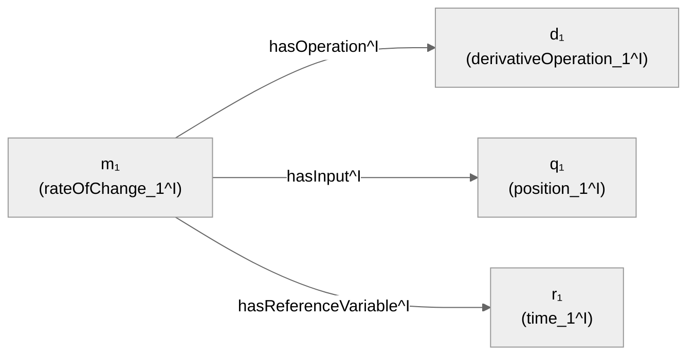

# Chương 4 — Bản thể học và Ngữ nghĩa Hình thức

> **Định hướng chương**
>
> **Câu hỏi trung tâm:** Làm thế nào các ký hiệu trong đồ thị có thể nhận được ý nghĩa hình
> thức đủ chính xác để máy xác định điều gì suy ra một cách logic từ một tập tiên đề?
>
> **Vì sao quan trọng:** Ba chương trước đã xây dựng cấu trúc đồ thị, biểu diễn RDF/Property
> Graph, lược đồ, danh tính và ngữ cảnh. Nhưng tất cả những lớp đó vẫn chưa trả lời được câu
> hỏi: khi nào một kết luận *bắt buộc phải đúng* nếu các tiền đề đúng? Chương này cung cấp cơ
> chế hình thức để trả lời câu hỏi đó.
>
> **Bạn sẽ hiểu:**
>
> - Sự khác biệt giữa cú pháp (ký hiệu) và ngữ nghĩa hình thức (ý nghĩa toán học)
> - Ontology là gì và khác schema ở điểm nào
> - Cơ chế trung tâm: diễn giải (interpretation) → mô hình (model) → suy diễn (entailment)
> - Điều kiện cần và điều kiện đủ trong định nghĩa lớp
> - Giả định thế giới mở (Open World Assumption) và hệ quả của nó
> - Phân biệt tính nhất quán (consistency), tính thỏa được (satisfiability), và suy diễn
> - Trực giác về Description Logic và OWL 2 profiles
>
> **Tiên quyết:** Chương 1–3. Đặc biệt: khái niệm triple RDF (§2.1), owl:sameAs và giả định
> tên duy nhất (§3.2), RDFS domain/range như quy tắc suy diễn (§2.1, §3.1).
>
> **Bản đồ khái niệm:**
>
> Ký hiệu ≠ Ý nghĩa → Ontology = cam kết ngữ nghĩa → Diễn giải gán nghĩa cho ký hiệu →
> Mô hình = diễn giải thỏa mọi tiên đề → Suy diễn = đúng trong mọi mô hình → Lớp như tập
> hợp → Điều kiện cần/đủ → Thế giới mở → Nhất quán vs Thỏa được

## 4.1 Mở đầu: Cú pháp không phải là ý nghĩa

Trong ba chương trước, chúng ta đã làm việc với các ký hiệu như `City`, `Country`,
`capitalOf`, `Hanoi`, `Vietnam`. Chúng ta đã dùng chúng để xây dựng đồ thị, truy vấn, và
gắn ngữ cảnh. Nhưng có một câu hỏi nền tảng mà chúng ta chưa trả lời:

Chuỗi ký tự `City` có nghĩa gì đối với máy?

Không có nghĩa gì cả — ít nhất là không tự thân. Tên gọi `City` chỉ là một chuỗi ký tự. Nó
không tự động tương ứng với tập hợp các thành phố trong thực tế. Tương tự, quan hệ
`capitalOf` không tự động mang theo bất kỳ tính chất logic nào (đối xứng? bắc cầu? hàm?) —
trừ khi chúng ta *nói rõ* bằng một cơ chế hình thức.

Đây là sự phân biệt cốt lõi của chương:

```
cú pháp / ký hiệu    ≠    ngữ nghĩa hình thức
(syntax)                  (formal semantics)
```

Cú pháp là cách viết. Ngữ nghĩa hình thức là quy tắc toán học xác định ký hiệu đó *nghĩa là
gì* — cụ thể hơn, nó xác định những diễn giải nào được phép và những kết luận nào bắt buộc
phải đúng.

Một **ontology** (bản thể học) là công cụ để nối cú pháp với ngữ nghĩa. Trong chương này,
chúng ta sẽ tìm hiểu cơ chế mà qua đó một ontology biến các ký hiệu rời rạc thành một hệ
thống ý nghĩa mà máy có thể suy luận trên đó.

> 🖊 **Tự kiểm tra:** Trước khi đọc tiếp, hãy thử giải thích bằng lời của bạn: tại sao việc
> đặt tên một nút là `City` trong đồ thị RDF chưa đủ để máy "hiểu" rằng nút đó đại diện cho
> lớp các thành phố? Thông tin bổ sung nào cần thiết?

## 4.2 Ontology là gì?

### Từ schema đến ontology

Chương 3 đã giới thiệu **schema** (lược đồ) như phần mô tả cấu trúc và từ vựng được kỳ
vọng của đồ thị dữ liệu: lớp nào tồn tại, quan hệ nào nối từ đâu đến đâu, thuộc tính nào
được phép [@hogan-knowledge-graphs]. Schema mô tả tổ chức, từ vựng và cấu trúc kỳ vọng.

Một **ontology** đi xa hơn: nó đưa ra các **cam kết ngữ nghĩa hình thức** (formal semantic
commitments) về các khái niệm và quan hệ trong miền tri thức. Nói cách khác:

- Schema nhấn mạnh cấu trúc và từ vựng kỳ vọng.
- Ontology nhấn mạnh các tiên đề logic xác định ý nghĩa của các khái niệm đó.

> ⚠ **Lưu ý về thuật ngữ:** Ranh giới giữa "schema" và "ontology" không tuyệt đối; các cộng
> đồng khác nhau dùng hai từ này với mức độ chồng lấn khác nhau. Trong cuốn sách này, chúng
> ta dùng sự phân biệt trên như một công cụ sư phạm, không phải như một định nghĩa phổ quát.

### Web Ontology Language (OWL)

**Web Ontology Language (OWL)** là chuẩn W3C để biểu diễn ontology trên nền RDF
[@w3c-owl2-overview]. OWL cung cấp một tập hợp các kiến tạo (constructs) để phát biểu các
tiên đề về lớp, thuộc tính và cá thể.

Một ontology OWL gồm ba loại thành phần:

1. **Thực thể** (entities): các đối tượng được đặt tên — lớp (class), thuộc tính đối tượng
   (object property), thuộc tính dữ liệu (data property), cá thể (individual).
2. **Biểu thức** (expressions): các tổ hợp của thực thể tạo thành mô tả phức tạp hơn — ví dụ
   "lớp những thứ vừa là City vừa có capitalOf trỏ đến một Country".
3. **Tiên đề** (axioms): các phát biểu ràng buộc ý nghĩa của thực thể và biểu thức — ví dụ
   "mọi CapitalCity đều là City".

> ⚠ **Phân biệt quan trọng:**
>
> - **Tên/nhãn** (name/label): chuỗi ký tự dùng để tham chiếu — `City`, `capitalOf`.
> - **Khai báo** (declaration): liên kết một IRI với một loại thực thể OWL (Class,
>   ObjectProperty, DataProperty, NamedIndividual, AnnotationProperty, Datatype). Khai báo hỗ
>   trợ quản lý từ vựng, phân loại và phân giải nhập nhằng, nhưng **không tạo ra hệ quả logic**
>   dưới Direct Semantics [@w3c-owl2-syntax].
> - **Tiên đề** (axiom): phát biểu ràng buộc ngữ nghĩa — "mọi City đều là Place". Tiên đề
>   mới là thứ tạo ra suy diễn.
> - **Chú thích** (annotation): thông tin dành cho con người — nhãn hiển thị, mô tả, bình
>   luận. Dưới OWL 2 Direct Semantics, chú thích **không có nghĩa ngữ nghĩa** và bị bỏ qua khi
>   tính suy diễn [@w3c-owl2-direct-semantics]. Tiên đề có thể mang chú thích, nhưng chú thích
>   đó vẫn không thay đổi nghĩa logic của tiên đề. Ứng dụng có thể diễn giải chú thích bên ngoài
>   ngữ nghĩa logic OWL.

Một chú thích `rdfs:label "Thành phố"` giúp con người đọc hiểu, nhưng bộ suy luận không dùng
nó để rút ra kết luận logic. Chỉ có tiên đề mới làm được điều đó.

## 4.3 Cơ chế trung tâm: Diễn giải → Mô hình → Suy diễn

Đây là phần quan trọng nhất của chương. Hãy đọc chậm.

### Toán học tối thiểu cho chương này

Chương này dùng nhiều ký hiệu toán học hơn các chương trước. Dưới đây là các ký hiệu sẽ
xuất hiện, kèm ý nghĩa:

| Ký hiệu | Đọc là | Nghĩa |
|---------|--------|-------|
| ∈ | "thuộc" | x ∈ S: x là phần tử của tập S |
| ⊆ | "tập con của" | A ⊆ B: mọi phần tử của A đều thuộc B |
| ∩ | "giao" | A ∩ B: tập các phần tử thuộc cả A lẫn B |
| ∪ | "hợp" | A ∪ B: tập các phần tử thuộc A hoặc B |
| ∅ | "tập rỗng" | tập không có phần tử nào |
| × | "tích Descartes" | A × B: tập các cặp (a,b) với a∈A, b∈B |
| ∀ | "với mọi" | ∀x: P(x) — P đúng cho mọi x |
| ∃ | "tồn tại" | ∃x: P(x) — có ít nhất một x sao cho P đúng |
| ⇒ | "kéo theo" | P ⇒ Q: nếu P đúng thì Q đúng |
| ⇔ | "khi và chỉ khi" | P ⇔ Q: P đúng khi và chỉ khi Q đúng |
| ⊑ | "lớp con của" | C ⊑ D: C là lớp con của D (subsumption) |
| ⊓ | "giao" (DL) | C ⊓ D: giao của hai lớp trong Description Logic |
| ⊔ | "hợp" (DL) | C ⊔ D: hợp của hai lớp trong Description Logic |
| ¬ | "phủ định" | ¬C: phần bù của lớp C |
| ⊨ | "suy diễn" | O ⊨ α: ontology O suy diễn ra α |
| ^I | "diễn giải I" | C^I: tập mà lớp C được diễn giải thành |

Bạn không cần nhớ hết ngay. Bảng này là tài liệu tham khảo; mỗi ký hiệu sẽ được giải thích
trong ngữ cảnh khi xuất hiện lần đầu.

### Diễn giải (Interpretation)

Một **diễn giải** I là một cách gán ý nghĩa toán học cho các ký hiệu trong ontology. Cụ
thể, một diễn giải gồm:

1. Một **miền diễn giải** (interpretation domain) Δ^I — một tập hợp khác rỗng chứa các "đối
   tượng" mà chúng ta đang nói về.

2. Một **hàm diễn giải** (·)^I gán mỗi ký hiệu với một đối tượng toán học trên miền Δ^I.

Hãy xem xét một ví dụ cụ thể. Giả sử ontology của chúng ta có các ký hiệu: `City`,
`Country`, `Place`, `capitalOf`, `Hanoi`, `Vietnam`. Một diễn giải I có thể là:

```
Δ^I = {h, v, p, f}
```

Đây là miền diễn giải — bốn phần tử trừu tượng. Lưu ý: h, v, p, f **không phải** là chuỗi
ký tự "Hanoi", "Vietnam". Chúng là các phần tử toán học trong miền. Sự kết nối giữa tên gọi
và phần tử miền nằm ở hàm diễn giải:

```
Hanoi^I   = h
Vietnam^I = v
```

Mỗi tên cá thể (individual name) được gán với đúng một phần tử của miền. Đây chính là sự
khác biệt giữa **tên** và **thực thể** mà Chương 3 đã nhấn mạnh: tên là ký hiệu, phần tử
miền là đối tượng toán học mà tên đó biểu thị trong diễn giải này.

Lớp được diễn giải thành **tập con** của miền:

```
City^I    = {h, p}
Country^I = {v, f}
Place^I   = {h, v, p, f}
```

Đọc $City^I \subseteq \Delta^I$ như sau: "Trong diễn giải I, lớp City được gán với tập con {h, p} của
miền." Nói cách khác, trong diễn giải này, h và p là các "thành phố".

Tập $\{h, p\}$ — ảnh của ký hiệu `City` dưới hàm diễn giải — được gọi là **class extension**
(mở rộng lớp) của `City` trong diễn giải I. Hai diễn giải khác nhau có thể gán hai class
extension khác nhau cho cùng một tên lớp; nhiệm vụ của ontology là ép mọi mô hình phải chọn
class extension thỏa mãn các tiên đề.

Thuộc tính đối tượng được diễn giải thành **quan hệ hai ngôi** trên miền:

```
capitalOf^I = {(h, v), (p, f)}
```

Đọc $capitalOf^I \subseteq \Delta^I \times \Delta^I$ như sau: "Trong diễn giải I, quan hệ capitalOf được gán với
tập các cặp {(h,v), (p,f)}." Nghĩa là: trong diễn giải này, h có quan hệ capitalOf với v,
và p có quan hệ capitalOf với f.

Hình bên dưới minh họa toàn bộ cấu trúc của một diễn giải: miền $\Delta^I$, các lớp như tập con,
các cá thể như phần tử cụ thể, và thuộc tính như quan hệ giữa các phần tử. Hãy đọc hình từ
trái sang phải: tên ký hiệu ở ngoài, phần tử miền ở trong, mũi tên biểu thị quan hệ.


### Thuộc tính dữ liệu và miền dữ liệu

OWL phân biệt hai loại thuộc tính. **Thuộc tính đối tượng** (object property) nối cá thể với
cá thể: $R^I \subseteq \Delta^I \times \Delta^I$. **Thuộc tính dữ liệu** (data property) nối cá thể với giá trị dữ
liệu: $P^I \subseteq \Delta^I \times \Delta_D$, trong đó $\Delta_D$ là **miền dữ liệu** (data domain) — tập các giá trị
như chuỗi, số, ngày tháng. Miền dữ liệu $\Delta_D$ khác rỗng và **rời nhau** với miền đối tượng $\Delta^I$
[@w3c-owl2-direct-semantics].

Ví dụ: `hasName(Hanoi, "Hà Nội")` hoặc `population(Hanoi, 8000000)`. Ở đây `"Hà Nội"` và
`8000000` là phần tử của $\Delta_D$, không phải của $\Delta^I$.

> ⚠ **Lưu ý sư phạm:** Phần đầu chương dùng ký hiệu đơn giản hóa $I = (\Delta^I, \cdot^I)$ để tập trung
> vào cơ chế cốt lõi. Khi làm việc với thuộc tính dữ liệu, hãy nhớ rằng ngữ nghĩa đầy đủ bao
> gồm cả miền dữ liệu $\Delta_D$ rời nhau. Ký hiệu đơn giản hóa không sai — nó chỉ chưa đủ cho thuộc
> tính dữ liệu.

> ⚠ **Quan trọng:** Một diễn giải chỉ là *một cách* gán nghĩa. Có vô số diễn giải khác nhau
> cho cùng một bộ ký hiệu. Ví dụ, một diễn giải J có thể gán $City^J = \{v\}$ — nghĩa là
> trong J, chỉ có v là "thành phố". Diễn giải J hoàn toàn hợp lệ về mặt toán học, dù nó
> không khớp với trực giác của chúng ta về thành phố. Vai trò của ontology là *loại bỏ* các
> diễn giải không phù hợp với ý định mô hình hóa.

### Tiên đề và sự thỏa mãn (Satisfaction)

Một **tiên đề** (axiom) là một phát biểu ràng buộc các diễn giải được phép. Xét tiên đề:

```
City ⊑ Place
```

Đọc: "City là lớp con của Place." Ý nghĩa hình thức của tiên đề này là điều kiện:

```
City^I ⊆ Place^I
```

Nghĩa là: trong bất kỳ diễn giải nào thỏa mãn tiên đề này, tập mà City được gán phải là tập
con của tập mà Place được gán.

Quay lại ví dụ: trong diễn giải I ở trên, $City^I = \{h, p\}$ và $Place^I = \{h, v, p, f\}$.
Vì $\{h, p\} \subseteq \{h, v, p, f\}$, diễn giải I **thỏa mãn** tiên đề `City ⊑ Place`.

Ngược lại, xét diễn giải K với $City^K = \{h, p\}$ và $Place^K = \{h\}$. Vì $\{h, p\} \not\subseteq \{h\}$
(phần tử p thuộc $City^K$ nhưng không thuộc $Place^K$), diễn giải K **không thỏa mãn** tiên đề
này.

Một diễn giải **thỏa mãn** một tiên đề khi điều kiện ngữ nghĩa của tiên đề đó đúng trong
diễn giải đó.

### Mô hình (Model)

Một **mô hình** của ontology O là một diễn giải thỏa mãn **tất cả** các tiên đề trong O.

Nói cách khác: mô hình là diễn giải "hợp lệ" — diễn giải mà mọi tiên đề đều đúng.

```
Models(O) = { I | I thỏa mãn mọi tiên đề trong O }
```

Xét ontology O gồm hai tiên đề:

```
(1) City ⊑ Place
(2) Country ⊑ Place
```

Diễn giải I ở trên (với $Place^I = \{h, v, p, f\}$, $City^I = \{h, p\}$, $Country^I = \{v, f\}$)
thỏa mãn cả hai → I là một mô hình của O.

Diễn giải K (với $Place^K = \{h\}$) không thỏa mãn (1) → K không phải mô hình của O.

> 🖊 **Tự kiểm tra:** Tại sao "mô hình" không giống với "ontology"? Ontology là tập tiên đề
> (mô tả các ràng buộc). Mô hình là một diễn giải cụ thể thỏa mãn các ràng buộc đó. Một
> ontology có thể có nhiều mô hình khác nhau. Hãy giải thích bằng lời của bạn: tại sao việc
> có nhiều mô hình là đặc điểm thiết kế, không phải lỗi?

### Suy diễn (Entailment)

Bây giờ chúng ta đã sẵn sàng cho khái niệm trung tâm:

```
O ⊨ α
```

Đọc: **"Ontology O suy diễn ra alpha."**

Nghĩa chính xác: **mọi mô hình của O đều thỏa mãn α**.

Nói cách khác: α đúng trong *tất cả* các diễn giải hợp lệ của O. Không có ngoại lệ. Nếu bạn
tìm được dù chỉ một mô hình của O mà trong đó α sai, thì O ⊭ α (O không suy diễn ra α).

**Ví dụ cụ thể.** Xét ontology O gồm:

```
(1) CapitalCity ⊑ City
(2) Hanoi : CapitalCity
```

(Tiên đề (2) nói: cá thể Hanoi thuộc lớp CapitalCity.)

Câu hỏi: O có suy diễn ra `Hanoi : City` không?

Hãy xét bất kỳ mô hình M nào của O. Vì M thỏa mãn (1), ta có $CapitalCity^M \subseteq City^M$.
Vì M thỏa mãn (2), ta có $Hanoi^M \in CapitalCity^M$. Kết hợp hai điều: $Hanoi^M \in City^M$.
Vậy `Hanoi : City` đúng trong M.

Vì lập luận trên đúng cho *mọi* mô hình M của O, ta kết luận:

```
O ⊨ Hanoi : City
```

Đây không phải là "máy đoán" hay "AI phát hiện". Đây là hệ quả logic bắt buộc từ cấu trúc
toán học của các mô hình.

> ⚠ **Suy diễn KHÔNG có nghĩa là:**
>
> - α đúng trong thực tế (tiền đề có thể sai).
> - Nguồn dữ liệu đáng tin cậy (suy diễn không đánh giá provenance).
> - Dữ liệu đầu vào hợp lệ (suy diễn không kiểm tra validation).
> - Máy "hiểu" theo nghĩa con người (máy thao tác trên cấu trúc toán học, không có ý thức
>   về ý nghĩa).
>
> Suy diễn chỉ có nghĩa là: **nếu** các tiên đề đúng, **thì** α cũng đúng. Đó là một phát
> biểu có điều kiện, không phải khẳng định tuyệt đối.

### Tóm tắt cơ chế

Hình bên dưới trực quan hóa mối quan hệ giữa diễn giải, mô hình và suy diễn. Tập lớn nhất
là tất cả các diễn giải có thể; tập con xanh là các mô hình của $O$ (thỏa mãn mọi tiên đề);
$\alpha$ đúng trong mọi mô hình đó nghĩa là $O \models \alpha$. Các diễn giải ngoài tập mô
hình (như $J_1$, $J_2$) vi phạm ít nhất một tiên đề.


```
Từ vựng + Tiên đề
        ↓
Các diễn giải có thể
        ↓ áp dụng tiên đề: loại bỏ diễn giải vi phạm
Models(O)
        ↓ α đúng trong mọi mô hình?
O ⊨ α
```

Ontology reasoning không phải là máy "suy nghĩ giống người". Nó là sự thu hẹp tập các diễn
giải có thể bằng các ràng buộc hình thức, rồi kiểm tra xem một phát biểu có đúng trong tất
cả các diễn giải còn lại hay không.

### Diễn giải trên miền cơ chế — chuyển giao toàn bộ máy móc

Ví dụ thành phố dùng để học *cơ chế hình thức*. Máy móc đó không dành riêng cho địa lý:
hãy diễn giải cùng một hệ ký hiệu trên miền cơ chế — chính cơ chế `RATE_OF_CHANGE` của
xuyên suốt cuốn sách.

Miền diễn giải gồm bốn phần tử cơ chế:

```
Δ^I = { m₁, d₁, q₁, r₁ }
```

trong đó $m_1$ sẽ "đóng vai" cơ chế rate of change, $d_1$ đóng vai phép toán đạo hàm,
$q_1$ đóng vai đại lượng position, và $r_1$ đóng vai biến thời gian. Hàm diễn giải gán tên
cho các phần tử miền:

```
rateOfChange_1^I        = m₁
derivativeOperation_1^I = d₁
position_1^I            = q₁
time_1^I                = r₁
```

Lớp được diễn giải thành tập con của miền:

```
Mechanism^I              = { m₁ }
RateOfChangeMechanism^I  = { m₁ }
DerivativeOperation^I    = { d₁ }
Quantity^I               = { q₁ }
ReferenceVariable^I      = { r₁ }
```

Thuộc tính đối tượng được diễn giải thành quan hệ hai ngôi:

```
hasOperation^I         = { (m₁, d₁) }
hasInput^I             = { (m₁, q₁) }
hasReferenceVariable^I = { (m₁, r₁) }
```



Hình: cùng một cấu trúc diễn giải như ví dụ thành phố, trên miền cơ chế. Miền
$\Delta^I = \{m_1, d_1, q_1, r_1\}$, lớp là tập con, thuộc tính là quan hệ.

Bây giờ kiểm tra sự thỏa mãn. Xét tiên đề định nghĩa `RateOfChangeMechanism` (sẽ được viết
đầy đủ ở §4.13):

```
RateOfChangeMechanism ≡ Mechanism ⊓ ∃hasOperation.DerivativeOperation
                        ⊓ ∃hasInput.Quantity ⊓ ∃hasReferenceVariable.ReferenceVariable
```

Trong diễn giải I:

- $m_1 \in \mathit{Mechanism}^I$ vì $\mathit{Mechanism}^I = \{m_1\}$.
- $m_1 \in (\exists hasOperation.\mathit{DerivativeOperation})^I$ vì tồn tại $\langle m_1, d_1\rangle \in hasOperation^I$ với $d_1 \in \mathit{DerivativeOperation}^I$.
- $m_1 \in (\exists hasInput.\mathit{Quantity})^I$ vì $\langle m_1, q_1\rangle \in hasInput^I$ với $q_1 \in \mathit{Quantity}^I$.
- $m_1 \in (\exists hasReferenceVariable.\mathit{ReferenceVariable})^I$ vì $\langle m_1, r_1\rangle \in hasReferenceVariable^I$ với $r_1 \in \mathit{ReferenceVariable}^I$.

Cả bốn điều kiện đúng → $\mathit{rateOfChange\_1}^I = m_1 \in \mathit{RateOfChangeMechanism}^I$. Diễn
giải I tuân theo định nghĩa cơ chế.

**Đối chứng — một diễn giải thỏa mãn ontology thành phố nhưng vi phạm tiên đề cơ chế.**
Xét diễn giải L diễn giải các ký hiệu địa lý như bình thường: $\mathit{City}^L = \{h, p\}$,
$\mathit{capitalOf}^L = \{(h,v), (p,f)\}$ — L thỏa mãn `City ⊑ Place`, `capitalOf` nối
thành phố–quốc gia, v.v. Nhưng L gán $\mathit{rateOfChange\_1}^L = m_5$ với
$hasOperation^L = \varnothing$. Khi đó $m_5 \notin (\exists hasOperation.\mathit{DerivativeOperation})^L$
— không có part tử nào vừa là DerivativeOperation vừa liên kết hasOperation với $m_5$ — nên theo
định nghĩa, $m_5 \notin \mathit{RateOfChangeMechanism}^L$. Ngoài định nghĩa, ontology cơ chế còn
**khẳng định** cá thể `rateOfChange_1 : RateOfChangeMechanism` (rateOfChange_1 *là* một cơ chế tốc
độ biến thiên). Vì L đặt $\mathit{rateOfChange\_1}^L = m_5$ ra ngoài lớp này, L vi phạm khẳng định
ấy. Do vậy L là mô hình của ontology thành phố nhưng *không* là mô hình của ontology cơ chế. Bài
học của §4.3 được tái khẳng định trên miền cơ chế: **thỏa mãn một bộ tiên đề không ngụ ý thỏa mãn
bộ khác**; một diễn giải hợp lệ về địa lý vẫn có thể "vô lý" về mặt cơ chế.

> 🖊 **Tự kiểm tra:** Dựng một diễn giải M trên miền cơ chế gồm năm phần tử
> $\{m_1, d_1, d_2, q_1, r_1\}$ với $hasOperation^M = \{(m_1, d_1), (m_1, d_2)\}$ và
> $\mathit{DerivativeOperation}^M = \{d_1\}$. Hỏi: $m_1$ có thuộc
> $(\exists hasOperation.\mathit{DerivativeOperation})^M$ không? *Chỉ dẫn — đáp án:* kiểm
> tra từng cặp trong $hasOperation^M$. Cặp $\langle m_1, d_1\rangle$ đưa đến $d_1$, và
> $d_1 \in \mathit{DerivativeOperation}^M$ → có ít nhất một liên kết như vậy → câu trả lời
> là **có**: $m_1$ thuộc hạn chế tồn tại. (Lưu ý: cặp $\langle m_1, d_2\rangle$ đưa đến $d_2
> \notin \mathit{DerivativeOperation}^M$ nhưng điều đó không bác bỏ câu trả lời — hạn chế
> tồn tại chỉ cần *một* liên kết đúng. Định nghĩa hình thức của $\exists R.C$ và $\forall R.C$
> ở §4.6.)

## 4.4 Lớp như tập hợp: subclass, equivalence, disjointness

Bây giờ ta áp dụng cơ chế diễn giải/mô hình/suy diễn vào các quan hệ giữa lớp.

### Subclass (Lớp con)

```
City ⊑ Place
```

Điều kiện ngữ nghĩa: $City^I \subseteq Place^I$ trong mọi mô hình.

Đây là quan hệ **một chiều**. Từ `City ⊑ Place`, ta biết mọi City đều là Place. Nhưng ta
**không** biết mọi Place đều là City. Place có thể chứa các phần tử không thuộc City.

### Equivalent Classes (Lớp tương đương)

```
A ≡ B
```

Điều kiện ngữ nghĩa: $A^I = B^I$ trong mọi mô hình.

Hai lớp tương đương khi và chỉ khi chúng có **cùng tập thành viên** trong mọi mô hình. Đây
là quan hệ hai chiều: $A \equiv B$ tương đương với cả $A \sqsubseteq B$ lẫn $B \sqsubseteq A$.

> ⚠ **Ngộ nhận phổ biến:** Nhầm lẫn `owl:equivalentClass` với `owl:sameAs`.
>
> - `owl:sameAs` (Chương 3): hai **cá thể** là một. `ex:Hanoi owl:sameAs wd:Q1858` nghĩa là
>   hai tên này chỉ cùng một cá thể.
> - `owl:equivalentClass`: hai **lớp** có cùng tập thành viên. $City \equiv UrbanArea$ nghĩa là
>   trong mọi mô hình, tập các City bằng tập các UrbanArea.
>
> Một bên nói về identity của cá thể. Một bên nói về equality của tập hợp. Đừng nhầm.

### Disjoint Classes (Lớp rời nhau)

```
City ⊓ Country ≡ ⊥
```

Điều kiện ngữ nghĩa: $City^I \cap Country^I = \emptyset$ trong mọi mô hình.

Nghĩa là: không có phần tử nào vừa là City vừa là Country.

> ⚠ **Quan trọng:** Các tên lớp khác nhau **không tự động** rời nhau. Việc `City` và
> `Country` là hai tên khác nhau không ngụ ý $City^I \cap Country^I = \emptyset$. Tính rời nhau phải
> được **khai báo tường minh** bằng một tiên đề. Đây là hệ quả trực tiếp của việc OWL không
> có giả định tên duy nhất (Chương 3): tên khác nhau không ngụ ý thực thể khác nhau, và
> tương tự, tên lớp khác nhau không ngụ ý tập thành viên rời nhau.

**Phản ví dụ:** Giả sử ontology chỉ có `City` và `Country` mà không có tiên đề disjointness.
Khi đó tồn tại một mô hình trong đó $City^I = \{h, v\}$ và $Country^I = \{v, f\}$ — phần tử v
thuộc cả hai lớp. Mô hình này hoàn toàn hợp lệ vì không có tiên đề nào cấm nó.

## 4.5 Điều kiện cần và điều kiện đủ

Đây là một trong những phần sâu nhất của chương. Hãy đọc kỹ.

### SubClassOf là điều kiện đủ một chiều

Xét:

```
CapitalCity ⊑ City
```

Đọc: "Mọi CapitalCity đều là City." Về mặt logic:

- Nếu x là CapitalCity ⇒ x là City. (Điều kiện **đủ**: là CapitalCity đủ để kết luận là City.)
- Nếu x là City ⇒ x là CapitalCity? **KHÔNG.** Là City không đủ để kết luận là CapitalCity.

Nói cách khác, `CapitalCity ⊑ City` cho ta: CapitalCity là điều kiện **đủ** cho City (là
CapitalCity thì chắc chắn là City), và City là điều kiện **cần** cho CapitalCity (muốn là
CapitalCity thì trước hết phải là City). Hướng rất quan trọng: $A \sqsubseteq B$ nghĩa là A đủ cho B, B
cần cho A.

### Điều kiện cần: SubClassOf với biểu thức lớp

Xét:

```
CapitalCity ⊑ City ⊓ ∃capitalOf.Country
```

Đọc: "Mọi CapitalCity đều là City VÀ có quan hệ capitalOf đến ít nhất một Country."

Vế phải ($City \sqcap \exists capitalOf.Country$) mô tả các **điều kiện cần** cho CapitalCity: nếu một
cá thể là CapitalCity, thì nó *phải* thỏa mãn cả hai điều kiện này. Nhưng ngược lại chưa
đúng: một cá thể thỏa mãn vế phải chưa chắc là CapitalCity (vì tiên đề chỉ nói một chiều).

### Điều kiện cần VÀ đủ: EquivalentClasses

Xét:

```
CapitalCity ≡ City ⊓ ∃capitalOf.Country
```

Đọc: "CapitalCity khi và chỉ khi là City và có quan hệ capitalOf đến ít nhất một Country."

Bây giờ vế phải vừa là điều kiện cần vừa là điều kiện đủ. Bất kỳ cá thể nào thỏa mãn vế
phải đều được phân loại là CapitalCity, và ngược lại.

**Ví dụ cụ thể.** Giả sử ontology O chứa:

```
(1) CapitalCity ≡ City ⊓ ∃capitalOf.Country
(2) Hanoi : City
(3) Vietnam : Country
(4) capitalOf(Hanoi, Vietnam)
```

Câu hỏi: O ⊨ `Hanoi : CapitalCity`?

Hãy xét bất kỳ mô hình M nào của O:

- Từ (2): $Hanoi^M \in City^M$
- Từ (3): $Vietnam^M \in Country^M$
- Từ (4): $(Hanoi^M, Vietnam^M) \in capitalOf^M$

Kết hợp: $Hanoi^M \in City^M$ và tồn tại $Vietnam^M \in Country^M$ sao cho
$(Hanoi^M, Vietnam^M) \in capitalOf^M$. Vậy $Hanoi^M$ thuộc tập $\{x \mid x \in City^M \text{ và } \exists y:
(x,y) \in capitalOf^M \text{ và } y \in Country^M\}$.

Từ (1), tập này chính là $CapitalCity^M$. Vậy $Hanoi^M \in CapitalCity^M$.

Vì lập luận đúng cho mọi mô hình M:

```
O ⊨ Hanoi : CapitalCity
```

> 🖊 **Tự kiểm tra:** Giả sử thay (1) bằng $CapitalCity \sqsubseteq City \sqcap \exists capitalOf.Country$ (chỉ
> SubClassOf, không phải Equivalence). Với cùng dữ liệu (2)-(4), O có suy diễn ra
> `Hanoi : CapitalCity` không? Tại sao? Gợi ý: xét xem có tồn tại mô hình nào trong đó
> Hanoi thỏa mãn vế phải nhưng không thuộc $CapitalCity^M$ không.

## 4.6 Biểu thức lớp (Class Expressions)

OWL cung cấp các kiến tạo để xây dựng biểu thức lớp phức tạp từ các lớp đơn giản. Mỗi biểu
thức có ngữ nghĩa tập hợp chính xác.

### Giao (Intersection)

```
C ⊓ D
```

Ngữ nghĩa: $(C \sqcap D)^I = C^I \cap D^I$

Tập các phần tử thuộc **cả** C lẫn D. Ví dụ: $City \sqcap HasAirport$ là lớp các thành phố có
sân bay.

### Hợp (Union)

```
C ⊔ D
```

Ngữ nghĩa: $(C \sqcup D)^I = C^I \cup D^I$

Tập các phần tử thuộc C **hoặc** D (hoặc cả hai).

Trên miền cơ chế: `Quantity ⊔ ReferenceVariable` là lớp mọi thứ hoặc là một đại lượng đầu
vào/đầu ra, hoặc là một biến tham chiếu. Ví dụ: `position_1 : Quantity` và `time_1 :
ReferenceVariable` — cả hai đều thuộc lớp hợp này.

### Phủ định (Complement)

```
¬C
```

Ngữ nghĩa: $(\neg C)^I = \Delta^I \setminus C^I$

Tập các phần tử trong miền **không** thuộc C. Lưu ý: phủ định tính tương đối so với miền
diễn giải $\Delta^I$, không phải "mọi thứ trong vũ trụ".

Trên miền cơ chế: `¬RateOfChangeMechanism` là lớp mọi thực thể **không phải** cơ chế tốc
độ biến thiên. Trong diễn giải I của §4.3, $\mathit{RateOfChangeMechanism}^I = \{m_1\}$ còn
$\mathit{derivativeOperation\_1}^I = d_1 \notin \{m_1\}$, nên $d_1 \in (\neg\mathit{RateOfChangeMechanism})^I$
— tức `derivativeOperation_1` rơi vào lớp phủ định này. Lưu ý quan trọng: điều đó đúng *trong I*
vì I gán $d_1$ ra ngoài lớp cơ chế; nó **không** phải một hệ quả logic từ `DerivativeOperation ⊑
¬RateOfChangeMechanism`. Muốn suy ra hệ quả đó cho *mọi* diễn giải, ta phải tiên đề hóa
`DisjointClasses(DerivativeOperation, RateOfChangeMechanism)` (xem §4.4) — không được giả định
tách rời khi chưa có tiên đề. Phủ định cho phép nói "X không thuộc loại Y" trong một diễn giải cụ
thể mà không cần liệt kê tường minh.

### Hạn chế tồn tại (Existential Restriction)

```
∃ R.C
```

Đọc: "những thứ có ít nhất một R-liên kết đến một phần tử thuộc C."

Ngữ nghĩa:

```
(∃ R.C)^I = { x ∈ Δ^I | ∃y: (x,y) ∈ R^I và y ∈ C^I }
```

**Ví dụ:** $\exists capitalOf.Country$ là lớp các cá thể có quan hệ capitalOf đến ít nhất một
Country. Trong diễn giải I ở trên, $Hanoi^I = h$ và $(h,v) \in capitalOf^I$ với
$v \in Country^I$, nên $h \in (\exists capitalOf.Country)^I$.

> ⚠ **Hệ quả quan trọng của thế giới mở:** Hạn chế tồn tại yêu cầu sự **tồn tại** của một
> phần tử y trong miền diễn giải, nhưng y **không nhất thiết phải có tên** trong đồ thị RDF.
> Nghĩa là: ontology có thể đòi hỏi rằng "trong mọi mô hình, tồn tại một Country mà Hanoi có
> quan hệ capitalOf đến" ngay cả khi không có cá thể Country nào được đặt tên tường minh trong
> dữ liệu.
>
> **Phân biệt bắt buộc:**
> - **Tồn tại ngữ nghĩa (semantic existence):** ontology đòi hỏi phần tử phù hợp trong mọi mô
>   hình. Đây là phát biểu về cấu trúc toán học của các mô hình.
> - **Vật chất hóa (materialization):** một bộ suy luận cụ thể *có thể* dùng witness, nút ẩn,
>   hoặc biểu diễn Skolem để tính toán — nhưng đây là hành vi triển khai, không phải bản thân
>   quan hệ suy diễn.
> - **Suy diễn OWL KHÔNG tự động thêm blank node hay triple RDF vào đồ thị nguồn.**
>
> Tồn tại ngữ nghĩa ≠ nút được vật chất hóa/serialized.

### Hạn chế phổ quát (Universal Restriction)

```
∀ R.C
```

Đọc: "những thứ mà mọi R-liên kết đều dẫn đến phần tử thuộc C."

Ngữ nghĩa:

```
(∀ R.C)^I = { x ∈ Δ^I | ∀y: (x,y) ∈ R^I ⇒ y ∈ C^I }
```

> ⚠ **Ranh giới tinh tế — hai mức độ khác nhau:**
>
> **Mức A — Trong một diễn giải I cụ thể:** Nếu x không có bất kỳ R-liên kết nào *trong I*,
> thì x ∈ (∀R.C)^I — một cách trống rỗng (vacuously true). Đây là hệ quả của logic cổ điển:
> "với mọi y, nếu (x,y) ∈ R^I thì y ∈ C^I" đúng tự động khi không có y nào thỏa (x,y) ∈ R^I.
>
> **Mức B — Suy diễn từ ontology/dữ liệu:** Nếu đồ thị RDF chỉ đơn thuần *không chứa* triple
> R nào cho x, điều đó **KHÔNG** suy diễn ra $x : \forall R.C$. Vì dưới giả định thế giới mở, có thể
> tồn tại một mô hình khác chứa R-liên kết chưa được khẳng định trong dữ liệu, và liên kết đó
> dẫn đến phần tử không thuộc C.
>
> **Phân biệt bắt buộc:** Vắng mặt trong dữ liệu/serialization ≠ vắng mặt trong diễn giải.
>
> **Ví dụ:** Giả sử $\forall hasChild.Doctor$ ("mọi con đều là bác sĩ").
> - Trong một diễn giải I cụ thể mà Alice không có con: $Alice \in (\forall hasChild.Doctor)^I$ (trống
>   rỗng).
> - Nhưng từ dữ liệu RDF chỉ thiếu triple hasChild cho Alice, ta **không** suy diễn được
>   $Alice : \forall hasChild.Doctor$ — vì có thể tồn tại mô hình trong đó Alice có con không phải bác
>   sĩ.
>
> Đây là lý do hạn chế phổ quát không thể dùng như một ràng buộc "phải có ít nhất một giá trị".

Hình bên dưới so sánh trực quan hai loại hạn chế. Bên trái: $\exists R.C$ yêu cầu tồn tại ít
nhất một $R$-liên kết đến phần tử thuộc $C$. Bên phải: $\forall R.C$ yêu cầu *mọi* $R$-liên
kết đều dẫn đến $C$ — nếu không có liên kết nào, điều kiện đúng trống rỗng. Lưu ý phần cảnh
báo phía dưới về sự khác biệt giữa vắng mặt trong dữ liệu và vắng mặt trong diễn giải.


### Ràng buộc số lượng (Cardinality)

OWL cung cấp các hạn chế về số lượng:

```
≥ n R.C    (ít nhất n R-liên kết đến phần tử thuộc C)
≤ n R.C    (nhiều nhất n R-liên kết đến phần tử thuộc C)
= n R.C    (đúng n R-liên kết đến phần tử thuộc C)
```

> ⚠ **OWL cardinality KHÔNG phải là form validation.** Trong cơ sở dữ liệu, "required field"
> hay "unique constraint" kiểm tra dữ liệu hiện có. Trong OWL, dưới giả định thế giới mở và
> không có giả định tên duy nhất:
>
> - $\geq 1\ hasChild.Person$ không yêu cầu dữ liệu RDF phải chứa một triple hasChild tường minh.
>   Ontology đòi hỏi rằng trong mọi mô hình, tồn tại một Person phù hợp. Bộ suy luận có thể
>   biểu diễn witness nội bộ hoặc vật chất hóa một nút ẩn — nhưng đó là hành vi triển khai,
>   không phải bản thân quan hệ suy diễn.
> - $\leq 1\ hasNationalCapital.City$ với hai tên `Hanoi` và `HaNoiCity` không tự động gây lỗi.
>   Ontology suy diễn rằng Hanoi và HaNoiCity biểu thị cùng một cá thể (Chương 3). Bộ suy luận
>   có thể biểu diễn hệ quả này bằng `owl:sameAs`, nhưng đó là hành vi triển khai.
>
> Validation theo nghĩa "kiểm tra dữ liệu tuân thủ quy tắc" là công việc của SHACL (Chương 5),
> không phải OWL.

## 4.7 Ngữ nghĩa thuộc tính (Property Semantics)

Ngoài lớp, OWL còn cho phép phát biểu tiên đề về thuộc tính. Dưới đây là các đặc trưng
quan trọng nhất, mỗi đặc trưng được giải thích qua cơ chế thay vì chỉ liệt kê.

### Subproperty (Thuộc tính con)

```
capitalOf ⊑ locatedIn
```

Ngữ nghĩa: $capitalOf^I \subseteq locatedIn^I$ trong mọi mô hình.

Nếu $(x,y) \in capitalOf^I$ thì $(x,y) \in locatedIn^I$. Mọi cặp thủ đô-quốc gia cũng là cặp
"nằm trong".

### Inverse (Nghịch đảo)

```
capitalOf⁻ ≡ hasCapital
```

Ngữ nghĩa: $(x,y) \in capitalOf^I \Leftrightarrow (y,x) \in hasCapital^I$.

Nếu Hanoi capitalOf Vietnam thì Vietnam hasCapital Hanoi, và ngược lại.

### Symmetric (Đối xứng)

```
Sym(sisterCity)
```

Ngữ nghĩa: $(x,y) \in sisterCity^I \Rightarrow (y,x) \in sisterCity^I$.

Nếu Hanoi sisterCity Paris thì Paris sisterCity Hanoi.

### Transitive (Bắc cầu)

```
Trans(locatedIn)
```

Ngữ nghĩa: $(x,y) \in locatedIn^I$ và $(y,z) \in locatedIn^I \Rightarrow (x,z) \in locatedIn^I$.

Nếu Hanoi locatedIn Vietnam và Vietnam locatedIn SoutheastAsia thì Hanoi locatedIn
SoutheastAsia.

### Functional (Hàm)

```
Func(hasNationalCapital)
```

Ngữ nghĩa: $(x,y) \in hasNationalCapital^I$ và $(x,z) \in hasNationalCapital^I \Rightarrow y = z$.

Mỗi cá thể có **nhiều nhất một** hasNationalCapital trong mô hình.

> ⚠ **Bất ngờ quan trọng cho kỹ sư cơ sở dữ liệu:** Giả sử ontology khai báo
> `Func(hasNationalCapital)` và dữ liệu chứa:
>
> ```
> Vietnam hasNationalCapital Hanoi
> Vietnam hasNationalCapital HaNoiCity
> ```
>
> Trong cơ sở dữ liệu quan hệ, đây là vi phạm ràng buộc unique. Nhưng trong OWL, vì không có
> giả định tên duy nhất (Chương 3), ontology **không mâu thuẫn**. Thay vào đó, ontology suy
> diễn rằng hai tên biểu thị cùng một cá thể:
>
> ```
> O ⊨ Hanoi và HaNoiCity là cùng một cá thể
> ```
>
> Một bộ suy luận có thể biểu diễn hệ quả này bằng `owl:sameAs`, nhưng bản thân quan hệ suy
> diễn là phát biểu ngữ nghĩa, không phải hành động thêm triple. Nếu ontology đồng thời khẳng
> định `Hanoi owl:differentFrom HaNoiCity`, thì tính functional sẽ khiến ontology **không nhất
> quán**. Nếu bạn muốn từ chối dữ liệu trùng lặp, hãy dùng SHACL (Chương 5).

### Inverse-Functional (Nghịch đảo hàm)

```
InvFunc(hasNationalCapital)
```

Ngữ nghĩa: $(x,z) \in hasNationalCapital^I$ và $(y,z) \in hasNationalCapital^I \Rightarrow x = y$.

Nếu hai quốc gia đều có cùng thủ đô (theo hasNationalCapital), thì hai quốc gia đó là một.

### Reflexivity, Asymmetry và Property Chains

OWL còn hỗ trợ ba đặc trưng bổ sung:

**Reflexive (phản xạ):** mọi cá thể đều có quan hệ với chính nó. `Reflexive(hasIdentity)` — mọi
thứ đều có quan hệ hasIdentity với chính nó. $R^I$ chứa $\{(x,x) \mid x \in \Delta^I\}$.
Trên miền cơ chế: `ex:rateOfChange_1 ex:hasIdentity ex:rateOfChange_1` — mỗi cơ chế liên
kết với chính nó qua hasIdentity. Tính chất này hiếm khi dùng cho các quan hệ nội dung
(chẳng hạn `requires` không được khai báo Reflexive) — nó chủ yếu phục vụ quan hệ định
danh.

**Irreflexive (phản xạ đảo):** không cá thể nào có quan hệ với chính nó. `Irreflexive(hasProperPart)`.
Trên miền cơ chế: `Irreflexive(requires)` — một cơ chế không thể `requires` chính nó. $R^I \cap \{(x,x) \mid x \in \Delta^I\} = \varnothing$.

**Asymmetric (bất đối xứng):** nếu $x$ quan hệ với $y$ thì $y$ không thể quan hệ với $x$.
`Asymmetric(hasInput)` — nếu mechanism M có M's input là quantity Q, thì Q không thể có input là
M. Trên miền cơ chế: `Asymmetric(requires)` — nếu `ex:newtonCooling_1 ex:requires ex:rateOfChange_1`,
thì `ex:rateOfChange_1` không thể `requires` `ex:newtonCooling_1`. $R^I \cap (R^I)^{-1} = \varnothing$.

**Property chain (chuỗi thuộc tính):** OWL 2 cho phép định nghĩa thuộc tính này là bắc cầu
của thuộc tính khác. `hasPart o hasPart ⊑ hasPart` nghĩa là "phần của phần của một thứ cũng
là phần của thứ đó". Trên miền cơ chế: `requires o requires ⊑ requires` — nếu M1 requires M2
và M2 requires M3, thì M1 requires M3. Ngữ nghĩa: $(x,z) \in R^I$ nếu tồn tại $y$ sao cho
$(x,y) \in R_1^I$ và $(y,z) \in R_2^I$, trong đó $R_1 \circ R_2 \sqsubseteq R$.
Property chain là công cụ mạnh để suy diễn quan hệ gián tiếp — và sẽ được dùng ở Chương 5
trong forward-chaining rule trên graph cơ chế.

## 4.8 Giả định thế giới mở (Open World Assumption)

Đây là một trong những khái niệm gây bất ngờ nhất cho kỹ sư quen với cơ sở dữ liệu. Hãy
dành thời gian cho nó.

### Trực giác cơ sở dữ liệu: ba khái niệm khác nhau

Khi so sánh OWL với cơ sở dữ liệu, cần phân biệt ba khái niệm mà kỹ sư phần mềm thường
nhầm lẫn:

**A. Giả định thế giới đóng (Closed World Assumption) trên sự kiện cơ sở dữ liệu:** Trong
nhiều hệ thống, vắng mặt của một bộ dữ liệu/sự kiện được xử lý như thể nó sai *đối với trạng
thái được biểu diễn*. Đây là quy ước ứng dụng, không phải luật phổ quát.

**B. SQL NULL:** Một khái niệm riêng biệt dùng logic ba giá trị (true/false/unknown). NULL
không đơn giản là false; các phép so sánh với NULL trả về UNKNOWN, và `WHERE` loại bỏ cả
false lẫn unknown. Đây là cơ chế xử lý giá trị thiếu, không phải giả định thế giới đóng.

**C. OWL Open World Assumption:** Vắng mặt của một khẳng định không suy ra phủ định của nó.

```
Cơ sở dữ liệu (CWA):   vắng mặt sự kiện → thường coi như false cho trạng thái hiện tại
SQL NULL:              giá trị thiếu → UNKNOWN (≠ FALSE)
OWL (OWA):             vắng mặt khẳng định → chưa biết (unknown)
```

### Trực giác OWL: thiếu = chưa biết

OWL hoạt động theo **giả định thế giới mở** (Open World Assumption):

```
OWL:
  không có dữ liệu → unknown (chưa biết)
                    trừ khi falsity suy ra được từ các tiên đề
```

**Ví dụ:** Đồ thị không chứa triple nào về sân bay của Hà Nội:

```
(không có) Hanoi hasAirport X
```

Điều này **KHÔNG** suy diễn ra:

```
"Hà Nội không có sân bay"
```

Nó chỉ có nghĩa là: chúng ta không biết Hà Nội có sân bay hay không. Có thể có, có thể
không. Ontology chưa nói.

**Ví dụ miền cơ chế — "thiếu điều kiện" không phải là "không có điều kiện".** Trong đồ thị
cơ chế, `ex:rateOfChange_1` và `ex:heatTransferRate_2` không có triple `ex:hasCondition` nào,
còn `ex:newtonCooling_1` thì có (Chương 2, OPTIONAL). Một kỹ sư quen thế giới đóng dễ đọc
"sách giáo khoa không ghi điều kiện cho rateOfChange_1" thành "rateOfChange_1 hoạt động vô
điều kiện". OWL không cho kết luận đó: dưới OWA, việc thiếu khẳng định chỉ có nghĩa là
*chưa biết* — tồn tại mô hình trong đó rateOfChange_1 có một Condition chưa được ghi vào dữ
liệu. Nhớ lại Chương 3: điều kiện áp dụng là một chiều của ngữ cảnh, phải được *khẳng định
bằng bằng chứng*, không được suy ra từ sự vắng mặt quan hệ. (Chương 6 sẽ quản lý tri thức
"chưa biết" này một cách có chủ đích qua tầng claim – bằng chứng.)

### Ba trạng thái suy diễn

**Giả sử O nhất quán** (có ít nhất một mô hình). Khi đó, một phát biểu α mà phủ định của nó
có thể biểu diễn được rơi vào đúng một trong ba trạng thái:

| Trạng thái | Ký hiệu | Nghĩa |
|------------|---------|-------|
| Được suy diễn | O ⊨ α | α đúng trong mọi mô hình của O |
| Bị phủ định | O ⊨ ¬α | α sai trong mọi mô hình của O |
| Chưa xác định | O ⊭ α và O ⊭ ¬α | Có mô hình thỏa α, có mô hình thỏa ¬α |

Trạng thái thứ ba — **chưa xác định** — là trạng thái mà cơ sở dữ liệu truyền thống không
có. Trong OWL, nó là trạng thái mặc định cho hầu hết các phát biểu mà ontology chưa ràng
buộc đủ chặt.

> ⚠ **Nếu ontology KHÔNG nhất quán:** Phân loại ba trạng thái trên bị phá vỡ dưới ngữ nghĩa
> cổ điển. Khi Models(O) = ∅, mọi phát biểu đều được suy diễn một cách trống rỗng (ex falso
> quodlibet). Đây là lý do kiểm tra tính nhất quán là bước đầu tiên quan trọng trước khi suy
> diễn — và là một động lực cho Chương 5.

> ⚠ **OWL không phải là "mọi thứ đều có thể đúng."** Các tiên đề vẫn loại bỏ các diễn giải
> không phù hợp. Thế giới mở có nghĩa là sự vắng mặt của thông tin không phải là bằng chứng
> của sự phủ định — nhưng các tiên đề vẫn ràng buộc tập mô hình. Một ontology càng nhiều
> tiên đề thì tập mô hình càng nhỏ, và càng nhiều phát biểu được xác định (entailed hoặc
> contradicted).

### Hệ quả cho validation

Đây là lý do OWL restrictions không tương đương với:

```
required field / NOT NULL / schema validation
```

Trong cơ sở dữ liệu, "required field" nghĩa là dữ liệu phải chứa giá trị. Trong OWL,
$\exists R.C$ nghĩa là trong mô hình phải tồn tại một R-filler — nhưng filler đó có thể là phần
tử ẩn, không có tên trong dữ liệu. OWL không kiểm tra dữ liệu; OWL mô tả cấu trúc của các
mô hình hợp lệ.

Validation theo nghĩa "từ chối dữ liệu không tuân thủ" thuộc về SHACL (Chương 5).

> 🖊 **Tự kiểm tra:** Giả sử ontology có $Person \sqsubseteq \exists hasName.xsd\text{:}string$ ("mọi Person đều có ít
> nhất một tên"). Đồ thị RDF chứa `ex:Alice rdf:type ex:Person` nhưng không có triple
> `ex:Alice ex:hasName ...` nào. Theo OWL, ontology có nhất quán không? Alice có phải là
> Person hợp lệ không? Giải thích tại sao câu trả lời khác với trực giác cơ sở dữ liệu.

## 4.9 Nhất quán, Thỏa được, Suy diễn: ba câu hỏi khác nhau

Ba khái niệm này thường bị nhầm lẫn. Hãy phân biệt rõ.

### Tính nhất quán của ontology (Consistency)

**Câu hỏi:** Tồn tại ít nhất một mô hình của O không?

```
O nhất quán ⇔ Models(O) ≠ ∅
```

Nếu ontology mâu thuẫn nội tại (ví dụ: vừa khẳng định $A \sqsubseteq B$ vừa $A \sqcap B \equiv \bot$ với
$\exists x: x \in A$), thì không có mô hình nào → ontology không nhất quán.

### Tính thỏa được của lớp (Class Satisfiability)

**Câu hỏi:** Lớp C có thể có ít nhất một thành viên trong một mô hình nào đó của O không?

```
C thỏa được đối với O ⇔ ∃I ∈ Models(O): C^I ≠ ∅
```

> ⚠ **Phân biệt tinh tế:** Một ontology có thể **nhất quán** trong khi một lớp cụ thể **không
> thỏa được**.
>
> **Ví dụ:**
> ```
> City ⊓ Country ≡ ⊥          (City và Country rời nhau)
> ImpossiblePlace ≡ City ⊓ Country  (ImpossiblePlace = giao của hai lớp rời)
> ```
> Ontology này vẫn nhất quán — tồn tại mô hình trong đó $City^I = \{h\}$, $Country^I = \{v\}$,
> $ImpossiblePlace^I = \emptyset$. Lớp `ImpossiblePlace` chỉ bị buộc phải có tập rỗng. Nó không
> gây mâu thuẫn; nó chỉ không thể có thành viên.
>
> Ngược lại, nếu thêm tiên đề $\exists x: x \in ImpossiblePlace$, thì ontology trở nên **không nhất
> quán** — vì không có mô hình nào thỏa mãn cả "ImpossiblePlace phải có thành viên" lẫn
> "ImpossiblePlace = ∅".

**Ba câu hỏi trên miền cơ chế.** Phân biệt trên áp dụng nguyên vẹn cho ontology cơ chế
(dùng định nghĩa chặt ở §4.13):

- **Không nhất quán — ví dụ cơ chế:**
  ```
  RateOfChangeMechanism ⊑ ∃hasApplication.DerivativeApplication
  rateOfChange_1 : RateOfChangeMechanism
  rateOfChange_1 : ¬∃hasApplication.DerivativeApplication
  ```
  Dòng thứ ba khẳng định tường minh điều ngược lại dòng thứ nhất cộng dòng thứ hai → không
  mô hình nào thỏa cả ba → ontology không nhất quán. Chú ý: dòng thứ ba phải là *khẳng định*;
  chỉ "thiếu triple hasApplication" thì ontology vẫn nhất quán (OWA, §4.8).

- **Lớp không thỏa được — ví dụ cơ chế:**
  ```
  ElementaryMechanism ≡ RateOfChangeMechanism ⊓ ¬∃hasApplication.DerivativeApplication
  ```
  Một thành viên của `ElementaryMechanism` buộc phải vừa là RateOfChangeMechanism (nên phải
  có một DerivativeApplication) vừa không được có ứng dụng nào → tập rỗng trong mọi mô hình
  → lớp này không thỏa được. Ontology vẫn nhất quán *miễn là* không ai khẳng định
  `x : ElementaryMechanism`. Nếu sau này dữ liệu ghi `ex:newtonCooling_1 : ElementaryMechanism`,
  ontology trở nên không nhất quán — và bộ suy luận sẽ báo, đây chính là cơ chế phát hiện
  lỗi mô hình hóa trước khi tri thức được tin dùng.

### Suy diễn (Entailment)

**Câu hỏi:** α đúng trong mọi mô hình của O không?

```
O ⊨ α
```

Đây là câu hỏi đã gặp ở §4.3. Nó khác với cả consistency lẫn satisfiability.

| Câu hỏi | Đối tượng | Trả lời |
|---------|-----------|---------|
| Consistency | Toàn bộ ontology | Có tồn tại mô hình? |
| Satisfiability | Một lớp cụ thể | Lớp có thể có thành viên? |
| Entailment | Một phát biểu | Phát biểu đúng trong mọi mô hình? |

## 4.10 Trực giác Description Logic

Sau khi đã hiểu cơ chế diễn giải/mô hình/suy diễn, chúng ta có thể đặt OWL vào bối cảnh rộng
hơn.

**Description Logic (DL)** là họ các ngôn ngữ logic được thiết kế để cân bằng giữa:

```
khả năng biểu diễn (expressiveness)
        ↕ đánh đổi
tính khả thi của suy luận (decidability / tractability)
```

DL là nền tảng lý thuyết của OWL. OWL 2 Direct Semantics tương thích chặt chẽ với Description
Logic SROIQ, mở rộng với các tính năng đặc thù OWL như datatype và punning. Chúng ta không cần
học toàn bộ DL để dùng OWL hiệu quả, nhưng hiểu trực giác DL giúp tránh ngộ nhận.

> ⚠ **Phân biệt:** Description Logic được thiết kế chủ yếu để đạt được khả năng biểu diễn hữu
> ích trong khi bảo toàn **tính quyết định được** (decidability) cho các tác vụ suy luận quan
> trọng. Không phải mọi DL đều "nhanh" — tính khả thi tính toán (tractability) mạnh hơn là mục
> tiêu của các OWL profiles (§4.12), không phải của DL nói chung.

### TBox, ABox, RBox: phân loại tinh thần

Trong truyền thống DL, các tiên đề thường được phân thành ba nhóm:

**TBox** (Terminological Box): tri thức tổng quát về miền — định nghĩa lớp, quan hệ subclass,
equivalence, disjointness.

```
City ⊑ Place
CapitalCity ≡ City ⊓ ∃capitalOf.Country
City ⊓ Country ≡ ⊥
```

**ABox** (Assertional Box): sự kiện về cá thể cụ thể.

```
Hanoi : City
Vietnam : Country
capitalOf(Hanoi, Vietnam)
```

**RBox** (Role Box): tiên đề về thuộc tính — transitivity, symmetry, functionality, v.v.

```
Trans(locatedIn)
Func(hasNationalCapital)
capitalOf⁻ ≡ hasCapital
```

> ⚠ **Rất quan trọng:** TBox/ABox/RBox là **phân loại tinh thần hữu ích**, KHÔNG phải các
> phần vật lý bắt buộc trong file OWL. Một ontology OWL là một tập tiên đề phẳng; không có
> yêu cầu cú pháp nào buộc bạn phải tách chúng thành ba file hay ba section riêng biệt. Phân
> loại này giúp tổ chức tư duy, không phải tổ chức tệp tin.

## 4.11 OWL Direct Semantics và RDF-Based Semantics

OWL 2 có hai ngữ nghĩa chính thức [@w3c-owl2-direct-semantics] [@w3c-owl2-rdf-semantics].
Sự phân biệt nằm ở **chế độ ngữ nghĩa** (semantic regime), không phải định dạng tệp tin.

- **Direct Semantics**: định nghĩa ngữ nghĩa mô hình-lý thuyết trực tiếp trên các kiến tạo của
  OWL structural specification. Tương thích với Description Logic SROIQ mở rộng với các tính
  năng đặc thù OWL (datatype, punning). Áp dụng cho ontology OWL 2 DL thỏa mãn các hạn chế
  toàn cục. Đây là ngữ nghĩa dùng trong chương này vì nó cho phép giải thích interpretation →
  model → entailment một cách sạch sẽ và trực tiếp.

- **RDF-Based Semantics**: định nghĩa ngữ nghĩa trực tiếp trên đồ thị RDF, mở rộng ngữ nghĩa
  RDFS. Hỗ trợ OWL 2 Full (không quyết định được) và tương thích rộng hơn với dữ liệu RDF
  tổng quát. Dưới RDF-Based Semantics, chú thích có nghĩa ngữ nghĩa yếu (khác với Direct
  Semantics nơi chú thích bị bỏ qua hoàn toàn).

> ⚠ **Phân biệt bắt buộc:** Cú pháp serialization ≠ chế độ ngữ nghĩa. Một ontology OWL 2 DL
> được viết bằng RDF/Turtle vẫn có thể được diễn giải bằng Direct Semantics sau khi ánh xạ về
> dạng cấu trúc OWL. Ngược lại, cùng một tài liệu RDF có thể được xử lý bằng RDF-Based
> Semantics mà không cần chuyển đổi. Việc chọn ngữ nghĩa phụ thuộc vào tác vụ suy luận và yêu
> cầu ứng dụng, không phụ thuộc vào định dạng lưu trữ.

Chương này chủ yếu dùng góc nhìn Direct Semantics / OWL 2 DL vì mục tiêu sư phạm: giúp bạn
hiểu cơ chế suy diễn mà không bị phân tán bởi chi tiết serialization. Khi triển khai thực tế
trên dữ liệu RDF, hãy tham khảo RDF-Based Semantics để hiểu sự khác biệt.

## 4.12 OWL 2 Profiles

OWL 2 đầy đủ rất biểu đạt, nhưng suy luận trên nó có thể tốn kém. W3C định nghĩa ba
**profiles** — các tập con của OWL 2 đánh đổi khả năng biểu diễn lấy hiệu suất suy luận
[@w3c-owl2-profiles]:

| Profile | Thiết kế cho | Đặc điểm suy luận |
|---------|-------------|-------------------|
| **OWL 2 EL** | Ontology lớn với nhiều lớp/thuộc tính | Suy luận cốt lõi (consistency, subsumption, instance checking) trong thời gian đa thức; truy vấn liên kết (conjunctive query) vẫn EXPTIME. Phù hợp taxonomy y khoa, sinh học |
| **OWL 2 QL** | Truy vấn trên lượng lớn dữ liệu cá thể | Hỗ trợ query rewriting sang SQL; phù hợp khi ABox rất lớn |
| **OWL 2 RL** | Suy luận dạng luật trên dữ liệu RDF | Tương thích với rule engine; phù hợp forward-chaining trên RDF stores. Tính đầy đủ không đảm bảo trên đồ thị RDF tùy ý |

> ⚠ **Không có profile "tốt nhất".** Lựa chọn phụ thuộc vào cấu trúc ontology và tác vụ suy
> luận cụ thể. EL không "nhanh hơn QL" trong mọi trường hợp; QL không "tốt hơn RL" cho mọi
> ứng dụng. Hãy chọn dựa trên yêu cầu thực tế, không dựa trên bảng xếp hạng chung chung.

**Phân loại ontology cơ chế.** Ontology Mechanism Knowledge Graph của chúng ta rơi vào profile
nào? Xét các tiên đề đã viết:

- `DerivativeApplication ⊑ MechanismApplication`, `DerivativeApplication ⊑ ∃differentiand.Quantity`
  → EL (cho phép ⊑, ⊓, ∃)
- `RateOfChangeMechanism ≡ Mechanism ⊓ ∃hasApplication.DerivativeApplication`
  → EL (≡ là tổ hợp của ⊑ và ⊑)
- `Reflexive(hasIdentity)` → EL (`ReflexiveObjectProperty` là một property axiom nằm trong
  OWL 2 EL. Lưu ý: đây là một *property characteristic*, không phải restriction `Self`
  (`∃R.Self`) — constructor `Self` **không** thuộc EL; biểu thức lớp của EL chỉ giới hạn ở ⊤, ⊥,
  lớp được đặt tên, ⊓, `∃R.C` và `≥n R.C`.)
- `requires o requires ⊑ requires` → **EL** (property chain **nằm trong** OWL 2 EL: văn phạm EL
  chấp nhận `SubObjectPropertyOf` kèm `ObjectPropertyChain`, chỉ bị ràng buộc bởi một quy tắc lan
  truyền range mang tính sổ sách [@w3c-owl2-profiles])
- `Irreflexive(requires)`, `Asymmetric(hasInput)`, `Asymmetric(requires)` → **không** EL
  (ba property characteristic này nằm ngoài văn phạm EL)

Vậy **lõi khái niệm** (Mechanism, RateOfChangeMechanism, DerivativeApplication) thuộc **OWL 2 EL**
— phù hợp vì đây là ontology TBox-heavy, cần suy luận phân loại đa thức. Các ràng buộc bất đối
xứng/khản xạ (property characteristics) không thuộc EL; chúng là thành viên của văn phạm **OWL 2
RL** và **OWL 2 DL**. Một ontology cơ chế tuân thủ DL mà giữ các characteristic này vẫn là **OWL 2
DL** (hoặc **OWL 2 RL** nếu nhắm tới rule engine) — *không phải* OWL 2 Full. OWL 2 Full là tập mở
rộng không quyết định được, áp dụng từ vựng OWL lên đồ thị RDF tùy ý mà không có các ràng buộc
toàn cục của DL; việc dùng `Asymmetric`/`Irreflexive` thông thường bên trong một ontology DL không
đưa ontology tới Full. Nếu chỉ truy vấn dữ liệu cá thể (ABox) mà không cần suy luận phân loại,
OWL 2 **QL** cho phép rewriting xuống SQL.

> 🖊 **Tự kiểm tra:** Ontology cơ chế có thể giảm xuống OWL 2 EL bằng cách bỏ đi những tính
> chất nào? Đánh đổi là gì?
>
> <details><summary>Đáp án</summary>
>
> Bỏ đúng ba property characteristic ngoài EL: `Irreflexive(requires)`, `Asymmetric(hasInput)`,
> `Asymmetric(requires)`. `Reflexive(hasIdentity)` và chuỗi `requires o requires ⊑ requires` được
> **giữ lại** — cả hai đã nằm trong văn phạm OWL 2 EL [@w3c-owl2-profiles]. Sau phép giảm này mọi
> tiên đề còn lại đều thuộc EL, nên suy luận phân loại (subsumption) chạy đa thức. Cái mất đi là
> ba ràng buộc bị bỏ đơn giản biến mất: không còn phát hiện được vòng phụ thuộc bất hợp lệ hay
> vòng lặp tự tham chiếu qua `requires` (đó là vai trò của `Asymmetric`/`Irreflexive`). Chú ý điều
> **không** mất: vì giữ chuỗi, `A requires B` + `B requires C` vẫn suy ra `A requires C`. Đây là
> một lưu ý chung — giảm ontology về một profile là phép biến đổi *cú pháp*, không bảo toàn phép
> suy diễn; mọi khả năng biểu đạt mà profile cấm đều mất đi chứ không được xấp xỉ.
> </details>

## 4.13 Cầu nối đến Mechanism Knowledge Graph

Tại sao ontology quan trọng cho hệ thống tri thức cơ chế (Mechanism Knowledge System) mà
cuốn sách hướng tới?

Xét ví dụ: chúng ta muốn định nghĩa hình thức thế nào là một **Rate of Change Mechanism**.
Bằng OWL, ta có thể viết:

```
RateOfChangeMechanism
≡
Mechanism
⊓ ∃hasOperation.DerivativeOperation
⊓ ∃hasInput.Quantity
⊓ ∃hasReferenceVariable.ReferenceVariable
```

Đọc: "Một RateOfChangeMechanism khi và chỉ khi nó là một Mechanism, có ít nhất một
DerivativeOperation, có ít nhất một Quantity làm đầu vào, và có ít nhất một
ReferenceVariable."

Điều này cho phép ontology **phân loại tự động**: nếu một cá thể m thỏa mãn tất cả các điều
kiện bên phải, bộ suy luận sẽ suy diễn `m : RateOfChangeMechanism` mà không cần ai gắn nhãn
tường minh.

> ⚠ **Đây là chữ ký cấu trúc đồ chơi sư phạm (pedagogical toy structural signature), KHÔNG
> phải ontology đủ cho nhận diện cơ chế xuyên miền.** Ba hạn chế tồn tại độc lập: định nghĩa
> trên KHÔNG nói rằng DerivativeOperation, Quantity và ReferenceVariable tham gia vào *cùng
> một* ứng dụng đạo hàm. Một cá thể có thể thỏa mãn cả ba existential thông qua các filler
> hoàn toàn không liên quan nhau.

Hãy buộc phát biểu trên phải trả giá — bằng chứng hai mô hình. Xét cá thể $m_9$ và hai mô
hình khả dĩ:

**Mô hình $M_1$** (thỏa mãn định nghĩa đồ chơi, nhưng "vô lý" về cơ chế):

```
Δ^{M1} = { m₉, d₁, q₁, q₂, r₁ }
Mechanism^M1              = { m₉ }
DerivativeOperation^M1    = { d₁ }
Quantity^M1               = { q₁, q₂ }
ReferenceVariable^M1      = { r₁ }
hasOperation^M1           = { (m₉, d₁) }
hasInput^M1               = { (m₉, q₁) }
hasReferenceVariable^M1   = { (m₉, r₁) }
```

Kiểm tra: $m_9 \in \mathit{Mechanism}^{M_1}$, có liên kết hasOperation đến một
DerivativeOperation ($d_1$), có hasInput đến một Quantity ($q_1$), có hasReferenceVariable
đến một ReferenceVariable ($r_1$). Đủ cả ba vế → theo định nghĩa đồ chơi,
$m_9 \in \mathit{RateOfChangeMechanism}^{M_1}$. Nhưng $M_1$ **không có bất kỳ**
DerivativeApplication nào — ba filler $d_1, q_1, r_1$ chỉ đơn thuần cùng hiện diện, không
bị ràng buộc thành "một ứng dụng đạo hàm" duy nhất. Một cái máy có phép toán đạo hàm, có
một đại lượng đầu vào, có một biến tham chiếu — mà không có *hoạt động* nào ràng buộc ba
thứ đó với nhau — bị định nghĩa đồ chơi gọi là RateOfChangeMechanism. Đó là lỗ hổng.

**Mô hình $M_2$** (thỏa mãn định nghĩa chặt):

```
Δ^{M2} = { m₉, d₁, q₁, r₁, a₁ }
Mechanism^M2              = { m₉ }
DerivativeApplication^M2  = { a₁ }
hasApplication^M2         = { (m₉, a₁) }
differentiand^M2          = { (a₁, q₁) }
withRespectTo^M2          = { (a₁, r₁) }
hasOperation^M2           = { (a₁, d₁), (m₉, d₁) }
```

Trong $M_2$, $m_9$ có hasApplication đến $a_1 \in \mathit{DerivativeApplication}^{M_2}$ →
thỏa định nghĩa chặt (bên dưới). Sự khác biệt hai mô hình chính là lỗ hổng được phơi bày:
định nghĩa ba hạn chế tồn tại độc lập *thừa nhận* $M_1$; định nghĩa có trung gian chặt
*đòi hỏi* $M_2$ với $a_1$ ràng buộc cả ba tham gia.

**Định nghĩa chặt — DerivativeApplication.** Từ Chương 3 (§3.3.3, n-ary), ứng dụng đạo hàm
là một thực thể trung gian bốn tham gia. Bây giờ ta viết nó bằng tiên đề DL:

```
DerivativeApplication ⊑ MechanismApplication
DerivativeApplication ⊑ ∃differentiand.Quantity
DerivativeApplication ⊑ ∃withRespectTo.ReferenceVariable
DerivativeApplication ⊑ ∃hasOperation.DerivativeOperation
RateOfChangeMechanism ≡ Mechanism ⊓ ∃hasApplication.DerivativeApplication
```

Từ dòng cuối: bộ suy luận phân loại `rateOfChange_1` là RateOfChangeMechanism khi và chỉ
khi nó có hasApplication đến một cá thể DerivativeApplication — tức khi tồn tại một
ứng dụng đạo hàm *duy nhất* ràng buộc differentiand, withRespectTo và hasOperation. Nếu
ba tham gia chỉ tồn tại "rách rời" như trong $M_1$, bộ suy luận không phân loại. Đây
chính là lời hứa của §3.3.3 được hoàn tất: cái nút phụ `derivativeApplication_1` mà Chương
3 dựng bằng tay giờ có ngữ nghĩa hình thức đầy đủ, và Chương 5 sẽ xác nhận nó bằng
SHACL/rule trên chính đồ thị cơ chế.

> Bài học: **chất lượng định nghĩa lớp phụ thuộc vào chất lượng mô hình khái niệm.** OWL suy
> luận chính xác theo các tiên đề ta cung cấp; nó không sửa chữa một mô hình khái niệm yếu.
> Sự khác biệt giữa $M_1$ và $M_2$ là bài toán mô hình hóa, không phải bài toán logic.
> Chương 6 sẽ quay lại quản lý hình thức này trong tầng nhận thức — một MechanismApplication
> được gắn claim, bằng chứng và trạng thái quản trị.

Nhưng ontology **không giải quyết được**:

- Làm sao trích xuất mô tả cơ chế từ văn bản sách giáo khoa?
- Làm sao đánh giá hai mô tả nhiễu có cùng chỉ một cơ chế?
- Làm sao đánh giá chất lượng bằng chứng?
- Làm sao xử lý mâu thuẫn giữa các nguồn?
- Làm sao quản lý hiệu lực thời gian?
- Làm sao quyết định khi nào một ứng viên trở thành tri thức được chấp nhận?

Những bài toán đó thuộc về các chương sau (Chương 6–10). Ontology cung cấp nền tảng ngữ nghĩa
hình thức — cấu trúc để nói "điều gì suy ra từ điều gì" — nhưng không thay thế được quá
trình thu thập, đánh giá và tiến hóa tri thức.

## 4.14 Những ngộ nhận thường gặp

**Sai lầm 1: "Ontology = taxonomy."** Ontology thường chứa cấu trúc phân cấp subclass, nhưng
còn thêm equivalence, disjointness, restrictions, property characteristics và các tiên đề phức
tạp hơn. Taxonomy có thể tồn tại độc lập như một sản phẩm phân loại; ontology mở rộng nó bằng
các cam kết ngữ nghĩa hình thức.

**Sai lầm 2: "Ontology = schema."** Schema mô tả tổ chức/từ vựng/cấu trúc kỳ vọng. Ontology
nhấn mạnh cam kết ngữ nghĩa hình thức và hệ quả logic. Ranh giới mờ, nhưng sự phân biệt hữu
ích. Validation xác định dữ liệu cụ thể có tuân thủ yêu cầu hay không — đó là công việc của
SHACL (Chương 5), không phải OWL.

**Sai lầm 3: "OWL tự động gán ý nghĩa con người cho từ ngữ."** OWL gán ngữ nghĩa toán học
(tập hợp, quan hệ), không phải ý nghĩa ngôn ngữ tự nhiên. `City` trong OWL là một tập con
của Δ^I, không phải khái niệm "thành phố" trong tâm trí con người.

**Sai lầm 4: "`owl:equivalentClass` giống `owl:sameAs`."** Đã phân tích ở §4.4.
equivalentClass = equality của tập hợp lớp. sameAs = identity của cá thể.

**Sai lầm 5: "Tên lớp khác nhau tự động rời nhau."** Đã phân tích ở §4.4. Disjointness phải
được khai báo tường minh.

**Sai lầm 6: "Thiếu thông tin nghĩa là sai."** Đã phân tích ở §4.8. OWL dùng Open World
Assumption: thiếu = chưa biết.

**Sai lầm 7: "OWL restriction là database validation rule."** Đã phân tích ở §4.6 và §4.8.
OWL mô tả cấu trúc mô hình, không kiểm tra dữ liệu. Dùng SHACL cho validation.

**Sai lầm 8: "`minCardinality 1` nghĩa là dữ liệu RDF phải chứa giá trị."** Không. OWL đòi
hỏi sự tồn tại ngữ nghĩa trong mọi mô hình — nhưng điều này không có nghĩa dữ liệu RDF phải
chứa triple tường minh, và cũng không có nghĩa bộ suy luận tự động thêm triple vào đồ thị
nguồn. Tồn tại ngữ nghĩa ≠ vật chất hóa.

**Sai lầm 9: "Suy diễn hình thức chứng minh sự thật thực tế."** Suy diễn chỉ chứng minh hệ
quy logic: nếu tiền đề đúng thì kết luận đúng. Tiền đề có thể sai.

**Sai lầm 10: "Bộ suy luận 'sáng tạo' tri thức bằng AI."** Bộ suy luận thao tác trên cấu
trúc toán học. Nó không sáng tạo; nó tính toán hệ quả logic của các tiên đề.

**Sai lầm 11: "TBox/ABox/RBox là các file OWL bắt buộc."** Đã phân tích ở §4.10. Chúng là
phân loại tinh thần, không phải yêu cầu vật lý.

**Sai lầm 12: "Ngôn ngữ càng biểu đạt càng tốt."** Biểu đạt cao hơn thường đi kèm chi phí
suy luận cao hơn. Chọn profile phù hợp với tác vụ, không phải ngôn ngữ mạnh nhất.

## 4.15 Câu hỏi suy ngẫm

1. (★) Cho $CapitalCity \sqsubseteq City$ và dữ liệu `Hanoi : City`. Ta có thể kết luận
   `Hanoi : CapitalCity` không? Tại sao?

2. (★★) Cho $CapitalCity \equiv City \sqcap \exists capitalOf.Country$ và dữ liệu:
   ```
   Hanoi : City
   Hanoi capitalOf Vietnam
   Vietnam : Country
   ```
   Tại sao Hanoi được phân loại là CapitalCity? Giải thích bằng ngữ nghĩa tập hợp/mô hình,
   không dùng từ khóa OWL.

3. (★★) Đồ thị không chứa triple `hasChild` nào cho Alice. OWL có thể kết luận Alice không
   có con không? Phát biểu bổ sung nào cần thiết để thiết lập điều gì đó mạnh hơn?

4. (★★★) Giả sử `hasNationalCapital` được khai báo functional và ta có:
   ```
   Vietnam hasNationalCapital Hanoi
   Vietnam hasNationalCapital HaNoiCity
   ```
   mà không có tiên đề nào nói Hanoi và HaNoiCity khác nhau. Tại sao OWL có thể KHÔNG coi
   đây là mâu thuẫn? Kết nối câu trả lời với Chương 3.

5. (★★★) Một ontology có thể nhất quán trong khi chứa một lớp không thỏa được không? Hãy
   xây dựng một ví dụ. (Gợi ý: hãy xem ví dụ `ElementaryMechanism` ở §4.9 — ontology vẫn nhất
   quán cho đến khi có ai khẳng định `x : ElementaryMechanism`.)

6. (★★) Ontology chứa `RateOfChangeMechanism ⊑ ∃hasApplication.DerivativeApplication` và
   cá thể `rateOfChange_1 : RateOfChangeMechanism`, nhưng dữ liệu (ABox) không chứa triple
   `hasApplication` nào cho `rateOfChange_1`. Ontology có không nhất quán không? Bộ suy luận
   có thể suy diễn gì về sự tồn tại của ứng dụng đạo hàm?

7. (★★★) `hasInput` được khai báo Asymmetric (§4.7). Ontology có `rateOfChange_1 hasInput
   position_1`. Bộ suy luận có thể suy diễn `position_1 hasInput rateOfChange_1` không?
   Điều gì xảy ra nếu một bộ dữ liệu khác (từ nguồn thứ hai, §3.3.2) ghi `position_1
   hasInput rateOfChange_1`?

8. (★★★) Bạn cần suy luận phân loại trên TBox cơ chế (hàng trăm lớp) và muốn đảm bảo thời
   gian đa thức. Dựa vào §4.12, bạn phải từ bỏ những tính chất nào của ontology hiện tại?
   Nếu thay vào đó bạn chỉ cần truy vấn ABox lớn bằng SQL, profile nào phù hợp hơn?

### 4.15.1 Gợi ý trả lời

**Câu 1 (★).** Cho $CapitalCity \sqsubseteq City$ và dữ liệu `Hanoi : City`. Ta có thể kết luận `Hanoi : CapitalCity` không? Tại sao?

Không. Từ `CapitalCity ⊑ City` chỉ suy ra được theo một chiều. Lý do: tiên đề subclass có nghĩa ngữ nghĩa là $CapitalCity^I \subseteq City^I$ trong mọi mô hình, còn dữ liệu cho ta $Hanoi^I \in City^I$ — tức phần tử của Hanoi nằm trong tập **lớn hơn** (City). Nằm trong tập cha không hề ngụ ý nằm trong tập con: luôn tồn tại mô hình M với $City^M \supseteq \{h\}$ nhưng $CapitalCity^M$ không chứa h, nên M là mô hình của O mà ở đó "Hanoi : CapitalCity" sai, do đó O ⊭ `Hanoi : CapitalCity`. Đây chính là tính một chiều của SubClassOf: CapitalCity là điều kiện **đủ** cho City, còn City chỉ là điều kiện **cần** cho CapitalCity — "là City" không đủ để kết luận "là CapitalCity". Muốn phân loại Hanoi thành CapitalCity cần điều kiện đủ ở chiều ngược lại, tức một tiên đề tương đương $CapitalCity \equiv City \sqcap \exists capitalOf.Country$ cùng dữ liệu chứng minh Hanoi thỏa vế phải. Bằng chứng: §4.4 nêu Subclass là quan hệ một chiều ("từ `City ⊑ Place` ta **không** biết mọi Place đều là City"); §4.5 khẳng định đích danh "Nếu x là City ⇒ x là CapitalCity? KHÔNG"; §4.8 (OWA) củng cố rằng việc thiếu khẳng định `Hanoi : CapitalCity` cũng không cho phép bác bỏ hay khẳng định nó.

**Câu 2 (★★).** Cho $CapitalCity \equiv City \sqcap \exists capitalOf.Country$ và dữ liệu `Hanoi : City`, `Hanoi capitalOf Vietnam`, `Vietnam : Country`. Tại sao Hanoi được phân loại là CapitalCity? Giải thích bằng ngữ nghĩa tập hợp/mô hình, không dùng từ khóa OWL.

Trong mọi mô hình M của O, tiên đề tương đương nghĩa là $CapitalCity^M = (City \sqcap \exists capitalOf.Country)^M$, tức tập CapitalCity **đúng bằng** giao của tập City với tập $(\exists capitalOf.Country)^M = \{x \mid \exists y: (x,y) \in capitalOf^M \text{ và } y \in Country^M\}$. Lý do: từ dữ liệu, ở mọi M ta có $Hanoi^M \in City^M$; $(Hanoi^M, Vietnam^M) \in capitalOf^M$; $Vietnam^M \in Country^M$. Hai điều sau đặt $Hanoi^M$ vào tập $\{x \mid \exists y (x,y)\in capitalOf^M \wedge y\in Country^M\}$. Kết hợp điều đầu, $Hanoi^M$ thuộc giao của hai tập ấy, mà giao đó chính là $CapitalCity^M$. Vì lập luận đúng cho **mọi** mô hình, theo định nghĩa suy diễn, O ⊨ `Hanoi : CapitalCity`. Không cần từ khóa OWL nào — chỉ cần "tập bằng tập" và "thuộc giao". Bằng chứng: §4.5 trình bày đúng ví dụ này và kết luận `O ⊨ Hanoi : CapitalCity`; §4.6 cho ngữ nghĩa tập hợp của ⊓ (giao) và ∃R.C (hạn chế tồn tại); §4.3 định nghĩa suy diễn là "đúng trong mọi mô hình".

**Câu 3 (★★).** Đồ thị không chứa triple `hasChild` nào cho Alice. OWL có thể kết luận Alice không có con không? Phát biểu bổ sung nào cần thiết để thiết lập điều gì đó mạnh hơn?

Không. Dưới giả định thế giới mở, việc thiếu triple `hasChild` cho Alice **không** cho phép OWL kết luận "Alice không có con". Lý do: vắng mặt khẳng định chỉ có nghĩa *chưa biết* — tồn tại mô hình trong đó Alice có một người con chưa được ghi vào dữ liệu, nên O ⊭ ¬∃hasChild.Thing(Alice). §4.6 phân biệt hai mức: trong một diễn giải cụ thể mà Alice không có R-liên kết thì $Alice \in (\forall hasChild.C)^I$ một cách trống rỗng (Mức A), nhưng từ việc đồ thị *thiếu* triple không suy ra được điều đó (Mức B). Phát biểu bổ sung để thiết lập điều mạnh hơn: (i) để kết luận Alice **có ít nhất một con**, phải khẳng định tường minh $\exists hasChild.Thing(Alice)$ (hoặc `≥1 hasChild.Thing(Alice)`, hoặc một triple `hasChild` cụ thể); (ii) để kết luận Alice **không có con**, OWL không làm được từ sự vắng mặt — cần đóng thế giới (domain closure / unique name) hoặc thêm tiên đề phủ định tường minh như $Alice \sqsubseteq \neg\exists hasChild.Thing$. Bằng chứng: §4.8 (OWA: "vắng mặt khẳng định → chưa biết", bảng ba trạng thái suy diễn); §4.6 (ranh giới vacuous truth Mức A/Mức B và cardinality không phải validation); §4.14 (Sai lầm 6 "thiếu thông tin nghĩa là sai").

**Câu 4 (★★★).** Giả sử `hasNationalCapital` được khai báo functional và ta có `Vietnam hasNationalCapital Hanoi`, `Vietnam hasNationalCapital HaNoiCity` mà không có tiên đề nào nói Hanoi và HaNoiCity khác nhau. Tại sao OWL có thể KHÔNG coi đây là mâu thuẫn? Kết nối câu trả lời với Chương 3.

Vì OWL **không có giả định tên duy nhất** (Unique Name Assumption — Chương 3). Tính functional chỉ nói "nhiều nhất một giá trị": $(x,y)\in R^I \wedge (x,z)\in R^I \Rightarrow y=z$. Với hai triple trên, thay vì mâu thuẫn, ontology buộc $Hanoi^I = HaNoiCity^I$ trong mọi mô hình — hai tên chỉ **cùng một** cá thể. Lý do: hai tên khác nhau không tự động chỉ hai thực thể khác nhau, nên "hai giá trị" hoàn toàn có thể là "một giá trị được viết bằng hai tên". Chỉ khi ontology **đồng thời** khẳng định `Hanoi owl:differentFrom HaNoiCity` thì tính functional mới làm ontology không nhất quán. Đây là điểm bất ngờ cho kỹ sư CSDL: trong RDBMS đây là vi phạm unique constraint, còn trong OWL đây là một suy diễn đồng nhất. Bằng chứng: §4.7 (hộp "Bất ngờ quan trọng cho kỹ sư cơ sở dữ liệu" nêu đúng ví dụ và kết luận `O ⊨ Hanoi và HaNoiCity là cùng một cá thể`); §4.4 (tên khác nhau không ngụ ý thực thể/tập rời nhau, hệ quả trực tiếp của việc OWL không có UNA như Chương 3); §4.9 (không nhất quán chỉ xảy ra khi thêm khẳng định differentFrom).

**Câu 5 (★★★).** Một ontology có thể nhất quán trong khi chứa một lớp không thỏa được không? Hãy xây dựng một ví dụ. (Gợi ý: hãy xem ví dụ `ElementaryMechanism` ở §4.9 — ontology vẫn nhất quán cho đến khi có ai khẳng định `x : ElementaryMechanism`.)

Có. Consistency hỏi "Models(O) ≠ ∅?" (toàn bộ ontology), còn satisfiability của lớp C hỏi "có mô hình nào trong đó $C^I \neq \emptyset$ không?" — hai câu hỏi độc lập, nên một ontology nhất quán vẫn có thể chứa lớp bị buộc rỗng. Ví dụ: `City ⊓ Country ≡ ⊥` và `ImpossiblePlace ≡ City ⊓ Country`. Ontology nhất quán vì tồn tại mô hình với $City^I=\{h\}$, $Country^I=\{v\}$, $ImpossiblePlace^I=\emptyset$; nhưng `ImpossiblePlace` **không thỏa được** vì mọi mô hình đều buộc nó rỗng. Trên miền cơ chế: `ElementaryMechanism ≡ RateOfChangeMechanism ⊓ ¬∃hasApplication.DerivativeApplication` — một thành viên buộc vừa phải có một DerivativeApplication (vì là RateOfChangeMechanism) vừa không được có ứng dụng nào → rỗng trong mọi mô hình → không thỏa được; ontology vẫn nhất quán **cho tới khi** ai đó khẳng định `x : ElementaryMechanism`, lúc đó mới trở nên không nhất quán. Lý do: lớp rỗng không phá vỡ mô hình; chỉ khẳng định "có thành viên" mới phá. Bằng chứng: §4.9 định nghĩa consistency và satisfiability tách biệt kèm đúng hai ví dụ `ImpossiblePlace` và `ElementaryMechanism`; §4.4 (disjointness buộc giao rỗng).

**Câu 6 (★★).** Ontology chứa `RateOfChangeMechanism ⊑ ∃hasApplication.DerivativeApplication` và cá thể `rateOfChange_1 : RateOfChangeMechanism`, nhưng dữ liệu (ABox) không chứa triple `hasApplication` nào cho `rateOfChange_1`. Ontology có không nhất quán không? Bộ suy luận có thể suy diễn gì về sự tồn tại của ứng dụng đạo hàm?

Không — ontology **vẫn nhất quán**. Dưới OWA, việc thiếu triple `hasApplication` cho `rateOfChange_1` không vi phạm tiên đề subclass, vì $\exists hasApplication.DerivativeApplication$ đòi hỏi một filler **tồn tại trong mọi mô hình**, chứ không đòi hỏi filler đó có tên hay được vật chất hóa trong đồ thị RDF. Lý do: `rateOfChange_1 : RateOfChangeMechanism` kéo theo, trong mọi mô hình M, phải có phần tử $a \in DerivativeApplication^M$ với $(rateOfChange\_1^M, a) \in hasApplication^M$; $a$ có thể là một witness vô danh. Bộ suy luận do đó suy diễn `O ⊨ ∃y (hasApplication(rateOfChange_1, y) ∧ y : DerivativeApplication)` — tức **tồn tại ngữ nghĩa** một ứng dụng đạo hàm — nhưng **không** tự động thêm blank node hay triple vào đồ thị nguồn (đó chỉ là hành vi triển khai nếu materialize). Bằng chứng: §4.6 (hộp "Hệ quả quan trọng của thế giới mở": tồn tại ngữ nghĩa ≠ vật chất hóa; "Suy diễn OWL KHÔNG tự động thêm blank node hay triple RDF vào đồ thị nguồn"); §4.8 (OWA: thiếu = chưa biết, không phải vi phạm); §4.9 (không nhất quán chỉ khi có khẳng định trái ngược tường minh).

**Câu 7 (★★★).** `hasInput` được khai báo Asymmetric (§4.7). Ontology có `rateOfChange_1 hasInput position_1`. Bộ suy luận có thể suy diễn `position_1 hasInput rateOfChange_1` không? Điều gì xảy ra nếu một bộ dữ liệu khác (từ nguồn thứ hai, §3.3.2) ghi `position_1 hasInput rateOfChange_1`?

Không — ngược lại là đằng khác. Asymmetric nghĩa là $R^I \cap (R^I)^{-1} = \varnothing$, tức $(x,y)\in hasInput^I \Rightarrow (y,x)\notin hasInput^I$. Từ `rateOfChange_1 hasInput position_1`, bộ suy luận suy diễn ra **phủ định**: `O ⊨ ¬(position_1 hasInput rateOfChange_1)`. Lý do: bất đối xứng cấm chiều ngược, nên không những không suy ra được `position_1 hasInput rateOfChange_1`, ontology còn **bác bỏ** nó. Nếu một nguồn thứ hai (Chương 3, ngữ cảnh đa nguồn) ghi `position_1 hasInput rateOfChange_1`, thì hợp nhất với tiên đề `Asymmetric(hasInput)` và triple thứ nhất tạo ra tình huống không mô hình nào thỏa được: phải có cả $(a,b)$ và $(b,a)$ trong $hasInput^I$ trong khi $R^I \cap (R^I)^{-1}=\varnothing$ → ontology **không nhất quán**. Đây chính là cơ chế phát hiện lỗi mô hình hóa/xung đột nguồn trước khi tri thức được tin dùng. Bằng chứng: §4.7 (Asymmetric: định nghĩa và ví dụ `hasInput`/`requires`); §4.9 (không nhất quán khi Models(O)=∅); §4.8 (hộp cảnh báo ex falso quodlibet khi ontology không nhất quán).

**Câu 8 (★★★).** Bạn cần suy luận phân loại trên TBox cơ chế (hàng trăm lớp) và muốn đảm bảo thời gian đa thức. Dựa vào §4.12, bạn phải từ bỏ những tính chất nào của ontology hiện tại? Nếu thay vào đó bạn chỉ cần truy vấn ABox lớn bằng SQL, profile nào phù hợp hơn?

Để giữ suy luận phân loại trong thời gian đa thức của OWL 2 EL, phải bỏ các property characteristic mà EL cấm: `Irreflexive(requires)`, `Asymmetric(hasInput)`, `Asymmetric(requires)`. Đánh đổi: mất khả năng phát hiện vòng tròn phụ thuộc bất hợp lệ (nhờ `requires` bất đối xứng/phản xạ đảo). Lưu ý quan trọng về mặt chuẩn (khớp với mục tự kiểm tra §4.12): chuỗi thuộc tính `requires o requires ⊑ requires` **không cần bỏ** — theo OWL 2 Profiles (W3C), văn phạm EL cho phép `SubObjectPropertyOf` kèm `ObjectPropertyChain`, nên property chain **nằm trong** EL; EL chỉ loại Symmetric/Asymmetric/Irreflexive/DisjointObjectProperties. Vì vậy tập cần bỏ tối thiểu là **ba** characteristic trên, không phải bốn. Nếu chỉ cần truy vấn ABox lớn bằng SQL: chọn **OWL 2 QL** — thiết kế cho query rewriting sang ngôn ngữ quan hệ, phù hợp khi ABox rất lớn. Bằng chứng: §4.12 (bảng EL/QL/RL và phân loại ontology cơ chế); đối chiếu chuẩn OWL 2 Profiles của W3C để sửa lại điểm property chain.

## 4.16 Chúng ta đã biết gì

- Cú pháp (ký hiệu) khác với ngữ nghĩa hình thức (ý nghĩa toán học).
- Ontology là tập tiên đề ràng buộc cách ký hiệu được diễn giải.
- Diễn giải gán nghĩa toán học cho ký hiệu: lớp → tập hợp, thuộc tính → quan hệ, cá thể →
  phần tử miền.
- Mô hình là diễn giải thỏa mãn mọi tiên đề.
- Suy diễn (O ⊨ α) nghĩa là α đúng trong mọi mô hình của O.
- SubClassOf: A ⊑ B nghĩa là A đủ cho B, B cần cho A. Equivalence: A ≡ B nghĩa là A và B
  cần và đủ cho nhau.
- Hạn chế tồn tại yêu cầu sự tồn tại trong mô hình, không nhất thiết trong dữ liệu.
- Hạn chế phổ quát không khẳng định sự tồn tại của liên kết.
- OWL dùng giả định thế giới mở: thiếu ≠ sai.
- Cardinality OWL là ngữ nghĩa logic, không phải form validation.
- Property characteristics (đối xứng, bắc cầu, hàm, phản xạ, bất đối xứng, chuỗi thuộc tính)
  là những ràng buộc lên quan hệ, có hiệu lực trong *mọi* mô hình.
- Tính nhất quán, thỏa được, và suy diễn là ba câu hỏi khác nhau.
- TBox/ABox/RBox là phân loại tinh thần, không phải yêu cầu vật lý.
- OWL 2 EL / QL / RL là những tập con đánh đổi biểu đạt lấy hiệu suất; ontology cơ chế có
  thể được phân loại vào từng profile (§4.12).

## 4.17 Chúng ta chưa làm được gì

Chúng ta đã hiểu **ngữ nghĩa hình thức là gì** và **hệ quả logic được định nghĩa như thế
nào**. Nhưng chúng ta chưa trả lời:

- Bộ suy luận **tính toán** các hệ quả đó bằng thuật toán nào?
- Nên **materialize** (tính trước) hay suy diễn tại thời điểm truy vấn?
- Hệ thống luật (rule systems) liên quan thế nào đến ngữ nghĩa OWL/RDFS?
- Làm sao phân biệt **inference** (suy diễn) với **validation** (xác nhận)?
- SHACL kiểm tra sự không tuân thủ như thế nào?
- Làm sao sửa chữa dữ liệu không hợp lệ?

Những câu hỏi này mở ra **Chương 5 — Suy diễn, Quy tắc và Xác nhận**.

## 4.18 Mechanism Knowledge System — Năng lực đạt được

**TRƯỚC CHƯƠNG NÀY** — hệ thống có schema RDFS (Chương 3) nhưng schema chỉ là danh sách
tuyên bố cú pháp: không có ngữ nghĩa hình thức, không có cách nào biết một phát biểu có *bắt
buộc* phải đúng hay chỉ *có thể* đúng, không có khái niệm ontology nhất quán hay không nhất
quán.

**SAU CHƯƠNG NÀY** — hệ thống có một ontology mô tả chính thức miền cơ chế: lớp
`RateOfChangeMechanism` được định nghĩa cần-và-đủ bằng tồn tại một `DerivativeApplication`
(§4.13), `DerivativeApplication` được ràng buộc bởi các existential lên `Quantity`,
`ReferenceVariable`, `DerivativeOperation`; quan hệ `requires` bất đối xứng chặn vòng tròn
phụ thuộc (§4.7). Người thiết kế hệ thống biết câu hỏi "ontology có nhất quán không", "lớp
nào thỏa được" (§4.9), biết OWA khiến "thiếu triple ≠ sai" (§4.8), và biết ontology cơ chế
thuộc profile nào để chọn reasoner (§4.12).

**VÍ DỤ RATE_OF_CHANGE CỤ THỂ** — ontology phân loại tự động
`rateOfChange_1 : RateOfChangeMechanism` từ việc nó có `hasApplication` trỏ tới
`derivativeApplication_1` (vốn có `differentiand` = `position_1`, `withRespectTo` = `time_1`).
Ngược lại, phát hiện lỗi mô hình hóa: nếu ai đó khẳng định `rateOfChange_1` vừa là
RateOfChangeMechanism vừa không có ứng dụng đạo hàm nào, ontology trở nên **không nhất
quán** và bộ suy luận báo lỗi (§4.9). Chứng minh hai mô hình (§4.13) cho thấy định nghĩa
"đồ chơi" không đủ chặt: nó có thể được thỏa mãn với các filler không liên quan.

**VẪN CHƯA GIẢI QUYẾT** — ontology là *tuyên bố*; còn câu hỏi *tính toán* các hệ quả bằng
thuật toán nào, phân biệt suy diễn (inference) với xác nhận (validation), kiểm tra dữ liệu
tuân thủ ràng buộc ra sao — vẫn chưa có lời giải. Chương 5 mở ra nấc tiếp theo: *suy diễn,
quy tắc và xác nhận*.

## Thuật ngữ đã gặp trong chương này

| Thuật ngữ | Nghĩa ngắn | Học chi tiết |
|-----------|-----------|--------------|
| Ontology (bản thể học) | Tập tiên đề ràng buộc ngữ nghĩa hình thức của ký hiệu | §4.2 |
| Axiom (tiên đề) | Phát biểu ràng buộc ngữ nghĩa | §4.2 |
| Interpretation (diễn giải) | Cách gán nghĩa toán học cho ký hiệu | §4.3 |
| Model (mô hình) | Diễn giải thỏa mãn mọi tiên đề | §4.3 |
| Entailment (suy diễn) | O ⊨ α: α đúng trong mọi mô hình của O | §4.3 |
| Subclass (lớp con) | C ⊑ D: C^I ⊆ D^I | §4.4 |
| Equivalent Classes (lớp tương đương) | A ≡ B: A^I = B^I | §4.4 |
| Disjoint Classes (lớp rời nhau) | C ⊓ D ≡ ⊥: C^I ∩ D^I = ∅ | §4.4 |
| Class Expression (biểu thức lớp) | Tổ hợp lớp: giao, hợp, phủ định, hạn chế | §4.6 |
| Existential Restriction (hạn chế tồn tại) | ∃R.C: có ít nhất một R-liên kết đến C | §4.6 |
| Universal Restriction (hạn chế phổ quát) | ∀R.C: mọi R-liên kết đều đến C | §4.6 |
| Reflexive / Irreflexive | Mọi phần tử tự liên kết / không phần tử nào tự liên kết | §4.7 |
| Asymmetric (bất đối xứng) | (x,y) ∈ R^I ⇒ (y,x) ∉ R^I | §4.7 |
| Property Chain (chuỗi thuộc tính) | R ∘ S ⊑ T: đi qua hai bước rồi suy ra một bước | §4.7 |
| Class Extension (phần mở rộng lớp) | C^I: tập các phần tử thuộc lớp C trong diễn giải | §4.3 |
| Necessary Condition (điều kiện cần) | A ⊑ B: B cần cho A | §4.5 |
| Sufficient Condition (điều kiện đủ) | A ⊑ B: A đủ cho B | §4.5 |
| Necessary & Sufficient (cần và đủ) | A ≡ B: A và B cần và đủ cho nhau | §4.5 |
| Open World Assumption (giả định thế giới mở) | Thiếu ≠ sai | §4.8 |
| Consistency (tính nhất quán) | Tồn tại ít nhất một mô hình | §4.9 |
| Satisfiability (tính thỏa được) | Lớp có thể có thành viên trong mô hình | §4.9 |
| Description Logic | Họ ngôn ngữ logic cân bằng biểu đạt và khả thi suy luận | §4.10 |
| TBox / ABox / RBox | Phân loại tinh thần: tri thức tổng quát / cá thể / thuộc tính | §4.10 |
| OWL 2 EL / QL / RL | Profiles đánh đổi biểu đạt lấy hiệu suất | §4.12 |

## Đọc thêm

- OWL 2 Web Ontology Language Primer [@w3c-owl2-primer] — giới thiệu toàn diện OWL 2.
- OWL 2 Direct Semantics [@w3c-owl2-direct-semantics] — ngữ nghĩa hình thức chuẩn.
- Hogan et al., *Knowledge Graphs*, Chapter 6: Deductive Knowledge [@hogan-knowledge-graphs] — suy diễn và ontology.
- OWL 2 Profiles [@w3c-owl2-profiles] — EL, QL, RL design rationale.
