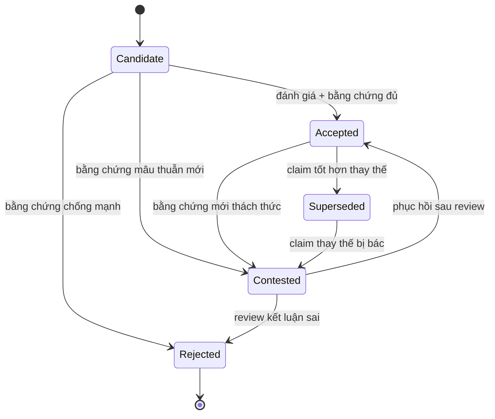

# Chương 6 — Phát biểu, Bằng chứng, Xuất xứ, Thời gian và Mâu thuẫn

> **Định hướng chương**
>
> **Câu hỏi trung tâm:** Một knowledge graph chứa các phát biểu. Nhưng ai đã đưa ra
> phát biểu đó? Dựa trên bằng chứng nào? Đúng trong khoảng thời gian nào? Và khi hai
> nguồn nói khác nhau, hệ thống nên làm gì — xóa một bên, hay giữ cả hai và đánh dấu
> mâu thuẫn?
>
> **Vì sao quan trọng:** Năm chương trước xây dựng nền tảng: đồ thị dữ liệu (Ch1–2),
> định danh và ngữ cảnh (Ch3), ngữ nghĩa hình thức (Ch4), suy diễn và xác nhận (Ch5).
> Nhưng tất cả đều giả định rằng mỗi phát biểu trong đồ thị là *đúng* — hoặc ít nhất
> không cần hỏi "đúng theo ai, đúng khi nào". Thực tế không như vậy. Tri thức luôn đến
> từ một nguồn cụ thể, tại một thời điểm cụ thể, với mức độ tin cậy cụ thể. Nếu hệ
> thống không biểu diễn được những chiều này, nó không thể phân biệt giữa "Hà Nội là
> thủ đô" (sự thật hiện tại) và "Huế là thủ đô" (sự thật lịch sử), cũng không thể trả
> lời "tại sao hệ thống tin điều này?"
>
> **Bạn sẽ hiểu:**
>
> - Mô hình tri thức luận (epistemic model) của sách: Quan sát → Khẳng định →
>   Phát biểu → Bằng chứng → Tri thức được chấp nhận
> - Phân biệt Mệnh đề (Proposition) – Khẳng định (Assertion) – Phát biểu (Claim)
> - Nguồn (Source) khác Bằng chứng (Evidence)
> - Mô hình xuất xứ PROV-O: Entity, Activity, Agent và chuỗi provenance
> - Các loại mâu thuẫn và cách ngữ cảnh hòa giải chúng
> - Nhiều đồng hồ thời gian: thời gian khẳng định, thời gian hiệu lực, thời gian quan
>   sát, thời gian hệ thống
> - Trạng thái quản trị tri thức: Candidate, Accepted, Rejected, Contested, Superseded
> - Vì sao đầu ra LLM là CandidateKnowledge, không phải tri thức đã xác nhận
>
> **Tiên quyết:** Chương 3 (named graph, n-ary, ngữ cảnh), Chương 4 (OWA, mô hình),
> Chương 5 (conformance ≠ truth, consistency ≠ correctness).
>
> **Bản đồ khái niệm:**
>
> Đồ thị dữ liệu + Ngữ nghĩa → **Tầng tri thức luận**: Phát biểu có nguồn gốc, bằng
> chứng, thời gian, trạng thái → Quản trị mâu thuẫn → Tri thức được chấp nhận (có điều
> kiện)

## 6.0 Mở đầu: Hai nguồn, hai con số

Giả sử bạn đang tích hợp dữ liệu dân số Hà Nội từ hai nguồn:

**Nguồn A** — Tổng cục Thống kê Việt Nam, báo cáo năm 2019:

```turtle
ex:claim_A  a           ex:PopulationClaim ;
            ex:entity   ex:Hanoi ;
            ex:value    8093100 ;
            ex:source   ex:GSO_Vietnam ;
            ex:asOf     "2019-07-01"^^xsd:date .
```

**Nguồn B** — Wikidata, truy cập ngày 2024-03-15:

```turtle
ex:claim_B  a           ex:PopulationClaim ;
            ex:entity   wd:Q1858 ;
            ex:value    8053663 ;
            ex:source   ex:Wikidata ;
            ex:retrievedAt "2024-03-15"^^xsd:date .
```

Hai con số khác nhau: 8.093.100 so với 8.053.663. Hệ thống nên làm gì?

Cách tiếp cận ngây thơ: chọn một, xóa một. Nhưng cách này mất thông tin. Con số
8.093.100 đúng *theo Tổng cục Thống kê, tại thời điểm 2019*. Con số 8.053.663 đúng
*theo Wikidata, tại thời điểm truy cập 2024*. Cả hai đều có thể đúng — trong ngữ cảnh
riêng của chúng.

Chương này xây dựng tầng tri thức luận (epistemic layer) cho knowledge graph: thay vì
lưu trữ các bộ ba như sự thật tuyệt đối, ta coi mỗi phát biểu là một **đối tượng tri
thức luận hạng nhất** — mang nguồn gốc, bằng chứng, thời gian, và trạng thái quản trị.
Khi hai phát biểu mâu thuẫn, hệ thống không xóa; nó **bảo tồn mâu thuẫn** và cung cấp
công cụ để đánh giá.

Đây là chương chuyển tiếp từ "đồ thị chứa gì" sang "đồ thị *biết* gì về những gì nó
chứa".

## 6.1 Mô hình tri thức luận: Từ quan sát đến tri thức được chấp nhận

### Trực giác

Trong đời sống, ta không coi mọi thông tin ngang hàng nhau. Một con số từ báo cáo chính
thức khác với một con số từ bài đăng mạng xã hội. Ta đánh giá thông tin dựa trên nguồn
gốc, bằng chứng hỗ trợ, và thời điểm áp dụng. Knowledge graph cần làm điều tương tự.

### Cơ chế

Sách định nghĩa một **mô hình tri thức luận** (epistemic model) gồm năm giai đoạn. Đây
không phải chuẩn W3C — đây là khung khái niệm do sách xây dựng để tổ chức các khái niệm
trong chương:


```
Quan sát → Khẳng định → Phát biểu → Bằng chứng → Tri thức được chấp nhận
(Observation) (Assertion)  (Claim)    (Evidence)   (Accepted Knowledge)
```

Mỗi giai đoạn:

1. **Quan sát (Observation):** Dữ liệu thô từ thế giới — một con số đo được, một dòng
   trong bảng tính, một câu trong tài liệu. Quan sát chưa được diễn giải thành phát
   biểu về thực thể.

2. **Khẳng định (Assertion):** Biểu diễn quan sát dưới dạng đồ thị — một bộ ba RDF,
   một cạnh trong đồ thị thuộc tính. Khẳng định là *cấu trúc dữ liệu*, chưa mang ngữ
   cảnh tri thức luận.

3. **Phát biểu (Claim):** Đối tượng tri thức luận hạng nhất. Một phát biểu bao gồm nội
   dung khẳng định + nguồn + thời gian + bằng chứng + trạng thái. Hai phát biểu có thể
   có cùng nội dung nhưng khác nguồn, khác thời gian, khác bằng chứng — và chúng là hai
   đối tượng riêng biệt.

4. **Bằng chứng (Evidence):** Thông tin hỗ trợ hoặc phản bác một phát biểu. Bằng chứng
   không phải là nguồn — nguồn là nơi phát biểu đến từ; bằng chứng là lý do để tin hoặc
   không tin phát biểu đó.

5. **Tri thức được chấp nhận (Accepted Knowledge):** Phát biểu đã qua quy trình quản
   trị và được gán trạng thái "Accepted". Chấp nhận không có nghĩa là đúng vĩnh viễn —
   nó có nghĩa là "hiện tại, với bằng chứng hiện có, phát biểu này được coi là đáng tin
   cậy nhất trong ngữ cảnh đã cho".

> ⚠️ **Phân biệt quan trọng:** Mô hình này là khung khái niệm của sách, không phải
> chuẩn W3C. PROV-O cung cấp từ vựng cho provenance; OWL-Time cung cấp từ vựng cho
> thời gian; nhưng không chuẩn nào định nghĩa "Claim" hay "Accepted Knowledge" như đối
> tượng hạng nhất. Sách xây dựng lớp này *trên* các chuẩn hiện có.

### Ứng dụng

Quay lại ví dụ dân số Hà Nội:

- `ex:claim_A` và `ex:claim_B` là hai **phát biểu** riêng biệt.
- Nội dung của chúng giống nhau (dân số Hà Nội) nhưng giá trị khác nhau.
- Mỗi phát biểu mang nguồn (`ex:GSO_Vietnam`, `ex:Wikidata`) và thời gian riêng.
- Hệ thống không chọn một; nó giữ cả hai và đánh dấu trạng thái.
- Nếu Tổng cục Thống kê công bố số liệu mới (2024), phát biểu cũ không bị xóa — nó
  được đánh dấu `Superseded` bởi phát biểu mới.

> 🖊 **Tự kiểm tra:** Hãy giải thích bằng lời của bạn: vì sao "khẳng định" (assertion)
> và "phát biểu" (claim) là hai khái niệm khác nhau? Cho một ví dụ trong đó cùng một
> khẳng định xuất hiện trong hai phát biểu khác nhau.

## 6.2 Mệnh đề – Khẳng định – Phát biểu: Ba lớp của cùng một nội dung

### Trực giác

Cùng một nội dung — "Hà Nội là thủ đô của Việt Nam" — có thể tồn tại ở ba mức độ trừu
tượng khác nhau. Phân biệt ba mức này là chìa khóa để xây dựng hệ thống tri thức có khả
năng quản lý mâu thuẫn mà không rơi vào hỗn loạn.

### Cơ chế

**Mệnh đề (Proposition)** là nội dung trừu tượng — ý nghĩa của phát biểu, độc lập với
ngôn ngữ, người nói, hay thời điểm. Trong logic, mệnh đề thường ký hiệu là P. Ví dụ:
P = "Hà Nội là thủ đô của Việt Nam". Mệnh đề không nằm trong đồ thị; nó là đối tượng
toán học/logic.

**Khẳng định (Assertion)** là biểu diễn của mệnh đề trong đồ thị dữ liệu. Trong RDF,
đó là một bộ ba:

```turtle
ex:Hanoi  ex:capitalOf  ex:Vietnam .
```

Khẳng định là cấu trúc dữ liệu thuần túy. Nó không nói ai đã đưa ra, khi nào, hay dựa
trên bằng chứng nào. Trong Ch3, ta đã học rằng named graph có thể gắn tên nguồn cho
một nhóm khẳng định — nhưng tên đồ thị chỉ là quy ước ứng dụng, không phải ngữ nghĩa
hình thức [@w3c-rdf11-concepts].

**Phát biểu (Claim)** là đối tượng tri thức luận hạng nhất. Nó bao gồm khẳng định cộng
với ngữ cảnh tri thức luận đầy đủ:

```turtle
ex:claim_1  a              ex:Claim ;
            ex:content     [ ex:Hanoi ex:capitalOf ex:Vietnam ] ;
            ex:statedBy    ex:Government_Decree_72 ;
            ex:statedAt    "1976-07-02"^^xsd:date ;
            ex:evidenceFor ex:evidence_legal_document ;
            ex:status      ex:Accepted .
```

Phát biểu là nút trong đồ thị. Nó có IRI riêng. Ta có thể nói về nó, truy vấn nó,
liên kết nó với bằng chứng, và gán trạng thái cho nó.

### Tại sao phân biệt này quan trọng

Nếu không phân biệt, ta rơi vào một trong hai bẫy:

**Bẫy 1: Coi khẳng định là phát biểu.** Khi lưu `ex:Hanoi ex:capitalOf ex:Vietnam`
như một bộ ba trần, ta mất khả năng gắn nguồn, thời gian, bằng chứng. Mọi khẳng định
trông ngang hàng nhau — không cách nào phân biệt "sự thật hiện tại" với "thông tin lỗi
thời".

**Bẫy 2: Coi mệnh đề là phát biểu.** Nếu ta dùng chính mệnh đề P làm định danh, thì
hai nguồn nói cùng một điều sẽ trỏ đến cùng một đối tượng. Ta mất khả năng gắn provenance
riêng cho mỗi nguồn. Claim identity ≠ content identity — hai phát biểu C₁ và C₂ có thể
có content(C₁) = content(C₂) nhưng vẫn là hai đối tượng riêng biệt với provenance riêng.

### Ứng dụng

Trong cơ chế n-ary của Ch3 (§3.3.3), thực thể trung gian `CapitalStatus` chính là một
dạng phát biểu đơn giản hóa — nó đại diện cho "sự kiện quan hệ" và cho phép gắn thời
gian. Chương 6 mở rộng mẫu này: thêm nguồn, bằng chứng, trạng thái, và nhiều chiều
thời gian.

> 🖊 **Tự kiểm tra:** Cho mệnh đề P = "Dân số Hà Nội là 8 triệu". Hãy viết ra (a) một
> khẳng định RDF biểu diễn P, và (b) một phát biểu (claim) chứa khẳng định đó kèm
> nguồn và thời gian. Giải thích vì sao (a) và (b) không thay thế được nhau.

**Ví dụ trên miền cơ chế.** Lấy mệnh đề P₇₂ = "Velocity là rate of change của position
theo thời gian" (câu nguồn chính của cuốn sách). Ba mức độ:

- **Mệnh đề:** P₇₂ — nội dung trừu tượng, không phụ thuộc từ vựng.
- **Khẳng định:** bộ ba trần `ex:rateOfChange_1 ex:hasOutput ex:velocity_1` — cấu trúc
  dữ liệu, không nói ai nói, khi nào, dựa trên gì. Chính kiểu triple này Ch2/Ch4 đã dùng.
- **Phát biểu:** hai claim riêng biệt cùng mang P₇₂ nhưng khác nguồn — cũng là tình
  huống `ta:velocityDef` và `tb:speedDef` của Ch3 §3.2.5:

```turtle
ex:claim_roc_A  a            ex:Claim ;
                ex:content   ex:prop_velocity_rate_of_change ;
                ex:statedBy  ex:textbook_A ;
                ex:statedAt  "2021-06-01"^^xsd:date ;
                ex:status    ex:Accepted .

ex:claim_roc_B  a            ex:Claim ;
                ex:content   ex:prop_velocity_rate_of_change ;   # cùng mệnh đề!
                ex:statedBy  ex:textbook_B ;
                ex:statedAt  "2023-02-14"^^xsd:date ;
                ex:status    ex:Candidate .
```

Hai claim chia sẻ cùng mệnh đề nhưng là hai đối tượng riêng — một Accepted từ textbook A,
một Candidate mới từ textbook B. **Bẫy 2 (§6.2): nếu dùng chính mệnh đề P₇₂ làm định
danh claim, ta gộp hai nguồn thành một và mất khả năng đánh dấu B chưa được chấp nhận.**

## 6.3 Nguồn khác Bằng chứng

### Trực giác

Khi ai đó nói "Hà Nội có dân số 8 triệu", ta hỏi hai câu khác nhau: "Ai nói?" (nguồn)
và "Dựa trên cái gì?" (bằng chứng). Hai câu trả lời có thể hoàn toàn khác nhau.

### Cơ chế

**Nguồn (Source)** trả lời câu hỏi "phát biểu này đến từ đâu?" — ai đã tạo ra nó, qua
kênh nào, khi nào. Trong PROV-O, nguồn được biểu diễn bằng `wasAttributedTo` (gán cho
một Agent) hoặc `wasGeneratedBy` (sinh ra bởi một Activity).

**Bằng chứng (Evidence)** trả lời câu hỏi "tại sao ta nên tin (hoặc không tin) phát
biểu này?" — dữ liệu gốc, phương pháp thu thập, tài liệu tham chiếu, hoặc phát biểu
khác hỗ trợ/phản bác.

Ví dụ:

```turtle
ex:claim_pop_2019  ex:statedBy     ex:GSO_Vietnam ;       # NGUỒN
                   ex:evidenceFor  ex:census_2019_data ;  # BẰNG CHỨNG
                   ex:evidenceFor  ex:sampling_methodology .
```

Nguồn là `ex:GSO_Vietnam` (Tổng cục Thống kê). Bằng chứng là `ex:census_2019_data`
(dữ liệu điều tra dân số 2019) và `ex:sampling_methodology` (phương pháp lấy mẫu).
Nguồn và bằng chứng là hai chiều thông tin riêng biệt.

Một nguồn đáng tin cậy có thể đưa ra phát biểu thiếu bằng chứng. Một nguồn ít uy tín
có thể đưa ra phát biểu được hỗ trợ bởi bằng chứng mạnh. Độ tin cậy của nguồn
(source reliability) khác với độ tin cậy của phát biểu (claim confidence).

### Ứng dụng

Trong Wikidata, **reference** đóng vai trò bằng chứng, còn **statement** tự thân ghi
nhận nguồn qua property `stated in` (P248). Một statement có thể có nhiều reference —
mỗi reference là một mảnh bằng chứng độc lập. Rank (preferred/normal/deprecated) phản
ánh đánh giá tổng hợp, không phải bằng chứng trực tiếp [@wikidata-statements].

> ⚠️ **Ngộ nhận phổ biến:** "Nguồn uy tín → phát biểu đúng." Sai. Nguồn uy tín làm
> tăng *xác suất* phát biểu đúng, nhưng không đảm bảo. Bằng chứng mới là yếu tố quyết
> định. Hệ thống cần lưu cả hai chiều riêng biệt.

## 6.4 Mô hình xuất xứ PROV-O: Entity, Activity, Agent

### Trực giác

Xuất xứ (provenance) trả lời câu hỏi "dữ liệu này đến từ đâu, được tạo ra như thế nào,
bởi ai?" PROV-O (PROV Ontology) là chuẩn W3C cung cấp từ vựng RDF để biểu diễn xuất
xứ [@prov-o].

### Cơ chế

PROV-O định nghĩa ba lớp cốt lõi [@prov-dm]:

- **Entity** (prov:Entity): "Một vật — vật lý, số, khái niệm, hoặc bất kỳ — có các
  khía cạnh cố định." Trong KG, entity là nút dữ liệu, tài liệu, dataset, hoặc kết quả
  tính toán.

- **Activity** (prov:Activity): "Một quá trình xảy ra trong thời gian, tác động lên
  hoặc sử dụng entity." Ví dụ: điều tra dân số, chạy pipeline ETL, phân tích dữ liệu.

- **Agent** (prov:Agent): "Một thực thể chịu trách nhiệm cho một activity, một entity,
  hoặc activity của agent khác." Ví dụ: Tổng cục Thống kê, một nhà nghiên cứu, một hệ
  thống tự động.

Ba lớp này **rời nhau**: một activity không phải là entity; một agent là một loại entity
đặc biệt (có trách nhiệm).

Các quan hệ cốt lõi:

| Quan hệ | Ý nghĩa | Ví dụ |
|---------|---------|-------|
| `prov:wasGeneratedBy` | Entity được sinh ra bởi Activity | `census_report wasGeneratedBy census_2019` |
| `prov:used` | Activity sử dụng Entity | `census_2019 used survey_forms` |
| `prov:wasAttributedTo` | Entity được gán cho Agent | `census_report wasAttributedTo GSO` |
| `prov:wasAssociatedWith` | Agent chịu trách nhiệm cho Activity | `census_2019 wasAssociatedWith GSO` |
| `prov:wasDerivedFrom` | Entity được dẫn xuất từ Entity khác | `population_claim wasDerivedFrom census_report` |
| `prov:wasInformedBy` | Activity được thông báo bởi Activity khác | `analysis wasInformedBy census_2019` |

Chuỗi provenance hình thành một **đồ thị có hướng** ngược về quá khứ: từ entity hiện
tại → activity sinh ra nó → entity đầu vào của activity → activity trước đó → ... Chuỗi
này cho phép truy ngược toàn bộ lịch sử của một mảnh tri thức.

### Ứng dụng

Áp dụng PROV-O cho ví dụ dân số Hà Nội:

```turtle
@prefix prov: <http://www.w3.org/ns/prov#> .

ex:population_claim_A
    a                ex:Claim ;
    ex:value         8093100 ;
    prov:wasDerivedFrom ex:census_2019_report ;
    prov:wasAttributedTo ex:GSO_Vietnam .

ex:census_2019_report
    a                prov:Entity ;
    prov:wasGeneratedBy ex:census_2019_activity ;
    prov:wasAttributedTo ex:GSO_Vietnam .

ex:census_2019_activity
    a                prov:Activity ;
    prov:startedAtTime "2019-04-01"^^xsd:date ;
    prov:endedAtTime   "2019-07-01"^^xsd:date ;
    prov:wasAssociatedWith ex:GSO_Vietnam ;
    prov:used          ex:survey_questionnaire_2019 .
```

Chuỗi provenance: `population_claim_A ← census_2019_report ← census_2019_activity ←
survey_questionnaire_2019`. Mỗi bước ghi nhận một tầng xuất xứ.


> 🖊 **Tự kiểm tra:** Vẽ chuỗi provenance cho một phát biểu "Hà Nội có 12 quận" được
> trích xuất tự động từ Wikipedia bởi một pipeline NLP. Cần ít nhất ba nút (Entity,
> Activity, Agent) và các quan hệ phù hợp.

**Ví dụ trên miền cơ chế.** Claim về `ex:rateOfChange_1` từ sách giáo khoa đi qua chuỗi
provenance đầy đủ:

```turtle
@prefix prov: <http://www.w3.org/ns/prov#> .

ex:claim_roc_A  a ex:Claim ;
    prov:wasDerivedFrom ex:textbookA_sec42 ;
    prov:wasAttributedTo ex:textbook_A .

ex:textbookA_sec42  a prov:Entity ;
    prov:wasGeneratedBy ex:extraction_activity_7 ;
    prov:wasAttributedTo ex:textbook_A .

ex:extraction_activity_7  a prov:Activity ;
    prov:used ex:textbookA_sec42_raw ;
    prov:wasAssociatedWith ex:extractor_pipeline_v3 .
```

Chuỗi: `claim_roc_A ← textbookA_sec42 ← extraction_activity_7 ←
textbookA_sec42_raw`. Mỗi mắt xích trả lời một câu "từ đâu, do ai, thế nào". Nếu một
mắt xích thiếu, chuỗi **đứt gãy**:

```turtle
ex:claim_roc_C  a ex:Claim ;
    prov:wasDerivedFrom ex:unknown_section ;
    ex:statedBy ex:unknown_author .    # không Agent, không Activity, không Entity xác định
```

Đây là **broken chain**: hệ thống không thể trả lời "claim này đến từ đâu, ai chịu
trách nhiệm". Chuỗi provenance đứt gãy không làm claim *sai*, nhưng làm claim *không
kiểm chứng được* — hệ thống không có đường truy ngược để đánh giá. Trong quản trị tri
thức (§6.12), claim có provenance đứt gãy nên bị giữ ở trạng thái `Candidate`, không
được nâng lên `Accepted` mà không có bằng chứng độc lập.

## 6.5 Quan hệ bằng chứng: supports, contradicts, isRelevantTo

### Trực giác

Bằng chứng không chỉ "hỗ trợ" hoặc "phản bác" — có nhiều mức độ liên quan. Một tài
liệu có thể liên quan đến một phát biểu mà không trực tiếp xác nhận hay phủ định nó.

### Cơ chế

Sách định nghĩa ba quan hệ bằng chứng (evidence relation):

- **supports(E, C):** Bằng chứng E hỗ trợ phát biểu C. E làm tăng mức độ tin cậy của C.
- **contradicts(E, C):** Bằng chứng E phản bác phát biểu C. E làm giảm mức độ tin cậy
  của C.
- **isRelevantTo(E, C):** Bằng chứng E liên quan đến phát biểu C nhưng không trực tiếp
  hỗ trợ hay phản bác. E cung cấp ngữ cảnh bổ sung.

Các quan hệ này **không đối xứng**: nếu E supports C, không suy ra C supports E. Chúng
cũng **không bắc cầu**: nếu E₁ supports C và E₂ supports C, không suy ra E₁ và E₂ hỗ
trợ lẫn nhau.

Trong RDF:

```turtle
ex:census_2019_data  ex:supports     ex:claim_pop_A .
ex:wiki_article_X    ex:contradicts  ex:claim_pop_A .
ex:gso_methodology   ex:isRelevantTo ex:claim_pop_A .
```

### Bằng chứng không phải chứng minh

Một bằng chứng hỗ trợ không làm phát biểu trở thành đúng. Nó làm tăng *mức độ tin cậy*
(confidence) — nhưng confidence là một đánh giá chủ quan phụ thuộc vào chính sách của
hệ thống. Không có công thức phổ quát để tính confidence từ tập bằng chứng.

> ⚠️ **Ngộ nhận phổ biến:** "Nhiều bằng chứng hỗ trợ → phát biểu đúng." Sai. Nhiều
> nguồn có thể lặp lại cùng một sai lầm (echo chamber). Chất lượng bằng chứng quan trọng
> hơn số lượng.

**Ranh giới phân loại mơ hồ.** Ba quan hệ trên không phải lúc nào cũng rạch ròi. Một
mảnh bằng chứng có thể *nửa hỗ trợ, nửa phản bác* tùy vào ngữ cảnh. Ví dụ trên miền cơ
chế: claim C₁ nói "RATE_OF_CHANGE chỉ hợp lệ trong miền vĩ mô, vận tốc thấp". Một thí
nghiệm quan sát hạt chuyển động nhanh chứng tỏ công thức cổ điển sai ở tốc độ gần ánh
sáng — nó **contradicts** phiên bản bất định (không có giới hạn), nhưng **supports**
phiên bản có giới hạn vĩ mô.

```turtle
ex:fast_particle_exp  ex:contradicts  ex:claim_roc_universal ;
                     ex:supports     ex:claim_roc_restricted .
```

Phân loại một mảnh bằng chứng đòi hỏi xác định *với claim nào* ta đang đối chiếu. Cùng
một phép đo có thể là bằng chứng ủng hộ cho claim này và phản bác cho claim khác. Đây
là lý do evidence relation phải ghi rõ cặp `(evidence, claim)`, không phải gán "độ tin
cậy" cho evidence trên bảng riêng.

## 6.6 Phân loại mâu thuẫn

### Trực giác

"Mâu thuẫn" không phải một hiện tượng đơn nhất. Hai nguồn nói khác nhau có thể vì nhiều
lý do khác nhau, và mỗi lý do đòi hỏi cách xử lý khác nhau.

### Cơ chế

Sách định nghĩa năm loại mâu thuẫn:


**1. Mâu thuẫn logic (Logical contradiction):** Hai phát biểu không thể cùng đúng trong
bất kỳ diễn giải nào. Ví dụ: `capitalOf(Hanoi, Vietnam)` và `¬capitalOf(Hanoi, Vietnam)`.
Đây là mâu thuẫn thực sự — ít nhất một bên sai.

**2. Xung đột giá trị (Value conflict):** Hai phát biểu gán giá trị khác nhau cho cùng
một thuộc tính của cùng một thực thể, trong cùng một ngữ cảnh. Ví dụ: `population(Hanoi)
= 8093100` và `population(Hanoi) = 8053663`. Có thể do đo lường khác nhau, làm tròn,
hoặc lỗi.

**3. Bất đồng thời gian (Temporal disagreement):** Hai phát biểu đúng ở các thời điểm
khác nhau. Ví dụ: "Huế là thủ đô" (đúng trước 1976) và "Hà Nội là thủ đô" (đúng từ
1976). Đây không phải mâu thuẫn thực sự — chỉ cần gắn nhãn thời gian chính xác.

**4. Bất đồng phạm vi (Scope disagreement):** Hai phát biểu đúng trong các phạm vi khác
nhau. Ví dụ: "Dân số Pháp là 67 triệu" (toàn quốc) và "Dân số Pháp là 55 triệu" (chỉ
phần châu Âu, không tính lãnh thổ hải ngoại). Ngữ cảnh phạm vi hòa giải.

**5. Bất đồng nguồn (Source disagreement):** Hai nguồn đưa ra giá trị khác nhau cho
cùng một thuộc tính, cùng thời điểm, cùng phạm vi. Đây là trường hợp phổ biến nhất và
khó xử lý nhất — cần đánh giá chất lượng nguồn, phương pháp, và bằng chứng.

### Ngữ cảnh hòa giải mâu thuẫn

Trước khi tuyên bố hai phát biểu "mâu thuẫn", hãy kiểm tra xem **ngữ cảnh có hòa giải
được không**. Bốn chiều ngữ cảnh cần căn chỉnh:

1. **Định danh thực thể:** Hai phát biểu có nói về cùng một thực thể không? (Ch3: identity resolution)
2. **Ý nghĩa vị từ:** Hai vị từ có cùng ngữ nghĩa không? (`population` có thể là de jure vs de facto)
3. **Phạm vi thời gian:** Hai phát biểu có áp dụng trong cùng khoảng thời gian không?
4. **Phạm vi không gian/pháp lý:** Hai phát biểu có cùng jurisdiction không?

Nếu sau khi căn chỉnh bốn chiều mà mâu thuẫn vẫn tồn tại, đó là **mâu thuẫn thực sự**
(genuine contradiction) — và hệ thống cần bảo tồn nó thay vì xóa bỏ.

> 🖊 **Tự kiểm tra:** Cho hai phát biểu: (A) "Dân số Việt Nam là 96 triệu" (nguồn:
> World Bank, 2019) và (B) "Dân số Việt Nam là 98 triệu" (nguồn: GSO, 2021). Hãy phân
> loại mâu thuẫn này theo taxonomy trên. Ngữ cảnh nào có thể hòa giải?

**Năm loại mâu thuẫn trên miền cơ chế.** Cùng taxonomy, áp dụng vào dữ liệu Mechanism-KG:

| Loại | Ví dụ cơ chế | Ngữ cảnh hòa giải |
|------|--------------|-------------------|
| **Logic** | `rateOfChange_1 hasInput position_1` và claim nói `rateOfChange_1 KHÔNG có input nào` | Không hòa giải được — ít nhất một bên sai |
| **Giá trị** | Hai claim gán `differentiand` của `derivativeApplication_1` lần lượt là `position_1` và `distance_1`, cùng định nghĩa "position" | Không hòa giải được — đo bằng hai định nghĩa khác nhau? Đối chiếu vị từ |
| **Thời gian** | "Cơ chế RATE_OF_CHANGE đúng" (valid [1687, 1905) — cơ học Newton) và "RATE_OF_CHANGE cổ điển sai" (valid [1905, nay) — tương đối tính) | Hòa giải bằng valid time (§6.7) |
| **Phạm vi** | "RATE_OF_CHANGE của vận tốc theo thời gian" (vₓ) và "RATE_OF_CHANGE theo quãng đường" (dₛ) | Hòa giải bằng `withRespectTo`: đồ thị ghi rõ reference variable |
| **Nguồn** | textbook A định nghĩa velocity = ds/dt; textbook B định nghĩa speed = \|ds/dt\| | Không hòa giải bằng ngữ cảnh — cần đánh giá nguồn, bằng chứng (§6.11) |

Hàng **Thời gian** là ví dụ then chốt: hai câu "cơ chế đúng" và "cơ chế sai" đều đúng —
mỗi câu trong khoảng hiệu lực riêng. Nếu không biểu diễn valid time, hệ thống tưởng
chúng mâu thuẫn và gắn `Contested`; thực ra chúng chỉ cần gắn nhãn thời gian chính xác.
Hàng **Phạm vi** tương tự: khác `withRespectTo` nghĩa là khác cơ chế con, không phải
mâu thuẫn — Ch3 §3.3.3 đã chuẩn bị cho điều này bằng reification.

## 6.7 Nhiều đồng hồ thời gian

### Trực giác

Thời gian trong knowledge graph không phải một trục đơn. Cùng một phát biểu có ít nhất
ba "đồng hồ" chạy song song, và nhầm lẫn giữa chúng là nguồn gốc của nhiều lỗi thiết kế.

### Cơ chế

Bốn đồng hồ thời gian cần phân biệt:


**1. Thời gian hiệu lực (Valid time):** Khoảng thời gian mà phát biểu đúng *trong thế
giới thực*. "Hà Nội là thủ đô" có valid time = [1976-07-02, now). "Huế là thủ đô" có
valid time = [1802, 1976-07-02). Valid time trả lời "khi nào điều này đúng trong thế
giới?"

**2. Thời gian khẳng định (Assertion time):** Thời điểm phát biểu được *đưa vào hệ
thống*. Assertion time trả lời "khi nào hệ thống biết điều này?"

**3. Thời gian quan sát (Observation time):** Thời điểm dữ liệu được *thu thập từ thế
giới*. Điều tra dân số 2019 có observation time = 2019-04-01 đến 2019-07-01, nhưng
assertion time có thể là 2020-01-15 (khi báo cáo được công bố). Observation time trả
lời "khi nào dữ liệu được đo?"

**4. Thời gian hệ thống (System/Transaction time):** Thời điểm hệ thống *lưu trữ* phát
biểu. System time trả lời "khi nào bản ghi này được ghi vào database?"

Bốn đồng hồ này **không thay thế được nhau**. Một phát biểu có thể có:
- Valid time = [2019, 2024) (đúng trong thế giới từ 2019 đến 2024)
- Observation time = 2019-07-01 (đo vào tháng 7/2019)
- Assertion time = 2020-01-15 (được công bố tháng 1/2020)
- System time = 2020-01-20T10:30:00 (được nhập vào hệ thống ngày 20/1/2020)

### Trực giác bitemporal

Mô hình **bitemporal** (hai thời gian) là trường hợp đặc biệt quan trọng: valid time +
system time. Valid time cho biết "điều này đúng khi nào trong thế giới"; system time cho
biết "hệ thống biết điều này khi nào".

Ví dụ: Ngày 2020-01-15, hệ thống ghi nhận "dân số Hà Nội = 8.093.100" (valid time =
2019). Ngày 2024-06-01, hệ thống nhận dữ liệu mới: "dân số Hà Nội = 8.418.883" (valid
time = 2024). Bản ghi cũ không bị xóa — system time cho phép truy vấn "hệ thống đã tin
điều gì vào ngày 2022?" và nhận được câu trả lời đúng.

### Biểu diễn bằng OWL-Time

OWL-Time [@owl-time] cung cấp từ vựng RDF cho thời gian:

```turtle
@prefix time: <http://www.w3.org/2006/time#> .

ex:claim_pop_A  time:hasTime [
    a               time:ProperInterval ;
    time:hasBeginning [ time:inXSDDate "2019-07-01"^^xsd:date ] ;
    time:hasEnd       [ time:inXSDDate "2024-01-01"^^xsd:date ]
] .
```

Đây là valid time. Assertion time và system time được biểu diễn bằng các property riêng:

```turtle
ex:claim_pop_A  ex:assertedAt  "2020-01-15"^^xsd:date ;
                ex:systemTime  "2020-01-20T10:30:00"^^xsd:dateTime .
```

> ⚠️ **Ngộ nhận phổ biến:** "Thời gian trong RDF là valid time." Sai. RDF không có
> khái niệm thời gian built-in. Mọi temporal annotation là quy ước ứng dụng. OWL-Time
> cung cấp từ vựng, nhưng việc gán ý nghĩa (valid vs assertion vs system) là trách
> nhiệm của người thiết kế.

**Thực thể thời gian (Temporal Entity).** Trước khi gắn thời gian, cần một định nghĩa
đứng một mình. Trong OWL-Time [@owl-time], một **thực thể thời gian** (`time:TemporalEntity`)
là một đối tượng biểu thị một khoảng hoặc khoảnh khắc thời gian, và có thể được dùng làm
giá trị của `time:hasTime`. Kiểu con quan trọng nhất là `time:ProperInterval` — *một
khoảng thời gian có điểm bắt đầu và điểm kết thúc, hai mốc không trùng nhau*:

```turtle
@prefix time: <http://www.w3.org/2006/time#> .

ex:validity_newtonian a time:ProperInterval ;
    time:hasBeginning [ time:inXSDDateTime "1687-07-05T00:00:00Z"^^xsd:dateTime ] ;
    time:hasEnd       [ time:inXSDDateTime "1905-09-26T00:00:00Z"^^xsd:dateTime ] .
```

**Hiệu lực thời gian của một cơ chế.** Áp dụng khái niệm này cho chính cơ chế
RATE_OF_CHANGE. Trong cơ học cổ điển, vận tốc là đạo hàm $ds/dt$ không có giới hạn về
tốc độ. Từ 1905, cơ học tương đối tính thay thế: vận tốc bị chặn bởi tốc độ ánh sáng.
Hai claim về *cùng* cơ chế có valid time khác nhau — không loại trừ nhau:

```turtle
ex:claim_roc_classical  ex:content    ex:prop_roc_velocity_unbounded ;
                        ex:hasTime    ex:validity_newtonian ;
                        ex:status     ex:Superseded .

ex:claim_roc_relativist ex:content    ex:prop_roc_velocity_bounded ;
                        ex:hasTime    [
                            a            time:ProperInterval ;
                            time:hasBeginning [ time:inXSDDateTime "1905-09-26T00:00:00Z"^^xsd:dateTime ]
                        ] ;
                        ex:status     ex:Accepted .
```

Câu trả lời đúng cho "cơ chế RATE_OF_CHANGE có đúng không" phụ thuộc *thời điểm bạn hỏi*:
trước 1905 claim cổ điển là đúng nhất; từ 1905, claim tương đối tính là đúng nhất. Đây
chính là **temporal disagreement** được hòa giải bằng valid time (§6.6).

**Truy vấn bitemporal cho cơ chế.** Kết hợp valid time + system time ta có thể trả lời:
"Ngày 2021-06-01, hệ thống tin gì về tốc độ tối đa của RATE_OF_CHANGE?" — truy vấn *hồi
tốc* (retrospective). State bitemporal được biểu diễn bằng hai khoảng:

```turtle
ex:claim_roc_unbounded  ex:content  ex:prop_roc_velocity_unbounded ;
    ex:validInterval [
        a time:ProperInterval ;
        time:hasBeginning [ time:inXSDDateTime "1687-07-05T00:00:00Z"^^xsd:dateTime ] ;
        time:hasEnd       [ time:inXSDDateTime "1905-09-26T00:00:00Z"^^xsd:dateTime ]
    ] ;
    ex:systemInterval [
        a time:ProperInterval ;
        time:hasBeginning [ time:inXSDDateTime "2020-01-20T10:30:00Z"^^xsd:dateTime ] ;
        time:hasEnd       [ time:inXSDDateTime "2024-06-01T11:05:00Z"^^xsd:dateTime ]   # đã bị supersede
    ] .
```

Truy vấn SPARQL "hệ thống tin gì ngày 2021-06-01?" — với điều kiện ngày hỏi nằm *trong
cả hai* khoảng:

```sparql
PREFIX ex: <http://example.org/kgbook/mks#>
PREFIX time: <http://www.w3.org/2006/time#>

SELECT ?claim ?content WHERE {
    ?claim ex:content ?content ;
           ex:validInterval [ time:hasBeginning ?vb ; time:hasEnd ?ve ] ;
           ex:systemInterval [ time:hasBeginning ?sb ; time:hasEnd ?se ] .
    FILTER ("2021-06-01T00:00:00Z"^^xsd:dateTime >= ?vb
        && "2021-06-01T00:00:00Z"^^xsd:dateTime <= ?ve
        && "2021-06-01T00:00:00Z"^^xsd:dateTime >= ?sb
        && "2021-06-01T00:00:00Z"^^xsd:dateTime <= ?se)
}
```

Ở ngày 2021-06-01, truy vấn trả về `claim_roc_unbounded` — và chỉ nó: claim tương đối
tính chưa được nhập vào hệ thống (system interval của nó bắt đầu từ 2024-06-01 khi nó
thay thế claim cũ). Bản ghi cũ không bị xóa (bảo tồn mâu thuẫn, §6.14); nó vẫn truy hỏi
được trong khung system time của nó. Đây là câu trả lời thực hành cho "hệ thống đã tin
gì, khi nào".

## 6.8 Thời gian của phát biểu khác thời gian của sự kiện

### Trực giác

"Hà Nội trở thành thủ đô năm 1976" và "Phát biểu 'Hà Nội là thủ đô' được đưa ra năm
2020" là hai sự kiện thời gian hoàn toàn khác nhau. Nhầm lẫn giữa chúng dẫn đến lỗi
truy vấn nghiêm trọng.

### Cơ chế

**Thời gian sự kiện (Event time)** là valid time của nội dung phát biểu — khi nào điều
được mô tả xảy ra trong thế giới.

**Thời gian phát biểu (Claim time)** là assertion time — khi nào phát biểu được đưa vào
hệ thống.

Ví dụ:

| Phát biểu | Event time | Claim time |
|-----------|-----------|------------|
| "Huế là thủ đô" | [1802, 1976) | 2020-01-15 |
| "Hà Nội là thủ đô" | [1976, now) | 2020-01-15 |
| "Hà Nội là thủ đô" (cập nhật) | [1976, now) | 2024-06-01 |

Hai phát biểu cuối có cùng event time nhưng khác claim time. Phát biểu thứ hai là bản
cập nhật — nội dung không đổi, nhưng thời điểm khẳng định thay đổi (có thể do nguồn mới,
kiểm chứng lại, hoặc migration dữ liệu).

### Ứng dụng

Khi truy vấn "thủ đô của Việt Nam hiện nay là gì?", hệ thống cần:
1. Tìm tất cả phát biểu về `capitalOf(Vietnam)`.
2. Lọc theo valid time chứa thời điểm hiện tại.
3. Trong các phát biểu thỏa mãn, chọn phát biểu có trạng thái `Accepted` và claim time
   gần nhất (hoặc evidence mạnh nhất).

Nếu hệ thống nhầm lẫn event time và claim time, nó có thể trả về "Huế" vì phát biểu về
Huế được nhập vào hệ thống *gần đây hơn* — dù nội dung của nó đã hết hiệu lực từ 1976.

## 6.9 Mô hình phát biểu Wikidata: subject–property–value + qualifiers + references + rank

### Trực giác

Wikidata là hệ thống tri thức lớn nhất thế giới xử lý mâu thuẫn ở quy mô công nghiệp.
Mô hình statement của nó đáng được nghiên cứu như một case study thực tế [@wikidata-statements]
[@wikidata-qualifiers].

### Cơ chế

Một **statement** trong Wikidata gồm:

- **Subject:** Item (Q-id) — thực thể được mô tả.
- **Property–Value:** Cặp thuộc tính–giá trị — nội dung cốt lõi.
- **Qualifiers:** Định ngữ ngữ cảnh — làm rõ phạm vi, thời gian, phương pháp.
- **References:** Nguồn dẫn — bằng chứng hỗ trợ.
- **Rank:** Preferred / Normal / Deprecated — quản lý giá trị cạnh tranh.

Ví dụ: Dân số Hà Nội trong Wikidata:

```
Item: Q1858 (Hà Nội)
Property: P1082 (population)
Value: 8053663
Qualifier: P585 (point in time) = 2011
Reference: P248 (stated in) = Q... (census source)
Rank: normal
```

### Rank không phải điểm chân lý

Rank trong Wikidata **không phải** là điểm số chân lý (truth score). Nó là cơ chế quản
trị:

- **Preferred:** Giá trị được ưu tiên hiển thị khi có nhiều giá trị. Thường là giá trị
  hiện tại hoặc đáng tin cậy nhất.
- **Normal:** Giá trị bình thường, hiển thị khi không có preferred.
- **Deprecated:** Giá trị không còn được khuyến nghị (lỗi thời, sai), nhưng vẫn được
  giữ lại để truy vết lịch sử.

Rank phản ánh **đánh giá của cộng đồng biên tập**, không phải bằng chứng tự thân. Một
statement deprecated vẫn tồn tại trong đồ thị — nó không bị xóa.

### References không phải chứng minh

Reference trong Wikidata ghi nhận *nguồn dẫn*, không phải *chứng minh*. Một statement
có thể có nhiều reference — mỗi reference là một mảnh bằng chứng độc lập. Sự hiện diện
của reference không đảm bảo statement đúng; nó cho phép người đọc *kiểm tra*.

### Liên hệ với mô hình sách

| Wikidata | Mô hình sách (Ch6) |
|----------|-------------------|
| Statement (core) | Assertion |
| Statement + qualifiers + references + rank | Claim |
| Reference | Evidence (một dạng) |
| Rank | Governance state (một dạng) |
| Qualifier | Context dimension |
| Item (Q-id) | Entity |

Wikidata chứng minh rằng một hệ thống tri thức sản xuất cần coi ngữ cảnh là hạng nhất.
Một cặp property–value trần hiếm khi là toàn bộ câu chuyện [@wikidata-qualifiers].

> 🖊 **Tự kiểm tra:** Trong Wikidata, một item có thể có nhiều statement cho cùng một
> property với các rank khác nhau. Hãy giải thích vì sao đây không phải là "lỗi dữ liệu"
> mà là thiết kế có chủ đích. Liên hệ với khái niệm "bảo tồn mâu thuẫn" của Ch6.

## 6.10 Biểu diễn Claim trong RDF: Lựa chọn thiết kế

### Trực giác

Làm sao biểu diễn Claim như một đối tượng hạng nhất trong RDF? Có nhiều cách, mỗi cách
có trade-off riêng.

### Cơ chế

Ba lựa chọn chính:

**Lựa chọn 1: N-ary pattern (Ch3 §3.3.3)**

Tạo một entity đại diện cho claim, nối nó với nội dung, nguồn, thời gian, bằng chứng:

```turtle
ex:claim_1  a              ex:Claim ;
            ex:subject     ex:Hanoi ;
            ex:predicate   ex:capitalOf ;
            ex:object      ex:Vietnam ;
            ex:statedBy    ex:Gov_Decree_72 ;
            ex:validFrom   "1976-07-02"^^xsd:date ;
            ex:status      ex:Accepted ;
            ex:evidenceFor ex:evidence_legal_doc .
```

Ưu điểm: linh hoạt, mỗi chiều ngữ cảnh là một cạnh hạng nhất. Nhược điểm: truy vấn phải
đi qua nút trung gian; nội dung khẳng định bị "phân rã" thành subject/predicate/object
riêng.

**Lựa chọn 2: Named graph + metadata**

Đặt khẳng định vào một named graph, rồi mô tả named graph đó:

```trig
ex:claim_1_graph {
    ex:Hanoi ex:capitalOf ex:Vietnam .
}

ex:claim_1_graph  ex:statedBy   ex:Gov_Decree_72 ;
                  ex:validFrom  "1976-07-02"^^xsd:date ;
                  ex:status     ex:Accepted .
```

Ưu điểm: khẳng định giữ nguyên dạng triple; SPARQL GRAPH query tự nhiên. Nhược điểm:
mỗi claim cần một named graph riêng — nặng khi có hàng triệu claim; tên đồ thị không tự
động có nghĩa provenance [@w3c-rdf11-concepts].

**Lựa chọn 3: RDF 1.2 Triple Terms (emerging)**

RDF 1.2 đang phát triển cơ chế triple term cho phép tham chiếu trực tiếp đến một bộ ba
[@w3c-rdf12-concepts]:

```turtle
<< ex:Hanoi ex:capitalOf ex:Vietnam >>  ex:statedBy  ex:Gov_Decree_72 ;
                                        ex:validFrom "1976-07-02"^^xsd:date .
```

Ưu điểm: gọn, giữ nguyên triple, không cần nút trung gian. Nhược điểm: chưa ổn định
(Candidate Recommendation); tooling hạn chế; không hỗ trợ mọi trường hợp n-ary.

> ⚑ **Phát triển hiện tại.** RDF 1.2 Triple Terms là Candidate Recommendation (2026-04).
> Sách dùng n-ary pattern làm baseline ổn định; triple term được nhắc đến như hướng phát
> triển tương lai.

### Lựa chọn của sách

Sách chọn **Lựa chọn 1 (n-ary pattern)** làm biểu diễn mặc định vì:
- Ổn định (W3C Note 2006, không phụ thuộc vào RDF 1.2)
- Linh hoạt nhất (hỗ trợ mọi chiều ngữ cảnh)
- Tương thích với PROV-O (claim entity = prov:Entity)
- Phù hợp với mental model "Claim là đối tượng hạng nhất"

**Ví dụ phản biện: claim thiếu thành phần bắt buộc.** Không phải mọi tri thức ngoài kia
đều là một claim hợp lệ. Một claim thiếu nguồn, thiếu thời gian, hoặc thiếu bằng chứng
thì không thể được đánh giá:

```turtle
ex:claim_malformed_1  a ex:Claim ;
    ex:content [ ex:rateOfChange_1 ex:hasOutput ex:velocity_1 ] .
    #   KHÔNG ex:statedBy       — ai nói?
    #   KHÔNG ex:statedAt       — khi nào?
    #   KHÔNG ex:evidenceFor    — dựa trên gì?
    #   KHÔNG ex:status         — đã qua đánh giá chưa?
```

Đây là **malformed claim**: thiếu metadata đến mức hệ thống không thể quyết định nên tin
hay không. Nó đúng ra chỉ nên là một Assertion (bộ ba trần), không phải Claim. Một claim
hợp lệ tối thiểu phải có: nguồn (`ex:statedBy`), thời điểm (`ex:statedAt`), và trạng
thái (`ex:status`). Ví dụ `ex:claim_roc_A` ở §6.17 là một claim hợp lệ đầy đủ.

## 6.11 Ngữ nghĩa độ tin cậy: Confidence phải nói rõ đang đánh giá gì

### Trực giác

"Độ tin cậy 0.8" nghĩa là gì? Không có câu trả lời duy nhất. Confidence có thể đo nhiều
thứ khác nhau, và nhầm lẫn giữa chúng dẫn đến sai lầm nghiêm trọng.

### Cơ chế

Khi gán confidence cho một phát biểu, phải xác định rõ **confidence đang đánh giá điều
gì**:

| Loại confidence | Đánh giá gì | Ví dụ |
|----------------|-------------|-------|
| Extraction confidence (độ tin cậy trích xuất) | Độ chính xác của quá trình trích xuất | NER model gán 0.92 cho entity "Hà Nội" |
| Source reliability (độ tin cậy nguồn) | Độ tin cậy của nguồn | GSO được đánh giá 0.95 dựa trên track record |
| Evidence assessment (đánh giá bằng chứng) | Mức độ bằng chứng hỗ trợ | 3 independent sources confirm → 0.9 |
| Temporal validity (hiệu lực thời gian) | Khả năng phát biểu còn hiệu lực | Last updated 5 years ago → 0.7 |
| Composite confidence (độ tin cậy tổng hợp) | Kết hợp nhiều yếu tố | Weighted combination of above |

Không có công thức phổ quát để tính composite confidence. Mỗi hệ thống cần định nghĩa
chính sách riêng — và chính sách đó phải được ghi nhận tường minh trong hệ thống.

### Source reliability ≠ Claim confidence

Một nguồn đáng tin cậy (high source reliability) có thể đưa ra một phát biểu thiếu bằng
chứng (low evidence assessment). Ngược lại, một nguồn ít uy tín có thể tình cờ đưa ra
phát biểu được hỗ trợ bởi bằng chứng mạnh.

```turtle
ex:claim_X  ex:sourceReliability  0.95 ;   # Nguồn rất uy tín
            ex:evidenceScore      0.30 ;   # Nhưng bằng chứng yếu
            ex:compositeConfidence ??? .   # Phụ thuộc chính sách
```

> ⚠️ **Ngộ nhận phổ biến:** "Confidence = xác suất phát biểu đúng." Sai. Confidence là
> đánh giá chủ quan phụ thuộc vào chính sách và ngữ cảnh. Nó không phải xác suất khách
> quan trừ khi hệ thống định nghĩa rõ ràng semantics probabilistic.

**Chính sách có thể tính toán được.** "Phụ thuộc chính sách" không có nghĩa là tùy
tiện. Một chính sách tốt là một *hàm tính được*: cùng đầu vào luôn cho cùng đầu ra, và
công thức được ghi trong metadata. Ví dụ, hệ thống Mechanism-KG định nghĩa:

```
composite(C) = 0.6 · sourceReliability(C) + 0.4 · evidenceScore(C)
```

với `sourceReliability` lấy từ mô hình xếp hạng nguồn bên dưới, `evidenceScore` do quy
trình đánh giá bằng chứng tính. Áp dụng cho claim cơ chế từ §6.2:

```turtle
ex:claim_roc_A  ex:sourceReliability  0.9 ;
                ex:evidenceScore      0.8 ;
                ex:compositeConfidence 0.86 .   # 0.6·0.9 + 0.4·0.8
```

Giá trị 0.86 là *hệ quả của chính sách*, có thể tái tính và đối chiếu — không phải con
số ngẫu nhiên. Khi chính sách thay đổi, toàn bộ composite cũ phải được đánh dấu quá
hạn chứ không giữ nguyên.

**Mô hình độ tin cậy nguồn cho cơ chế.** "Nguồn uy tín" cần được lượng hóa. Một mô hình
đơn giản: xếp hạng theo tầng, mỗi nguồn gán điểm cơ sở, có thể điều chỉnh bằng lịch sử:

| Tầng | Ví dụ nguồn | Điểm cơ sở | Ghi chú |
|------|-------------|-----------|---------|
| 1. Bình duyệt (peer-reviewed) | Bài báo về suy luận cơ chế | 0.95 | Có quy trình đánh giá độc lập |
| 2. Sách giáo khoa | textbook A, textbook B | 0.85 | Uy tín nhưng chậm cập nhật |
| 3. Tài liệu kỹ thuật / chuẩn | RDFS/OWL spec | 0.90 | Chuẩn hóa, được duy trì |
| 4. Trích xuất tự động (LLM, NLP) | pipeline LLM | 0.60 | Nhanh, rẻ, nhưng dễ hallucinate |

Điểm cơ sở có thể bị điều chỉnh: một nguồn tầng 2 có track record tốt (nhiều claim
Accepted được kiểm chứng) được nâng lên; một nguồn tầng 1 có lịch sử sai sót bị hạ. Quan
trọng nhất: đây là *model công khai*, được lưu trong đồ thị, để bất kỳ ai cũng có thể
giải thích vì sao `claim_roc_B` (từ textbook B, Candidate) được đánh giá thấp hơn
`claim_roc_A` (từ textbook A, Accepted).

## 6.12 Trạng thái quản trị tri thức: Candidate, Accepted, Rejected, Contested, Superseded

### Trực giác

Tri thức trong một hệ thống sống không tĩnh. Nó trải qua vòng đời: được đề xuất, được
đánh giá, được chấp nhận, bị thách thức, bị thay thế. Hệ thống cần biểu diễn các trạng
thái này tường minh.

### Cơ chế

Năm trạng thái quản trị (governance states):

| Trạng thái | Ý nghĩa | Hành động |
|-----------|---------|-----------|
| **Candidate** | Mới được đề xuất, chưa qua đánh giá | Giữ, chờ review |
| **Accepted** | Đã qua đánh giá, được coi là đáng tin cậy nhất hiện tại | Dùng trong truy vấn, suy diễn |
| **Rejected** | Đã qua đánh giá, bị từ chối (sai, thiếu bằng chứng) | Giữ để truy vết, không dùng |
| **Contested** | Đang bị thách thức bởi bằng chứng mới hoặc phát biểu khác | Giữ, đánh dấu cần review |
| **Superseded** | Được thay thế bởi phát biểu mới hơn/tốt hơn | Giữ để lịch sử, trỏ đến replacement |

**Máy trạng thái (FSM).** Năm trạng thái này tạo thành một máy trạng thái hữu hạn. Mỗi
lượt chuyển là một **sự kiện quản trị** có ghi lại — không phải thay đổi ngẫu nhiên:



Vòng lặp quan trọng: `Contested → Accepted` cho phép một claim bị thách thức nhưng sau
đó được phục hồi khi bằng chứng mới ủng hộ nó. Không có luật nào nói trạng thái chỉ đi
một chiều.

**Vòng đời của một claim cơ chế.** Theo dõi claim về định nghĩa vận tốc xuyên suốt:

| Thời điểm | Sự kiện | Trạng thái | Vì sao |
|-----------|---------|-----------|--------|
| 2021-06-01 | `claim_roc_A` từ textbook A vào hệ thống | Candidate | Chưa đánh giá |
| 2021-06-10 | Kiểm chứng: khớp với textbook B, đúng ngữ pháp cơ chế | Accepted | Bằng chứng đủ, nguồn tầng 2 |
| 2024-05-20 | `claim_roc_relativist` xuất hiện với valid time [1905, nay) | Contested | Bằng chứng mới thách thức phạm vi |
| 2024-06-01 | Đối chiếu: hai claim khác valid time, không phải mâu thuẫn | Accepted (cũ) → Superseded | `claim_roc_relativist` tốt hơn cho hiện tại; cái cũ vẫn đúng trong khoảng của nó |

Lưu ý bước cuối: claim cổ điển **không bị bác** — nó được *thay thế* trong khi vẫn đúng
trong valid time của nó. Đây là Supersession ≠ Contradiction (§6.13).

**Ngữ nghĩa truy vấn của Accepted.** Trạng thái này là **mặc định truy vấn** của hệ
thống: khi người dùng hỏi "định nghĩa vận tốc hiện nay là gì?", hệ thống chỉ xét claim
có `ex:status ex:Accepted` (và còn hiệu lực theo valid time). Candidate/Rejected/Contested
không được dùng cho trả lời mặc định — chúng chỉ xuất hiện trong truy vấn quản trị:

```sparql
PREFIX ex: <http://example.org/kgbook/mks#>
SELECT ?claim ?content WHERE {
    ?claim ex:content ?content ;
           ex:status  ex:Accepted .
}
```

Nếu chạy truy vấn này sau 2024-06-01, kết quả trả về `claim_roc_relativist` chứ không
phải `claim_roc_A` (đã Superseded). Query semantics của Accepted chính là câu trả lời
cho "hệ thống *tin* gì" — khác với "hệ thống *biết* gì" (tất cả claim trong ledger).

### Accepted ≠ Chân lý vĩnh viễn

Trạng thái `Accepted` có nghĩa là "hiện tại, với bằng chứng hiện có, đây là phát biểu
đáng tin cậy nhất". Nó **không** có nghĩa là "đúng mãi mãi". Khi bằng chứng mới xuất
hiện, một phát biểu Accepted có thể chuyển sang Contested hoặc Superseded.

### Rejected ≠ Xóa

Phát biểu bị từ chối **không bị xóa khỏi đồ thị**. Nó được giữ lại với trạng thái
`Rejected` và lý do từ chối. Điều này cho phép:
- Truy vết lịch sử ("tại sao ta từng nghĩ X?")
- Tránh lặp lại sai lầm ("đã từng thử X, bị reject vì Y")
- Audit trail cho compliance

### Ứng dụng

```turtle
ex:claim_pop_old  ex:status  ex:Superseded ;
                  ex:supersededBy ex:claim_pop_new ;
                  ex:supersededAt "2024-06-01"^^xsd:date ;
                  ex:reason "New census data available" .

ex:claim_pop_new  ex:status  ex:Accepted ;
                  ex:value   8418883 ;
                  ex:source  ex:GSO_Vietnam ;
                  ex:asOf    "2024-01-01"^^xsd:date .
```

> 🖊 **Tự kiểm tra:** Hãy giải thích vì sao "Accepted" không có nghĩa là "đúng". Cho
> một ví dụ trong đó một phát biểu Accepted chuyển sang Contested khi bằng chứng mới
> xuất hiện.

## 6.13 Thay thế khác Mâu thuẫn: Supersession vs Contradiction

### Trực giác

Khi một phát biểu mới thay thế phát biểu cũ, đó không nhất thiết là mâu thuẫn. Có thể
chỉ là cập nhật — cùng một câu hỏi, câu trả lời tốt hơn.

### Cơ chế

**Supersession (Thay thế):** Phát biểu mới thay thế phát biểu cũ vì nó *tốt hơn* — mới
hơn, chi tiết hơn, dựa trên bằng chứng mạnh hơn. Phát biểu cũ không nhất thiết *sai*;
nó chỉ không còn là lựa chọn tốt nhất.

Ví dụ: Dân số Hà Nội 2019 = 8.093.100 (từ census 2019) được superseded bởi dân số 2024
= 8.418.883 (từ census 2024). Số liệu 2019 không sai — nó đúng *tại thời điểm 2019*.
Nhưng với câu hỏi "dân số hiện nay", số liệu 2024 tốt hơn.

**Contradiction (Mâu thuẫn):** Hai phát biểu không thể cùng đúng trong cùng một ngữ
cảnh. Ít nhất một bên sai.

Ví dụ: "Hà Nội có 12 quận" và "Hà Nội có 30 quận" (cùng thời điểm, cùng định nghĩa
"quận"). Đây là mâu thuẫn — cần điều tra xem bên nào sai.

### Phân biệt trong thực hành

| Tiêu chí | Supersession | Contradiction |
|----------|-------------|---------------|
| Phát biểu cũ sai? | Chưa chắc | Ít nhất một bên sai |
| Nguyên nhân | Dữ liệu mới, tốt hơn | Lỗi, bất đồng, thay đổi thực tế |
| Xử lý | Mark Superseded, keep old | Mark Contested, investigate |
| Trạng thái cũ | Superseded | Contested hoặc Rejected |

> ⚠️ **Ngộ nhận phổ biến:** "Phát biểu mới luôn đúng hơn phát biểu cũ." Sai. Mới hơn
> không có nghĩa là đúng hơn. Một nguồn cũ có thể chính xác hơn một nguồn mới nhưng kém
> uy tín. Supersession là quyết định quản trị, không phải quy luật tự nhiên.

**Supersession của thuật toán — bản cũ không sai, chỉ là cũ.** Nguyên tắc trên áp dụng cả
cho *chính bộ trích xuất* (extractor) trong pipeline Mechanism-KG. Trong §6.16 ta có
`extractor_pipeline_v1` tạo ra các claim Candidate. Khi đội phát triển phát hành
`extractor_pipeline_v3` với nhận diện quan hệ tốt hơn (ví dụ: đọc được cấu trúc
"velocity *is the rate of change of* position" thay vì chỉ nhặt cụm "rate of change"),
thì version mới **supersede** version cũ:

- `extractor_pipeline_v3 prov:wasDerivedFrom extractor_pipeline_v1` — v3 kế thừa và cải
  tiến.
- V1 không bị đánh dấu Rejected: kết quả của nó không sai, chỉ thô hơn.
- Nhưng claim mới tạo ra **bắt buộc** ghi provenance trỏ về v3, và khi bộ đánh giá chọn
  claim nào được nâng lên Accepted (§6.11), claim từ v3 được ưu tiên hơn so với claim
  cùng nội dung từ v1.

Điều này tạo ra một **hệ thống giống git cho tri thức**: mỗi phiên bản thuật toán là một
"release", mỗi claim là một "commit" có provenance. Suy diễn sau này kế thừa toàn bộ
lịch sử — không xóa, chỉ thêm lớp.

## 6.14 Đồ thị bằng chứng và Bảo tồn mâu thuẫn

### Trực giác

Bằng chứng tạo thành một đồ thị riêng — đồ thị bằng chứng (evidence graph) — liên kết
các phát biểu với nhau qua quan hệ supports/contradicts/isRelevantTo. Đồ thị này song
song với đồ thị dữ liệu và cung cấp tầng đánh giá.

### Cơ chế

Đồ thị bằng chứng gồm:
- **Nút:** Claim và Evidence (có thể chồng lấp — một claim có thể là evidence cho claim
  khác)
- **Cạnh:** supports, contradicts, isRelevantTo

Ví dụ:

```turtle
# Claim A: Dân số HN = 8.093.100 (GSO 2019)
# Claim B: Dân số HN = 8.053.663 (Wikidata 2024)
# Evidence E1: Census 2019 methodology doc
# Evidence E2: Wikidata edit history showing multiple revisions

ex:evidence_E1  ex:supports     ex:claim_A .
ex:evidence_E2  ex:isRelevantTo ex:claim_B .
ex:claim_A      ex:contradicts  ex:claim_B .  # Value conflict
```

### Bảo tồn mâu thuẫn

Hệ thống **không xóa mâu thuẫn**. Thay vào đó, nó:
1. Ghi nhận mâu thuẫn tường minh (quan hệ `contradicts`).
2. Phân loại mâu thuẫn (§6.6).
3. Gắn ngữ cảnh hòa giải nếu có thể (§6.6).
4. Nếu không hòa giải được, đánh dấu `Contested` và chờ review.

Bảo tồn mâu thuẫn cho phép:
- **Audit:** Ai nói gì, khi nào, dựa trên gì?
- **Re-evaluation:** Khi bằng chứng mới xuất hiện, mâu thuẫn cũ có thể được giải quyết.
- **Multi-perspective queries:** "Theo nguồn A, X là gì? Theo nguồn B, X là gì?"

> ⚠️ **Ngộ nhận phổ biến:** "Hệ thống tri thức phải nhất quán." Sai. Hệ thống có thể
> *nhất quán về mặt logic* (không chứa P ∧ ¬P trong cùng một ngữ cảnh) trong khi vẫn
> *chứa các phát biểu mâu thuẫn* từ các nguồn khác nhau. Mâu thuẫn được contextualize
> thành các claim objects riêng biệt — hệ thống nhất quán ở tầng metadata, không nhất
> thiết ở tầng nội dung.

## 6.15 Sổ cái phát biểu: Kiến trúc tầng tri thức luận

### Trực giác

Tầng tri thức luận (epistemic layer) là một lớp kiến trúc nằm trên đồ thị dữ liệu. Nó
không thay thế đồ thị dữ liệu — nó bổ sung metadata tri thức luận cho mỗi phát biểu.

### Cơ chế

Kiến trúc ba tầng:


```
┌─────────────────────────────────────────┐
│         TẦNG QUẢN TRỊ (Governance)       │
│  Status, Confidence, Review decisions   │
├─────────────────────────────────────────┤
│       TẦNG TRI THỨC LUẬN (Epistemic)     │
│  Claims, Evidence, Provenance, Time     │
├─────────────────────────────────────────┤
│         TẦNG DỮ LIỆU (Data Graph)        │
│  Entities, Relations, Attributes        │
└─────────────────────────────────────────┘
```

**Tầng dữ liệu** chứa các entity và relation thuần túy — những gì Ch1–5 đã xây dựng.

**Tầng tri thức luận** chứa các Claim object, liên kết với nội dung ở tầng dữ liệu,
kèm provenance (PROV-O), bằng chứng, và thời gian (OWL-Time).

**Tầng quản trị** chứa trạng thái, confidence, và quyết định review. Tầng này phụ thuộc
vào chính sách của hệ thống cụ thể.

### Claim Ledger

Sổ cái phát biểu (Claim Ledger) là tập hợp tất cả Claim objects trong hệ thống. Mỗi
claim có:
- IRI duy nhất (claim identity)
- Nội dung (link đến assertion ở tầng dữ liệu)
- Provenance (PROV-O relations)
- Evidence (supports/contradicts/isRelevantTo)
- Temporal annotations (valid time, assertion time)
- Governance state (Candidate/Accepted/Rejected/Contested/Superseded)

Claim Ledger không phải một cấu trúc dữ liệu riêng — nó là tập hợp các claim nodes
trong cùng đồ thị RDF, được truy vấn bằng SPARQL như bất kỳ dữ liệu nào khác.

## 6.16 Đầu ra LLM là CandidateKnowledge

### Trực giác

LLM tạo ra văn bản trôi chảy và thường đúng. Nhưng đầu ra LLM không phải tri thức đã
xác nhận — nó là *ứng viên tri thức* cần được kiểm chứng.

### Cơ chế

Khi LLM tạo ra một phát biểu, hệ thống nên:

1. **Gán trạng thái Candidate.** Đầu ra LLM chưa qua đánh giá.
2. **Ghi nhận provenance.** LLM là Agent; inference run là Activity; prompt + context là
   input entities.
3. **Yêu cầu bằng chứng độc lập.** LLM output không thể là bằng chứng cho chính nó.
   Cần ít nhất một nguồn độc lập để nâng cấp từ Candidate lên Accepted.
4. **Không tự verify.** Việc dùng cùng một LLM để "kiểm tra" đầu ra của chính nó không
   tạo ra bằng chứng độc lập. Đó là circular verification.

```turtle
ex:llm_claim_1  a              ex:Claim ;
                ex:content     [ ... ] ;
                ex:status      ex:Candidate ;
                prov:wasGeneratedBy ex:llm_inference_run_42 ;
                prov:wasAttributedTo ex:GPT4 ;
                ex:evidenceFor ex:none_yet .  # Chờ bằng chứng độc lập
```

### Tại sao LLM output không tự verify

LLM hoạt động bằng cách dự đoán token tiếp theo dựa trên training data. Nó không có
khả năng truy cập thế giới thực để kiểm chứng. Khi LLM "kiểm tra" đầu ra của chính
mình, nó đang so sánh prediction với prediction — không phải với reality.

Điều này không có nghĩa là LLM output vô giá trị. Nó có giá trị cao như *ứng viên* —
nhưng cần external evidence để trở thành *tri thức được chấp nhận*.

> ⚠️ **Ngộ nhận phổ biến:** "LLM nói đúng → phát biểu đúng." Sai. LLM có thể hallucinate
> — tạo ra thông tin nghe hợp lý nhưng sai. Headline confidence (LLM tự tin) ≠ actual
> correctness. Always require independent evidence.

**Cơ chế trích xuất bởi LLM → CandidateMechanism.** Nối với Chương 5: khi pipeline LLM
trích xuất một cơ chế mới từ tài liệu, đầu ra đi vào hệ thống dưới dạng
`ex:CandidateMechanism` (Ch5 §5.6 — chính là đối tượng mà `CandidateMechanismShape` kiểm
tra). Bốn bước xử lý:

```turtle
ex:candidateRateOfChange_1  a ex:CandidateMechanism ;
    rdfs:label "RATE_OF_CHANGE (draft)" ;
    ex:hasOperation ex:derivativeOperation_1 ;
    ex:hasInput ex:position_1 ;
    prov:wasGeneratedBy ex:llm_extraction_run_42 ;
    prov:wasAttributedTo ex:LLM_pipeline_v3 ;
    ex:status ex:Candidate .
```

1. **Gán trạng thái Candidate.** Đầu ra LLM chưa qua đánh giá; nó *chưa* được nâng lên
   `AcceptedKnowledge`.
2. **Ghi provenance.** LLM là `prov:Agent`; extraction run là `prov:Activity`; văn bản
   nguồn là input entity. Chú ý: LLM không phải *nguồn* — `ex:LLM_pipeline_v3` chỉ chịu
   trách nhiệm về hoạt động trích xuất, không chứng minh nội dung.
3. **Xác nhận cấu trúc.** Chạy `CandidateMechanismShape` (Ch5 §5.6): nếu thiếu
   `ex:hasOutput`, báo violation → candidate giữ ở Candidate, chờ repair (Ch5 §5.12).
4. **Yêu cầu bằng chứng độc lập.** Để nâng từ Candidate lên Accepted, cần ít nhất một
   nguồn độc lập (ví dụ textbook B từ §3.2.5) xác nhận cùng nội dung. Việc dùng chính
   LLM để "kiểm tra" đầu ra của nó là circular verification — không phải bằng chứng.

Reasoner cũng là một loại Agent: khi bộ suy luận OWL (Ch4) suy ra
`ex:rateOfChange_1 a ex:Mechanism` từ subClassOf, triple suy ra được gán
`prov:wasGeneratedBy ex:reasoner_run_7 ; prov:wasAttributedTo ex:reasoner_owl2rl_v2` —
phân biệt với triple asserted từ dữ liệu gốc. Đây chính là "inferred ≠ asserted" của
Ch5 §5.4, giờ có metadata provenance đi kèm.

## 6.17 Ví dụ Mechanism KG: Áp dụng tầng tri thức luận

### Trực giác

Chương 1–5 đã xây dựng liên tục một cơ chế trung tâm: RATE_OF_CHANGE — `ex:rateOfChange_1`
nhận `ex:position_1` làm `differentiand`, `ex:time_1` làm reference variable, sinh ra
`ex:velocity_1`. Đến chương này, hệ thống chuyển từ "biết mô hình hóa cơ chế" sang "biết
*quản lý tri thức* về cơ chế": mỗi tuyên bố về cơ chế có nguồn, bằng chứng, thời gian,
trạng thái. Đây là áp dụng toàn bộ khung tri thức luận vừa học.

### Cơ chế

**Pipeline đầy đủ: từ quan sát đến tri thức được chấp nhận.** Theo dõi một mảnh tri thức
xuyên năm giai đoạn của §6.1:

**Bước 1 — Quan sát (Observation):** câu nguồn của cuốn sách —
*"Velocity is the rate of change of position with respect to time"* — được quan sát
trong textbook A, trang 42. Đây là dữ liệu thô, chưa vào đồ thị:

```turtle
ex:obs_velocity_def_1  a ex:Observation ;
    ex:observedAt "2021-06-01T09:00:00Z"^^xsd:dateTime ;
    ex:observedBy ex:extractor_pipeline_v3 ;
    ex:sourceText "Velocity is the rate of change of position with respect to time" .
```

**Bước 2 — Khẳng định (Assertion):** quan sát được biểu diễn thành các bộ ba RDF
(đúng như Ch2/Ch4 đã dùng, giờ là dữ liệu được cung cấp):

```turtle
ex:rateOfChange_1  ex:hasOperation       ex:derivativeOperation_1 ;
                   ex:hasInput           ex:position_1 ;
                   ex:hasReferenceVariable ex:time_1 ;
                   ex:hasOutput          ex:velocity_1 .
```

**Bước 3 — Phát biểu (Claim):** các khẳng định trên được bọc thành đối tượng tri thức
luận hạng nhất với nguồn + thời gian + trạng thái:

```turtle
ex:claim_roc_A  a           ex:Claim ;
    ex:content  ex:assertion_roc_1 ;
    ex:statedBy ex:textbook_A ;
    ex:statedAt "2021-06-01"^^xsd:date ;
    ex:status   ex:Accepted ;
    prov:wasDerivedFrom ex:obs_velocity_def_1 .
```

**Bước 4 — Bằng chứng (Evidence):** hai mảnh bằng chứng độc lập gắn vào claim:

```turtle
ex:evidence_derivative_calc  ex:supports ex:claim_roc_A .
ex:textbookB_velocity_def    ex:supports ex:claim_roc_A .
```

**Bước 5 — Tri thức được chấp nhận:** sau khi bằng chứng đủ, claim được giữ ở
`Accepted` (§6.12). Không phải chân lý vĩnh viễn: khi `claim_roc_relativist` xuất hiện
với valid time [1905, nay) (§6.7), `claim_roc_A` chuyển `Contested` rồi `Superseded` —
trong khi vẫn đúng trong khoảng hiệu lực của nó.

**Đồ thị bằng chứng của cơ chế.** Nối tất cả lại:

```turtle
# Claim B — cùng mệnh đề từ textbook B, mới vào hệ thống (Chương 3 §3.2.5)
ex:claim_roc_B  a ex:Claim ;
    ex:content ex:assertion_roc_1 ;
    ex:statedBy ex:textbook_B ;
    ex:statedAt "2023-02-14"^^xsd:date ;
    ex:status   ex:Candidate .

ex:evidence_derivative_calc  ex:supports     ex:claim_roc_A .
ex:textbookB_velocity_def    ex:supports     ex:claim_roc_B .
ex:claim_roc_relativist      ex:contradicts  ex:claim_roc_A_temporal .  # temporal, §6.7
```

Bằng chứng `textbookB_velocity_def` hỗ trợ cả hai claim (chúng chia sẻ mệnh đề) nhưng
không tự nâng `claim_roc_B` lên Accepted — việc nâng cấp là quyết định quản trị dựa trên
đánh giá nguồn (§6.12, §6.11).

**Claim về cơ chế tính toán (Chương 5).** Không chỉ cơ chế vật lý — tri thức về *bản
thân các cơ chế suy luận* cũng là claim. Ví dụ từ Ch5 §5.2:

"Cơ chế forward chaining đảm bảo dừng khi đồ thị hữu hạn, tập quy tắc hữu hạn, không
hàm, biến an toàn."

```turtle
ex:claim_fc_term  a              ex:Claim ;
    ex:subject     ex:ForwardChaining ;
    ex:predicate   ex:terminationGuarantee ;
    ex:object      ex:FiniteGraphSafeRules ;
    ex:statedBy    ex:Hogan_et_al_2021 ;
    ex:validFrom   "2021-01-01"^^xsd:date ;
    ex:status      ex:Accepted ;
    prov:wasDerivedFrom ex:hogan_ch4_section_4_3 ;
    ex:evidenceFor ex:rif_safeness_theorem ;
    ex:evidenceFor ex:datalog_termination_proof .
```

Nếu một nguồn khác nói "forward chaining không đảm bảo dừng với SWRL rules" — đây
không phải mâu thuẫn với claim trên. SWRL rules vượt ra ngoài phạm vi "finite,
function-free, safe" — đây là **scope disagreement** (§6.6). Ngữ cảnh hòa giải: claim
trên áp dụng cho Horn clauses/Datalog; claim mới áp dụng cho SWRL.

**Ba claim cơ chế — tóm tắt.** Chương này đã dùng ít nhất ba claim cơ chế với metadata
đầy đủ:

| Claim | Nội dung | Nguồn | Trạng thái | Valid time | Biết thêm ở |
|-------|----------|-------|------------|-----------|-------------|
| `claim_roc_A` | Velocity = rate of change (pos, time) | textbook A | Accepted → Superseded | [1687, 1905) | §6.2, §6.17 |
| `claim_roc_B` | Cùng mệnh đề, từ nguồn B | textbook B | Candidate | [1687, 1905) | §6.2 |
| `claim_roc_relativist` | Vận tốc bị chặn bởi tốc độ ánh sáng | [tương đối tính] | Accepted | [1905, nay) | §6.7 |
| `claim_fc_term` | Forward chaining dừng trong phạm vi an toàn | Hogan et al. | Accepted | [2021, nay) | §6.17 |

Đây chính là "reader có thể quản lý tri thức cơ chế theo hướng tri thức luận từ đầu đến
cuối" — từ câu văn quan sát được, qua khẳng định RDF, tới claim với bằng chứng, thời
gian, và trạng thái quản trị.

## 6.18 Pipeline phát hiện mâu thuẫn

### Trực giác

Phát hiện mâu thuẫn tự động là một bài toán khó. Pipeline dưới đây là khung khái niệm,
không phải thuật toán hoàn chỉnh.

### Cơ chế

Bốn bước:

1. **Alignment:** Căn chỉnh entity identity, predicate semantics, temporal scope, spatial
   scope giữa các phát biểu. Nếu không align được, không so sánh được.

2. **Comparison:** So sánh nội dung sau khi aligned. Xác định loại mâu thuẫn (§6.6).

3. **Contextualization:** Gắn ngữ cảnh hòa giải nếu có thể. Nếu temporal disagreement →
   gắn valid time. Nếu scope disagreement → gắn scope qualifier.

4. **Flagging:** Nếu mâu thuẫn thực sự (không hòa giải được) → đánh dấu `Contested`,
   ghi nhận quan hệ `contradicts`, chờ human review hoặc automated resolution policy.

Pipeline này **không tự động giải quyết mâu thuẫn**. Nó chỉ phát hiện và phân loại. Giải
quyết mâu thuẫn đòi hỏi đánh giá chất lượng nguồn, bằng chứng, và ngữ cảnh — những việc
đòi hỏi judgment, không chỉ computation.

## 6.19 Định danh phát biểu khác Định danh thực thể

### Trực giác

Claim C₁ và Claim C₂ có thể có cùng nội dung nhưng vẫn là hai đối tượng riêng biệt.
Định danh phát biểu (claim identity) khác với định danh thực thể (entity identity) và
định danh nội dung (content identity).

### Cơ chế

Ba loại định danh:

- **Entity identity:** `ex:Hanoi` và `wd:Q1858` có thể trỏ đến cùng một thực thể (qua
  `owl:sameAs`). Đây là bài toán Ch3.

- **Content identity:** Hai phát biểu có cùng nội dung (same proposition P). Content(C₁)
  = Content(C₂).

- **Claim identity:** C₁ và C₂ là hai đối tượng riêng biệt với IRI riêng, ngay cả khi
  content(C₁) = content(C₂). Mỗi claim có provenance riêng, evidence riêng, status riêng.

Ví dụ:

```turtle
ex:claim_A  ex:content  ex:prop_hanoi_capital ;
            ex:statedBy ex:GSO ;
            ex:status   ex:Accepted .

ex:claim_B  ex:content  ex:prop_hanoi_capital ;  # Cùng nội dung!
            ex:statedBy ex:Wikidata ;
            ex:status   ex:Candidate .
```

`ex:claim_A` và `ex:claim_B` là hai claim objects riêng biệt. Chúng chia sẻ nội dung
nhưng có provenance và status khác nhau. Nếu ta dùng chính nội dung làm định danh claim,
ta mất khả năng gắn provenance riêng.

## 6.20 Phủ định và Sự vắng mặt: Open World Assumption áp dụng cho Claim

### Trực giác

Trong OWA (Ch4 §4.8), sự vắng mặt của một bộ ba không có nghĩa là bộ ba đó sai. Tương
tự, sự vắng mặt của một Claim(P) không có nghĩa là Claim(¬P).

### Cơ chế

Ba trạng thái tri thức luận:

| Trạng thái | Ý nghĩa |
|-----------|---------|
| Claim(P) exists, Accepted | Hệ thống tin P (có bằng chứng) |
| Claim(P) exists, Rejected | Hệ thống đã đánh giá và từ chối P |
| No Claim(P) exists | Hệ thống chưa biết về P — không tin P, cũng không tin ¬P |

Trạng thái thứ ba là **sự vắng mặt tri thức luận** (epistemic absence). Nó khác với
phủ định:

- **Phủ định (Negation):** Claim(¬P) — hệ thống có phát biểu tường minh rằng P sai.
- **Vắng mặt (Absence):** Không có Claim(P) — hệ thống chưa từng xem xét P.

> ⚠️ **Ngộ nhận phổ biến:** "Không có claim về P → P sai." Sai. Đây là CWA (Closed
> World Assumption), không phải OWA. Trong KG với OWA, absence of evidence ≠ evidence
> of absence.

### Ứng dụng

Khi truy vấn "Có phát biểu nào nói rằng Huế KHÔNG PHẢI là thủ đô không?", hệ thống cần
tìm Claim với nội dung phủ định tường minh — không phải chỉ kiểm tra sự vắng mặt của
Claim("Huế là thủ đô").

## 6.21 Mâu thuẫn khác Bất nhất: Contradiction vs Inconsistency

### Trực giác

Hai nguồn có thể nói khác nhau mà hệ thống vẫn *nhất quán về mặt logic*. Phân biệt này
quan trọng để tránh nhầm lẫn giữa "dữ liệu mâu thuẫn" và "hệ thống lỗi".

### Cơ chế

**Mâu thuẫn (Contradiction):** Hai phát biểu không thể cùng đúng. Đây là tính chất của
*nội dung* — P và ¬P không thể cùng đúng trong cùng một diễn giải.

**Bất nhất (Inconsistency):** Hệ thống chứa P và ¬P *trong cùng một ngữ cảnh logic*,
khiến không tồn tại diễn giải nào thỏa mãn cả hai. Đây là tính chất của *hệ thống*.

Khi hai phát biểu mâu thuẫn được contextualize thành hai claim objects riêng biệt (với
nguồn khác nhau, thời gian khác nhau, scope khác nhau), hệ thống **vẫn nhất quán** —
vì không có diễn giải nào buộc cả hai claim phải đúng đồng thời. Mâu thuẫn tồn tại ở
tầng nội dung; nhất quán được duy trì ở tầng metadata.

Ví dụ:
- `ex:claim_A says population(Hanoi) = 8093100` (GSO, 2019)
- `ex:claim_B says population(Hanoi) = 8053663` (Wikidata, 2024)

Hệ thống không bất nhất — nó chứa hai claim objects riêng biệt. Một reasoner OWL không
tìm thấy inconsistency vì không có axiom nào buộc `population` phải single-valued across
all claims.

> ⚠️ **Ngộ nhận phổ biến:** "Hai nguồn nói khác nhau → hệ thống bất nhất." Sai. Hệ
> thống chỉ bất nhất nếu nó khẳng định cả P và ¬P trong cùng một ngữ cảnh logic. Khi
> mâu thuẫn được contextualize, hệ thống nhất quán.

## 6.22 Tóm tắt chương

| Khái niệm | Định nghĩa ngắn |
|-----------|----------------|
| Epistemic model | Observation → Assertion → Claim → Evidence → Accepted Knowledge |
| Proposition | Nội dung trừu tượng, độc lập với biểu diễn |
| Assertion | Biểu diễn mệnh đề trong đồ thị (bộ ba, cạnh) |
| Claim | Đối tượng tri thức luận hạng nhất: assertion + source + time + evidence + status |
| Source ≠ Evidence | Nguồn = nơi phát biểu đến từ; Bằng chứng = lý do tin/không tin |
| PROV-O | Entity, Activity, Agent + quan hệ provenance |
| Contradiction types | Logical, Value, Temporal, Scope, Source |
| Context dissolution | Align identity, predicate, time, scope trước khi declare contradiction |
| Valid time | Khi phát biểu đúng trong thế giới |
| Assertion time | Khi phát biểu được đưa vào hệ thống |
| Observation time | Khi dữ liệu được thu thập |
| System time | Khi bản ghi được lưu trữ |
| Governance states | Candidate, Accepted, Rejected, Contested, Superseded |
| Supersession ≠ Contradiction | Thay thế = tốt hơn; Mâu thuẫn = ít nhất một bên sai |
| LLM output | CandidateKnowledge — cần independent evidence |
| Claim identity ≠ Content identity | Cùng nội dung, khác provenance → khác claim |
| Negation ≠ Absence | Claim(¬P) ≠ no Claim(P) |
| Contradiction ≠ Inconsistency | Mâu thuẫn ở nội dung; nhất quán ở metadata |

### Toán học tối thiểu cho chương này

Chương này sử dụng rất ít ký hiệu toán học. Các ký hiệu xuất hiện:
- P, ¬P: mệnh đề và phủ định (logic mệnh đề cơ bản, Ch4)
- ⊨: entailment (Ch4)
- Tập hợp và quan hệ (Ch1)

Không yêu cầu toán học mới beyond Ch4.

### Tự kiểm tra cuối chương

> 🖊 Hãy vẽ sơ đồ epistemic model bằng lời của bạn, giải thích mỗi giai đoạn và cho ví
> dụ cụ thể từ domain mechanism KG.

> 🖊 Cho một phát biểu "X là Y", hãy liệt kê tất cả metadata tri thức luận cần gắn để
> phát biểu đó trở thành một Claim object đầy đủ.

> 🖊 Giải thích vì sao hệ thống có thể chứa hai phát biểu mâu thuẫn mà vẫn nhất quán về
> mặt logic.

## 6.23 Mechanism Knowledge System — Năng lực đạt được

**TRƯỚC CHƯƠNG NÀY** — hệ thống có ontology OWL (Ch4), suy diễn và xác nhận (Ch5).
Nhưng toàn bộ dữ liệu đều được *cho sẵn*: `rate_of_change.ttl` được nhập bằng tay, coi
mọi triple là đúng, không có câu hỏi "ai nói thế?", "từ bao giờ?", "hai nguồn khác nhau
nói khác nhau thì tin ai?".

**SAU CHƯƠNG NÀY** — hệ thống có một tầng tri thức luận (epistemic layer) đứng trước
tầng ontology:
- **Tách nội dung khỏi nguồn gốc:** mỗi phát biểu là một `Claim` với đầy đủ provenance
  (ai nói, khi nào, từ đâu — PROV-O), khác biệt với nội dung trần của nó (§6.2, §6.4).
- **Đánh giá:** `Evidence` supports/contradicts từng claim (§6.5); 5 loại mâu thuẫn được
  phân loại và hòa giải (§6.6); confidence tính được từ độ tin cậy nguồn và độ mạnh bằng
  chứng (§6.11).
- **Thời gian:** 4 đồng hồ (valid/assertion/observation/system), biểu diễn bitemporal
  bằng OWL-Time (§6.7, §6.8).
- **Quản trị:** claim đi qua vòng đời Candidate → Accepted → (Contested →) Superseded;
  Supersession ≠ Contradiction (§6.12, §6.13). Claim ledger bảo toàn mâu thuẫn thay vì
  xóa (§6.14, §6.15).
- **LLM:** đầu ra LLM là `CandidateKnowledge`, không bao giờ tự động trở thành tri thức
  chấp nhận (§6.16, §6.17).

**VÍ DỤ RATE_OF_CHANGE CỤ THỂ** — `claim_roc_A` (textbook A) trở thành Accepted sau khi
có `evidence_derivative_calc`; `claim_roc_B` (textbook B, cùng nội dung) vẫn là Candidate
vì thiếu bằng chứng độc lập (§6.2, §6.11, §6.17). Claim cổ điển "vận tốc không giới
hạn" mang valid interval [1687, 1905) và bị Superseded bởi claim tương đối tính có valid
interval [1905, now) — không bị bác, chỉ bị thay thế trong phạm vi thời gian của nó
(§6.7, §6.13). Truy vấn bitemporal trả về "định nghĩa vận tốc đúng ngày 2021-06-01" khác
với "định nghĩa hiện nay" (§6.7, §6.12).

**VẪN CHƯA GIẢI QUYẾT** — tầng tri thức luận giả định claim đã *nằm* trong ledger với
provenance đầy đủ. Câu hỏi "tri thức mới đến từ đâu?" — LLM trích xuất từ văn bản, khớp
nối thực thể (entity resolution), tích hợp nhiều nguồn — chưa có lời giải. Chương 7
(Knowledge Acquisition and Integration) mở ra nấc tiếp theo: *làm sao để một agent thu
thập và hợp nhất tri thức mà không làm hỏng graph đã được quản trị*.

## Thuật ngữ đã gặp trong chương này

| Thuật ngữ | Nghĩa ngắn | Học chi tiết |
|-----------|-----------|--------------|
| Epistemic model (mô hình tri thức luận) | Chuỗi Observation → Assertion → Claim → Evidence → Accepted Knowledge | §6.1 |
| Proposition / Assertion / Claim | Nội dung trừu tượng / thể hiện trong ngôn ngữ / bản ghi có metadata | §6.2 |
| Provenance (xuất xứ) | Ai tạo, từ đâu, khi nào — PROV-O Entity/Activity/Agent | §6.4 |
| Evidence (bằng chứng) | Bản ghi tác động đến độ tin của claim — khác với nguồn | §6.3, §6.5 |
| supports / contradicts / isRelevantTo | Ba quan hệ bằng chứng giữa evidence và claim | §6.5 |
| Contradiction taxonomy | 5 loại: logical, value, temporal, scope, source | §6.6 |
| Valid / assertion / observation / system time | Bốn đồng hồ khác nhau của cùng một phát biểu | §6.7, §6.8 |
| Bitemporal (song thời gian) | Lưu cả valid time lẫn system time | §6.7 |
| ProperInterval (OWL-Time) | Khoảng thời gian có điểm đầu và điểm cuối | §6.7 |
| Qualified statement (n-ary) | Gói quan hệ thành object để gắn metadata (Wikidata pattern) | §6.9 |
| Governance states | Candidate, Accepted, Rejected, Contested, Superseded | §6.12 |
| Supersession ≠ Contradiction | Thay thế = tốt hơn; Mâu thuẫn = ít nhất một bên sai | §6.13 |
| Claim ledger | Nhật ký bất biến chứa mọi claim, kể cả mâu thuẫn | §6.15 |
| CandidateKnowledge | Đầu ra LLM — cần bằng chứng độc lập trước khi Accepted | §6.16 |
| Confidence policy | 0.6·sourceReliability + 0.4·evidenceScore | §6.11 |
| Negation ≠ Absence | Claim(¬P) khác "không có claim nào về P" | §6.20 |
| Contradiction ≠ Inconsistency | Mâu thuẫn ở nội dung; nhất quán ở metadata | §6.21 |

## Tài liệu tham khảo

- PROV-O: The PROV Ontology [@prov-o]
- PROV Data Model (PROV-DM) [@prov-dm]
- Time Ontology in OWL [@owl-time]
- Wikidata Help:Statements [@wikidata-statements]
- Wikidata Help:Qualifiers [@wikidata-qualifiers]
- RDF 1.1 Concepts and Abstract Syntax [@w3c-rdf11-concepts]
- Defining N-ary Relations on the Semantic Web [@w3c-nary-relations]
- Knowledge Graphs (Hogan et al.) [@hogan-knowledge-graphs]
